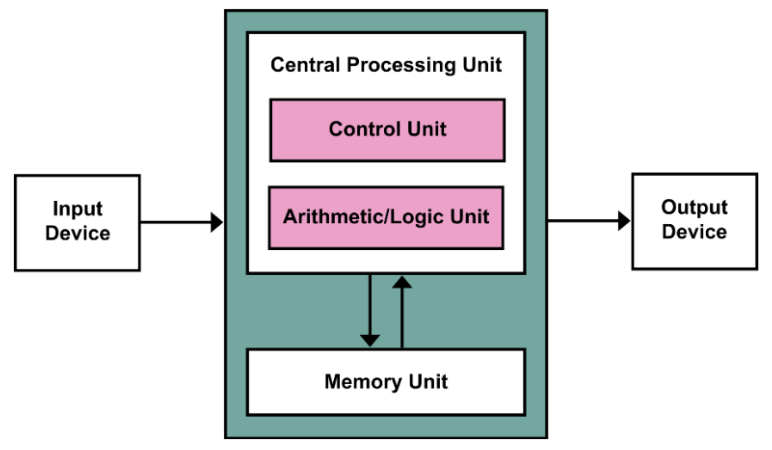
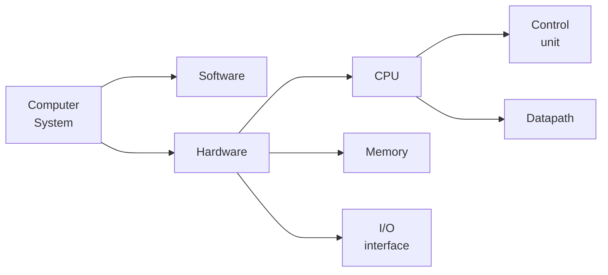
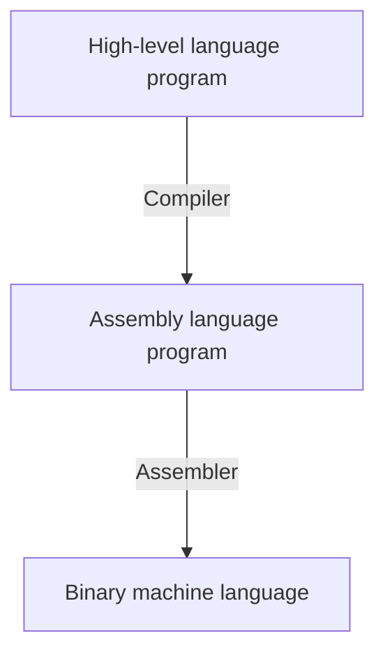

# 1 Prelude

!!! tip "前言"
    本章内容有不少概述性的内容，很多内容很浅也很散，之后章节都会详细展开，此处更多的是介绍。建议重点关注以下部分：

    - [1.1 Eight Great Ideas](#11-eight-great-ideas)
    - [1.5 Performance](#15-performance)

- 冯·偌伊曼架构
  - 计算与存储分离
  - 数据和指令放在同一个存储器

    

## 1.1 Eight Great Ideas

部分在实际题目中还挺难区分的，注意识别题目中的关键暗示。此外，先学习了之后的内容会对部分思想有更深刻的理解。

- Design for Moore’s Law （设计紧跟摩尔定律）
    - **Moore's Law**: Integrated circuit resources double every 18-24 months.
    - Design for where it will be when finishes rather than design for where it starts.
- Use Abstraction to Simplify Design (采用抽象简化设计)
    - 层次化、模块化的设计
- Make the Common Case Fast (加速大概率事件)
- Performance via Parallelism (通过并行提高性能)
- Performance via Pipelining (通过流水线提高性能)
    - 换句话说就是，每个流程同时进行，只不过每一个流程工作的对象是时间上相邻的若干产品；
    - 相比于等一个产品完全生产完再开始下一个产品的生产，会快很多；
    - 希望每一个流程的时间是相对均匀的；
- Performance via Prediction (通过预测提高性能)
    - 例如先当作 `if()` 条件成立，执行完内部内容，如果后来发现确实成立，那么直接 apply，否则就再重新正常做；
    - 这么做就好在（又或者说只有这种情况适合预测），预测成功了就加速了，预测失败了纠正的成本也不高； 
- Hierarchy of Memories (存储器层次)
    - Disk / Tape -> Main Memory(DRAM) -> L2-Cache(SRAM) -> L1-Cache(On-Chip) -> Registers
- Dependability via Redundancy (通过冗余提高可靠性)
    - 类似于卡车的多个轮胎，一个模块 down 了以后不会剧烈影响整个系统；

---

## 1.2 Below Program

- 高级语言的出现体现了“抽象”的思想；

---

## 1.3 Components of a computer

The five classic components of a computer:

- **input**;
- **output**;
- **memory** (DRAM);
    - 程序、数据存储的地方，也是程序“运行的位置”；
    - cache memory (SRAM): buffer for the DRAM memory;
- **datapath**;
    - 负责实际的数据处理；
- **control**;
    - 负责指挥控制如何进行数据处理，给出控制信号；

> **processor** / **(central processor unit)CPU** = datapath + control

为了实现抽象，我们设计了一套硬件和最低抽象程度的软件之间的接口——**instruction set architecture** (ISA)，本课程将会以 RISC-V 为例进行介绍，详细内容将放在[第二章](./2_instructions.md)。

此外，根据是否具有易失性，内存被分为两类：**main memory / prime memory** (eg. DRAM) 和 **secondary memory** (eg. magnetic disks, flash memory)。

---

## 1.4 Technologies for Building Processors and Memory

- integrated circuit (IC): dozens to hundreds of transistors into a single chip;
- very large-scale integrated circuit (VLIC): billions of combinations of conductors, insulators, and switches manufactured in a single small package;

集成电路加工绕不开的一个话题就是硅晶加工，硅晶锭(silicon crystal ingot)会被加工成硅片(silicon wafer)，然后再进行加工，最后成为集成电路。一个硅片会被切成很多小块，其中难免有一些坏的(defects)，而那些好的就被称为 dies，或者说 chips。而这个工艺的产量则由下面这个公式定义：

$$
\begin{aligned}
\text{Cost per die} &= \frac{\text{Cost per wafer}}{\text{Dies per wafer} \times \text{yield}} \\
\text{Dies per wafer} &\approx \frac{\text{Wafer area}}{\text{Die area}} \\
\text{Yield} &= \frac{1}{\left(
    1 + (\text{Defects per area} \times \text{Die area} / 2)
\right) ^ 2}
\end{aligned}
$$

最后一个式子基于经验观察得到，其中指数实际上与加工步骤数量有关。

---

## 1.5 Performance

衡量计算机的性能和表现，无论对于工程师还是消费者都是一个非常必要的需求。其中一个重要的标准就是“运行速度”，具体来说：

- **Response Time / Execution Time**	从程序开始到结束的时间
- **Throughput / Bandwidth**	单位时间内完成的任务数量

并且我们这样联系 performance 和 execution time：

$$
\text{Performance}_X = \frac{1}{\text{Execution time}_X}
$$

而相对性能(Relative Performance)就是非常 naive 地对两个比较对象求比值，我们通常所说的比较两个东西的性能，也就是指计算它们的相对性能。

当我们需要衡量一个 CPU 的性能，或者具体去分析一个 CPU 的性能构成时，就需要更加具体的指标：

- CPU (execution) time（CPU 执行时间）
- CPU clock cycle（时钟周期数）
- clock rate（时钟频率） / clock cycle time（时钟周期）

$$
\begin{aligned}
    \text{CPU execution time} &= \text{CPU clock cycles} \times \text{Clock cycle time} \\
    &= \frac{\text{CPU clock cycles}}{\text{Clock rate}}
\end{aligned}
$$

同时，还有一个容易得到的关系：

$$
\begin{aligned}
    \text{CPU clock cycles} &= \text{Instructions count} \times \text{Average cycles per instruction}
\end{aligned}
$$

其中，每条指令的平均周期数(Average cycles per instruction)又缩写为 CPI。

> CPI(clock cycles per instruction), the average number of clock cycles each instruction takes to execute = $\frac{\text{CPU clock cycles}}{\text{Instruction count}}$;

于是，将上面的两块关系整合起来就得到：

$$
\begin{aligned}
    \text{CPU time} &= \text{Instruction count} \times \text{CPI} \times \text{Clock cycle time} \\ 
    &= \frac{\text{Instruction count} \times \text{CPI}}{\text{Clock rate}}
\end{aligned}
$$

??? note "练习"
    === "题面"
        编译器可能提供两种代码序列，每一个序列都包含 A、B、C 三种类型的指令，每种指令的 CPI 如下表所示。

        |     |  A  |  B  |  C  |   
        |:---:|:---:|:---:|:---:|
        | CPI |  1  |  2  |  3  |
        |Instruction count \@ seq 1|  2  |  1  |  2  |
        |Instruction count \@ seq 2|  4  |  1  |  1  |

        1. 哪一个 seq 执行了最多的指令？
        2. 哪一个 seq 更快？
        3. 每一个 seq 的 CPI 是多少？

    === "答案"

        1.弱智题，加起来就行。

        $$
        \begin{aligned}
            \text{instruction count @ seq 1} = 2 + 1 + 2 = 5 \\
            \text{instruction count @ seq 2} = 4 + 1 + 1 = 6
        \end{aligned}
        $$

        所以 2 多。

        2.由于产生差异的地方是编译器，所以我们默认时钟周期相同，所以比较 CPU time 等效于比较 clock cycles。

        $$
        \begin{aligned}
            \text{clock cycles @ seq 1} = 2 \times 1 + 1 \times 2 + 2 \times 3 = 10 \\
            \text{clock cycles @ seq 2} = 4 \times 1 + 1 \times 2 + 1 \times 3 = 9
        \end{aligned}
        $$

        所以 2 快。

        3.seq 的 CPI 就是 seq 的 clock cycles 除以 seq 的 instruction count：

        $$
        \begin{aligned}
              \text{CPI @ seq 1} = \frac{10}{5} = 2 \\
              \text{CPI @ seq 2} = \frac{9}{6} = 1.5
        \end{aligned}
        $$

??? note "练习"
    === "题面"
        A given application written in Java runs 15 seconds on a desktop processor. A new  Java compiler is released that requires only 0.6 as many instructions as the old  compiler. Unfortunately, it increases the CPI by 1.1. How fast can we expect the application to run using this new compiler? Pick the right answer from the three  choices below:

        1. $\frac{15\times 0.6}{1.1} = 8.2 sec$;
        2. $15\times 0.6\times 1.1 = 9.9 sec$;
        3. $\frac{15\times 1.1}{0.6} = 27.5 sec$;
        
    === "答案"
        已知公式：

        $$
        \begin{aligned}
            \text{CPU time} &= \text{CPI} * \text{instruction count} * \text{clock cycle time}
        \end{aligned}
        $$

        现在 CPI 变成 1.1 倍，instruction count 变成 0.6 倍，所以应该选 2。
        

---

## Others

- ……不是很想学了 再说吧

- $KB = 10^3 B, KiB = 2^{10} B$
- K M G T P E Z Y
- **Amdahl Law**   $T_{\text{improved}} = \cfrac{T_{\text{affected}}}{\text{Improvement Factor}}+T_\text{unaffected}$ [🔗 Wiki](https://zh.wikipedia.org/wiki/%E9%98%BF%E5%A7%86%E8%BE%BE%E5%B0%94%E5%AE%9A%E5%BE%8B)

- MIPS: Millions of Instructions Per Seconds

$$
\begin{aligned}
MIPS 
&= \frac{\text{\#Instructions}}{\text{Execution time} \times 10^6} \\
&= \frac{\text{\#Instructions}}{
    \frac{
        \text{Instruction count} \times \text{CPI}
    }{
        \text{Clock rate}
    } \times 10^6
} \\
&= \frac{\text{Clock rate}}{\text{CPI} \times 10^6}
    
\end{aligned}
$$

### 内存

    

