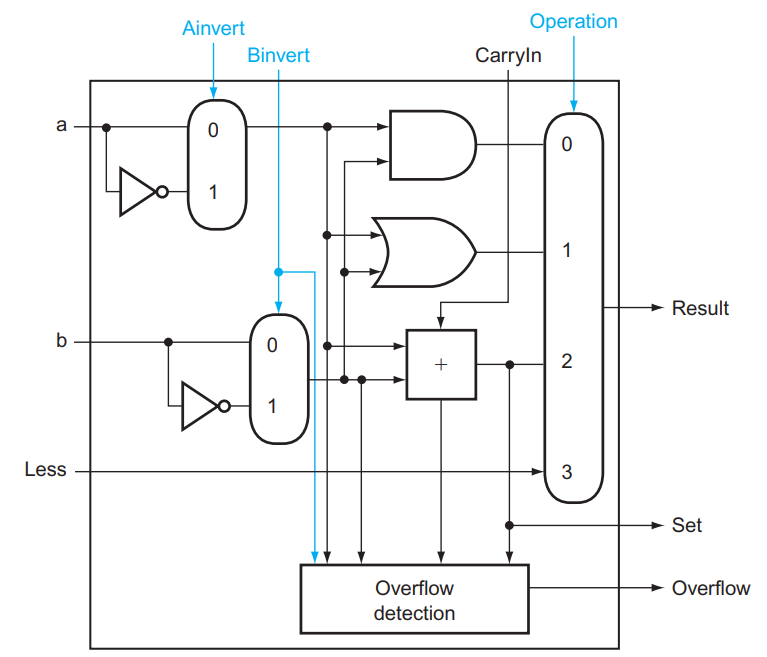
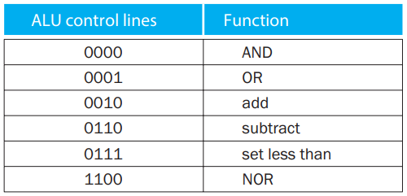
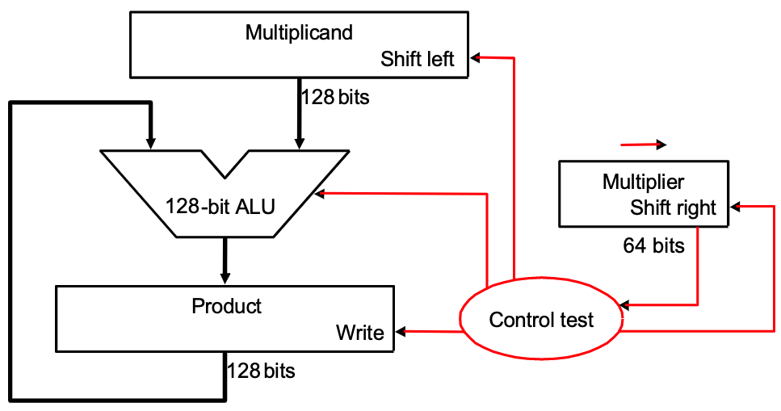
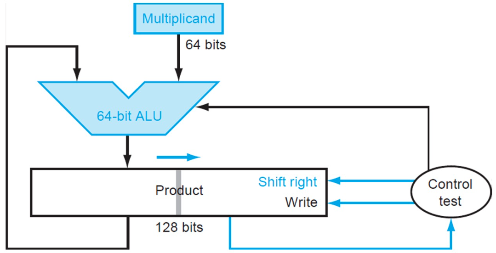
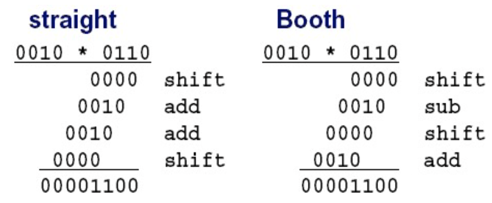
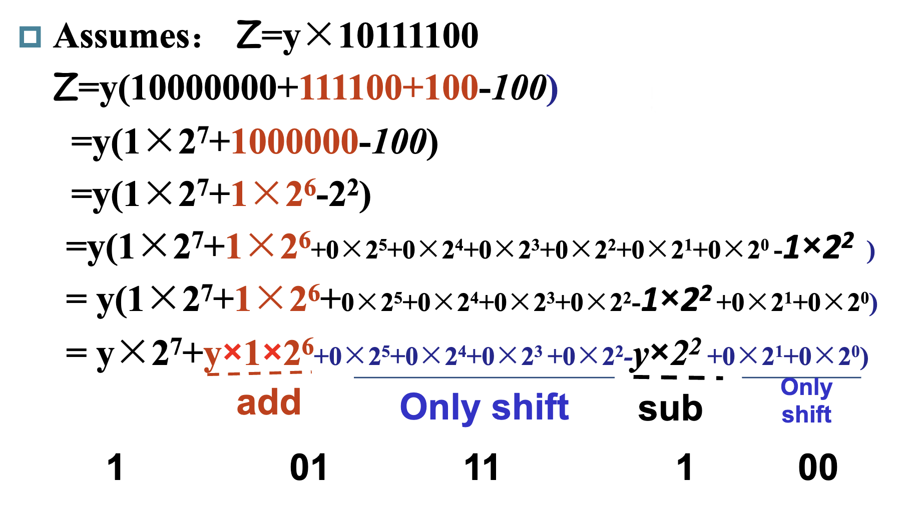
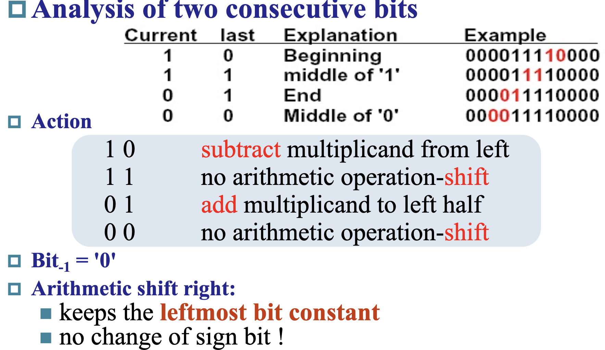
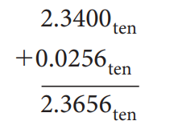

# 3 Arithmetic

!!! tip "提示"
    在开始本章之前，请确保自己了解各种二进制下表示数的相关方法。

## 3.1 一个基本的 ALU

**世界上不存在减法**。众所周知，减法就是加上相反数。所以这个世界上不存在减法。

**Overflow**。硬件规模是有限的，因此运算结果超过这个限制时，就会发生溢出。对于有符号加法，当正数和正数相加得到负数，或者负数和负数相加得到正数时，就可以判定溢出。对于无符号加法，如果结果小于二者中任意一个，也可以判定溢出。

- 关于 Overflow，硬件层面需要能检测溢出，然后将这个指令的地址存储到一个特别的寄存器 EPC 里，然后跳转到 OS 中专门的程序中来处理这个溢出（异常处理）；

**ALU, Arithmetic Logic Unit**，算术逻辑单元，执行一些算术运算或者逻辑运算。

- [数逻里的 ALU](https://note.isshikih.top/cour_note/D2QD_DigitalDesign/Chap03/#%E7%AE%97%E6%9C%AF%E9%80%BB%E8%BE%91%E7%94%B5%E8%B7%AF)

### 3.1.1 1-bit ALU
> （下面这部分内容在课本附录 A.5 开始的地方）

在数字逻辑设计这门课程中，我们学过 AND, OR, XOR 这些 gates，以及 inverter 和 mux 这些东西，我们尝试用这些东西攒一个 ALU 出来。在这一节中，我们希望 ALU 具有加法、减法、与运算、或运算和比较的能力。

我们先考虑 1 bit ALU 的构造。我们学习过 1 bit [Full Adder](https://note.isshikih.top/cour_note/D2QD_DigitalDesign/Chap03/#%E5%8D%8A%E5%8A%A0%E5%99%A8--%E5%85%A8%E5%8A%A0%E5%99%A8) 的构造：

{width=300} {width=200}

上左图是全加器的具体构造，右图是我们将其进行封装后的表示方式。

我们结合一个 mux，就可以构造一个支持与、或以及加法运算的 1 bit ALU：

{width=300}

其中 `Operation` 是用来指明 mux 采取哪个结果的信号，值为 00 01 10 分别对应与、或、加法运算。

### 3.1.2 加上减法和 NOR！
减法运算怎么办呢？众所周知，由于补码有 $x + \bar x = 111\dots111_2 = -1$，因此 $-x = \bar x + 1$，所以 $a - b = a + (-b) = a + \bar b + 1$。据此我们可以构造这样的结构：

{width=300}

其中 `Binvert` 用来指明是否需要将结果取反；在计算减法时，我们将 `Binvert` 设为 `1` ，然后将 `CarryIn` 也设为 `1` ， `Operation` 设为 `2` ，这样我们的结果就是 $a + \bar b + 1$。

`NOR` 运算： `a NOR b = NOT(a OR b) = (NOT a) AND (NOT b)` ，因此 `NOR` 运算可以这样实现：

{width=300} {width=200}

上右图是我们目前的 1 bit ALU 的抽象结构。

### 3.1.3 串联得到 64-bit ALU！
有了 1 bit 的 ALU，我们就可以构造出 RISC-V 所需的 64 bits 的 ALU 了：

{width=500}

可以看到，对于 64 位的加法、减法、AND, OR, NOR 运算，这样的 64 位 ALU 都可以完成。

同时也可以注意到，这里面除了我们熟悉的内容外，还多了 `Less` ,  `Set` 和 `Overflow` 这些位。它们是用来干什么的呢？

首先 `Overflow` 是容易理解的，它用来表示加法或减法有没有出现溢出的现象；显然这个判断只需要在 ALU63，即 Most Significant Bit 才需要进行。容易证明，如果 $C_{in} \oplus C_{out} = 1$，那么存在溢出；因此 ALU63 只需要添加一个额外的 XOR 门即可完成这一判断。

> Tip: 这里提到的 $C_{in}$ 和 $C_{out}$ 指的都是最后一个 ALU 的 carry in 和 carry out。
>
> 简单做解释，首先，最后一位是符号位。$C_{in} \oplus C_{out} = 1$ 意味着其中一个是 1，另外一个是 0；
> - 假设 $C_{in} = 1, \, C_{out} = 0$，则意味着 $a_{63}$ 和 $b_{63}$ 都为 0，即两个 operand 都是正数，此时由于 $C_{in} = 1$，所以 $res_{63}=1$ 即结果是负数，两正数相加得到负数，发生 overflow；
> - 假设 $C_{in} = 0, \, C_{out} = 1$，则意味着 $a_{63}$ 和 $b_{63}$ 都为 1，即两个 operand 都是负数，此时由于 $C_{out} = 0$，所以 $res_{63}=0$ 即结果是正数，两负数相加得到正数，发生 overflow；

`Less` 和 `Set` 共同使用，是为了实现 `slt rd, rs1, rs2` 这个操作（即实现比较操作）（SLT 即 Set Less Than）的。这个操作的含义是，如果 `rs1 < rs2` ，那么将 `rd` 置为 `1` ，否则置为 `0` 。如何进行这一判断呢？很简单，`rs1 < rs2` 即 `rs1 - rs2 < 0`，也就是说如果 `rs1 - rs2` 结果的最高位是 `1` ，那么就说明 `rs1 < rs2` 。所以对于 `slt` 这个操作，我们只需要计算 `rs1 - rs2`，而后将 ALU63 中加法器的结果（即最终结果的符号位）赋值给 `Result[0]` ，即运算结果的 Least Significant Bit，而将其他位的结果 `Result[1:63]` 都设成 0，就可以完成 `slt` 操作了。

所以可以看到，上图中，除了 ALU0 的 `Less` 来自 ALU63 的 `Set` 外，其他 ALU 的 `Less` 都是 `0` 。

结合上述讨论，上图中 ALU0 ~ ALU62 的结构如下第一张图所示，ALU63 的结构如下第二张图所示：

{width=500}

{width=500}

（注：第二张图中的 Overflow Detection 被复杂化了，实际上可以通过 `CarryIn` 和 `CarryOut` 的异或完成的。）

可以看到， `Operation` 增加了 `3` 的取值，这个取值表示进行 `slt` 操作。

### 3.1.4 一点优化！
之前我们也讨论过，如果做减法或者 `slt` 的话，需要将 `Binvert` 和 ALU0 的 `CarryIn` 设成 `1` ，如果是加法的话这两个信号都是 `0` ；其他运算用不到这两个信号。因此这两个信号始终取值相等，我们可以将这两个信号合并为一个，称之为 `Bnegate` 。

另外，我们也有 `beq` ， `bne` 这样的操作，结合 Common case fast 的设计思想，我们将判断结果是否为 0 的功能也直接加到 ALU 里。

结合上述两个思路，我们形成了最终的 64-bit ALU！

{width=500}

对于这样的一个 ALU，我们需要 4 bits 的 control lines，分别是 `Ainvert` ,  `Bnegate` 和 `Operation` (2 bits)。ALU 的符号和 control lines 的含义如下：

{width=150} {width=300}

### 3.1.5 更快的加法
上面的 64 位加法的实现方式是通过 1 位加法器串联实现的，这种方式势必需要等待前一个加法器算出结果后才能算后一个的。这种多位加法器的实现称为行波加法器 **Ripple Carry Adder, RCA**。显然，这种实现方式比较慢。

那么，如何加速呢？

#### 3.1.5.1 Carry Lookahead Adder, CLA
课本指出，RCA 缓慢的重要原因是后一个 adder 需要等前一个 adder 的 carry 结果；但我们不妨讨论出现 carry 的可能。第一种可能是，如果 $a$ 和 $b$ 都是 1，那么一定会 **生成** 一个 carry；另一种可能是，如果 $a$ 和 $b$ 中有且仅有一个是 1，那么如果传入的 carry 是 1，则这里也会 carry，即 carry 被 **传播** 了。

也就是说，$c_{out} = a \cdot b + (a + b)\cdot c_{in}$。我们记 **generate** $g = a\cdot b$，**propagate** $p = a + b$，则有 $c_{out} = g + p \cdot c_{in}$。所以，我们可以这样构造一个全加器：

{width=150}

所以，我们可以推导出如下关系（可以形象理解每一个等式的每一个 term 的来源）：

{width=500}

利用这个关系，我们可以构造这样一个四位加法器：

{width=500}

上面的 PFA, Partial Fully Adder，就是前面我们构造的新全加器的一部分。可以看到，通过这样的方式，我们可以加速加法的运算；但是注意到越到高位，门的 fan-in 就越大，因此不能一直增加的。所以对于更多位数的加法器，我们将上面这样构成的 4-bit CLA 再通过类似的方式串起来！

{width=500}

#### 3.1.5.2 Carry Skip Adder (马德先生没讲)

#### 3.1.5.3 Carry Select Adder, CSA

体现了 预测 / 冗余 的思想。

这个思路其实比较简单，就是把输入 carry 为 0 或者 1 的情况都算一遍，然后根据实际的情况从中选出正确的那种就好了：

{width=500}

{width=500}

## 3.2 乘法 

～～暂时不想学了，听说考的不多～～

### V1

- [大致原理](https://note.isshikih.top/cour_note/D2QD_DigitalDesign/Chap06/?h=%E4%B9%98%E6%B3%95#%E7%AE%97%E6%9C%AF)

换句话来说，所谓的乘法实际上是根据 Multiplier 的 0/1 来选择是否要将 Multiplicand 的对应位移结果加到 Product 上。

64 bits 乘法器的硬件实现大致如下：

    

简单做解释，一共进行 64 次：

1. 判断 Multiplier 寄存器的最低位是否是 1：
   1. 如果是，则将 Multiplicand 寄存器的值加到 Product 寄存器里；
   2. 如果否，进入下一步；
2. 将 Multiplier 寄存器的值右移一位（这是为了不断拿出每一位，相当于在枚举 Multiplier 的每一位），将 Multiplicand 寄存器的值左移一位（对应于和 Multiplier 的第几位乘得到的位移，具体参考上面的链接内容）；
3. 判断是否做满 64 次，决定是否终止；

### V2

可以发现，V1 中做了大量的 128 位加法，但是实际上被加过去的 Multiplicand 有效内容只有 64 位。V2 正是解决了这个问题。

    

它将 Multiplicand 寄存器换为了 64 位，而将位移操作转移到了 Product 寄存器中进行。这里最重要的一点就是，64 位加法只影响 Product 寄存器左侧的 64 位，而之后的右移操作则是 128 位。这样，虽然最低位的结果一开始会被放在 Product 寄存器的第 65 位里，但是在经过 64 次右移之后，它就出现在第一位了。于是，所有的 128 位加法都被 64 位加法替代，实现了加速。

其流程大概是，一共进行 64 次：

1. 判断 Multiplier 寄存器的最低位是否是 1：
   1. 如果是，则将 Multiplicand 寄存器的值加到 Product 寄存器的左半部分里；
   2. 如果否，进入下一步；
2. 将 Multiplier 寄存器的值右移一位，将 Product 寄存器的值右移一位；
3. 判断是否做满 64 次，决定是否终止；
### V3

我们还发现，我们对 Multiplier 的右移是为了枚举最低位，但是为了实现这个枚举，我们每次都要做 64 位的右移；除此之外，在一开始的几次中，Product 的右半部分大部分没有意义，但是仍然在 128 位的右移中影响效率。仔细一看，我们能发现，我们每右移一次 Multiplier 寄存器，就会右移一次 Product 寄存器，而前者将导致 Multiplier 寄存器中出现一个没意义的 bit，后者将导致 Product 寄存器中消失一个没意义的别特。

V3 正是抓住了这个点，直接将 Multiplier 存在了 Product 的低 64 位中。当我们从中取出最低位并经过一次判断后，这一位就不重要了，而恰好 Product 需要右移，就将这一位消除，方便我们下一次从最低位拿出下一个比特！

那么这么做的好处在哪里呢？首先，少了一个寄存器，节省了空间；其次，原本需要 Multiplier 寄存器和 Product 寄存器都做右移，现在只需要 Product 寄存器右移即可，减少了一个 64 位右移操作。

    

其流程大概是，一共进行 64 次：

1. 判断 Product 寄存器的最低位是否是 1：
   1. 如果是，则将 Multiplicand 寄存器的值加到 Product 寄存器的左半部分里；
   2. 如果否，进入下一步；
2. 将 Product 寄存器的值右移一位；
3. 判断是否做满 64 次，决定是否终止；

---

乘有符号数主要是转化为乘无符号数来做。首先存储两个数的符号，然后将它们转化为无符号数。接下来对两个无符号数做无符号乘法，最后根据之前存储的符号决定结果的符号并转化为有符号数。

---

一种改进的乘法方法是 Booth's Algorithm。

### Booth's Algorithm。

- Booth's Algorithm（有点类似于差分算法）

> 我个人觉得 xyx 放的这张图不是很清晰，把它折叠了。

??? tip "xyx's img"
    

        
    

在我看来，Booth's Algorithm 的主要思想在于，减少乘数中“`1`”的数量。具体来说，在我们原先的乘法策略中，每当乘数中有一位 `1` 时，都会需要一个加法（将位移后的被乘数累加到结果中）。但是，如果乘数中有较长的一串 `1` 时，我们可以将它转化为一个大数字减一个小数，如：`00111100 = 01000000 - 00000100`，此时 4 个 `1` 变为 2 个 `1`，我们就可以减少做加法的次数。这也是为什么 xyx 说有点像差分了。

    

那么在实际执行过程中，Booth's Algorithm 主要遵循两位比特的模式进行操作。

    
    

> 对于上面这张图的理解，稍微做一些解释。它实际上的表示是挪用了 V3 的乘法器。product 一列代表的是 product 寄存器，左一半一开始置 0，右一半一开始存放的是乘数，而上面提到的将被乘数加减累计到结果中的操作，也是对于左半部分来说的（**换句话来说就是用 V3 做 Booth's**）。需要提醒的是，在 Booth's Algorithm 中，两位识别是从第一位开始的，此时第一位作为两位中的高位，低位为 0，而后在下一轮中第一位作为低位，第二位作为高位，以此类推。

有意思的事出现了，Booth's Algorithm 也能应用于负数。

仔细想想就会发现其实很合理，对于正数，其最高位一定是 `0`，因此不管怎么样它最终都会匹配到一个 `01` 的模式，来给一个 `1111..` 收尾。但是负数不然，负数的最高位是 `1`，这也意味着它最终不会执行所谓的 `01` 对应的加法操作来给 `111...` 收尾。换句话来说，它好像“亏”了一个在下一位的加法。（具体的为什么我来不及细想了，但是只管上理解这个“亏”很合理.）

## 3.3 除法 暂时不想学了，听说考的不多

和乘法很像。

## 3.4 浮点运算

> 大部分处理器可能本身并不支持浮点运算，只不过在软件层面可以将浮点运算转换为整数运算。

### 3.4.1 IEEE 754 浮点表示

我们将小数点左边只有 1 位数字的表示数的方法称为 **科学记数法, scientific notation**，而如果小数点左边的数字不是 0，我们称这个数的表示是一个 **规格化数, normalized number**。科学记数法能用来表示十进制数，当然也能用来表示二进制数。

IEEE 754 规定了一种浮点数标准：我们将浮点数表示为 $(-1)^S \times F \times 2^E$ 的形式，这里的 $F \times 2^E$ 是一个规格化数，而 $(-1)^S$ 用来表示符号位：$S$ 为 0 说明该浮点数为正数，为 1 则为负数；$F$ 和 $E$ 也用若干 bits 表示，分别表示尾数和指数，我们稍后讨论。也就是说，我们将其表示为 $1.\text{xxxxx}_2\times 2^{\text{yyyy}}$ 的形式这意味着我们没法直接通过这种表达形式表示 0（为什么小数点左边是 1 呢？因为二进制只有 0 和 1，而规格化要求小数点左边不能为 0）。我们通过科学记数法调整了小数点的位置使其满足规格化的要求，因此我们称这种数的表示方法为 **浮点, floating point**。

小数点的英文是 decimal point，但是我们这种表示方法不再是 decimal 的了，因此我们起个新名字：**二进制小数点, binary point**。

IEEE 754 规定了两种精度的浮点数格式，分别是 single precision 和 double precision（分别对应 C 语言中的 `float` 和 `double` ），RISC-V 这两种都支持：

{width=700}

{width=700}

可以看到，fraction 的位数越多，浮点数的精度就越高；而 exponent 的位数越多，浮点数能保存的范围就越大。

那么对于 $(-1)^S \times F \times 2^E$，$S$ 的二进制表示方法是显然的，仅需要一个 bit 就好了。那么 $F$ 和 $E$ 怎么表示呢？如我们之前所说，$F$ 就是 $1.\text{.xxxxx}_2$ 的形式，这个 1 是固定的，因此 $F$ 只需要保存 $\text{.xxxxx}$ 的部分就可以了（但是请注意，它的权重从左到右分别是 $2^{-1}, 2^{-2}, ...$）！那么 $E$ 怎么办呢？注意到这个指数在实际使用中可能是正整数、负整数或 0，因此我们使用一个偏移，对单精度浮点数偏移 127，双精度浮点数偏移 1023（刚好是表示范围的一半！），也就是说我们保存的  `exponent`  其实是 $E + bias$ 的二进制。也就是说，对于这样的一个表示，其值是：

$$(-1)^S\cdot (1 + \text{fraction}) \cdot 2 ^ {\text{exponent} - \text{bias}}$$

课本给出了一个例子：

聪明的小朋友可能会问，0 应该怎么保存呢？毕竟 0 没有前导 1。对于这样的特殊情形，IEEE 754 有特别规定，用特殊的值保存它们：

在上表中：

   - 第 1 条表示 0；
   - 第 2 条表示非规格化数，这种数主要是为了用来表示一些很小的数，它的取值为 $(-1)^S\cdot (\mathbf{0} + \text{fraction}) \cdot 2 ^ {- \text{bias}}$；但是并非所有机器都支持这种表示，有的机器会直接抛出一个 exception。我们不考虑非规格数的存在；
   - 第 3 条表示正常的浮点数；
   - 第 4 条表示无穷大或者无穷小，出现在 exponent overflow 或者浮点数运算中非 0 数除以 0 的情况；
   - 第 5 条表示非数，出现在 0/0, inf / inf, inf - inf, inf * 0 的情况

（如果数字过大不能表示，即 overflow，则结果置为 inf；如果数字过小不能表示，即 underflow，则结果置为 0。）

这两种表示法的范围和精度分别是多少呢？

   - 范围
      - 能表示值的 **绝对值** 的范围是 $1.0_2 \times 2^{1-\text{bias}} \sim 1.11\dots 11_2 \times 2^{11\dots 11_2-1-\text{bias}}$，即 $1\times 2^{1 - \text{bias}}\sim(2 - 2^\text{-Fra#})\times 2^{(2^\text{Exp#} - 1) - 1 - \text{bias}}$，其中 `Fra#` 和 `Exp#` 分别表示 fraction 和 exponent 的位数；
      - 单精度浮点数：$\pm 1\times 2^{-126}\sim \pm(2 - 2^{-23}) \times 2^{127}$
      - 双精度浮点数：$\pm 1\times 2^{-1022}\sim \pm(2 - 2^{-52}) \times 2^{1023}$

   - 精度
      - $2^ \text{-Fra#}$
      - 单精度浮点数：$2^{-23}$
      - 双精度浮点数：$2^{-52}$

> 有时候题目里会出不同的浮点数表示法，让你比较精度，此时一般指的是，fraction + exponent 总位数相同的情况下，fraction 更多的一般更精确，也就是说这个精度更倾向于“能表示更多的小数位”。

!!! info "18~19 Final"
    
{width=600}

    ??? info "答案"
        +inf, 0xBF800000

可以试一下 -32.6，结果可以自己在 [IEEE-754 Floating Point Converter](https://www.h-schmidt.net/FloatConverter/IEEE754.html) 里面找~

### 3.4.2 浮点加法

以 $1.000_2\times2^{-1}-1.110_2\times2^{-2}$ 为例， 浮点数的加减法分为以下几步：

1.  Alignment: 指数对齐，**将小指数对齐到大指数**：$-1.110_2\times2^{-2} = -0.111\times2^{-1}$
    1.  为什么是小对大？首先，小对大的过程是在小指数的 fraction 前补 `0`，可能导致末尾数据丢失；大对小的过程是在大指数的 fraction 后补 `0`，可能导致前面的数据丢失。在计算过程中，我们保持的精确位数是有限的，而在迫不得已丢去精度的过程中，让小的那个数的末几位被丢掉的代价比大的前几位丢失要小太多了；
2.  Addiction Fraction 部分相加减：$1.000-0.111=0.001$
3.  Normalization: 将结果规格化：$0.001\times2^{-1}=1.000\times2^{-4}$；同时需要检查是否出现 overflow 或者 underflow，如果出现则触发 Exception
4.  Rounding: 将 Fraction 部分舍入到正确位数；舍入结果可能还需要规格化，此时回到步骤 3 继续运行

{width=400}

### 3.4.3 浮点乘法
分别处理符号位、exponent 和 fraction：

- 将两个 Exponent 相加并 **减去一个 bias**，因为 bias 加了 2 次
- 将两个 (1 + Fraction) 相乘，并将其规格化；此时同样要考虑 overflow 和 underflow；然后舍入，如果还需要规格化则重复执行
- 根据两个操作数的符号决定结果的符号

{width=400}

### 3.4.4 精确算术

IEEE 754 规定了一些额外的舍入控制，用来保证舍入的精确性。

**Round modes**

- `guard` / `round` / `sticky`

{width=600}

Round to nearest even 只对 0.5 有效，别的都和四舍五入一样

一般的浮点数后面还会有 2 bits，分别称为 guard 和 round，其主要目的是让计算结果的舍入更加的精确： 

{width=128} {width=172}

事实上加法只需要用到 guard，但是对于乘法，如果存在前导 0，需要将结果左移，这时候 round bit 就成了有效位，能避免精度的损失。

另外还有一个位叫 sticky bit，其定义是：只要 round 右边出现过非零位，就将 sticky 置 1，这一点可以用在加法的右移中，可以记住是否有 1 被移出，从而能够实现 "round to nearest even"。

`units in the last place(ulp)`: The number of bits in error in the leas t significant bits of the significant between the actual number and the number that can be represented.

