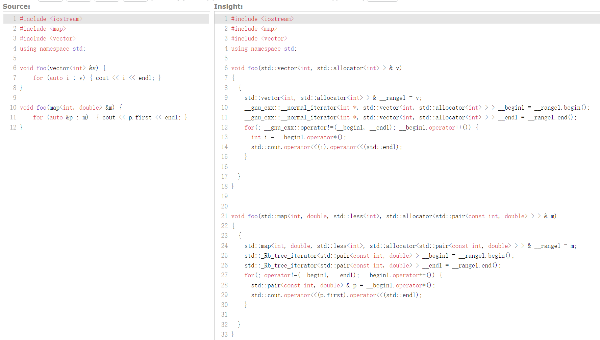
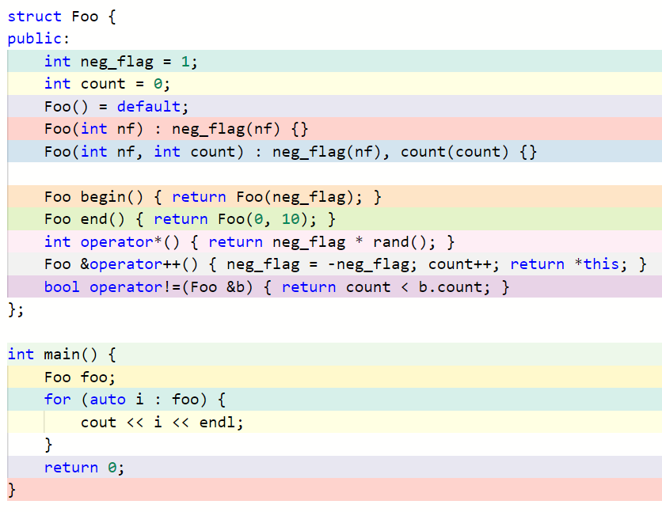
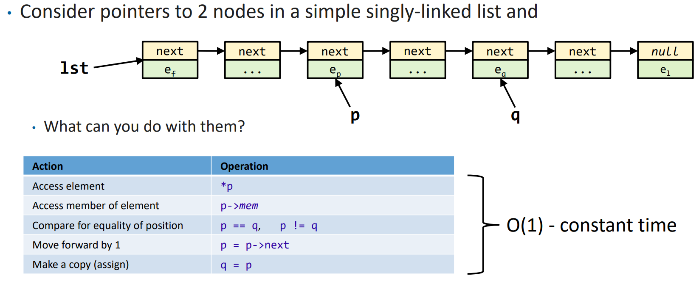
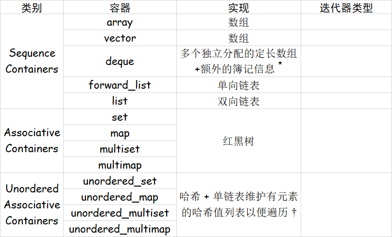
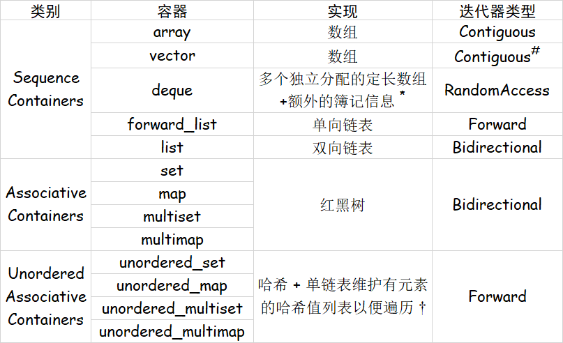
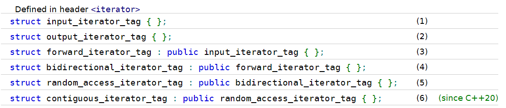
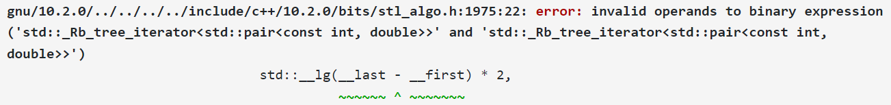
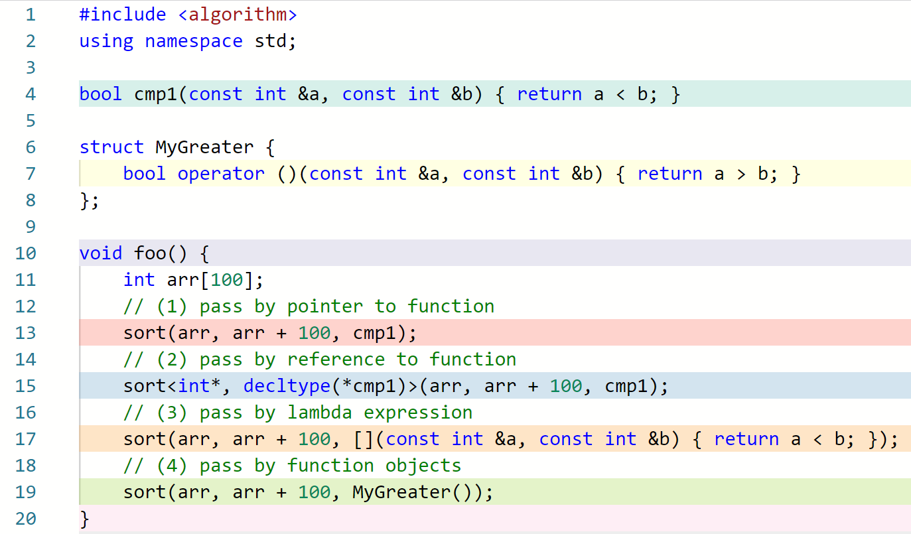
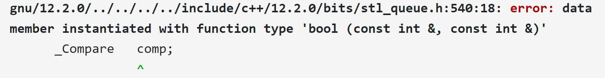

# 8 模板 (II) - 理解 STL：迭代器与函数对象

!!! info "本节录播地址"
    本节的朋辈辅学录播可以在 [B 站](https://www.bilibili.com/video/BV12V4y1o7c5/?spm_id_from=333.788&vd_source=c5a9383e47adf0fdb6896be9dbbc50fc) 找到！

!!! note ""
    本文部分图片来自 CppCon 2021 - Back to Basics: Classic STL

--8<-- "cpp/cpp_restart/toggle_visibility.md"

---

## 8.1 迭代器 | Iterators

在上一节中我们看到，STL 中有十余种容器，同时有上百种算法。但是，我们很容易理解的是，即使是相同的算法，它在不同的容器上的具体实现也是不同的。看下面一个例子：

```c++
#include <algorithm>
#include <iostream>
#include <vector>
#include <set>
#include <list>

int main() {
    std::vector<int> v = {0, 1, 2, 3, 4, 5, 6, 7, 8, 9};
    std::set<int> s = {2, 4, 1, 4, -1};
    std::list<int> l = {1, 5, 6, 2, 7};

    auto print = [](int i){ std::cout << i << ' '; };
    std::for_each(v.begin(), v.end(), print); 
    std::cout << '\n';
    std::for_each(s.begin(), s.end(), print); 
    std::cout << '\n';
    std::for_each(l.begin(), l.end(), print); 
    std::cout << '\n';
}

/* Output:
0 1 2 3 4 5 6 7 8 9 
-1 1 2 4 
1 5 6 2 7
*/
```

我们知道，`std::vector` 的底层数据结构是数组，`std::set` 的底层数据结构是红黑树，`std::list` 的底层数据是双向链表；`std::for_each` 对它们进行遍历的方式显然不同。

<center>{width=400}</center>

但是，对它们进行遍历的方式也有共通之处：对于 `for_each(c.begin(), c.end(), print);`，它需要做的事就是，从容器的 **开头** 开始，每次 **找到下一个元素**，**访问元素内容**，直到容器的 **末尾** 为止。即：`for (SomeType ptr = c.begin(); ptr != c.end(); go_to_next_node(ptr)) { print(get_value(ptr)); }`。

!!! inline end tips
    「迭代 (iteration)」的一个义项是 "One cycle of a set of instructions to be repeated"，即循环中的一次。在我们的语境中，我们的循环是为了遍历数据结构，迭代要做的事就是找到下一个元素和访问元素内容。

这里 `SomeType` 就是用来迭代 (iterate) 这个数据结构的变量的类型。显然，这个类型并不是数据结构中元素的类型，因为对于一个数组 `int a[10];`，我们需要通过一个 `int *` 才能找到下一个元素，而不是通过 `int`。即，这个循环形如 `for (int * ptr = a; ptr != a + N; ++ptr) { print(*ptr); }`。也就是说，这里的「开头」是 `a`，「末尾」是 `a + N`，「判断是否到达末尾」的方式是 `ptr != end()`，「找到下一个元素」的方式是 `++ptr`，「访问元素内容」的方式是 `*ptr`。

也就是说，我们通过指针能够完成「找到下一个元素」「访问元素内容」以及「比较」的功能，也就是迭代时所需的功能。因此我们将指针称为数组的 **迭代器 (iterator)**。迭代器并不是一个具体的数据类型，而是一类东西的统称。

???+ tips
    不过，数组的最后一个元素明明是 `a[N - 1]`，为什么要把 `a + N` 即 `&a[N]` 作为末尾？原因是，我们希望循环在 **越过** `a[N - 1]`，即 **到达但未访问** `a[N]` 时就停止，也就是说我们的「末尾」其实是 **one-past-the-end position**，如下图所示：

    <center>{width=500}</center>

然而，对于其他数据结构，就没有指针这样简单的方式来实现遍历了。不过，我们可以通过运算符重载的方式来为其他数据结构提供用于它们的「指针」，从而能够使用和数组的指针一样的方式来遍历容器，亦即：

```c++
class MyIterator {
    // 一些内部数据
public:
    // 构造函数
    MyIterator& operator++();   // 找到下一个元素
    bool operator!=();          // 判断是否到达末尾
    Elem& operator*();          // 访问元素内容
}
```

这样，我们就也可以通过 `for (MyIterator it = c.begin(); it != c.end(); ++it) { print(*it); }` 的方式来遍历容器 `c` 了。

作为一个具体的例子，我们考虑单链表：

```c++
template<typename T> struct Node {
    T data;
    Node * next = nullptr;
    Node(const T &data = T()) : data(data) {}
};

template<typename T> class MyLList {
    Node<T> * head = new Node<T>, *tail = head;
public:
    void insert_after(const T& value) {
        tail->next = new Node(value);
        tail = tail->next;
    }
};
```

我们可以为它写出如下的迭代器：

```c++
template<typename T> class MyLList {
    Node<T> * head = new Node<T>, *tail = head;
public:
    class MyIterator;
    using iterator = MyIterator;
    
    iterator begin() { return iterator(head->next); }
    iterator end()   { return iterator(nullptr); }

    void insert_after(const T& value) {
        tail->next = new Node(value);
        tail = tail->next;
    }
};

template<typename T> class MyLList<T>::MyIterator {
    Node<T> * val;
public:
    MyIterator(Node<T> * val) : val(val) {}
    MyIterator& operator++() { 
        val = val->next;
        return *this;
    }
    bool operator!=(const MyIterator &it) {
        return val != it.val;
    }
    T& operator*() { return val->data; }
};
```

这样，我们就可以方便地遍历 `MyLList` 了，例如下面代码所示：

```c++
#include <algorithm>
#include <iostream>

int main() {
    MyLList<int> list;
    list.insert_after(3);
    list.insert_after(4);
    list.insert_after(6);
    list.insert_after(5);
    
    using std::cout;
    for (auto i : list)    cout << i << ' ';
    cout << '\n';

    std::for_each(list.begin(), list.end(), [](int &x) { x *= 2; });
    for (auto i : list)    cout << i << ' ';

    return 0;
}
```

这段代码使用了上一节介绍的 range-based for loop、placeholder type specifier `auto` 以及 lambda 表达式，不记得了的话可以去前一节复习！

这段代码的运行结果可以在 [Complier Explorer](https://godbolt.org/z/P3d5bvf8Y) 看到！

从这个例子中，我们可以理解 **迭代器 (Iterator)** 解决的问题。我们知道，我们写程序的目的就是 **处理、查询、使用数据**，数据结构和算法是我们的工具。_在概念层面上_，各种容器或者数据结构的意义是以一定的方式或者性质 **容纳** 数据，但是它本身不具备处理数据的能力；而各种算法的意义是按一定的方法 **处理** 数据，它本身并不持有任何数据。而迭代器就是它们之间的桥梁——一个容器可能是一个数组、一棵二叉树、一个链表，或者其他任何可能的数据结构；一种算法需要对容器做遍历或者其他类型的访问；但是遍历一个数组和一棵二叉树的方式肯定是不同的——迭代器存在的意义就是通过运算符重载或者其他方式，来向算法隐藏容器的不同细节；算法只需要使用 `++` 就能获得下一个元素的迭代器，通过 `*` 就能访问当前迭代器指向的元素，它不需要关心到底是如何访问的；这其实上就是指针的抽象。通过这种方法，STL 保持了它的简洁性，提升了代码的复用。

???+ tip
    为什么说是 “在概念层面上” 呢？因为在实际的实现中，为了提高性能或者易用性，一些容器也将一些算法放到了自己的成员函数中，例如 `map` 和 `set` 的 `lower_bound` 等。但是从概念角度上，容器就仅仅是个包装好了的数据结构而已。

这样，我们其实也就知道了 `for (auto &a : c)` 是如何实现的了！事实上，对于有迭代器的容器（stack, queue, priority_queue 并没有迭代器，因为你不应当尝试去遍历或者以其他自由的形式访问这些容器中的元素），它的成员函数 `begin()` 和 `end()` 返回的都是某种迭代器；这些迭代器都重载了 `++` 运算符（事实上，对于这些容器，实现 `++` 运算符并不需要知道整个容器的结构；例如在红黑树中找到下一个节点不必知道根节点是什么。想一想为什么）。因此，对于这样包含成员函数 `begin()` 和 `end()` ，且其返回值类型支持运算符 `++` 、 `*` 和 `!=` 的类， `for (auto &a : c) {/* A */}` 的实现方法就类似于： `for (auto it = c.begin(); it != c.end(); ++it) {auto &a = *it; /* A */}` 。

???+ tip
    我们之前提到，对于 `std::vector<int> v;` ， `v.begin()` 的返回值类型是 `std::vector<int>::iterator`；而这和我们前面那段代码中所写的 `MyLList<T>::iterator` 一样，它其实是另一个类的别名，在我们之前的例子中，它实际上是 `MyLList<T>::MyIterator` 的别名。库的作者可以根据自己的喜好来定义迭代器类型实际的名称，而只需要设置好 `Container::iterator` 这个统一的别名即可。
    
    在实践中，取决于环境，`std::vector<int>::iterator` 可能是 `__gnu_cxx::__normal_iterator<int*, std::vector<int>>` ；对于 `std::map<int, double> m;` ， `m.begin()` 的返回值类型可能是 `std::_Rb_tree_iterator<std::pair<const int, double>>` 。感兴趣的小朋友可以自己在 [https://godbolt.org/z/6s5x66rdG](https://godbolt.org/z/6s5x66rdG) 尝试（这里也展示了一种查看表达式类型的小技巧）！

    同时，也可以使用 C++ Insights 来查看：[https://cppinsights.io/s/cd95e24b](https://cppinsights.io/s/cd95e24b) 

    

    不过，我们在真正使用到这些类型的时候，可以通过 `std::vector<int>::iterator` 来获得迭代器的类型；这是类的一个成员，声明了一个别名。

我们可以通过 [CppInsights](https://cppinsights.io/s/90d5fb67) 查看之前遍历 `MyLList` 的代码，从而验证上述知识。

???+ info "整活"
    我们之前提到，使用这种 range-based for loop，只需要类“包含成员函数 `begin()` 和 `end()` ，且其返回值类型支持运算符 `++` 、 `*` 和 `!=` ”，所以其实我们可以写出这样的代码 XD：

    

    感兴趣的小朋友可以来玩一玩：[https://godbolt.org/z/813b9e9Pd](https://godbolt.org/z/813b9e9Pd)

???+ tip
    另外，除了 `begin()` ，容器还会提供 `cbegin()` , `rbegin()` , `crbegin()` 这三种成员函数，提供不同的迭代器；也有对应的 `end()` 版本。这里 `c` 是指 const，即迭代器指向的变量是只读的； `r` 是指 reverse，即这种迭代器是逆序的，即：

    

## 8.2 迭代器的分类

我们在前一节中得知，`std::vector` 和 `std::unordered_set` 之类的容器都是有迭代器的，我们可以通过迭代器遍历它们。我们还知道，我们可以通过 `std::sort` 来对 `vector` 中的元素进行排序。请问：我们是否可以用 `sort` 来对 `unordered_set` 中的元素进行排序？如果不能，为什么？

??? tips "Unordered Associative Containers 的实现"
    作为一个提示，我们介绍 `unordered_set` 的实现思路。
    
    我们知道，Unordered Associative Containers 基于哈希表来实现，各个元素会根据给定的哈希函数计算出一个哈希值。每个哈希值对应一个链表，元素根据哈希值放到对应的链表 ("bucket") 中。当进行遍历时，实际上会遍历所有有元素的哈希值，并遍历其链表中的每一个元素。

    不过，我们考虑这样一个问题：如果有 $m = 10^6$ 个 bucket，但是只有 $n = 100$ 个元素，如果直接遍历 bucket 的话复杂度是 $O(m+n) >> O(n)$ 的。
    
    因此，实现中会额外用一个单向链表维护所有有元素的 bucket 列表，遍历时根据这个列表去找元素，复杂度就仅是 $O(n)$ 的了。
    
根据上述实现，我们很容易理解，这样的数据结构中并没有「排序」的余地。那假如我们就是尝试做这样的事，会发生什么呢？

我们写出这样的代码：

```c++
#include <unordered_set>
#include <algorithm>

void foo(std::unordered_set<int>& s) {
    std::sort(s.begin(), s.end());
}
```

得到了巨大报错！！

```
In file included from <source>:2:
In file included from /opt/compiler-explorer/gcc-12.2.0/lib/gcc/x86_64-linux-gnu/12.2.0/../../../../include/c++/12.2.0/algorithm:61:
/opt/compiler-explorer/gcc-12.2.0/lib/gcc/x86_64-linux-gnu/12.2.0/../../../../include/c++/12.2.0/bits/stl_algo.h:1938:22: error: invalid operands to binary expression ('std::__detail::_Node_iterator<int, true, false>' and 'std::__detail::_Node_iterator<int, true, false>')
                                std::__lg(__last - __first) * 2,
                                          ~~~~~~ ^ ~~~~~~~
/opt/compiler-explorer/gcc-12.2.0/lib/gcc/x86_64-linux-gnu/12.2.0/../../../../include/c++/12.2.0/bits/stl_algo.h:4820:12: note: in instantiation of function template specialization 'std::__sort<std::__detail::_Node_iterator<int, true, false>, __gnu_cxx::__ops::_Iter_less_iter>' requested here
      std::__sort(__first, __last, __gnu_cxx::__ops::__iter_less_iter());
           ^
<source>:5:10: note: in instantiation of function template specialization 'std::sort<std::__detail::_Node_iterator<int, true, false>>' requested here
    std::sort(s.begin(), s.end());
         ^
/opt/compiler-explorer/gcc-12.2.0/lib/gcc/x86_64-linux-gnu/12.2.0/../../../../include/c++/12.2.0/bits/stl_iterator.h:621:5: note: candidate template ignored: could not match 'reverse_iterator' against '_Node_iterator'
    operator-(const reverse_iterator<_IteratorL>& __x,
    ^
/opt/compiler-explorer/gcc-12.2.0/lib/gcc/x86_64-linux-gnu/12.2.0/../../../../include/c++/12.2.0/bits/stl_iterator.h:1778:5: note: candidate template ignored: could not match 'move_iterator' against '_Node_iterator'
    operator-(const move_iterator<_IteratorL>& __x,
    ^
In file included from <source>:2:
In file included from /opt/compiler-explorer/gcc-12.2.0/lib/gcc/x86_64-linux-gnu/12.2.0/../../../../include/c++/12.2.0/algorithm:61:
/opt/compiler-explorer/gcc-12.2.0/lib/gcc/x86_64-linux-gnu/12.2.0/../../../../include/c++/12.2.0/bits/stl_algo.h:1847:18: error: invalid operands to binary expression ('std::__detail::_Node_iterator<int, true, false>' and 'std::__detail::_Node_iterator<int, true, false>')
      if (__last - __first > int(_S_threshold))
          ~~~~~~ ^ ~~~~~~~
/opt/compiler-explorer/gcc-12.2.0/lib/gcc/x86_64-linux-gnu/12.2.0/../../../../include/c++/12.2.0/bits/stl_algo.h:1940:9: note: in instantiation of function template specialization 'std::__final_insertion_sort<std::__detail::_Node_iterator<int, true, false>, __gnu_cxx::__ops::_Iter_less_iter>' requested here
          std::__final_insertion_sort(__first, __last, __comp);
               ^
/opt/compiler-explorer/gcc-12.2.0/lib/gcc/x86_64-linux-gnu/12.2.0/../../../../include/c++/12.2.0/bits/stl_algo.h:4820:12: note: in instantiation of function template specialization 'std::__sort<std::__detail::_Node_iterator<int, true, false>, __gnu_cxx::__ops::_Iter_less_iter>' requested here
      std::__sort(__first, __last, __gnu_cxx::__ops::__iter_less_iter());
           ^
<source>:5:10: note: in instantiation of function template specialization 'std::sort<std::__detail::_Node_iterator<int, true, false>>' requested here
    std::sort(s.begin(), s.end());
         ^
/opt/compiler-explorer/gcc-12.2.0/lib/gcc/x86_64-linux-gnu/12.2.0/../../../../include/c++/12.2.0/bits/stl_iterator.h:621:5: note: candidate template ignored: could not match 'reverse_iterator' against '_Node_iterator'
    operator-(const reverse_iterator<_IteratorL>& __x,
    ^
/opt/compiler-explorer/gcc-12.2.0/lib/gcc/x86_64-linux-gnu/12.2.0/../../../../include/c++/12.2.0/bits/stl_iterator.h:1778:5: note: candidate template ignored: could not match 'move_iterator' against '_Node_iterator'
    operator-(const move_iterator<_IteratorL>& __x,
    ^
2 errors generated.
```

遇到这种情况时，不要怕，我们来找 **error** 到底是什么：


编译器告诉我们，`std::__detail::_Node_iterator<int, true, false>` 之间的二元运算 `-` 是非法的；即没有运算符重载定义了这个类型之间的 `-` 运算。

猜一猜，这个陌生的 `std::__detail::_Node_iterator<int, true, false>` 是什么东西呢？回顾前面的讨论我们不难猜出，它实际上就是 `std::unordered_set<int>::iterator`。也就是说，它对应的迭代器并不支持计算两个元素之间距离的功能。

众所周知，`sort` 的实现类似快速排序[^sort]；而快速排序本身是需要 **随机访问** 容器中的元素的，即能够以 $O(1)$ 的时间使用类似 `c[i]` 的方式访问到容器中的任意一个元素；同时也需要能够以 $O(1)$ 的时间计算两个元素之间的 **距离**。但是，`unordered_set` 本身显然不能够满足上述要求。

[^sort]: 实际上的实现可以参考 [这里](https://stackoverflow.com/a/22444975/14430730)。快速排序的 worst case 是 $O(n^2)$ 的，但是 `std::sort` 的 worst case 是 $O(n \log n)$ 的。

这也就告诉我们，迭代器的能力其实是有强有弱的。

考虑数组，我们有大量任务可以在常数时间内完成：


而如果是双向链表，能在常数时间内完成的任务就会少了许多，例如我们失去了随机访问和计算距离等能力：


对于单向链表，我们进一步失去了访问前序元素的能力：



而在阅读一个输入流的情况下，我们也许会进一步失去「从头开始再看一遍」的能力：


由于这样的区别，我们将迭代器分为如下几个类别[^it_category]：

[^it_category]: 更详细的要求参见 https://en.cppreference.com/w/cpp/iterator

- **Input** Iterator : 能够用来标识、 **遍历** 一个容器中的元素，能够从所指的元素中 **读取** 值
    - Input Iterator 只需要保证 **单趟** 算法的有效性：一旦一个 Input Iterator `it` 被 `++` 后，它之前所指的值及其所有拷贝都不再需要保证有效性
- **Forward** Iterator : 在 Input Iterator  的基础上，能够支持 **多趟** 算法
- **Bidirectional** Iterator : 在 Forward Iterator 的基础上，能够 **双向移动**
- **RandomAccess** Iterator : 在 Bidirectional Iterator 的基础上，能够在 **常数** 时间内移动从而指向 **任一** 元素
- **Contiguous** Iterator (C++17) : 在 RandomAccess Iterator 的基础上，逻辑上相邻的元素在内存里 **物理上也相邻**。
    - 指向数组中元素的 **指针** 满足 Contiguous Iterator 的所有要求。
    
在上述类别的基础上，还有一种 **Output** Iterator。它和 Input Iterator 类似，需要能够用来标识、 **遍历** 一个容器中的元素，能够向所指的元素中 **写入** 值；同样不需要保证多趟算法的有效性。

由于 Output Iterator 和前述 5 个类型是相互独立的。因此，我们称满足前述 5 个中某一个、同时还满足 Output Iterator 的迭代器为 **mutable** 的。

下面的表格概括了上述内容：


???+ example "Quiz 时间!"
    Quiz 时间！

    那么，请大家根据自己的理解，结合对应容器的实现方式，写出它们提供满足什么要求的迭代器！

    

    ???+ Note "图注"
        **\***  对于 deque，例如每个定长数组长度为 100，那么访问 `q[514]` 其实就是访问 `a[5][14]` ，也就是第 6 个数组里的第 15 个元素。

        $\dagger$ 上表中 Unordered Associative Containers 的实现考虑了这样一个问题：如果有 $m = 10^6$ 个 bucket，但是只有 $n = 100$ 个元素，如果直接遍历 bucket 的话复杂度是 $O(m+n) >> O(n)$ 的；因此实现中额外用一个单向链表维护所有有元素的 bucket 列表，遍历时根据这个列表去找元素，复杂度就仅是 $O(n)$ 的了。

    ??? success "答案"
        

        ???+ note "图注"
            **#**  特别地， `vector<bool>` 是 `vector` 的一个显式特化，标准希望实现者可以考虑用更节省空间的方式保存 `vector<bool>` ，但是具体实现方法是 implementation defined 的（标准不指明实现方式，但是具体的实现者需要给出说明）；因此 `vector<bool>` 提供的迭代器满足的具名要求也是 implementation defined 的。

同时，除了 `set`, `unordered_set`, `multiset`, `unordered_multiset` 的迭代器只有 const 的版本之外，其他容器的迭代器都有 const 和 mutable 两个版本；即其他容器的迭代器的 mutable 版本符合 output iterator 的要求，可以用它们修改指向元素的值。

为什么集合系列容器没有 mutable 迭代器呢？因为集合按元素的值做了排序 / 哈希；如果允许通过迭代器修改，那么有可能导致顺序被破坏。

那为什么 map 系列容器有 mutable 迭代器呢？这是否意味着它们的 key 可以被修改呢？并非如此。map 系列容器可以看做键值对的集合，其元素的类型是 `std::pair<const Key, Val>`；可以看到它的 `first` 元素类型是 `const Key`，因此虽然迭代器是 mutable 的，但是只能用来修改 value，而不能用来修改 key。

回顾我们提到的算法， `sort` 需要传入的迭代器满足 Random Access Iterator；这一限制的实现方式其实就是， `sort` 的实现中会包含 `it1 - it2` ， `it + n` 之类的运算，如果不支持这些运算就无法通过编译。

同时， `lower_bound` 和 `upper_bound` 只需要传入的迭代器满足 Forward Iterator；但是如果还满足 Random Access Iterator，那么复杂度是 $O(\log n)$ 的；否则是 $O(n)$ 的。因此，对于 `set` , `map` , `multiset` 和 `multimap` ，它们提供的迭代器不满足 Random Access Iterator，但是它们本身类内提供了自己的 `lower_bound` 函数，因此此时应该用类内的这些函数。

??? tip "补充"
    这种在满足和不满足 Random Access Iterator 时有不同复杂度的实现方式是，每个 iterator `It` 都需要有一个对应的 `iterator_traits<It>` ，其中包含了一个 `iterator_category` ，它用来标识这个迭代器满足哪种要求。对于指向对象的指针类型， `iterator_traits` 有对应的特化，其 `iterator_category` 为 `random_access_iterator_tag` 。

    

    在 `lower_bound` 中，使用 `it + n` 这样的操作可能是通过 `std::advance(it, n)` 的方式实现的，这个函数对于不同的 `iterator_traits` 有不同的重载；对于支持随机访问的，就会通过 `it + n` 的方式实现，而如果不支持，则通过循环实现。

## 8.3 迭代器何必是迭代器

让我们考虑这样一个问题：`sort` 的函数签名是什么样的？即， `template <`_`-1-`_`> std::sort(`_`-2-`_`)` 的 _-1-_ 和 _-2-_ 两处是什么？具体而言：

a. 为什么它既能对 vector 这样的容器进行排序，也可以对传统的数组进行排序？<br/>
b. 自定义比较函数是怎么实现的？如何适配有和没有自定义比较函数的两种情况的？

我们先来讨论 a 问题。

前一节中我们讨论过， `sort` 要求传入的迭代器满足 Random Access Iterator，这一要求是因为 `sort` 的实现中会包含类似 `end - begin` , `it + n` , `*it` 之类的操作。我们在前一节也讨论过了，满足 Random Access Iterator 的迭代器需要支持上述操作；而同时，指针类型也支持这样的操作。

和 8.1 小节中的「整活」类似，其实只要我们传入的类型支持上述操作就可以了。而如果类型并不支持上述操作，则会编译错误，例如 8.2 小节开头演示用 `sort` 排序其实报的错就是「并没有这两个迭代器之间的 `-` 运算」：



为了进一步解释，我们可以写一个小的 demo：

```c++
template<typename T>
void demo(T a, T b) {
    auto diff = a - b;
    auto t = a + (diff / 2);
    *t = 1;
}

#include <vector>
#include <map>
void foo() {
    int arr[10];
    std::vector<int> v;
    std::map<int, int> m;

    demo(arr + 2, arr + 7);
    demo(v.begin() + 1, v.end() - 1);
    // demo(m.begin(), m.end());
}
```

可以看到，我们的 `demo` 用到了前述三种操作，而 15 和 16 行用指针和 vector 的迭代器调用它的时候都可以正常编译通过；但是 17 行就会出现编译错误：


所以说， `sort` 既适用于传统数组，也适用于 vector 等容器是自然的：指针和满足 Random Access Iterator 的迭代器都支持 `sort` 函数里用到的各种运算，因此自然就能通过编译。

也就是说，我们要求 `sort` 传入的类型满足 Random Access Iterator 并不是一个前提，而是一个 **结果** —— 我们把 `sort` 以及和它类似的函数，对传入参数类型「能够在 **常数** 时间内移动从而指向 **任一** 元素的函数」的要求起了个名字，叫做 Random Access Iterator。而这种要求在语言中的体现，也并不是使用专门的 tag 来标记某个迭代器符合什么样的具名要求，而只是不符合这种要求的类型自然无法通过编译，因为对应函数中使用了要求所说明的一些操作。

这符合一种称为「duck typing」的思想：If it walks like a duck and it quacks like a duck, then it must be a duck。因此，在 STL 的设计中，If something **behaves** like an iterator, then it **is** an iterator。

迭代器的分类不是一种类型，而是一种要求。

!!! tip ""
    这其实就再次向我们展现了 template 所支持的泛型编程的意义——面向对象编程允许我们写一个「支持某一类型（基类）以及属于这一类型的其他类型（子类）」的函数；而泛型编程则允许我们写一个「支持满足某一条件（拥有某些特定成员）的所有类型」的函数。

    也就是说，在面向对象编程中，我们通过继承和多态来将不同的类型抽象起来，用「子类对象是一个父类对象」的逻辑来在需要时把子类对象当做父类对象使用，从而提高代码的简洁性和重用度；而在泛型编程中，我们通过类似上文中 `sort` 的方式，将不同类型共同具有的一些函数或字段作为要求。即，面向对象的函数所提出的要求是 "is"，即通过「子类对象 is a 父类对象」的方式做抽象，而泛型编程的函数所提出的要求是 "has"，即通过「某个类型 has 某些成员」的方式来做抽象。这也是泛型编程相比面向对象编程来说更加自然以及自由之处。

    聪明的小朋友可能又要问了——泛型编程的逻辑是 "has"，而在前文中 `sort` 的例子里，如果对应类型并不 "has" 那些运算符，就会出现编译错误。如果我们希望分开 "has" 和 "不 has" 两种情况，使它们分别调用不同的函数重载，怎么办捏？这时就需要介绍伟大的 SFINAE (Substitution Fail Is Not An Error) 技术了。我们会在后面的章节中讨论这一技术。

## 8.4 函数又何必是函数

下面我们来讨论 b 问题，这个问题相对简单。

首先讨论我们给 sort 传入的是一个自定义函数的指针的情形：

```cpp
bool cmp(const int& a, const int& b) { return a > b; }
vector<int> v = {3, 1, 4, -2, 5, 3};
sort(v.begin(), v.end(), cmp);
```

!!! tip inline end ""
    这是一个得知类型的小技巧：https://godbolt.org/z/P545Yesrn

在这里，`cmp` 是一个类型为 `bool(const int &, const int &)` 的函数。在将 `cmp` 作为参数传递时，发生了 function-to-pointer conversion，这是一种 [standard conversion](../5_class_2/#-隐式类型转换--implicit-conversion)。亦即，我们通过 `auto fp = cmp;` or `auto fp = &cmp;` 得到的 `fp`，都是类型为 `bool (*)(const int &, const int &)` 的指向函数的指针。

在 `sort` 中，我们传入的 `cmp` 被怎样使用了呢？我们知道一个函数指针 `fp` 可以通过 `fp(args...)` 的方式直接调用：

```c++
bool cmp(const int& a, const int& b) { return a > b; }
void foo() {
    auto fp = &cmp;
    fp(1, 2);
}
```

那么，其实 `sort` 中直接调用 `cmp(*it1, *it2)` 就可以实现对两个元素的比较了！

与上一节讨论的「has a」关系一样，如果函数不能以 `cmp(*it1, *it2)` 的方式调用，则函数自然会报错：


所以， `sort` 大概可以是这样：

```cpp
template< class RandomIt, class Comparator >
void sort( RandomIt first, RandomIt last, Comparator comp ) {
    // ...
    if (comp(*it1, *it2)) {
        // ...
    }
    // ...
}
```

这里的模板参数 `RandomIt` 用来适配不同的迭代器类型（包括指针）；而 `Comparator` 用来适配不同的比较函数指针，因为比较函数指针的类型因其参数类型的不同而不同。

不过，事情还没结束！我们之前介绍过这样的使用方式：

```c++
vector<int> v = {3, 1, 4, -2, 5, 3};
sort(v.begin(), v.end(), greater<int>());
```

其中，`greater<int>` 是什么呢？一种可能的实现是：

```cpp
template<typename T>
struct greater {
    bool operator ()(const T &lhs, const T &rhs) {
        return lhs > rhs;
    }
};
```

我们可以看到， `greater` 其实是个结构体，或者说是个类；它里面有一个对运算符 `()` 的重载。

在 C++ 中，如果 `a` 是一个对象，那么 `a(b...)` 其实等同于 `(a).operator()(b...)` ，其实就是将 `b...` 作为参数列表，调用了 `()` 运算符。我们把 `()` 运算符称为函数调用运算符 (function call operator)，顾名思义，这个运算符表示函数调用。也就是说，如果我们有一个 `greater<T>` 类的对象 `cmp` ，那么我们就可以通过 `cmp(a, b)` 来调用 `(cmp).operator()(a, b)` ，从而返回比较的结果。

再回到 `sort(v.begin(), v.end(), greater<int>());` 中来。聪明的小朋友可以看出， `greater<int>()` 其实就是调用 `greater<int>` 的默认构造函数，构造了一个 `greater<int>` 类型的对象传递给 `sort` 。不妨设对应形参名为 `cmp` ，那么在 `sort` 中，我们就仍然可以通过 `cmp(a, b)` 来调用 `greater<int>` 中的 `operator ()` 来实现比较。

我们回顾前面写出的函数签名，我们可以发现，这个函数签名竟仍然适配 `greater<int>()` 这样的参数！

```cpp
template< class RandomIt, class Comparator >
void sort( RandomIt first, RandomIt last, Comparator comp ) {
    // ...
    if (comp(*it1, *it2)) {
        // ...
    }
    // ...
}
```

那么，我们也可以直接写 `sort(v.begin(), v.end());` 来实现升序排序。这又是怎么实现的呢？其实非常简单，只需要一个函数重载即可：

```cpp
template<typename RandomIt>
void sort(RandomIt begin, RandomIt end)
```

而它的实现可以使用前面的版本，大概的实现方法如下：

```c++
template<typename RandomIt>
void sort(RandomIt begin, RandomIt end) {
    sort(begin, end, less<decltype(*begin)>());
}
```

不过实际上的实现方法仍然会使用到我们还没有详细讲的 traits，即：

```c++
template<typename RandomIt>
void sort(RandomIt begin, RandomIt end) {
    sort(begin, end, less<typename iterator_traits<RandomIt>::value_type>());
}
```

综上所述，我们可以给出 8.3 小节开头问题的答案， `sort` 的函数签名可以是：

```cpp
template<typename RandomIt>
void sort(RandomIt begin, RandomIt end);

template<typename RandomIt, typename Comparator> 
bool sort(RandomIt begin, RandomIt end, Comparator cmp);
```

!!! tip ""
    实际上，C++17 还引入了两个包含 `ExecutionPolicy` 的版本。我们暂时略过。

### 函数对象

事实上，我们刚才已经看到了函数对象。在讨论函数对象是什么之前，我们先来回顾一下什么是 **对象 (object)** 。对象要有值、类型、size、生命周期等属性，描述的是一块内存上的数据及其含义。下列常见的实体不是对象：

- struct / class，包含其模板及特化，它用来 **描述** 一类对象的内存安排（虽然它们可能包含虚函数表）；
- struct / class 的非 static 成员变量；
- function，包含其模板及特化，它是一段代码；
- reference，它只是已有对象或函数的别名，编译器不必为它们分配内存（因此不存在引用数组、引用的引用和指向引用的指针）；等。

!!! note ""
    **请注意**：上述「对象」的概念和 OOP 中「对象」的概念并不一致。在 C++ 的上述定义中， `int` 和 `int*` 是对象；而在 OOP 中不是。

上面的内容中，我们只需要知道一件事——函数不是对象。但是，在上述对问题 3 的讨论中，我们已经看到了 2 种能够被当成函数使用的对象：函数指针，以及重载了 function call operator `operator ()` 的类的对象。事实上，C++ 将任何定义了 function call operator 的对象统称为 **函数对象 (Function Object)** 。具体来说，函数对象包括：

- 函数指针；
- 任何能够转化到函数指针的类的值（如无状态，即没有捕获任何东西的 lambda 表达式）；
- 任何重载了 function call operator 的类的值（如 lambda 表达式）。

!!! tip ""
    很多人将函数对象称为 **仿函数 (Functor)**，但是事实上直至 C++20，这个名称在标准中 **从未出现过**。所以请不要使用这个名称。

因此，我们使用函数调用语句 `E(A...)` 时， `E` 可以是函数、函数引用、函数对象，或者其他值为函数引用或函数对象的表达式。函数用来赋值或者作为参数被传递时，如果接收方不是引用，则会发生 function-to-pointer 的隐式类型转换，即被隐式转换成函数指针。因此当函数作为参数被传递时，接收方要么接收到一个引用，要么接收到一个指针。

#### 如何给 `sort` 传递自定义比较器

知道了这些内容，我们就有了很多种给 `sort` 之类的函数传递函数的方式了！



???+ note "解释"
    聪明的小朋友可能会问了——第 15 行传递引用为什么那么麻烦呀！其实可以看到，如果不显示给出模板参数，那么就会像 13 行一样被解释成函数指针而不是函数引用。因此如果我们真的想要让它是一个引用，那就只能显式地写出其类型；如果写 `decltype(cmp1)` 的话，虽然模板参数是一个引用类型，但是传进去的其实还是个函数指针而不是引用，因为函数本身不是对象，我们不能定义一个函数类型的变量（此时，编译器会自动把参数类型从函数改为函数指针^[temp.deduct.general#3](https://timsong-cpp.github.io/cppwp/n4868/temp.deduct.general#3.sentence-1)^ ^[dcl.fct#5](https://timsong-cpp.github.io/cppwp/n4868/dcl.fct#5.sentence-3)^；参见 [这里](https://cppinsights.io/s/bcf2606b)）。但是如果写 `decltype(*cmp1)` 的话，这就是一个引用类型，所以传进去的就是一个引用了。

    当然，这里也可以直接写 `bool (&)(const int &, const int &)` 。
    
    <br/>
    
    聪明的小朋友可能又会问了——为什么第 15 行传递引用写 `cmp1` 而不是 `*cmp1` 呀！其实写 `*cmp1` 也行，但是 `cmp1` 更自然。 `*cmp1` 是什么意思呢？显然我们不能对一个函数解引用，因此此时 `cmp1` 会被隐式转换成函数指针，解引用之后得到指向 `cmp1` 的一个左值；也就是说 `*cmp1` 和 `cmp1` 其实还是一个东西。也是同样的原理我们甚至可以写 `*********cmp1` ，其实就是反复触发 function-to-pointer 和解引用。例如：

    ```c++
    void foo() {
        int arr[100];
        // (1) pass by pointer to function
        sort(arr, arr + 100, *******cmp1);
        // (2) pass by reference to function
        sort<int *, decltype(*cmp1)>(arr, arr + 100, ****cmp1);
        sort<int *, bool(&)(const int &, const int &)>(arr, arr + 100, cmp1);
        // (3) pass by lambda expression
        sort(arr, arr + 100, [](int a, int b) { return a < b; });
        // (4) pass by function objects
        sort(arr, arr + 100, MyGreater());
    }
    ```

!!! tip ""
    函数对象除了能够用来将函数当做参数传递以外，还可以用来构造闭包 (closure)。闭包在函数之外，还能够通过成员变量保存一些状态；且不同于函数内部 static 变量的是，拥有统一函数体的不同函数对象，也可以保存不同的状态。这是显然的，因为它们实际上是同一个类的不同实例。我们会在讲 lambda 表达式的时候一并讲解。

#### 如何给 `priority_queue` 传递自定义比较器

再考虑一个问题！有一个比较函数 `bool cmp(const int& a, const int& b) { return a > b; }` ，我们可以写 `sort(v.begin(), v.end(), cmp);` 来用 `cmp` 进行排序。那么，如果我们希望用 `cmp` 作为 `priority_queue` 等容器的自定义比较函数应该怎么做呢？

`priority_queue` 是一个模板类；它和 `sort` 的最大区别是，传入的比较函数需要作为一个成员变量存在实例当中。关键的定义如下：

```cpp
template<class T,
    class Container = std::vector<T>,
    class Compare = std::less<typename Container::value_type>
> class priority_queue {
    Compare comp;
public:
    priority_queue() : priority_queue(Compare(), Container()) { }
    explicit priority_queue( const Compare& compare )
        : priority_queue(compare, Container()) { }
    priority_queue( const Compare& compare, Container&& cont );
    /* ... Many Other Constructors and Other Members ... */
}
```

可以看到，`priority_queue` 接收 3 个模板参数，分别规定了内部元素类型、底层容器类型和比较器；其中底层容器类型默认为 `std::vector<T>` ，而比较器可以认为默认为 `std::less<T>` 。

第 9 行的构造函数接受一个比较器对象和一个容器对象，它们将会作为构造出的实例的成员。

当我们写类似 `priority_queue<int> pq;` 的代码时，我们显式指定 `T` 为 `int` ，其他参数为默认值，并调用了第 6 行的构造函数；可以看到这个构造函数调用了 `Container` 和 `Compare` 的默认构造函数作为参数调用第 9 行的构造函数，从而构造出了本实例的比较器对象和容器对象。

当我们写类似 `priority_queue<int, vector<int>, decltype(lambda)> pq(lambda);` 的代码时（ `lambda` 是一个 lambda 表达式），其实就是显式地说明了模板参数，并调用第 7 行的构造函数，将我们的自定义比较器作为参数传入作为本实例的比较器对象。容器对象仍然是调用对应构造函数构造的。

所以说，我们其实可以有很多种给 priority_queue 等容器传比较器的方式！


!!! tip ""
    上图中 (4) 的写法会报这样的编译错误：
    
    也就是说，这里 `_Compare` 即 `decltype(func)` 即 `bool (const int &, const int &)` 是一个函数类型，我们不能声明一个函数类型的成员变量。


---

!!! info "泛型编程与 OOP"
    自 1987 年左右，C++ 及其编程风格开发的重点转向了模板、static polymorphism、泛型编程和多范式编程。

    泛型编程是基于「参数化 (parameterization)」的一种编程范式，我们可以将一个类型或者一个算法参数化，从而将一种数据结构或者算法一般化。

    泛型编程相对 OOP 更加灵活，它并不依赖继承的结构。OOP 有时被描述为 "ad hoc polymorphism"，而泛型被称为 "parametric polymorphism"，泛型相较于 OOP 更加结构化（更加抽象）。

    对于 C++ 而言，泛型编程的解析均发生在编译时（因此也被称为 static / compile-time polymorphism），并不需要运行时的 dispatch；因此对于那些对运行时性能要求较高的程序，泛型编程往往更受欢迎。

    泛型编程也不是万能的，在一些继承结构明显的情况下使用 OOP 比泛型更加方便和自然。而且除了类似写库之类有参数化需求的情况以外，泛型编程可能也并不完全需要。

    同时在 C++ 中，模板带来方便的同时，也带来了一些不尽人意的后果——错误检查滞后、出错信息非常糟糕。为了解决这个问题，C++20 引入了 concepts 以及配套的「新版 STL」—— ranges。我们将在后面的章节讨论它。

---

--8<-- "cpp/cpp_restart/toggle_visibility.md"
