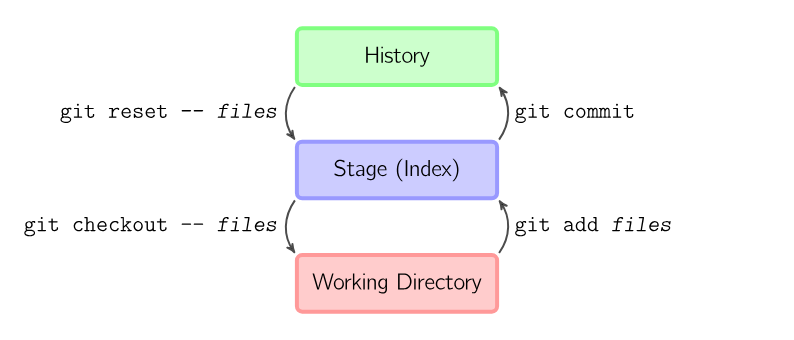

# [WIP] 4 树对象和提交对象

!!! abstract
    上一章我们讨论了 git 如何处理单个的文件。这章中，我们会了解到 git 如何处理一个目录，以及如何将目录的状态保存到 git repo 中。

    这章中，我们会实现：

    - `ls-files`, `check-ignore`, `status`

## 4.1 预备知识

### 4.1.1 暂存区 (stage / index)

大家已经熟悉：在本地仓库中，我们会对文件进行一些修改。每当我们完成了一个阶段目标，我们会通过 `git add files` 的方式将我们的修改添加到暂存区 (stage, a.k.a. index) 中，然后通过 `git commit` 的方式将暂存区中的内容提交到 git repo 中。也就是说，在 git 的设计中，总共有 3 个类似的东西：本地工作目录、暂存区和 git repo，它们以如下方式交互：

<figure markdown>
  
  <figcaption markdown>git 的基本用法 | [src](https://marklodato.github.io/visual-git-guide/index-zh-cn.html)</figcaption>
</figure>


???+ tip "文件的状态变化"
    在 git 和用户的视角里，每一个文件的状态变化如下图所示：

    <center></center>

    下面对这张图做详细的解释。

    ---

    我们使用下面这样的形式来刻画 git 仓库 (repo)、暂存区 (index / stage) 和本地工作目录 (work-tree) 某个时刻的状态快照：

    ```
       repo          index        work-tree
    ----------     ---------      ---------
    main.py(1)     main.py(1)     main.py(1)
    ```

    可以看到，main.py 在三个位置都存在，说明这个文件曾经被 commit 过。我们用 `(1)` 来描述文件的版本；这三个地方 main.py 的版本一致，这说明这个文件在提交之后未被修改过。

    ---

    我们可能会添加一些文件；对于我们没有 `git add` 过的文件，它们的状态是「未跟踪 (untracked)」的：git 并不知道这些文件是否被更改过，因为它从来没有存储过这些文件的状态信息；即从来没有用 `git hash-object -w` 把它们写入到对象存储过：

    ```
       repo          index        work-tree
    ----------     ---------      ---------
                                  README.md(1)
    main.py(1)     main.py(1)     main.py(1)
    ```

    ---

    当我们使用 `git add` 将文件添加到暂存区时，git 会为这个文件的内容生成一个 blob，然后将它写入到 stage 的 tree 中。因此它的状态变为「已暂存 (staged)」；这意味着 git 已经记住了这次修改，并把它加入到了暂存区——git 有能力对这个文件的后续修改进行跟踪：

    ```
       repo          index        work-tree
    ----------     ---------      ---------
                   README.md(1)   README.md(1)
    main.py(1)     main.py(1)     main.py(1)
    ```

    ---

    当我们在本地对已跟踪的文件进行修改后，它们的状态变为「已修改 (modified)」，因为 git 发现了本地该文件的 SHA 和暂存区中该文件的 SHA 并不相同。
    
    ```
       repo          index        work-tree
    ----------     ---------      ---------
                   README.md(1)   README.md(2)
    main.py(1)     main.py(1)     main.py(1)
    ```
    
    但事实上，此时 README.md 是「已修改」的的同时，它也是「已暂存」的；准确地来说，README.md(1) 是「已暂存」的，而 README.md(2) 是「已修改」的：
    
    

    ???+ tip "`git status`"
        `git status` 会告诉我们 3 种「变动」：
        
        - `Changes to be committed`：暂存区与 repo 的差异
        - `Changes not staged for commit`：已跟踪的文件中，工作目录与暂存区的差异
        - `Untracked files`：工作目录中未跟踪的文件

        在本节的例子中，我们会看到全部这三个种类。

    ---

    当我们使用 `git add` 将已修改的文件添加到暂存区后，它们的状态再次变为「已暂存 (staged)」。

    ```
       repo          index        work-tree
    ----------     ---------      ---------
                   README.md(2)   README.md(2)
    main.py(1)     main.py(1)     main.py(1)
    ```

    ---

    当我们使用 `git commit` 将暂存区的内容提交到 git repo 时，实际上我们是使用 index tree 的内容构建了一个 commit object，将它写入到仓库中（我们稍后会详细讨论这些细节）。因此，它们的状态变为「已提交 (committed)」，因为 git 将暂存区的内容写入到了 git repo 中。此时，git repo 中的内容和暂存区的内容相同，而 work-tree 的状态与它们也一样，因此它也是「未修改 (unmodified)」的。已提交和未修改是等价的状态。

    ```
       repo          index        work-tree
    ----------     ---------      ---------
    README.md(2)   README.md(2)   README.md(2)
    main.py(1)     main.py(1)     main.py(1)
    ```

    ???+ tip

        当然，如果我们在 `git commit` 时处在以下状态：

        ```
           repo          index        work-tree
        ----------     ---------      ---------
                       README.md(1)   README.md(2)
        main.py(1)     main.py(1)     main.py(1)
        ```

        在我们提交后，repo 变得和 index 一样，但 work-tree 的 README.md 与前二者的版本并不同，因此 README.md 的状态仍然是「已修改」：

        ```
           repo          index        work-tree
        ----------     ---------      ---------
        README.md(1)   README.md(1)   README.md(2)
        main.py(1)     main.py(1)     main.py(1)
        ```

        

    ---

    我们还可以通过 `git rm` 将文件从暂存区删除；

    ```
       repo          index        work-tree
    ----------     ---------      ---------
    README.md(2)                  README.md(2)
    main.py(1)     main.py(1)     main.py(1)
    ```

    此时，README.md 的状态变回「未跟踪」，因为 index 中已经没有 README.md 了，因此不知道 README.md 是否被修改过：

    > 注：`git rm` 默认会从 index 和 work-tree 中删除文件；如果只想从 index 中删除，可以使用 `git rm --cached`：

    

    !!! quote "以上的内容的例子启发自 [这个回答](https://stackoverflow.com/a/55878249/14430730)。"

### 4.1.2 暂存区的实现

在上面一节，我们从概念上了解了暂存区的作用。在这一节，我们会具体讨论暂存区的实现。根据上一节的讨论，我们可以把暂存区用一个 tree 对象来刻画——在 `git add` 时加入或者更新文件，在 `git rm` 时删除文件，在 `git commit` 的时候将 tree 对象写入到一个 commit 中；这听起来是一个优雅的方案。

但是，事实上 git 为了面对一些复杂的情况（例如 conflict，我们在后面的章节中会讨论）以及一些性能上的考虑，它使用了 index file 来保存了更多的信息；这个文件存储在 `.git/index`。我们来看看 index file 的具体结构和内容[^index]。

!!! info "这里可能有点脏"
    Index file 的结构和内容有点复杂。如果您对这部分不那么感兴趣，也不要求自己完全独立完成整个项目，那您不妨简略地阅读这一节，然后直接使用我的实现。

[^index]: 您可以在 [git/Documentation
/gitformat-index.txt](https://github.com/git/git/blob/master/Documentation/gitformat-index.txt) 看到原版的详细描述。

举个例子，我们用 `git init` 新建一个仓库，然后 `echo "hello" > hello` `git add hello` 添加一个文件。我们来看看此时这个文件里的内容：

```
0x44495243 0x00000002 0x00000001 0x6595204E 0x2755287C 0x6595204E 0x2755287C 0x0100000E 
   D I R C    * * * *    * * * *    e *   N    ' U ( |    e *   N    ' U ( |    * * * * 
magic word    version  entry cnt  ctime sec ctime nsec  mtime sec mtime nsec        dev

0x00C574CF 0x000081A4 0x000001F7 0x00000014 0x00000006 0xCE013625 0x030BA8DB 0xA906F756 
   * * t *    * * * *    * * * *    * * * *    * * * *    * * 6 %    * * * *    * * * V 
     inode       mode        uid        gid       size    sha (a.k.a. Object name)

0x967F9E9C 0xA394464A 0x00056865 0x6C6C6F00 0x00000000 0x3424106A 0x27D913FE 0x0A425BCC 
   * * * *    * * F J    * * h e    l l o *    * * * *    4 $ * j    ' * * *    * B [ *
      sha (cont.)     flags|   file-name       padding    checksum

0x85BB74D5 0x4D5F71A3 
   * * t *    M _ q *
    checksum(cont.)
```

（上面的输出中 4 字节为一组，下面对齐显示了字节对应的字符；非可见字符用 `*` 代替。第三行的内容是我添加的注释。）

??? note "上面的输出是怎么生成的"
    事实上，可以通过命令 `hd .git/index` 或者 `hexdump -C .git/index` 达到类似的效果：

    ```
    % hexdump -C .git/index
    00000000  44 49 52 43 00 00 00 02  00 00 00 01 65 95 20 4e  |DIRC........e. N|
    00000010  27 55 28 7c 65 95 20 4e  27 55 28 7c 01 00 00 0e  |'U(|e. N'U(|....|
    00000020  00 c5 74 cf 00 00 81 a4  00 00 01 f7 00 00 00 14  |..t.............|
    00000030  00 00 00 06 ce 01 36 25  03 0b a8 db a9 06 f7 56  |......6%.......V|
    00000040  96 7f 9e 9c a3 94 46 4a  00 05 68 65 6c 6c 6f 00  |......FJ..hello.|
    00000050  00 00 00 00 34 24 10 6a  27 d9 13 fe 0a 42 5b cc  |....4$.j'....B[.|
    00000060  85 bb 74 d5 4d 5f 71 a3                           |..t.M_q.|
    00000068
    ```

    但是我希望更清晰地显示字符的对应关系，以及方便我加注释。所以我写了下面的代码将字节流以人类友好的方式打印出来；

    ```python
    def print_bytes(data, group_size=4, group_each_line=6):
        def is_printable(byte):
            return 32 <= byte <= 126

        byte_each_line = group_size * group_each_line

        n = len(data)
        for i in range(0, n, byte_each_line):
            line = data[i:i+byte_each_line]
            for j in range(0, len(line), group_size):
                group = line[j:j+group_size]
                print('0x' + ''.join(f'{byte:02x}' for byte in group).upper(), end=' ')
            print()

            for j in range(0, len(line), group_size):
                group = line[j:j+group_size]
                print('   ', end='')
                print(' '.join(chr(byte) if is_printable(byte) else '*' for byte in group), end=' ')
            print('\n')

    def print_index():
        index_path = find_repo() / GIT_DIR / "index"
        with index_path.open("rb") as f:
            print_bytes(f.read(), 4, 8)
    ```

结合这个例子，我们来介绍 Index 文件的具体格式：

- 一个 12 字节的 header，它包括：
    - 4 字节的 signature (magic word)，固定为 `DIRC`，表示 dir cache
    - 4 字节的 version number，上面的例子中是 `2`
    - 4 字节的 entry count，表示 index 中的 entry 数量，上面的例子中只有一个，即 `1`
- 一系列 index entrys，它们按一定规则排序（稍后讨论）。每个 entry 包括：
    - 8 字节的 ctime，表示文件的 metadata 最后一次修改的时间
    - 8 字节的 mtime，表示文件的内容最后一次修改的时间
    - 4 字节的 dev，表示文件的设备号
    - 4 字节的 ino，表示文件的 inode
    - 4 字节的 mode，表示文件的模式，其中：
        - 16 位 unused，全 0
        - 4 位的 object type，取值为 `b1000` (regular), `b1010` (symlink), `b1110` (gitlink i.e. submodule)
        - 3 位的 unused，全 0
        - 9 位的 permission bits：对于 regular files，取值只能是 `0644` 或 `0755`，分别表示不可执行和可执行；其他类型的文件，取值为 `0000`
    - 4 字节的 uid，表示文件的所有者的 user id
    - 4 字节的 gid，表示文件的所有者的 group id
    - 4 字节的 file size，表示文件的大小，单位是字节
    - 20 字节的 sha，表示文件的内容的 sha
    - 2 字节的 flags，表示文件的状态，其中：
        - 1 位的 assume-valid，表示文件的内容已经被验证过，因此 git 可以跳过对它的检查
        - 1 位的 extended，表示文件的内容已经被扩展过，因此 git 可以跳过对它的检查
        - 2 位的 stage，表示文件的状态，取值为：
            - `b00` 表示文件的状态是「已修改」
            - `b01` 表示文件的状态是「已暂存」
            - `b10` 表示文件的状态是「已提交」
        - 12 位的 name length，表示文件名的长度；如果长于 `0xFFF`，则取值为 `0xFFF`
    - 文件名
        - 保存相对于 repo 根目录的路径，以 `x00` 结尾
    - padding，用 `x00` 填充，使得 entry 按 8 字节对齐；即每个 entry 的大小是 8 字节的倍数
- 一系列 extensions，我们忽略它们（上面这个例子里并没有）
- 前面所有内容的 checksum
    - 可以尝试 `assert data[-20:] == hashlib.sha1(data[:-20]).digest()`，其中 `data` 是 index file 的内容

根据上面这些内容，我们就可以解析 index file 了！我们需要一个类来保存 index file 的所有细节内容，并能够根据这个类还原出一个 index file，这是后续我们对 index 做各种操作的基础。

作为一个里程碑，让我们来实现 `git ls-files` 这个命令！这个命令非常简单，就是将 index 中的所有文件名打印出来：

<!-- termynal -->
```
% git ls-files
.gitignore
readme.md
scripts/lint.sh
scripts/lint_all.sh
setup.py
xgit/__init__.py
xgit/cli.py
xgit/commands/__init__.py
xgit/commands/cat_file.py
xgit/commands/hash_object.py
xgit/commands/init.py
xgit/constants.py
xgit/types.py
xgit/utils.py
```

### 4.1.3 更新暂存区

在 4.1.1，我们看到 `git add` 和 `git rm` 可以将文件添加到暂存区或者从暂存区删除。

## 4.2 效果

能够通过 `cat-file -p` 查看树对象和提交对象的内容。

## 4.3 我的实现

不会完全显示出来，使用的是 `less` 这个命令行工具。这是一个分页器。

````python
import typer
import subprocess

app = typer.Typer()

@app.command()
def show_data():
    # 生成或获取要显示的数据
    data = "这里是您的数据...\n" * 100  # 示例数据

    # 使用分页器显示数据
    with subprocess.Popen(['less'], stdin=subprocess.PIPE, text=True) as proc:
        proc.communicate(data)

if __name__ == "__main__":
    app()
````
