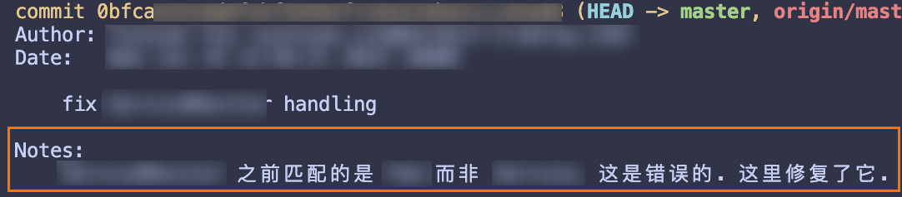

Git 保存的是快照而非版本之间的差别。[ref](https://git-scm.com/book/en/v2/Getting-Started-What-is-Git%3F#:~:text=Snapshots%2C%20Not%20Differences)

#### 配置在哪

git 有一堆配置。它主要分为 3 级：

- 系统级别的配置，保存在 `/etc/gitconfig` 文件中，这个文件对系统上的所有用户都有效。
- 用户级别的配置，保存在 `~/.gitconfig` 文件中，这个文件只对当前用户有效。
- 项目级别的配置，保存在项目的 `.git/config` 文件中，这个文件只对当前项目有效。

???+ info "`/etc` 目录"
    `/etc` 目录是干什么的呢？[这里](https://unix.stackexchange.com/questions/5665/what-does-etc-stand-for) 有一个完整的故事。简单来说，`/etc` 是 `et cetera` 的缩写，本身用来放那些没地方放的东西。随着时间的推移，`/etc` 目录变成了存放配置文件的地方。

    [Filesystem Hierarchy Standard](http://www.pathname.com/fhs/pub/fhs-2.3.pdf) 是一个定义了什么目录是放什么的标准。

#### 如何操作

如果要修改配置，可以直接修改上述文件，也可以通过 `git config` 命令来修改。`git config` 命令可以查询、设置、更改、删除配置。

`git config` 可以通过选项配置要操作的是哪个级别的配置。`--system` 选项表示系统级别，`--global` 选项表示用户级别，`--local` 选项表示项目级别。如果不指定选项，默认是项目级别。

另外，`git -c NAME=VALUE` 可以设置配置只对当前命令有效的配置。

`git config` 提供一系列选项读取或者展示配置的全部键值或部分键值，并提供编程友好的选项。

例如，通过 `git config --list --show-origin`

通过 `git var -l` 可以查看所有的 logical variables，这包含了所有的配置。

#### 有什么配置

配置是分节的；例如 `push` 一节有 `autoSetupRemote` 选项，这描述了执行 `git push` 时的行为方式（即当没有指定远程分支时，是否自动 `--set-upstream`）。节有可能是 git 命令，也有可能是其他内容。

- 设置别名：`alias`，比如 `git config --global alias.co checkout`，这样就可以用 `git co` 代替 `git checkout`。
    - 也可以带参数，比如我设置了 `alias.catn = commit --amend --date=now --no-edit`，即我使用 `git catn` 来将当前修改 amend 到上一个 commit 中，将其时间改为现在，但不修改 commit message。
- `help.autoCorrect`，默认情况下如果给 git 了一个它不认识的命令，它会报错然后建议正确的命令；这个配置可以使得它立即执行建议、在一段时间后自动执行建议，或者提供 prompt 让用户选择。
    - 
- `pull.ff` = `only`，这个配置相当于每次 `git pull` 都加上 `--ff-only` 选项。我在用这个。
- `push.autoSetupMerge`，如本节开头所述。
- `init.defaultBranch` = `main`，`git init` 时创建名为 `main` 的分支
- `rerere.enabled` = `true`，`rerere` (reuse recorded resolution) 会记住解决冲突的方法，下次遇到相同的冲突时会自动解决；在 rebase 一个巨大分支时很有用。
- `merge.conflictstyle` = `zdiff3`，我先用用看，参见 https://www.ductile.systems/zdiff3/
- `core.excludesFile`，指定一个全局的 gitignore
- `branch.sort` = `-committerdate`，设置 `git branch` 按最近提交时间排序而非字典序

#### TODO

- [delta](https://github.com/dandavison/delta)
- [credentials](https://git-scm.com/docs/gitcredentials)
- sparse-checkout
- `merge.conflictStyle` 配置指定了冲突时的展示风格。
- [rerere](https://git-scm.com/book/en/v2/Git-Tools-Rerere)
- [git diff algorithms](https://luppeng.wordpress.com/2020/10/10/when-to-use-each-of-the-git-diff-algorithms/)
- worktree: [ref1](https://github.blog/2015-07-29-git-2-5-including-multiple-worktrees-and-triangular-workflows/), [ref2](https://gist.github.com/GeorgeLyon/ff5a42cb24c1de09e4139266a7689543), [doc](https://git-scm.com/docs/git-worktree)

#### 简单看了一眼的东西

- `git notes` 能够在不更改 commit 的情况下为 commit 添加注释。它的使用不太广泛，GitHub 和 GitLab 也不支持显示 notes。
    - [相关讨论](https://tylercipriani.com/blog/2022/11/19/git-notes-gits-coolest-most-unloved-feature/) 指出，notes 可以用来让一些信息离线记录在 git 中，例如 code review 的信息。
    - 自 2014 年起，GitHub [不再显示 notes 了](https://github.blog/2010-08-25-git-notes-display/)。
    - GitLab 支持 notes 仍然是一个 open issue。
    - 

#### 参考资料

- [Popular Git Config Options](https://jvns.ca/blog/2024/02/16/popular-git-config-options/)
