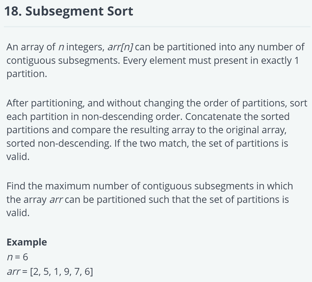

# 量化相关

!!! abstract
    量化这边因为需要避嫌，就大概总结一下考察了哪些问题，不具体指明是哪家公司了。

    这里能不换行说完的东西就放到「零散的问题」里，其他的以「Session」的形式组织。Session 已经打乱处理。

    复盘的时候发现自己还有好多问题现在都不会 QAQ 得找时间好好补一下乐

## 1 操作系统和 Linux 相关

### Session 1

问了开发的环境。问了 Linux + x86-64 环境下系统调用的过程。回答了系统调用号应该在 AL，然后保存现场，进入 kernel mode 开始运行（我也不知道说的对不对）。问了参数应该怎么传。回答了前 6 个参数保存在寄存器里，好像第一个是 RDI，顺序不记得了，剩下的放在栈上。（面试的时候刚好软安做到这里了 XD 对不对就不清楚了

### Session 2

问 virtual memory space 到 physical memory space 的转换。回答了每个进程有个页表，寻址时通过 MMU 转换。问 MMU 是纯软件还是硬件的。问页表存储在哪。如何加速地址转换的过程。问如果虚拟地址对应的物理地址不在内存里会怎么样。问内核处理完 page fault 之后会怎么样。

### 零散的问题

1. 问一个包到达网卡直到由一个用户态进程接收经过了什么样的过程。提示考察硬件和内核如何协作。我回答没有了解过。
1. 让对比共享内存和 socket 这两种进程间通信的方式的优劣。提示通过性能、易用性、扩展性等角度对比。
1. 问我学习过哪些锁。问如果自己实现 semaphore 怎么实现。
1. 让说几个常用的 linux 命令。问了 linux 的权限位。
1. 问了进程间通信的手段。问了共享内存如何使用，我不知道。
1. 让说几个常用的 gdb 命令。
1. 让介绍中断的概念。让区分硬中断和软中断。
1. Linux 里一个 page 多大。
1. 让解释 page fault，区分软缺页和硬缺页 (major / minor fault)。如何减少 page fault。（改善调页算法、lock 一些内存、更改 page 大小、提升局部性等）
1. 什么命令能看一个进程打开的文件。

## 2 C++ 相关

### Session 1

给出代码：

```c++
struct A {
    int a = 0;
    char b;
    long long c = 1;
};
```

问 `sizeof(A)`。问为什么要对齐。

```c++ linenums="1"
struct A {
    int a = 0;
    char b;
    long long c = 1;
    virtual void printa() = 0;
    virtual void printb() { cout << b; }
    void printc() { cout << c; }
};

struct B : public A {
    void printa();
    void printb() { cout << 2; }
    void printc() { cout << 3; }
};

void print();

int main() {
    B foo;
}
```

问为什么 19 行会报错。回答因为 B 没有实现 A 里的纯虚函数，所以 B 还是抽象类。追问为什么抽象类就不能实例化对象，我说因为会链接错误（其实不会）。他提示为什么 16 行这样写就不报错。我明白了，说都不会链接错误，只是按语义设计来说抽象类就是不能实例化。

现在把 11 行改为 `void printa() { cout << 1; }`，问在 main 里 `foo.printa();` `foo.printb();` `foo.printc();` 的输出分别是多少。

如果 `A *bar = new B;`，问 `bar->printa();` `bar->printb();` `bar->printc();` 的输出分别是多少。解释原因。

问 `sizeof(B)`。

问 `bar->printa();` 然后 `bar->printb();` 然后 `bar->printc();`，让对比这三次访问的速度。第一次最慢，因为要先找 vtable 再找函数地址。第二次稍快，因为 vtable 会在 cache 里。第三次最快，因为静态绑定使得函数地址就在汇编里。

问如果 `B *p = new B[10];`，能不能只 delete 前 5 个。

### Session 2

问了 C++ 项目使用的标准版本，回答了 C++17。问了对 C++11 中的智能指针有什么了解。追问有没有看过实现，回答了没有。他指出 shared_ptr 的引用计数是一个原子操作，问我对 C++11 中的 atomic 有什么了解。我回答不太了解。问对 memory order 有什么了解，我也不太了解。

### Session 3

让介绍一下 C++ 里的 lambda。给了 `struct A {int x;}; std::vector<A> v;`，让用 `std::sort` 来排序：`std::sort(v.begin(), v.end(), [](A &a, A &b) {return a.x < b.x;});`。

指出 lambda 是一种语法糖，要我把它用函数对象实现。我当时不太会函数对象。

问了这里第三个参数 `[](A &a, A &b) {return a.x < b.x;}` 是什么类型。问了 `std::sort` 的函数签名是什么。当时不会。参见 [理解 STL —— 迭代器与函数对象](../../cpp/理解%20STL%20-%20迭代器与函数对象/)。

### Session 4

分析 STL 里 `map`, `unordered_map`, `vector` 插入、删除、修改的复杂度。问 `std::string` 怎么实现的。

如果有 `std::string s1 = "1", s2 = "12", ..., s10 = "12345678910", ..., s1000 = "..."`，问 `std::string s = s1 + s2 + ... + s1000` 的复杂度。考察的是 `s1` 会被拷贝 999 次。

### 零散的问题

1. 问我对智能指针有什么理解，我说只知道 shared_ptr。让大概用代码写一下实现。猜着写了一下，但是好像有很多问题，比如引用计数没加锁之类的。
1. 让介绍 C++ 里的面向对象。追问了多继承的原因。追问了对于一个具体的对象，如何找到虚函数表。追问了虚继承的逻辑和实现。
1. 让解释 C++ 中 static 的作用。问了 C++ 中 public, protected, private 继承的区别。
1. 让解释 C++ 中 inline 的作用。问从代码到可执行文件需要哪些步骤，大概是 `.cpp -> .i -> .S -> .o -> executable`。问了 inline 在其中哪一步完成。
1. 问了动态链接和静态链接的区别，分析其优劣。
1. 让解释 C++ 中的虚函数及其动机。问为什么建议把析构函数设置成虚函数。问构造函数能不能设置成虚函数。
1. 让解释 C++ 中指针和引用的区别。
1. 让指出 C++ shared_ptr 有什么问题。
1. 让解释 C++ 的右值引用是干什么的。
1. 让介绍 C++17 有什么新特性。
1. 问模板是干什么的。写库用的，是「写工具的工具」。
1. 斐波那契数列模板元编程。
1. 递归深度大概能多少。我猜栈有 256MB，他说没有那么大。
1. 不同的优化选项，编译器会做什么事。
1. 让解释 C++ 中 const 的作用。问了 const & 传参有什么好处。
1. 给 Foo 类加一个 static 成员变量和加一个虚函数分别会不会让 sizeof(Foo) 变大。
1. 重载需要什么条件。
1. 虚函数会带来什么损耗。
1. 虚函数表是什么时候构造的，虚函数表指针是什么时候赋值的。
1. 模板的特化是什么，解释全特化和偏特化。
1. vector 一直 push_back，占用的内存会怎么变化；事先知道有多大的话可以怎么做。
1. set 想用迭代器改掉可以吗。这个我答错了，其实不行，因为 set 的迭代器是 constant。
1. vector 和 map 是线程安全的吗。我不会。
1. sort 底层是什么排序算法。
1. vector 的 push_back 和 emplace_back 有什么区别。
1. shared_ptr b 赋值给 a，引用计数会有什么变化。
1. 有没有方法能够在 const 成员函数里改成员变量。
1. virtual function 能不能 inline。
1. 对比 unique_ptr, shared_ptr 和原始的指针性能。
1. 让介绍 C++ 的 atomic。我不太懂。
1. 让介绍 likely 和 unlikely。

## 3 写题 / 数据结构和算法相关

### Session 1

HackerRank 上的一次笔试。

???+ example "T1"
    <center>{width=600}</center>

    <center>{width=600}</center>

    题目给了部分代码，实现函数（后面几个题也是这样的，就直接写函数要求了）：

    ??? info "题目给出的代码"
        ```c++
        #include <bits/stdc++.h>

        using namespace std;

        string ltrim(const string &);
        string rtrim(const string &);


        /*
        * Complete the 'getMaximumMex' function below.
        *
        * The function is expected to return an INTEGER.
        * The function accepts following parameters:
        *  1. INTEGER_ARRAY arr
        *  2. INTEGER x
        */

        int getMaximumMex(vector<int> arr, int x) {
        }

        int main()
        {
            ofstream fout(getenv("OUTPUT_PATH"));

            string arr_count_temp;
            getline(cin, arr_count_temp);

            int arr_count = stoi(ltrim(rtrim(arr_count_temp)));

            vector<int> arr(arr_count);

            for (int i = 0; i < arr_count; i++) {
                string arr_item_temp;
                getline(cin, arr_item_temp);

                int arr_item = stoi(ltrim(rtrim(arr_item_temp)));

                arr[i] = arr_item;
            }

            string x_temp;
            getline(cin, x_temp);

            int x = stoi(ltrim(rtrim(x_temp)));

            int result = getMaximumMex(arr, x);

            fout << result << "\n";

            fout.close();

            return 0;
        }

        string ltrim(const string &str) {
            string s(str);

            s.erase(
                s.begin(),
                find_if(s.begin(), s.end(), not1(ptr_fun<int, int>(isspace)))
            );

            return s;
        }

        string rtrim(const string &str) {
            string s(str);

            s.erase(
                find_if(s.rbegin(), s.rend(), not1(ptr_fun<int, int>(isspace))).base(),
                s.end()
            );

            return s;
        }
        ```
    
    ??? success "我的答案"
        ```c++
        int getMaximumMex(vector<int> arr, int x) {
            vector<int> cnt(x, 0);
            for (auto i : arr)  cnt[i % x]++;
            int minn = 100005;
            for (auto i : cnt)  minn = min(i, minn);
            for (int i = 0; i < x; i++) {
                if (cnt[i] == minn)
                    return minn * x + i;
            }
            __builtin_unreachable();
        }
        ```

???+ example "T2"
    <center>{width=600}</center>
    <center>{width=600}</center>
    <center>{width=200}</center>
    <center>{width=600}</center>

    要求实现函数 `int findMaxSubsegmentsCount(vector<int> arr)`

    ??? success "我的答案"
        ```c++
        int findMaxSubsegmentsCount(vector<int> arr) {
            int n = arr.size();
            vector<int> premax(n), postmin(n);
            
            premax[0] = arr[0];
            for (int i = 1; i < n; i++)
                premax[i] = max(premax[i - 1], arr[i]);
            
            postmin[n - 1] = arr[n - 1];
            for (int i = n - 2; i >= 0; i--)
                postmin[i] = min(postmin[i + 1], arr[i]);
            
            int res = 1;
            for (int i = 0; i < n - 1; i++)
                if (premax[i] <= postmin[i + 1])
                    res++;
                    
            return res;
        }
        ```

### Session 2

???+ example "写题"
    房间中有 n 个灯泡，编号从 0 到 n-1，自左向右排成一行。最开始的时候，所有的灯泡都是关着的。
    
    请你设法使得灯泡的开关状态和 target 描述的状态一致，其中 target[i] 等于 1 表示第 i 个灯泡是开着的，等于 0 意味着第 i 个灯是关着的。

    有一个开关可以用于翻转灯泡的状态，翻转操作定义为：选择当前配置下的任意一个灯泡 (下标为 i)，翻转下标从 i 到 n-1 的每个灯泡。翻转时，如果灯泡的状态为 0 就变为 1，为 1 就变为 0。

    返回达成 target 描述的状态所需的最少翻转次数。

    示例:<br/>
    输入: target = "10111"<br/>
    输出: 3
    
    解释: 初始配置 "00000"<br/>
    从第 3 个灯泡 (下标为 2) 开始翻转 "00000" -> "00111"<br/>
    从第 1 个灯泡 (下标为 0) 开始翻转 "00111" -> "11000"<br/>
    从第 2 个灯泡 (下标为 1) 开始翻转 "11000" -> "10111"<br/>
    至少需要翻转 3 次才能达成 target 描述的状态。

    提示:<br/>
    1 <= target.length <= 10^5^

    ??? success "我的答案"
        ```cpp
        int minFlips(string &target) {
            int count = 0;
            bool status = 0;
            for (auto c : target) {
                if (c - '0' != status) {
                    count++;
                    status = !status;
                }
            }
            return count;
        }
        ```


### Session 3

???+ example "写题"
    有大概这样的代码：
    ```cpp
    class Obj {
        int val;
    public:
        void foo(const Obj &other_obj) {
            if (other_obj.val > val) {
                other_obj.val--;
                val++;
            }
        }
    }
    ```
    加锁使其同步。
    
### Session 4

有一个随机函数 `rand_m()`，能等概率地生成 0 ~ m - 1 的随机数。问如何用这个函数来实现一个 `rand_n()`，来等概率地生成 0 ~ n - 1 的随机数。

???+ success "我的解法"
    刚开始说的是，调用 `n` 次 `rand_m()` 并把结果相加然后对 `n` 取模。其实是错的，例如 `m = 3, n = 2` 的情况，生成 0 和 1 的概率显然不均等。

    面试官问「有没有更快的做法」，于是想到了：

    1. 如果 $m \ge n$，那么取 $q = \lfloor \cfrac{m}{n} \rfloor$。用 `rand_m()` 生成一个随机数 $r$，如果 $r \ge n\cdot q$ 则重新生成，直到生成出 $r < n\cdot q$ 为止，返回 `n` 即可。
    2. 如果 $m < n$，那么调用 $k = \lceil \log_M N \rceil$ 次 `rand_m()`，所得结果可以形成一个 $k$ 位 $m$ 进制数，用此数替代 $m$，按 $m \ge n$ 的方法计算。

    查到了 https://math.stackexchange.com/a/2249958 ，是类似的方法，叫做 reject sampling，不过还有别的方法。

### Session 5

???+ example "写题"
    写一个类，实现并查集，应保证 a 和 b 连通当且仅当 `getRoot(a) == getRoot(b)`，大概是：
    ```cpp
    template<class T>
    class DisjointSet {
    public:
        DisjointSet();
        void addNode(const T &node);
        T getRoot(const T &node) const;
        void connectNodes(const T &a, const T &b);
    }
    ```
    询问了是否可以假设`T`是可比较的或者可哈希的，是可以的。

### Session 6

???+ example "写题"
    写一个类，大概是：
    ```cpp
    class TimeStamp {
    public:
        TimeStamp(uint64_t num) : _num(num) {}
        TimeStamp(const std::string &str) {
            // TODO
        }
        uint64_t getNum() const { return _num; }
        std::string getStr() const {
            // TODO
        }
    private:
        uint64_t _num;
    }
    ```
    能够实现`"yyyymmdd:hh:mm:ss.ffffff"`的时间格式的储存。例如`"20220824:02:12:50.056789"`。

### Session 7

???+ example "写题"
    给定一个数列 `array`，它的元素全部为 int，验证它是否能从全为 1，长度为 `array.length()` 的数列 `base` 经过若干次如下操作变为数列 `array`：选择某个元素，将其变为 `sum(base)`。

    ??? success "我的答案"
        ```cpp
        bool check(const vector<int> &v) {
            priority_queue<int, vector<int>, less<int>> pq(v.begin(), v.end());
            int sum = 0;
            for (auto i : v)    {
                sum += i;
                if (i < 1)  return false;
            }

            while (true) {
                int top = pq.top();
                if (top == 1)  return true;
                int temp = top - (sum - top);
                sum -= sum - top;
                if (temp < 1)   return false;
                pq.pop();
                pq.push(temp);
            }

            __builtin_unreachable();
        }
        ```

### Session 8

???+ example "写题"
    写一个类，支持给定路径 (如 `"aa/bb/c/d.txt"`) 和 user，创建文件 `createFile`；给定路径 (如 `"aa/bb/c"`)，返回路径中文件的个数`getFileNum`；给定路径，返回路径中文件创建者的列表`getUsers`：
    ```cpp
    class Foo {
    public:
        Foo();
        void createFile(const std::string &path, const std::string &user);
        size_t getFileNum(const std::string &path) const;
        std::vector<std::string> getUsers(const std::string &path) const;
    }
    ```
	不要求考虑文件被重复创建的情况。<br />给出了一个 helper 类，能够支持路径的拆分，即从`std::string`到`std::vector<std::string>`，例如`"aa/bb/c/d.txt"` -> `["aa", "bb", "c", "d.txt"]`。

### 零散的问题

1. 问对于归并排序的理解。问二路归并的时间复杂度（我当时竟然掏出笔开始算了）。
1. 让介绍常见的排序算法。让介绍快速排序的思路，问了快速排序的额外空间复杂度。让介绍堆排序的过程。
1. 计算字符串，包含数字和 `+`, `-`, `()`, ` `。不需要考虑不合法的情况。
1. 有 `n` 块石头，A 和 B 轮流拿，每次 1 ~ 3 块，先拿完者胜。假设都做最优选择，给定 `n`，问先手能否取胜。答案是如果 `n % 4 == 0` 则先手负，否则先手胜。
1. 剑指 offer 里的题：https://leetcode.cn/problems/qiu-12n-lcof/ 。
1. 有三个容器，10L / 7L / 3L，10L 的是满的，另外两个是空的，如何分出 2 份 5L 的水。算了半天算出来了XD 百度能找到。这里 https://en.wikipedia.org/wiki/Water_pouring_puzzle 有个通解，但是我感觉通解还不如自己推。
1. 有一根木棍，将其切成三段，问三段能构成三角形的概率是多少。后来查到这个问题叫 The Broken Stick Problem。我的做法是线性规划，梦回高中数学。答案是 1/4。
1. 经典题目接雨水。
1. 2 手交易最多赚多少（这题考过两次）
1. 有 N 个大文件，表示 N 支股票的交易记录，每个文件的每一行是 `<timestamp, record>`，且各文件内 timestamp 递增。设计算法将这 N 个文件 merge 到一个文件中，仍然保持 timestamp 递增。相同 timestamp 的顺序任意。
1. 有两个链表，在后面某个结点相交，让找出这个结点。是这个题 https://leetcode.cn/problems/intersection-of-two-linked-lists/

## 4 其他

### Session 1 (HR)

问了哪里人、高考成绩和排名，为什么选择浙大的信息安全专业。问了实习期间的工作情况。问了为什么没有转正。问了期望的工作地和薪资。问了毕业之前有没有机会提前到公司实习。

问了目前是只在看量化还是也在看其他的。问了投了哪几家。对于公司更关注哪些方面。

问了在工作之外有什么爱好。问了抗压能力、自驱力之类的自我评价。

### Session 2

问我为什么对量化感兴趣，我说我对 C++ 比较感兴趣，低延迟高性能能发挥我 C++ 和其他方面的基础知识。他认为这些优化是量化的「第一阶段」，成熟的公司都做的差不多了。量化的问题不能通过堆生产力解决，也不像游戏和互联网那样存在优化的上限。

问我有没有看过优化相关的新东西，我说没有。他说最好还是要有关注新东西的习惯。

问我认为经过发展之后的能力能为量化发挥怎么样的作用。

### 零散的问题

1. 看到我学编程语言，问对 lambda calculus 是否有了解。
1. 如果给一个性能比较差的程序要优化，有什么样的思路。讲了找最耗时的部分，举了算法复杂度或者常数高、使用错误的类、分支、cache 之类。
1. 给一杯奶和一杯茶，做奶茶。问是把奶倒到茶里好喝还是茶倒到奶里好喝。面试官说这个问题是「为了考察获取信息和思考问题的全面度，还有思维发散的程度」。
1. 让描述交换机更新转发表的过程。
1. 让说明 TCP 和 UDP 的区别。为什么有些需要可靠传输的也用 UDP 不用 TCP，为什么。TCP 哪些地方会造成效率下降。
1. 看到我是信安的，问 SYN Flood 有什么解决方案。
1. 问珠海发信息到上海，延迟大概是多少；相邻的两台机器之间发信息，延迟大概是多少。
1. 交易所如何设计来使得保证接收的各个用户公平。（我不太会，他简单解释的时候好像提到了 TCP 不能广播）
1. 还有哪些我了解但是他没问到的。