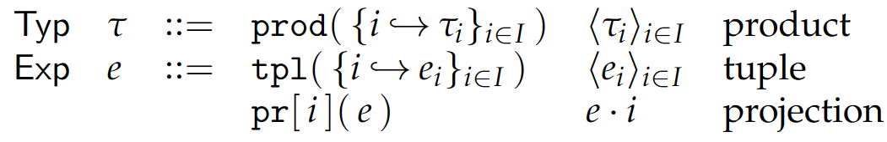
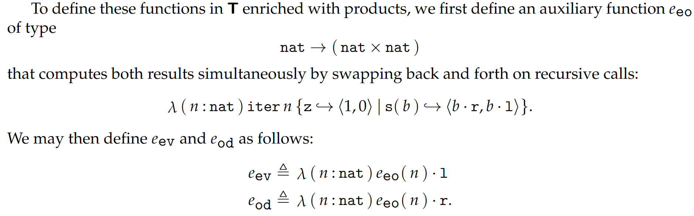

# 10 Product Types | 积类型

两种类型 $\tau_1$ 和 $\tau_2$ 的 **二元积 (binary product)** $\tau_1\times\tau_2$ 是 **有序对 (ordered pair)**（或称为 **元组 (tuple)**）$\langle e_1, e_2 \rangle$（或记为 $(e_1, e_2)$）的类型，其中 $e_1 : \tau_1, e_2 : \tau_2$。

更一般地，**有限积 (finite product)** $\langle \tau_i \rangle_{i\in I}$ 的每个元素都是一个 tuple，每个 tuple 的第 $i$ 个元素的类型为 $\tau_i$。$I$ 是索引的有限集；上述 tuple 称为 $I$-indexed tuple。除了常见的 $I = \{0, \cdots, n-1\}$ 索引的 $n$-tuples 以外，也有用有限的符号集索引的 labeled-tuples，也成为 records。

**空积 (nullary product)** (a.k.a **unit**) 类型仅由唯一的不含任何值的空 tuple 构成。

积类型在编程语言中有重要作用。各种语言中的 struct, record, pair, tuple 等类型都是积类型。可以接受多个参数或者返回多个结果的函数也是积类型的一种例子。

二元积的抽象语法如下：

{width=600}

有限积的抽象语法如下：

{width=600}

有了 tuple，我们就可以用迭代式 $\text{iter}\{\text{z}\hookrightarrow e_0 | \text{s}(x) \hookrightarrow e_1\}(e)$ 代替递归式了：

{width=700}

## 10.3 Primitive Mutual Recursion | 原始互递归

这样的函数：

{width=200}

可以这样定义：

{width=700}
