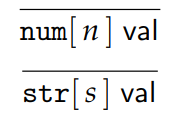

# 5 Dynamics | 动态语义

## 5.1 Transition Systems | 转换系统

我们用下面 4 中形式的判断来描述 **转换系统 (transition system)**。转换系统用于归纳地指明程序执行的一步步过程：

1. $s$ state（$s$ 是转换系统的一个状态）
2. $s$ final（在 $s$ state 的前提下，$s$ 是一个终结状态）
3. $s$ initial（在 $s$ state 的前提下，$s$ 是一个初始状态）
4. $s \mapsto s'$（在 $s$ state 和 $s'$ state 的前提下，$s$ 可以转换到 $s'$）

我们称一个无法转换的状态是 **卡住的 (stuck)**。我们约定，所有终结状态都是 stuck 的；但是转换系统中也可能存在 stuck 的非终结状态。

我们称一个转换系统是 **确定性的 (deterministic)**，当且仅当对每个状态 $s$，有至多一个 $s'$ 使得 $s\mapsto s'$。否则，称之为 **非确定性的 (non-deterministic)**。

如果一系列状态 $s_0, \cdots, s_n$ 满足 $s_0$ initial，且 $s_i\mapsto s_{i+1}, 0\le i < n$，则称之为一个 **转换序列 (transition sequence)**。称一个转换序列为 **最大的 (maximal)**，当且仅当 $s_n$ 是 stuck 的。称一个转换序列为 **完备的 (complete)**，当且仅当（它是 maximal 的，而且）$s_n$ final。

判断 $s\downarrow$ 表示有一个从 $s$ 开始的 complete transition sequence，即 $s$ initial 且存在 $s'$ final s.t. $s\mapsto^*s'$。其中 **转换判断的迭代 (iteration)** $s\mapsto^*s'$ 定义如下：

$$\frac{}{s\mapsto^* s}$$

$$\frac{s\mapsto s'\quad s'\mapsto^* s''}{s\mapsto^* s''}$$

类似地，我们定义 **转换判断的 n 次迭代 (n-times iteration)** $s\mapsto^n s'$ 如下：

$$\frac{}{s\mapsto^0 s}$$

$$\frac{s\mapsto s'\quad s'\mapsto^n s''}{s\mapsto^{n+1}s''}$$

**定理 5.1** 对所有状态 $s$ 和 $s'$，$s\mapsto^*s'$ 当且仅当 $\exists k \ge 0, s\mapsto^ks'$。

## 5.2 Structural Dynamics | 结构化动态语义

结构化动态语义通过转换系统来归纳地指明程序执行的一步步过程。**E** 语言的结构化动态语义定义如下：

所有状态都是初始状态。

判断 $e$ val 表示 $e$ 是一个 **闭值**，代表已完成的计算，是封闭状态。其归纳定义由如下规则给出：

{width=150}

状态之间的转换判断 $e\mapsto e'$ 由以下规则归纳定义：

（`times` 和 `len` 类似，略）

在上述定义中，5.4a, 5.4d, 5.4h 是基本的求值步骤，称为 **指令转换 (instruction transition)**；而其他规则用于确定执行顺序，称为 **搜索转换 (search transition)**。

例如，5.4b 和 5.4c 就表示，如果 $\text{plus}(e_1;e_2)$ 中 $e_1$ 不在终结状态，就应当先做转换；如果 $e_1$ final，那么在考虑 $e_2$ 能否转换，如果能转换则优先转换。直到所有转换都完成，即 $e_1$ final 且 $e_2$ final，再根据 5.4a 进行求值。

上述定义的 5.4h 的前提部分和 5.4g 被方括号括起，这其实是针对 `let` 的两种不同理解提出的。一种是 **按值解释 (by-value interpretation)**，即在绑定到已定义的变量之前先对表达式进行求值，如果采取这种理解，则方括号括起的部分应当被保留；而另一种是 **按名解释 (by-name interpretation)**，即在没有求值的情况下直接进行绑定。  
容易理解，已定义变量被多次使用时，按值解释效率较高；而已定义变量不被使用时，按名解释效率较高。

???+ example

    下面的求值序列是一个例子；

    
{width=600}

    其中的每一步都可以通过前述规则推导证明：

    
{width=600}

上述对 **E** 的结构化动态语义可以引出一下两个引理：

**引理 5.2（值的终结性，finality of value）** （在 **E** 语言中，）不存在表达式 $e$，使得对于某个 $e'$，$e$ val 和 $e\mapsto e'$ 同时成立。

**引理 5.3（确定性，determinacy）** （在 **E** 语言中，）如果 $e\mapsto e'$ 且 $e\mapsto e''$，那么 $e'$ 和 $e''$ 是 $\alpha$-equivalent 的。

## 5.3 Contextual Dynamics | 上下文动态语义

没看懂，暂略、

## 5.4 Equational Dynamics | 等式动态语义

没讲，暂略。