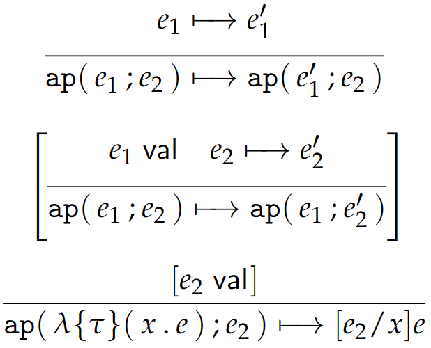

# 9 System T of Higher Order Recursion

## 9.1 知识补充

在介绍 System T 之前，我们补充一些预备知识。

**部分函数 (partial functions)**。如果 $f$ 是 $A$ 到 $B$ 的二元关系，且 $\forall a \in A$，有 $f(a) = \varnothing$ 或存在 $b\in B$ 使得 $f(a) = {b}$ ，则称 $f$ 是一个部分函数。当 $f(a) \neq \varnothing$ 时，记 $f(a)\downarrow$。

**全函数 (total functions)**。如果 $f$ 是部分函数，且 $\forall a \in A, f(a)\downarrow$，则称 $f$ 是一个全函数。

**非终止性**。在数学中的函数基本是全函数；但部分函数对于计算机科学来说是重要的。一个算法可以表示为求出 $a\in A$ 在集合 $B$ 中对应元素的过程，但这个算法对于部分 $a\in A$ 可能不会终止，这种情况是很常见的。

例如：

```
f :: Int -> Int
f 1 = 1
f n = n + f(n - 2)
```

这个函数 `f` 对于偶自然数和负数都不会终止，因此它是一个部分函数。

**递归函数论**。递归函数论是和图灵机以及 $\lambda$ 演算相等价的计算模型，它从另一个⻆度刻画了可计算性。在递归函数论中，人们把函数划分为了 3 个层次：原始递归函数，递归函数，和其他的不能用递归函数表示的函数。这些函数集合的范围越来越大。

**原始递归 (primitive recursion) 运算**。设 $f$ 是一个 $n$ 元全函数，$g$ 是 $n+2$ 元全函数，令

$$
\begin{array}{rl}
h(x_1, \dots, x_n, 0) &= &f(x_1, \dots, x_n) \\
h(x_1, \dots, x_n, t+1) &= &g(t, h(x_1, \dots, x_n, t), x_1, \dots, x_n) 
\end{array}
$$

则称 $h$ 是由 $f$ 和 $g$ 经过原始递归运算得到的。

## 9.2 Gödel's System T

System T 是函数类型和自然数类型的结合，同时引入了原始递归机制。

**T** 语言的抽象和具体语法如下：

<center>{width=500}</center>

其闭值由以下规则定义，这是动态语义的一部分：

<center>{width=150}</center>

与前面的讨论类似，这里方括号括起的部分也是用来区分不同的解释的。在 eager form of **T** 中方括号中的内容应当保留，在 lazy form 中则应去掉。后文中涉及动态语义的部分省略相关解释。

!!! note
    这里我们仍然可以使用之前「按值调用」和「按名调用」的说法，但是我们改为用 eager 和 lazy 描述；这是因为，$\text{s}(e)$ 也涉及到这两者的区别，但是 $\text{s}$ 是一个运算符而非函数，因此再用「调用」则稍显不妥。

我们分几个部分来讨论和解释上述语法。

### 9.2.1 Abstraction and Application

**T** 对于函数的处理和 **EF** 是一致的，其静态语义由以下规则定义：

<center>{width=300}</center>

相关闭值的定义已经在前文讨论过了。动态语义中相关的转换规则如下：

<center>{width=300}</center>

可以看到，这和 **EF** 中的并无区别。

### 9.2.2 Natural Numbers

**T** 对于自然数的定义和我们在 2.2 节中定义的基本一致，只是采用的符号略有不同。其静态语义由以下规则定义：

<center>{width=150}</center>

相关闭值的定义已经在前文讨论过了。动态语义中相关的转换规则如下：

<center>{width=150}</center>

我们把 $\text{s(}\cdots \text{s(z))}$ 简写为 $\overline{n}$，表示后继被作用到 0 上 $n \ge 0$ 次。

### 9.2.3 Recursion

与 **E** 不同，**T** 中对于自然数的操作只有原始递归。但事实上，这种操作更加通用，因此实际上可以实现 **E** 中的所有算术操作，甚至更多。

我们下面来讨论 **T** 语言中的递归操作。**递归式 (recursor)** 的抽象语法是 $\text{rec}\{e_0;x.y.e_1\}(e)$；具体语法是 $\text{rec }e\{\text{z}\hookrightarrow e_0 | \text{s}(x) \text{ with } y \hookrightarrow e_1\}$，或者写作 $\text{rec}\{\text{z}\hookrightarrow e_0 | \text{s}(x) \text{ with } y \hookrightarrow e_1\}(e)$。

它表示的含义其实就是：如果 $e$ 满足 $\text{z}$ 的形式，则表达式的值为 $e_0$；否则 $e$ 可以表示为 $\text{s}(e')$ 的形式，此时表达式的值为 $e_1$，$e_1$ 有绑定变量 $x$ 和 $y$，$e'$ 被绑定到 $x$ 上，以 $e'$ 为操作数递归，将递归的结果绑定到 $y$ 上。

用 9.1 节中「原始递归」的方法表示，其实就是：

$$
\begin{array}{rl}
h(\vec{x}, \text{z}) &= &\vec{x}.e_0 \\
h(\vec{x}, \text{s}(e')) &= &\vec{x}.e_1(e', h(\vec{x}, e')) 
\end{array}
$$

上面的描述可能还是有点抽象，不妨举一个例子。我们在 OCaml 中定义如下的 `nat` 类型：

```OCaml
type nat = 
| Z 
| S of nat;;
```

我们定义「加倍」函数：

```OCaml
let rec double a = 
  match a with
  | Z -> Z
  | S x -> S(S(double x));;

double (S (S Z));;
```

尝试运行可以得到正确的结果：

<center>{width=300}</center>

进一步地，我们将其改写为递归式的形式：

```OCaml
let rec double a = 
  match a with
  | Z -> Z
  | S x -> let y = double x in S(S y);;
```

<center>{width=300}</center>

因此，我们可以容易地写出 `double` 对应的递归式：

$$\lambda(e:\text{nat})\text{rec}\{\text{z}\hookrightarrow \text{z} | \text{s}(x) \text{ with } y \hookrightarrow \text{s}(\text{s}(y))\}(e)$$

即

$$\lambda\{\text{nat}\}(e.\text{rec}\{\text{z}; x.y.\text{s}(\text{s}(y))\}(e))$$

!!! info "迭代式"
    可以看到，这里在 $\text{s}(\text{s}(y))$ 中虽然 $x$ 被绑定了，但是并没有被使用。这种情况下，我们可以用 **迭代式 (iterator)** $\text{iter}\{e_0;y.e_1\}(e)$ 替代递归式。这是递归式的一种特例。

这样，我们其实就容易理解课本中说「递归式 $\text{rec}\{e_0;x.y.e_1\}(e)$ 表示从 $e_0$ 开始，对变换 $x.y.e_1$ 的 $e$ 轮折叠」是什么意思了。例如调用 $\text{rec}\{e_0;x.y.e_1\}(\overline{n})$，如果从参数为 $\overline{n}\to 0$ 的方向看，其实就是正常递归调用的路径；如果从参数为 $0\to \overline{n}$ 的方向看，其实就是将 $\text{z}$ 作为 $x$、$e_0$ 作为 $y$ 计算 $e_1$，然后将结果作为 $y$、$\text{s}(x)$ 作为 $x$ 再计算 $e_1$，重复 $n$ 次，得到该递归式的值。

因此，我们就可以给出递归的静态和动态语义了。

静态语义：

<center>{width=400}</center>

动态语义：

<center>{width=500}</center>

### 9.2.4 Definability

自然数上的一个数学函数 $f : \mathbb{N}\to\mathbb{N}$ 是 **可定义 (definable)** 的，当且仅当存在一个 $\text{nat}\to\text{nat}$ 类型的表达式 $e_f$，使得 $\forall n \in \mathbb{N}, e_f(\overline{n})\equiv \overline{f(n)} : \text{ nat}$。