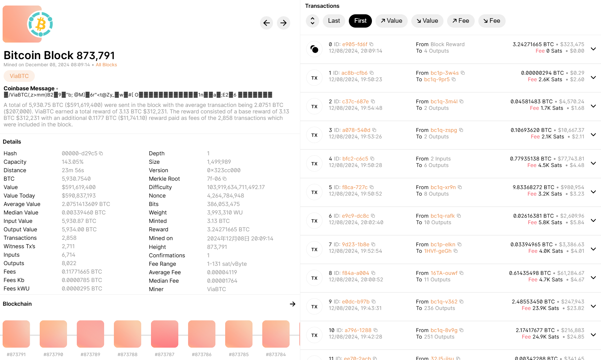
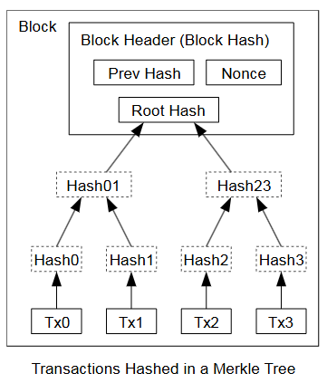

# 咸鱼暄学区块链

学一下区块链！

[北京大学肖臻老师《区块链技术与应用》公开课](https://www.bilibili.com/video/BV1Vt411X7JF) 看起来不错，从这里开始学试试。

笔记先都记在这个文档里！形成体系之后再重新梳理和拆分。

## 1 BitCoin

!!! info "参考资料"
    - [官方社区](https://bitcoin.org/zh_CN/) 的相关资源
        - [工作原理简述](https://bitcoin.org/zh_CN/how-it-works)
        - [白皮书](https://bitcoin.org/zh_CN/bitcoin-paper)
        - [FAQ](https://bitcoin.org/zh_CN/faq)
    - [BitCoin Wiki](https://en.bitcoin.it/wiki/Main_Page)

### 1.1 密码学原理

比特币是一种加密货币 (Cryptocurrency)。它的核心技术是区块链 (Blockchain)。

- 加密货币其实没有加密，区块链上的所有信息都是公开的。

!!! warning
    密码学相关知识在以前的安全相关课程学过了，这里不过多展开。

#### Cryptographic Hash Function

密码学中的哈希函数 (Cryptographic Hash Function) 是比特币的基础。它们通常有以下重要特性：

1. **Collision Resistance**：没有高效的方法找到两个不同的输入，使得它们的哈希值相同。
    - 这一点很难证明，通常是验证性的。但是也有一些哈希函数被破解了，比如 MD5。
2. **Hiding**：给定一个哈希值，没有高效的方法找到对应的输入。
    - 这个性质可以被用来实现 Digital Commitment，也叫做 Digital Equivalent of Sealed Envelope。
    - 例如，如果某个时刻我需要证明我已经知道了某个信息，但是我不想让别人知道这个信息，我可以先把这个信息哈希一下，然后把哈希值公开。等到需要证明的时候，我再公开原始信息，让别人验证哈希值是否匹配。
3. **Puzzle Friendly**：给定一个哈希值，没有高效的方法找到对应的输入，使得哈希值的前缀满足某个条件。
    - 这个性质可以被用来实现 Proof of Work。Proof of Work 的目的是为了让计算机在找到一个特定的输入的时候需要花费一定的时间，从而防止恶意用户快速地生成大量的输入。
    - Puzzle 的一个例子是，我们定义对于一个输入 `payload`，我们需要找到一个 `nonce`，使得哈希函数值 `H(payload + nonce)` 的前缀有 `k` 个 0 (即 `H(payload + nonce) < target`)。
    - Puzzle Friendly 事实上是指，difficult to solve but easy to verify。

比特币使用的哈希函数是 SHA-256。

#### Digital Signature

如何在比特币中开一个「账户」？只需要生成一对 Public Key 和 Private Key。

???+ info "公私钥"
    这个概念来自于非对称加密 (Asymmetric Cryptography)。
    
    对称加密 (Symmetric Cryptography) 是指加密和解密使用同一个密钥，它的核心问题是密钥的分发。
    
    非对称加密使用一对密钥，一个用来加密，一个用来解密。这样只需要分发公钥，私钥可以在本地保存。这样就避免了密钥分发的问题。

当我发布一个交易时，我使用我的私钥对交易进行签名。其他人需要验证这个交易是否是我发布的，只需要使用我的公钥对签名进行验证。我的公钥会被放在交易中，这样任何人都可以验证这个交易。

值得注意的是，在生成公私钥以及签名时，我们都需要使用随机数。使用一个好的随机数生成器是非常重要的，否则会导致私钥泄露。

### 1.2 数据结构

下图是我写下这段话时比特币区块链的 [最新一个区块](https://www.blockchain.com/explorer/blocks/btc/873791)，可以看到当前长度是 873,791：



这个区块的部分具体信息是：

```python hl_lines="3-8"
{
    'id': '00000000000000000001e08800208cb45070a50055ea87da5bfb378103bd29c5',
    'version': 842842112,
    'prev_block': '0000000000000000000007f767b76b6a19140b3ac4da7fe1da3466b054cd19de',
    'merkle_root': '7f4e54d88e8f20e2186e5daa4c4fb81a58aefb46b3c197c7534bba450ee69f06',
    'timestamp': 1733659754,
    'bits': 386053475,
    'nonce': 4264784948,
    'height': 873791,
    'tx_count': 2858,
    'size': 1499989,
    'weight': 3993310,
    'mediantime': 1733655475,
    'difficulty': 103919634711492.17
}
```

`id` 就是这个区块的哈希值，由高亮的 6 个字段加上 padding 以 SHA256 算法计算得出 ([ref](https://en.bitcoin.it/wiki/Protocol_documentation#block))。

比特币区块链的核心作用是存储交易信息。每个区块包含了一系列交易 (Transaction, `tx` or `txn`)，上面的 `tx_count` 就是这个区块包含的交易数量。上面的 `merkle_root` 是这些交易的一个摘要，我们会在 [后面](#merkle-tree) 详细介绍。

生成这个区块的人（「矿工」）需要不断尝试（「挖矿」）来找到一个 `nonce`，使得这个区块的哈希值满足一定要求，这个要求是由 `bits` 字段指定的。这个要求会动态调整，以保证每个区块的生成时间大约是 10 分钟；这就是 Proof of Work 机制。我们会在后面详细讨论。

???+ note "如何防篡改？"
    `prev_block` 是上一个区块的哈希值，这样就形成了一个链。如果攻击者希望篡改某个区块中的一个交易，那么他需要选择以下几种方式之一来使得这个篡改不被发现；而这些方式都有解决方案：

    1. 修改这个区块中的其他交易，使得 `merkle_root` 不变。基于 Collision Resistance 的特性，这是困难的。
    2. `merkle_root` 发生了变化，但攻击者通过修改他可以控制的字段 `timestamp` 或 `nonce` 使得区块哈希不变。同样，这是困难的。
    3. 这个区块的哈希发生了变化，因此下一个区块的 `prev_block` 发生了变化；攻击者通过修改 `timestamp` 或 `nonce` 使得下一个区块的哈希不变。同样，这是困难的。
    4. 攻击者终于理解了 Collision Resistance 的特性并放弃了保持哈希值不变；但从这个区块开始构造出一条新的链，并让大家接受这个链。我们稍微展开这个攻击是如何被保护的：
        - 根据比特币的协议，比特币网络总是接受最长 (工作量最大) 的链作为有效链。（我们后面会具体讨论这个话题。）
        - 除非攻击者能控制超过 51% 的算力，否则他的新链不可能比原链增长得更快。因此攻击者的链不会被网络接受。
        - 也是因此，上面这种攻击方式被称为 **51% attack**。

    也就是说，区块链实现了 [tamper-evident](https://en.wikipedia.org/wiki/Tamper-evident_technology) log：对区块的任何篡改都是可以被容易地检测到的。

#### Hash Pointers

上面我们看到的 `prev_block` 是一个 Hash Pointer。使用过 Git 的朋友们会熟悉，这和 Git commit 中的 parent 是类似的；通过这样一个 hash pointer，我们不仅可以知道这个区块的位置，还能验证这个区块的完整性。

区块链上的第一个区块是 [Genesis Block](https://en.bitcoin.it/wiki/Genesis_block)（创世纪块），它的 `prev_block` 是全 0。

#### Merkle Tree

Merkle Tree 是一种树形结构，它的叶子节点是数据块的哈希值，而非叶子节点是它的子节点的哈希值的哈希值。这样，我们可以通过根节点的哈希值 `merkle_root` 来验证整个树的完整性。下图[^from_white_paper]是一个例子:

[^from_white_paper]

[^from_white_paper]: 来自 [比特币白皮书](https://bitcoin.org/zh_CN/bitcoin-paper)。

Merkle Tree 使用的哈希算法是 **Double** SHA256[^double_hash]，即 `dhash(a) = SHA256(SHA256(a))`。

[^double_hash]: 不过，[似乎大家也不觉得 Double SHA256 对于比特币有什么好处](https://bitcoin.stackexchange.com/questions/110065/checksum-sha256sha256prefixdata-why-double-hashing)。

???+ info "特殊情况"
    除了树根外，如果某行有奇数个节点，那么我们复制最后一个节点的哈希值，使得这一行有偶数个节点。[例如](https://en.bitcoin.it/wiki/Protocol_documentation#Merkle_Trees)：

    ```
    d1 = dhash(a)
    d2 = dhash(b)
    d3 = dhash(c)
    d4 = dhash(c)            # a, b, c are 3, so we take the c twice

    d5 = dhash(d1 concat d2)
    d6 = dhash(d3 concat d4)

    d7 = dhash(d5 concat d6)
    ```

???+ note "交易过程简述"
    在一个用户想要发起一次转账交易时，他需要构造一个交易，这个交易包含了他的公钥、接收者的公钥、转账金额、手续费等信息，并用他的私钥对这个交易签名。然后，用户会将这个交易广播到网络中。网络中的矿工会验证其有效性，然后放入 mempool 中等待打包。

    当矿工完成一次 Proof of Work 之后，他会挑选 mempool 中的交易（通常优先挑选手续费高的交易），构造一个 merkle tree 并将其放入区块中，然后开始挖矿。

    当一个区块被挖出来之后，矿工会广播这个区块。其他矿工会验证这个区块的有效性，并从 mempool 中移除这个区块中包含的交易。然后，他们会继续挖下一个区块。

    我们会在后面详细讨论这个过程。

!!! warning "TODO: 轻节点如何验证交易？"
    在 [这里](https://www.bilibili.com/video/BV1Vt411X7JF/?p=3&share_source=copy_web&vd_source=e31915b0fe206e59ed5bac3c953ee665&t=1236) 有介绍，但是还没有了解轻节点的定义和动机，稍后再回来看。

### 1.3 共识协议

我们先从中心化的讨论入手，随后再进入去中心化的设计。

如果要实现一个中心化的数字货币系统，假设有一个大家都信任的中心化机构负责发行数字货币，他应该如何实现呢？
