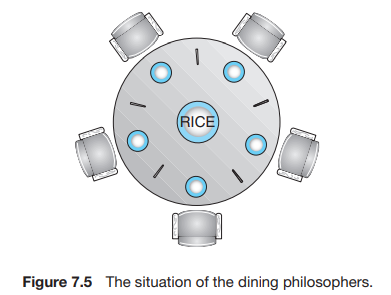

# 7 Synchronization Examples

## 7.1 经典同步问题

一般我们用信号量解决问题，因为信号量相对来说功能更多。

### 7.1.1 Bounded-Buffer Problem

!!! info "Bounded-Buffer Problem"
    给定两个进程：producer 和 consumer，它们共用大小为 $n$ 的 buffer。Producer 生产数据放入 buffer，consumer 从 buffer 取出数据从而使用之。

    该问题需要保证：producer 不应当在 buffer 满时放入数据，consumer 也不应当在 buffer 空时取出数据。

首先，根据我们在前一节中的讨论，produce 和 consume 的过程会访问到 `buffer` 的资源，因此是 critical section，我们需要使用一个锁（或者信号量，后同）来控制对 `buffer` 的访问：

```C linenums="1"
semaphore lock = 1;

producer() {
    while (true) {
        // <1> If buffer is full, wait 
        wait(lock);
        add_to_buffer(next_produced);
        signal(lock);
    }
}

consumer() {
    while (true) {
        // <2> If buffer is empty, wait
        wait(lock);
        next_consumed = take_from_buffer();
        signal(lock);
    }
}
```

不过，上面两处注释中要求根据 `buffer` 的容量决定是否需要等待的需求还没有实现。

我们可以考虑使用一个变量 `count` 来记录 `buffer` 中有多少个元素；如果这样实现的话，对 `count` 的修改也是 critical section，因此也需要锁的控制：

```C linenums="1"
semaphore lock = 1;
int count = 0;

producer() {
    while (true) { 
        wait(lock);
        while (count == BUFFER_SIZE) ;  // If buffer is full, wait 
        add_to_buffer(next_produced);
        count++;
        signal(lock);
    }
}

consumer() {
    while (true) {
        wait(lock);
        while (count == 0) ;    // If buffer is empty, wait
        next_consumed = take_from_buffer();
        count--;
        signal(lock);
    }
}
```

这种方式的实现问题是显然的：比如当前 `buffer` 为空，即 `count` 为 0，`consumer` 会在 16 行处等待；但因为此时它持有着 `lock`，任何 producer 都不能 produce，因此这个等待会永久持续下去。这违反了 **Progress** 和 **Bounded waiting** 的要求。

我们可以稍作修改，当 `count` 的要求不满足时，立即释放 `lock` 并进入下一次循环，即：

```C linenums="1"
semaphore lock = 1;
int count = 0;

producer() {
    while (true) { 
        wait(lock);
        if (count == BUFFER_SIZE) {
            // If buffer is full, give up
            signal(lock);
            continue;
        } else {
            add_to_buffer(next_produced);
            count++;
            signal(lock);
        }
    }
}

consumer() {
    while (true) {
        wait(lock);
        if (count == 0) {
            // If buffer is empty, give up
            signal(lock);
            continue;
        } else {
            next_consumed = take_from_buffer();
            count--;
            signal(lock);
        }
    }
}
```

也就是：

```C linenums="1"
semaphore lock = 1;
int count = 0;

producer() {
    while (true) { 
        wait(lock);
        if (count != BUFFER_SIZE) {
            add_to_buffer(next_produced);
            count++;
        }
        signal(lock);
    }
}

consumer() {
    while (true) {
        wait(lock);
        if (count != 0) {
            next_consumed = take_from_buffer();
            count--;
        }
        signal(lock);
    }
}
```

!!! tips
    **对于这种「有同步需求的整型」，也可以通过信号量实现**！

首先我们尝试使用一个 `lock`  和一个 `eslot` (empty slot，空闲 buffer 的个数) 来解决：

```C linenums="1"
semaphore lock = 1;
semaphore eslot = BUFFER_SIZE;

producer() {
    while (true) {
        wait(eslot);    // if buffer is full, i.e. eslot == 0, wait
                        // else, eslot--
        wait(lock);
        add_to_buffer(next_produced);
        signal(lock);
    }
}

consumer() {
    while (true) {
        // <2> If buffer is empty, i.e. eslot == BUFFER_SIZE, wait
        wait(lock);
        next_consumed = take_from_buffer();
        signal(lock);
        signal(eslot);  // eslot++
    }
}
```

由于 `eslot` 作为一个信号量，我们对它 `++` 和 `--` (实际上是 `wait` 和 `signal`) 是 atomic 的，不需要考虑同步问题。

但是，16 行处我们希望让 `eslot == BUFFER_SIZE` 的时候循环等待，不过信号量本身并没有提供这个功能。怎么办呢？我们需要一个额外的 semaphore `fslot`  (full slot) 来解决这个问题：

```C linenums="1"
semaphore lock = 1;
semaphore eslot = BUFFER_SIZE;
semaphore fslot = 0;

producer() {
    while (true) {
        wait(eslot);    // if buffer is full, i.e. eslot == 0, wait
                        // else, eslot--
        wait(lock);
        add_to_buffer(next_produced);
        signal(lock);
        signal(fslot);  // fslot++
    }
}

consumer() {
    while (true) {
        wait(fslot);    // if buffer is empty, i.e. fslot == 0, wait
                        // else, fslot--
        wait(lock);
        next_consumed = take_from_buffer();
        signal(lock);
        signal(eslot);  // eslot++
    }
}
```

需要特别注意的是 `wait` 之间的顺序。例如如果将 `wait(lock)` 和 `wait(fslot)` 的顺序调转过来，就会发生和前面提到的情况一样的死锁。

### 7.1.2 Readers-Writers Problem

!!! info "Readers-Writers Problem"
    对一个数据，readers 只能读，writers 只能写。
    
    设计方案保证：多个 readers 可以同时读取，但是 writer 进行写时不能有其他 writers 和 readers。

不考虑部分原子性的情况下，我们希望的方案大概如下：

```C linenums="1"
semaphore write_lock = 1;
int reader_num = 0;

writer() {
    while (true) {
        while (reader_num > 0)  ;   // if there is any reader, wait
        wait(write_lock);
        write();
        signal(write_lock);
    }
}

reader() {
    while (true) {
        reader_num++;
        read();
        reader_num--;
    }
}
```

不过我们需要考虑 `reader_num` 的原子性，即：

```C linenums="1"
semaphore write_lock = 1;
semaphore reader_num_lock = 1;
int reader_num = 0;

writer() {
    while (true) {
        wait(reader_num_lock);
        if (reader_num > 0) {
            signal(reader_num_lock);
            continue;   // if there is any reader, give up
        }
        signal(reader_num_lock);

        wait(write_lock);
        write();
        signal(write_lock);
    }
}

reader() {
    while (true) {
        wait(reader_num_lock);
        reader_num++;
        signal(reader_num_lock);

        read();

        wait(reader_num_lock);
        reader_num--;
        signal(reader_num_lock);
    }
}
```

这种实现的结果是，当存在读进程时，写进程将被延迟。这可能导致写进程发生 **starvation**。

如果希望写进程优先，我们可以规定，如果写进程 ready，那么其他读进程应当等待，直到写进程结束；即使得写进程尽可能早地开始。我们可以通过新增一个信号量实现：

```C linenums="1" hl_lines="3 8 16 26 30"
semaphore write_lock = 1;
semaphore reader_num_lock = 1;
semaphore writer_first = 1;
int reader_num = 0;

writer() {
    while (true) {
        wait(writer_first);
        wait(reader_num_lock);
        if (reader_num > 0) {
            signal(reader_num_lock);
            signal(writer_first);
            continue;   // if there is any reader, give up
        }
        signal(reader_num_lock);
        signal(writer_first);

        wait(write_lock);
        write();
        signal(write_lock);
    }
}

reader() {
    while (true) {
        wait(writer_first);
        wait(reader_num_lock);
        reader_num++;
        signal(reader_num_lock);
        signal(writer_first);

        read();

        wait(reader_num_lock);
        reader_num--;
        signal(reader_num_lock);
    }
}
```

课本给出的解决方案大致如下，但是我感觉没有上面我的想法自然QWQ：

```C linenums="1"
Semaphore rcnt_mutex = 1;
Semaphore rw_mutex = 1;
int reader_count = 0;

// Writer
do {
    wait(rw_mutex);
    
    read_and_write();
    
    signal(rw_mutex);
} while (true);

// Reader
do {
    wait(rcnt_mutex);			// 保证 reader_count 的同步
    reader_count++;
    if (reader_count == 1)
        wait(rw_mutex);			// 第一个 reader 出现时拿走 rw_mutex
    signal(rcnt_mutex);
    
    read();
    
    wait(rcnt_mutex);			// 保证 reader_count 的同步
    reader_count--;
    if (reader_count == 0)
        signal(rw_mutex);		// 全部 reader 退出时释放 rw_mutex
    signal(rcnt_mutex);
}
```


### 7.1.3 Dining-Philosophers Problem

!!! info "Dining-Philosophers Problem"
    5 个哲学家一起吃饭！每两个哲学家之间有一根筷子，每个人一次可以拿起来一根筷子，拿到两根筷子的就可以吃一段时间。吃完思考一段时间。

    <center></center>

一个朴素的解法是这样的：

```C linenums="1"
vector<semaphore> chopstick(5, 1);  // initialize semaphores to all 1

philosopher(int index) {
    while (true) {
        wait(chopstick[i]);
        wait(chopstick[(i + 1) % 5]);
        eat();
        signal(chopstick[i]);
        signal(chopstick[(i + 1) % 5]);
        think();
    }
}
```

问题是，可能某时刻每个人同时拿起左边的筷子，这样会导致死锁。

解决方案之一是，只允许同时拿起两根筷子；这种方案的实现是，轮流询问每个人是否能够拿起两根筷子，如果能则拿起，如果不能则需要等待那些筷子放下：

```C linenums="1"  hl_lines="2 6 9"
vector<semaphore> chopstick(5, 1);  // initialize semaphores to all 1
semaphore lock = 1;

philosopher(int index) {
    while (true) {
        wait(lock);
        wait(chopstick[i]);
        wait(chopstick[(i + 1) % 5]);
        signal(lock);

        eat();
        
        signal(chopstick[i]);
        signal(chopstick[(i + 1) % 5]);
        think();
    }
}
```

另一种解决方案是，奇数号人先拿左边筷子，偶数号人先拿右边筷子，这样也能避免死锁。

## 7.2 Linux Sync

2.6 以前的版本的 kernel 中通过禁用中断来实现一些短的 critical section；2.6 及之后的版本的 kernel 是抢占式的。

Linux 提供：

- Atomic integers
- Spinlocks
- Semaphores
- Reader-writer locks

## 7.3 POSIX Sync