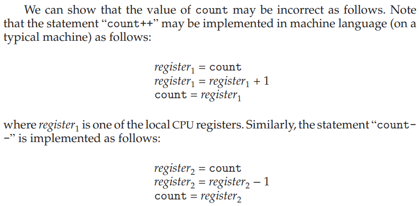
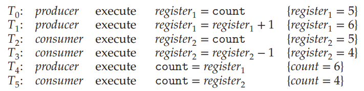
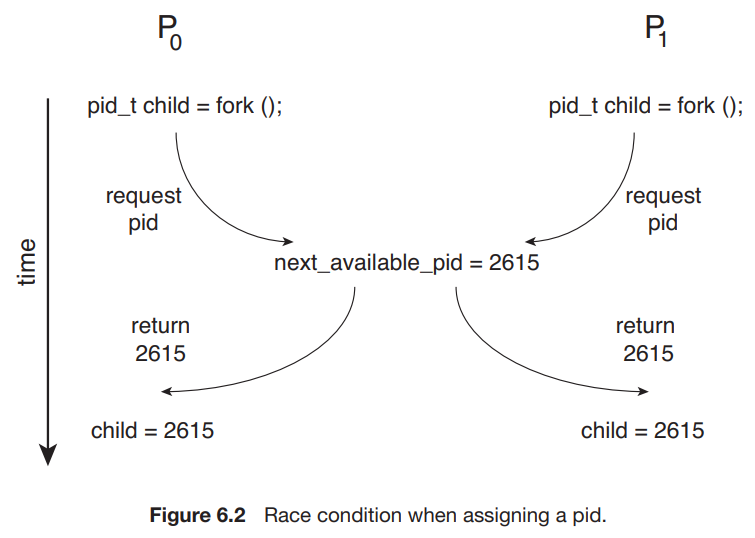
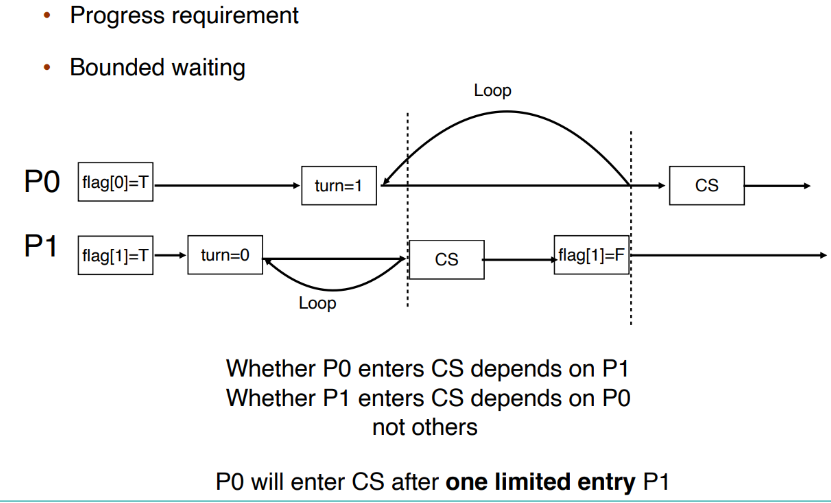
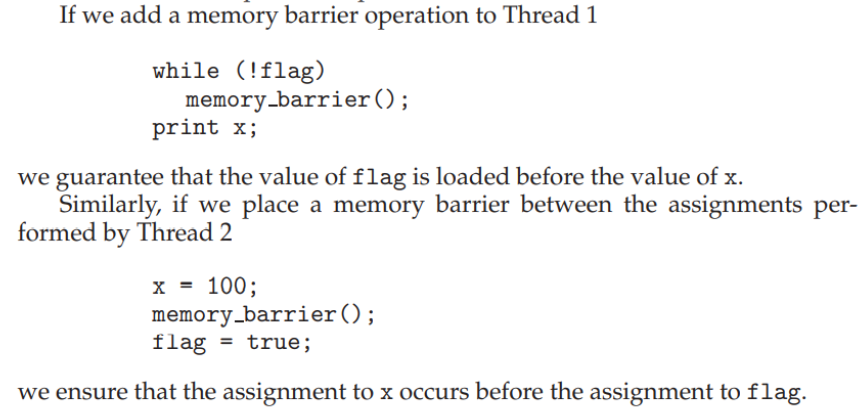
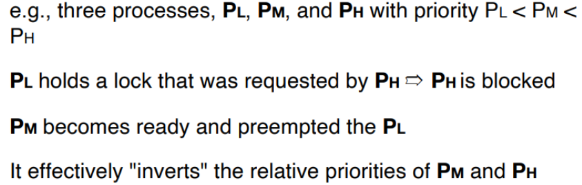

# 6 Synchronization Tools

## 6.1 为什么需要同步

我们说 **Cooperating Process** 是可以影响系统中其他运行进程或被其他进程影响的进程。

Cooperating processes 会共同使用一些数据，可能是直接使用同一段地址空间（代码+数据），或者是通过共享的内存或信息传递来共用一些数据。对数据的同时访问 (concurrent access) 可能会导致 data inconsistency，因为数据的一致性需要 cooperating processes 有序的运行。

???+ example "Bounded-buffer Problem"
    给定两个进程：producer 和 consumer，它们共用大小为 $n$ 的 buffer。Producer 生产数据放入 buffer，consumer 从 buffer 取出数据从而使用之。
    
    该问题需要保证：producer 不应当在 buffer 满时放入数据，consumer 也不应当在 buffer 空时取出数据。

    我们可能想要像这样实现这两个进程：

    ```c linenums="1"
    /* Producer Process */
    while (true) {
        /* produce an item in next_produced */
        while (count == BUFFER_SIZE)
            ; /* do nothing */
        buffer[in] = next_produced;
        in = (in + 1) % BUFFER_SIZE;
        count++;
    }

    /* Consumer Process */
    while (true) {
        while (count == 0)
            ; /* do nothing */
        next_consumed = buffer[out];
        out = (out + 1) % BUFFER_SIZE;
        count--;
        /* consume the item in next_consumed */
    }
    ```

    但是，`count` 的值可能是错误的。

    

    一种可能的运行顺序是：

    

出现上例中这样的问题，是因为我们允许两个进程同时操控变量 `count`。类似这样的多个进程同时操控同一个数据，因而结果取决于每一种操控的出现顺序的情形，称为 **race condition**。为了防止 race condition，我们需要保证同一时间只有一个进程可以操控某个变量。

Race condition 在操作系统中是常见的。Kernel code 中也包含 race condition 的可能性。

!!! example "Kernel 中也存在 race condition 的可能"
    

    两个进程 P0 和 P1 同时 `fork()` 时，如果不加限制，可能会出现类似前例的情况，即在某一个进程把当前的 `next_avaliable_pid` 分配给他的 child 后，在没来得及更新 `next_avaliable_pid` 前，另一个进程使用了 `next_avaliable_pid` 来给 child 分配 PID，这就会导致两个不同的线程使用同一个 PID 的情况。

因此，从操作系统的设计本身来说，避免 race condition 带来错误的结果是非常重要的。应用程序的开发人员在使用多进程时也应当充分考虑是否会带来问题。

## 6.2 问题建模: The Critical-Section Problem

​考虑一个有 n 个进程的系统，每个进程中都有这样一段代码，它可能会修改一些与其他至少一个进程公用的数据，这段代码称为 **critical section**。这个系统需要满足的重要性质是：当一个进程正在运行它的 critical section 时，其他进程都不能进入它的 critical section。

​我们将这个问题称为 **Critical-section problem**，也就是要设计一种达成这一性质的方法；或者说，设计一种能让各个进程 **同步 (synchronize)** 它们的活动，从而安全地共享数据的协议。

!!! tips
    「​同步」的核心意义是，规定进程所做的工作之间的顺序或者先序关系，从而防止一些非法情况的发生。


​每个进程必须在 **entry section** 中申请进入 critical section 的许可；在 critical section 运行结束后进入 **exit section**，在这里许可被释放。其他代码称为 **remainder section**。

​Critical-section problem 的解决方法必须满足如下三个要求：

- **Mutual exclusion** - 没有两个进程可以同时在运行 critical section。
- **Progress** - 系统整体上是在运行的，即要么有进程在运行它的 critical section，要么没有任何进程想要（将要，即在运行 critical section 之前的 section）进入 critical section，要么在有限时间内将有一个进程被选中进入它的 critical section。
- **Bounded waiting** - 任何一个进程等待进入 critical section 的时间是有限的。即，当一个进程提出一个进入 critical section 的请求后，只有有限个（次）进程会在它之前进入 critical section。

### Kernel 中的 CS Problem

​对于单核系统，我们可以通过在 critical section 中禁止中断（即，在 entry section 中 disable，在 exit section 中 enable）的方式来实现上述功能（虽然可能是危险的）。​但是对于多核系统，中断禁止的消息要传到所有处理器，消息传递会延迟进入临界区，会降低效率；同时也会影响时钟中断。

​我们需要保证 kernel 的设计实现了 critical section。Kernel 的实现分为两种类型，分别是 **抢占式内核 preemptive kernel** 和 **非抢占式内核 nonpreemptive kernel**，其区别是是否允许处于 kernel mode 的进程被抢占。

​（但是实际上，非抢占式内核的实现是保证同一个时间点只有一个进程能在 kernel 里跑[^1][^2] ——这种实现和上述概念的区别是，有可能有多个处理器；如果按上述的概念来说的话，并不能保证没有多个 CPU 同时跑在 kernel 里。）因此，非抢占式内核不会导致 kernel mode 的 race condition，因为在任一时间点只有一个进程能在 kernel 里跑，所以 kernel 用到的各种数据和资源也就只有它一个人用了！

[^1]: [What was the reason of the non-preemptivity of older Linux kernels? | StackExchange](https://unix.stackexchange.com/questions/412806/what-was-the-reason-of-the-non-preemptivity-of-older-linux-kernels)

[^2]: [Giant lock | Wikipedia](https://en.wikipedia.org/wiki/Giant_lock)

​抢占式内核相对而言更难设计，但是同时也能有更快的响应。我们在后面若干节来讨论设计抢占式内核，或者说设计出解决了 critical-section problem 的程序的方案。

## 6.3 Peterson's Solution

​Peterson's solution 基于一定的假设解决了两个 task 的 synchornization：

```C linenums="1"
int turn;			// Who is allowed to enter
boolean flag[2];	// Ready to enter its CS

void foo() {
    while (true) {
        flag[i] = true; 	// Mark self ready
        turn = 1 - i;		// Assert that if the other process wishes to 
        					// enter its CS, it can do so.
        while (flag[1 - i] && turn == 1 - i);	// Wait
        /* critical section */
        flag[i] = false;	// Set ready to false
        /* remainder section */
    }
}
```

其中， `i` 是 0 或 1，表示第 i 个进程； `turn` 是当前有权进入 critical section 的进程（0 或 1）； `flag[i]` 是第 i 个进程是否准备好进入 critical section，初始值均为 FALSE。

To enter the critical section, process Pi first sets `flag[i]` to be true and then sets `turn` to the value `1-i` (the other process), thereby asserting that if the other process wishes to enter the critical section, it can do so. If both processes try to enter at the same time, `turn` will be set to both `0` and `1` at roughly the same time. Only one of these assignments will last; the other will occur but will be overwritten immediately. The eventual value of `turn` determines which of the two processes is allowed to enter its critical section first.

### 性质证明

我们可以通过简易的分类讨论证明 Peterson's Solution 满足 6.2 中提到的三个性质：Mutual exclusion, process and bounded waiting。




### Reordering

​但实际上，Peterson's solution 在现代计算机体系结构上不一定适用，因为现代的处理器和编译器有可能会为了优化性能而对一些读写操作进行重排。在优化中，处理器或编译器会考虑其重排的合理性，即保证了在单线程程序中结果值是稳定且正确的。但是这不能保证其在多线程共用数据时的正确性，重排可能会导致不稳定或者不期望的输出。例如如果编译器将对 `flag[i]` 和 `turn` 赋值的顺序交换：


​Note that reordering of memory accesses can happen even on processors that don't reorder instructions[^3].

[^3]: [Peterson's algorithm #note | Wikipedia](https://en.wikipedia.org/wiki/Peterson%27s_algorithm#Note)

### Memory Barrier

​如我们之前所说，编译器和处理器会对代码的结构进行 reorder，以达到最佳效果。

!!! example "重排的例子"
    对 a2 和 b1 进行重排，使得不需反复读取交替 x 和 y 值：
    
    ```c linenums="1"
    int x = 1;
    int y = 2;
    int a1 = x * 1;
    int b1 = y * 1;
    int a2 = x * 2;
    int b2 = y * 2;
    // 可能会优化为：
    int x = 1;
    int y = 2;
    int a1 = x * 1;
    int a2 = x * 2;
    int b1 = y * 1;		// a2, b1 的顺序进行了重排
    int b2 = y * 2; 
    ```

​重排可能使得在多核运行时出现与期望不同的结果。为了解决这个问题，我们引入 **Memory Barrier**：它用来保证其之前的内存访问先于其后的完成。即，我们保证在此前对内存的改变对其他处理器上的进程是可见的。



### Memory Model

​另外，在现代的体系结构上，一个线程写了对应的变量后有可能不会立刻写回内存，这也有可能导致问题：

How a computer architecture determines what memory guarantees it will provide to an application program is known as its **memory model**. In general, a memory model falls into one of two categories:

1. **Strongly ordered**, where a memory modification on one processor is immediately visible to all other processors.
2. **Weakly ordered**, where modifications to memory on one processor may not be immediately visible to other processors.

## 6.4 硬件指令

​许多现代系统提供硬件指令，用于检测和修改 word 的内容，或者用于 **atomically**（uniterruptably，不可被打断地） 交换两个 word。这里，我们不讨论特定机器的特定指令，而是通过指令 `test_and_set()` 和 `compare_and_swap()` 抽象了解这些指令背后的主要概念。

### 6.4.1 `test_and_set`

指令 `test_and_set()` 的功能可以按如下方式来定义：

```c linenums="1"
bool test_and_set(bool *target) {
    bool rv = *target;
    *target = true;
    return rv;
}
```

上述的「定义」只说明了这个指令的功能，但是这一指令的重要特征是，**它的执行是 atomic 的**。

我们可以在支持这个指令的机器上实现 mutual exclusive：定义一个 bool 变量 `lock` ，初始化为 false。进程的结构为：

```c linenums="1"
while (true) {
    /* Entry Section */
    while (test_and_set(&lock)) 	
        ; /* do nothing */
   	
    /* Critical Section */
    
    /* Exit Section */
    lock = false;
    
    /* Remainder Section */
}
```

可见，如果 `lock` 在 Entry Section 时为 true，那么 `test_and_set(&lock)` 将返回 true，因此会始终在 while 循环中询问。直到某个时刻 `lock` 为 false，那么 `test_and_set(&lock)` 将返回 false 同时将 `lock` 置为 true，进程进入 Critical Section，同时保证其他进程无法进入 Critical Section。当持锁的进程完成 Critical Section 的运行，它在 Exit Section 中释放 `lock` ，从而允许其他进程进入 Critical Section。

而如果某个时刻 `lock` 为 false，而有两个或多个进程几乎同时调用了 `test_and_set(&lock)` 。但由于它是 atomic 的，因此只有一个进程可以返回 false。

​但是，如上所示的控制不能满足 bounded waiting 条件：


​我们可以作如下更改以满足 bounded waiting：

```c linenums="1"
while (true) {
    /* Entry Section */
    waiting[i] = true;
    while (waiting[i] && test_and_set(&lock)) 	
        ; /* do nothing */
   	waiting[i] = false;
    
    /* Critical Section */
    
    /* Exit Section */
    j = (i + 1) % n;
    while ((j != i) && !waiting[j]))
        j = (j + 1) % n;
    if (j == i)
        lock = false;
    else
        waiting[j] = false;
    
    /* Remainder Section */
}
```

我们引入了 bool 数组 `waiting[]` 。在 Entry Section 中，我们首先置 `waiting[i]` 为 true；当 `waiting[i]` 或者 `lock` 中任意一个被释放时，进程可以进入 Critical Section。初始时， `lock` 为 false，第一个请求进入 CS 的进程可以获许运行。在 Exit Section 中，进程从下一个进程开始，遍历一遍所有进程，发现正在等待的进程时释放它的 `waiting[j]` ，使其获许进入 CS，当前进程继续 Remainder Section 的运行；如果没有任何进程在等待，那么它释放 `lock` ，使得之后第一个请求进入 CS 的进程可以直接获许。

这样的方式可以保证每一个进程至多等待 n-1 个进程在其前面进入 CS，满足了 bounded waiting 条件。

### 6.4.2 `compare_and_swap`

指令 `compare_and_swap()` 可以如下定义：

```c linenums="1"
int compare_and_swap(int *value, int expected, int new_value) {
    int temp = *value;
    if (*value == expected)
        *value = new_value;
    return temp;
}
```

同样，`compare_and_swap()` 的执行是 atomic 的。类似地，我们声明一个全局变量 `lock` ，初始值设为 0。进程的结构为：

```c linenums="1"
while (true) {
    /* Entry Section */
    while (compare_and_swap(&lock, 0, 1) != 0) 	
        ; /* do nothing */
   	
    /* Critical Section */
    
    /* Exit Section */
    lock = 0;
    
    /* Remainder Section */
}
```

可见，`compare_and_swap()` 和 `test_and_set()` 没有本质区别。上例 `compare_and_swap()`  的使用方法同样无法保证 bounded waiting，我们可以使用与 `test_and_set()` 同样的方式来解决。

## 6.5 Atomic Variables

​如我们先前所说，之前介绍的指令常被用来作为同步工具的组成部分而不是直接使用，我们可以使用 `compare_and_swap()` 指令来实现一些工具。其中一个工具就是 **Atomic Variable**。

​一个变量在更新的过程中可能会导致一个 race condition，而 Atomic Variable 可以为数据提供 atomic updates。例如，我们使用不可打断的 `increment(&count)`; 指令来代替可被打断的 `count++` 指令就可以解决本节开头的 Bounded-buffer Problem：

```c linenums="1"
void increment(atomic_int *v) {
    int temp;
    do {
        temp = *v;
    } while (temp != compare_and_swap(v, temp, temp+1));
}
```

注意到，程序循环尝试将 `v` 赋值为 `temp+1` ，当赋值成功时返回。由于 CAS 指令是 atomic 的，因此它不会在运行过程中被打断；在程序其他运行过程中 `v` 的值都没有发生改变。

但是需要注意的是，如果 buffer 有两个 consumer 在同时等待读取，那么当 `count` 由 0 变成 1 的时候两个 consumer 可能会同时进入来读取，但是实际上只有 1 个值在 buffer 中。即，Atomic Variable 并不能解决所有 race condition，因为它解决的问题仅是变量更新过程中的 race condition。

## 6.6 Mutex

​我们尝试设计软件工具来解决 CS problem。我们讨论 Mutex (MUTual EXclusion) Lock 的实现，它通常被认为是最简单的 synchronization tool。

​我们考虑让进程在 Entry Section 申请 acquire() 一个锁，然后在 Exit Section release() 一个锁。对于这个锁，我们用一个布尔变量来表示它是否 avaliable：

```c linenums="1"
while (true) {
    acquire();
    /* critical section */
    release();
    /* remainder section */
}

/* ------- */
void acquire() {
    while (!available)
        ; /* busy waiting */
    avaliable = false;
}

void release() {
    avaliable = true;
}
```

我们需要保证 `acquire()` 和 `release()` 是 atomic 的。我们可以使用 `test_and_set()` 和 `compare_and_swap()` 来实现：
```c
void acquire() {
    while (compare_and_swap(&available, 1, 0) != 1)
        ; /* busy waiting */
}

void release() {
    available = true;
}
```

但是这种实现的缺点是，它需要 **busy waiting**，即当有一个进程在临界区中时，其他进程在请求进入临界区时在 acquire() 中持续等待，<br />例如当两个进程同时使用一个 CPU 时：

> T0 acquires lock -> INTERRUPT-> T1 runs, spin, spin spin … (till time's out) -> INTERRUPT-> T0 runs -> INTERRUPT->T1 runs, spin, spin spin … -> INTERRUPT-> T0 runs, release locks -> INTERRUPT -> T1 runs, enters CS

可以发现，T1 在它的 CPU 时间内不断循环等待，直到 T0 释放锁。因此这种锁也成为 **spinlock**。可以想象，如果有 N 个进程同时使用一个 CPU，那么将有大约 $\frac{N-1}{N}$ 的时间被浪费。如果有进程在企图 acquire 一个锁时被阻止，我们称它是 **contended（被争夺）**；反之我们称它 **uncontended**。如我们所述，highly contended locks 会降低当前运行程序的整体性能。

​我们还可以考虑下面的设计，其中 yield() 会使程序从 running 转为 ready，从而让出 CPU：

```c
void acquire() {
    while (compare_and_swap(&avaliable, 1, 0) != 1)
        yield(); 
}

void release() {
    avaliable = true;
}
```

​不过，如果所需的等待时间一般小于 context switch 所需的时间的话，用 spinlock 可能是更好的[^4]。

[^4]: [When to use busy waiting](https://gateoverflow.in/227185/process-synchronization)

## 6.7 Semaphores

我们给出一种更厉害的 synchronization tool，称为 semaphore。一个 semaphore `S` 是一个整型变量，它除了初始化外只能通过两个 atomic 操作 `wait()` 和 `signal()` （原称为 `P()` 和 `V()` ）来访问：

```c linenums="1"
void wait(S) {
    while (S <= 0)
        ;	/* busy waiting */
    S--;
}

void signal(S) {
    S++;
}
```

!!! tips
    需要重申的是，`wait()` 和 `signal()` 的实现也应是 atomic 的。

有 2 种 semaphore：

- **Counting semaphore** - S 的值不受限制；
- **Binary semaphore** - S 的值只能是 0 或 1。类似于互斥锁。

!!! example
    <center>{width="500"}</center>

但是，如同前面我们所说，semaphore 也具有 busy waiting 的问题。为了解决这个问题，我们可以为 semaphore 引入 **waiting queue**：

```c linenums="1"
typedef struct {
    int value;
    struct list_head * waiting_queue;
} semaphore; 

wait(semaphore *S) {
    S->value--;
    if (S->value < 0) {
        add this process to S->list;
        block();
    }
}
signal(semaphore *S) {
    S->value++;
    if (S->value <= 0) {
        remove a process P from S->list;
        wakeup(P);
    }
}
```

操作 `block()` 挂起调用它的进程，操作 `wakeup(P)` 重新启动 P 的执行，这两个操作都是由操作系统作为基本系统调用提供的。

> The list of waiting processes can be easily implemented by a link field in each process control block (PCB). Each semaphore contains an integer value and a pointer to a list of PCBs. One way to add and remove processes from the list so as to ensure bounded waiting is to use a FIFO queue, where the semaphore contains both head and tail pointers to the queue. In general, however, the list can use any queuing strategy. Correct usage of semaphores does not depend on a particular queuing strategy for the semaphore lists.

我们在第 7 章讨论 semaphore 的若干使用案例。

​同时需要注意的是，错误地使用 semaphore 可能会导致 deadlock：

<center>{width="500"}</center>

我们在第 8 章讨论 deadlock 的更多细节。

## 6.8 Priority Inversion

<center>{width="500"}</center>

​这个问题称为 **priority inversion**，即具有中等优先级的 M 的运行时间反而影响了具有较高优先级的 H 的等待时间。

​我们可以通过优先级继承 **priority inheritance** 来解决这一问题：所有正在访问资源（如上例中，低优先级的 L 所持的锁）的进程获得需要访问这个资源的更高优先级进程的优先级，直到它们用完有关资源为止。（如上例中，priority inheritance 将允许 L 临时继承 H 的优先级从而防止被 M 抢占；当 L 释放锁后则回到原来的优先级，此时 H 将在 M 之前执行。）