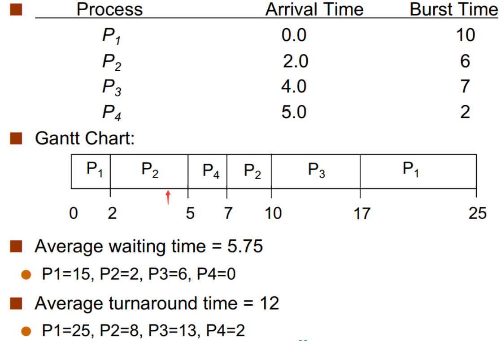

# 4 Scheduling

**​多道 (multiprogramming)** 环境下，进程的个数通常大于 CPU 的个数。CPU 调度就是 OS 关于哪个 ready 进程可以运行（使用 CPU）以及运行多久的决定。

​其目标是始终允许某个进程运行以最大化 CPU 利用率，同时保证一定的公平性。这在多道环境下是必要的，关系到系统的整体效率。

## 4.1 调度的时机

​​​CPU 调度可能出现在某一个进程：

a. Running -> Waiting，如等待 I/O  
b. Running -> Terminated  
c. Running -> Ready，当发生了 interrupt，如计时器到时间了  
d. Waiting -> Ready，如 I/O 完成了  
e. New -> Ready

{width=400}

**​非抢占式 (nonpreemptive)** 调度只会在 a, b 处进行调度，因为只有这时候当前正在运行的进程不能再运行了；**抢占式 (preemptive)** 调度会发生在上述任何时机。因此，抢占式调度使得 OS 有更充分的控制，但它也更复杂。

​也就是说，当上述情况发生时，可以直接调用调度器来进行调度。

## 4.2 调度的过程

{width=600}

​这个过程叫 上下文切换 (context switch)，这里的上下文其实就由 PCB 来表示。

## 4.3 调度算法的评价

对于不同的应用场景，我们对 scheduling 的要求也有所不同，有些也会有冲突。为此，我们需要充分考虑各种算法的属性。我们可能需要的要求包括：

- Maximize **CPU Utilization** : CPU 使用率，即 CPU 非空闲的时间比例
- Maximize **Throughput** : 吞吐量，每个时间单元内完成的进程
- Minimize **Turnaround Time** : 周转时间，从进程创立到进程完成的时间，包括等待进入内存、在 ready queue 中等待、在 CPU 上执行、I/O 执行等时间
- Minimize **Waiting Time** : 等待时间，在 ready queue 中（或在 Ready 状态下）等待所花的时间之和
- Minimize **Response Time** : 响应时间，交互系统从进程创立到第一次产生相应的时间

这些要求有时甚至是冲突的。例如，较多的 context switch 会减少 throughput，因为 context switch 过程中并没有有用的工作；而较少的 context switch 会增加 response time。

## 4.4 调度算法

基于上述不同目的，多种调度算法被设计出来。

### 4.4.1 ​First-Come First-Served (FCFS) | Nonpreemptive

​先申请 CPU 的进程首先获得 CPU。可以用一个 FIFO 队列简单实现。

​​{width=400}

**​Convoy effect** - short process behind long process，​尤其是当有进程进入 waiting 后，再返回的时候又需要重新排队。

### 4.4.2 ​Shortest-Job-First (SJF)

#### ​Non-preemptive: Shortest-next-CPU-burst

​每当 CPU 调度时，其选取 ready queue 中下次 CPU 执行时间最短的进程。这样会使得给定的一组进程具有 minimum average waiting time.

{width=300}

#### ​Preemptive: Shortest-remaining-time-first

​每当 CPU 调度时（注意抢占式调度的调度时机），选择最短剩余运行时间的进程。

{width=300}

​SJF 的两个版本都可以获得最小的平均等待时间，但最大的问题在于我们并不知道剩余的运行时间。解决方案是预测，将下次执行时间预测为此前 CPU 执行长度的指数平均。

### 4.4.3 ​Round-Robin (RR) | Preemptive

​定义一个 **时间片 (time slice / time quantum)** ，即一个固定的较小时间单元 (10-100ms)。除非一个 process 是 ready queue 中的唯一进程，它不会连续运行超过一个时间片的时间。Ready queue 是一个 FIFO 的循环队列。每次调度时取出 ready queue 中的第一个进程，设置一个计时器使得进程在一个时间片后发生中断，然后 dispatch the process。

{width=300}

​相比 SJF 而言，平均等待时间更长，但响应时间更短。

​RR scheduling 的性能很大程度上取决于时间片的大小。如果时间片较小，则 response/interactivity 会很好，但会有较大的 overhead，因为有较多的 context-switch；时间片较大则响应较差，但 overhead 会较小。如果 时间片 $\to \inf$，则 RR $\to$ FCFS。

​在实践中，时间片大约 10~100ms，每次 contest-switch 约 10μs。即 context-switch 的时间花费是比较小的。

### 4.4.4 ​Priority Scheduling

​每个进程都有一个优先级，每次调度时选取最高优先级的进程。（下例中规定优先级值小的优先级高。）

{width=300}

​优先级可以是内部的或者外部的：

- internal: 一些测量数据，例如 SJF 是 Priority 的一个特例，即优先级由预测 CPU 运行时间决定。
- external: 由用户指定进程的重要性。

​Priority Scheduling 也可以与 Round-Robin 结合，如：

{width=300}

​要实现 Priority Scheduling，可以简单地将 ready queue 用 priority queue 实现；priority queue 也可以是抢占式或非抢占式的，如 SJF 一样。

​Priority 的一个重要问题是 **indefinite blocking / starvation** ，即低优先级的进程可能永远没有机会被执行。一个解决方法是 **Priority Aging** ，即根据等待时间逐渐增加在系统中等待的进程的优先级。

### 4.4.5 ​Multilevel Queue Scheduling

​在实际应用中，进程通常被分为不同的组，每个组有一个自己的 ready queue，且每个队列内部有自己独立的调度算法。

例如，前台队列使用 RR 调度以保证 response，后台队列可以使用 FCFS。

同时，队列之间也应当有调度。通常使用 preemptive priority scheduling，即当且仅当高优先级的队列（如前台队列）为空时，低优先级的队列（如后台队列）中的进程才能获准运行。

也可以使用队列间的 time-slicing，例如一个队列使用 80% 的时间片而另一个使用 20%。

例如：

{width=300}

### 4.4.6 ​Multilevel Feedback Queue Scheduling

​Multilevel Feedback Queue Scheduling 允许进程在队列之间迁移。这种算法可以有很多种实现，因为队列的数量、每个队列中的调度策略、队列之间的调度算法以及将进程升级到更高优先级/降级到更低优先级的队列的条件都是可变的。一个系统中的最优配置在另一个系统中不一定很好。这种算法也是最为复杂的。

​看这样一个例子：有三个队列 0, 1, 2，优先级逐次降低。当进程 ready 时被添加到 Q0 中，Q0 内部采用 RR Scheduling，的每个进程都有 8ms 的时间完成其运行，如果没有完成则被打断并进入 Q1；只有当 Q0 为空时 Q1 才可能被运行。Q1 内部也使用 RR Scheduling，每个进程有 16ms 时间完成其运行，如果没有完成则被打断并进入 Q2；只有当 Q1 也为空时 Q2 才可能被运行。Q2 内部采用 FCFS 算法。

{width=300}
