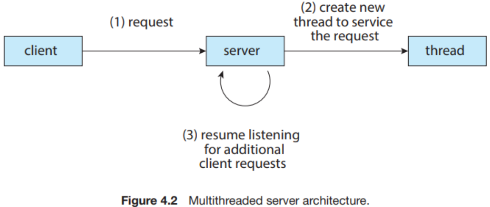
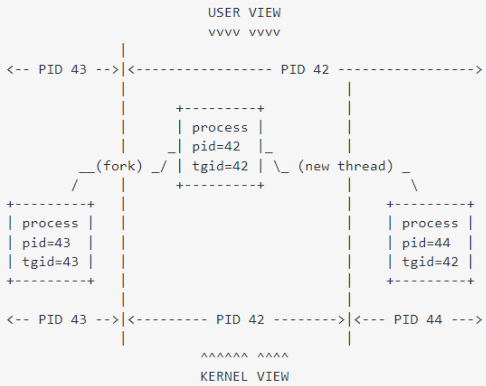

# 5 Threads

在进程一节中，我们看到了进程在 fork 时有较大的开销，也看到了 copy-on-write 等技术能够减少这些开销；在调度一节中，我们同样看到了上下文切换时会带来的开销。我们容易意识到，在很多情况下，若干进程可能共享一些内容，而操作系统本身如果知道这些共享，则可以减省新建进程的开销以及进程间切换的时延。因此操作系统引入了 **线程 (threads)**。

​在 Linux 中，线程也被称为 **轻量级进程 (LightWeight Process)**，这实际上是对线程非常恰当的一个描述。每个线程都有它自己的 thread ID, PC, register set 和 runtime stack。线程与同一进程的其他线程共享 code section, data section, heap, open files 以及 signals。

{width=300}

{width=300}

​对于支持线程的操作系统，实际调度的是内核级线程而非进程。也就是说，线程是运行以及 CPU 调度的基本单元。（而进程是分配资源的基本单元。）

## 5.1 多线程编程的优缺点

采用 **多线程编程 (Multi-Threaded Programming)** 的优点包括：

- **Economy:** 建立线程相比进程是很经济的，因为 code, data & heap 已经在内存中了；另外在同一进程的线程间进行 context switch 时也会更快，因为我们不需要 cache flush。
- **Resource Sharing:** 同一进程的线程之间天然共享内存，因此我们无需为它们编写 IPC；这也允许我们对同一块内存做并行的处理。但这也会引入风险。
- **Responsiveness:** 多线程的进程会有更好的响应性，即当一个线程 blocked 或者在做一些长时间的操作时，其他线程仍然能完成工作，包括对用户的响应。
    - 例如，在一个 client-server 结构中，我们用一个线程来响应客户端的请求：  
    
{width=300}

- **Scalability:** 在多处理器的体系结构中，多线程进程可以更好地发挥作用，因为每个线程都可以在一个处理器上运行；而单线程进程只能在一个处理器上运行。

实际上，后两点对多个单线程进程也是适用的。但多线程进程相较而言更加经济和自然。

多线程也有一些缺点：

- 如果一个进程出现错误，那么整个进程都会去世（比如浏览器的一个网页挂了，那么可能整个浏览器都会挂）。
- 由于 OS 对每个进程地址空间的大小限制，多线程可能会使得进程的内存限制更加紧缩（这在 64 位体系结构中不再是问题）。
- 由于多个线程共享部分内存，因此内存保护会比较困难。

## 5.2 线程的实现方式

{width=300}

​线程实现的重点是共享一些资源；而具体的实现分为 **用户级线程 (User-Level Thread)** 和 **内核级线程 (Kernel-Level Thread)** 两类。

用户级线程的特点是，它在操作系统上只是一个进程，这个进程包含 **线程库 (Thread Library)** 的部分，​这部分代码负责完成线程的创建、切换等操作；而内核级线程则是由操作系统支持这些操作。

​用户级线程的优点包括：

- ​它并不实际占用操作系统的 TID (Thread ID) 等资源，因此理论上来说可以支持比内核级线程更多的线程数；
- ​它的调度等操作代码均在用户态，不需要进入内核态；
- ​比较容易实现自定义的调度算法。

​用户级线程的缺点包括：

- 一旦当前正在运行的线程阻塞，那么在操作系统看来就是整个进程被阻塞了，那么同一个进程中的其他线程也同样会被阻塞；而如果是内核级线程的话，一个线程阻塞了，其他线程仍然能正常运行。
- 同一个进程中的多个用户级线程无法在多核上分别运行。

### 多线程模型

​在同时支持用户级线程和内核级线程的系统中，用户级线程到内核级线程的映射方式有多种选择。

​​这种方式其实和只支持用户级线程没啥区别：

{width=300}

​这种方式和只支持内核级线程也没啥区别：

{width=300}

​​​前面两种的组合，在这种情况下，$n$ 个用户级线程可以映射到 $m (\le n)$ 个内核级线程上：

{width=300}

## 5.3 ​Linux 线程

​Linux 中没有特别区分进程和线程，它们都被称为 tasks，每一个线程都有一个 `task_struct`。（虽然从概念上说，线程应该都使用其所属进程的 PCB，但是 Linux 不是这么实现的！）

​Linux 中可以通过 `clone()` 新建一个线程；这个系统调用包含了一大堆选项，包括新建的是一个线程还是进程，以及继承 / 新建哪些资源等。事实上，在很多实现中，`fork()` 的内部就是调用 `clone()` 实现的。

​从用户视角而言，Linux 中的线程通过 TID (Thread ID) 标识，而来自同一个进程的多个线程应当具有同样的 PID (Process ID)；系统调用 `gettid()` 和 `getpid()` 的实现和这个理解是一样的。

​但是事实上，`task_struct` 里面并没有 `tid` 这个字段，而是有 `pid` 和 `tgid` (Thread Group ID) 这两个字段。其实，这里的 `pid` 和我们前述的 TID 含义一致，而这里的 `tgid` 和前述 PID 含义一致。这主要是历史原因，在还不支持线程的年代，`pid` 作为调度的依据被使用；在支持多线程后，调度的单元从进程变为了线程，如果引入一个新的字段 `tid`，则需要修改相关的代码，因此 `pid` 被保留，但发挥 `tid` 的作用；引入了一个新的字段 `tgid`，表示这一组线程的标识符，也就是其所属进程的标识符。

{width=300}[^1]

[^1]: https://stackoverflow.com/a/9306150/14430730

​正因如此，从 Linux 2.4 开始，getpid() 返回的就不再是 pid 了，而是 tgid。[^2]

[^2]: 参见 CLONE_THREAD 一节：https://man7.org/linux/man-pages/man2/clone.2.html

​使用 ps 指令，还能看到一个名叫 LWP (LightWeight Process) 的值，这个值始终和 TID 的值相同；LWP 通常被用作给用户呈现，而 TID 更经常被用作 gettid() 之类的系统调用。还有一个字段叫 NLWP，表示进程中的线程个数。[^3]

[^3]: https://www.baeldung.com/linux/pid-tid-ppid#2-tid-thread-identifier