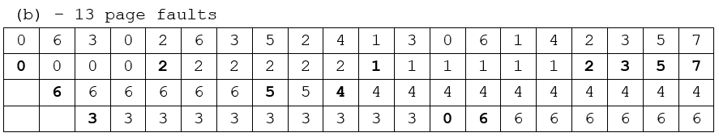
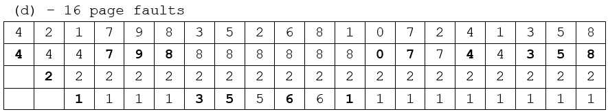

# 10 Virtual Memory

## 10.1 引入

我们说，「进程的代码等数据必须在内存中」，这是因为 CPU 只有能力访问内存，而并不能访问磁盘。但是，在上一节的末尾我们提出了 swapping 机制，这一机制允许我们把那些在 main memory 里放不下的内容交换到 disk 里。这一机制其实扩展了「内存」的概念：在这种机制的支持下，我们并不需要顾虑内存的实际大小；物理内存和用于交换的磁盘空间一并被用来提供「内存」的作用，也就是给操作系统提供按照地址访问内存单元中数据的能力。

我们在第 9 节若干次提到过 **地址空间 (address space)** 这个词汇，它指的是地址取值的全集。例如，对于一个 32 位寻址的体系结构，其 **物理地址空间**（物理地址的集合）就是 $0 \sim 2^{32} - 1$，亦即 `0x00000000 ~ 0xffffffff`。在引入分段 / 分页技术之前，各个进程和操作系统共同使用同一个地址空间，也就是上述的物理地址空间。这样的内存模型称为 **flat memory**，它会带来比较大的碎片，同时隔离性较差，内存的保护较弱。而在引入了分段 / 分页技术之后，每个进程都有了自己的一套 logical memory (a.k.a. virtual memory) ，其对应的的地址空间就叫做 **逻辑地址空间 (logical address space)** 或者 **虚拟地址空间 (virtual address space)**；而对应的段表 / 页表的作用就是提供从虚拟地址空间到物理地址空间的映射（映射过程中，由于 swapping 机制的存在，也有可能出现 swap 的过程）。

我们知道，上述的映射过程由 OS 和 MMU 共同实现，因此进程的虚拟地址空间是被隔离的；只要 MMU 不出现问题以及页表不被篡改（这通常比较困难），其他进程就没有办法访问到这个进程的内存。

也就是说，虚拟内存供软件使用，而 CPU 在访问对应的内存地址时会由 MMU 自动转换为对应的物理地址；如果对应的 page 不在物理内存中，就会触发一次 **page fault**，这是一个 exception。有 3 种可能的情况：

1. 当前的进程的页表中并没有这个虚拟地址对应的 page；
2. 权限不符，例如试图运行某个权限位是 `RW-` 的 page 中的代码，或者试图写入某个权限位是 `R-X` 或 `R--` 的 page 中的某个内存单元；
3. 当前虚拟地址是合法的，但是对应的 page 被 swapped out 了。

我们知道，exception 会交由操作系统处理；如果是前两种情况，操作系统应当报错并做相关处理（例如杀掉对应进程）；而如果是后一种情况，操作系统应当将进程阻塞，并将对应的 page 交换回来，调页完成后唤醒进程。

在一条指令执行期间，可能触发多次 page fault（指令本身和访问的地址可能都不在物理内存中）。当 page fault 被解决后，指令被重新运行；因此一条指令在真正成功运行之前可能会被尝试运行多次。

### Kernel Addresses & Userspace Addresses

我们在 Overview 中提到过，指令被分为 privileged 和 non-privileged，前者只有 kernel mode 下可以执行，而后者在 kernel 和 user mode 下都能执行；地址空间也一样。每个进程的虚拟地址空间（下简称地址空间、AS）被分为了 **Kernel Portion** 和 **User Portion**；kernel 代码可以访问这两块空间，而 user 代码只能访问 User Portion。

!!! info ""
    实际上，每个进程的 AS 的 kernel portion 都映射到了同一块物理内存[^1]。原因是显然的：所有进程用到的都是同一套 kernel，因此没必要把 kernel 用的内存（存例如各个进程的页表、各种队列之类的东西）复制好几份。

    [^1]: https://unix.stackexchange.com/questions/487052/where-is-page-table-stored-in-linux#comment893427_487056

???+ info "实现"
    例如，在 32 位虚拟地址空间的设计里，kernel 默认使用高 1GB，各个进程的 user portion 使用低 3GB 的虚拟地址空间；通过在 build kernel 之前更改 `CONFIG_PAGE_OFFSET` 可以更改这一分配：

    
{width=300}

    而对于 64 位虚拟地址空间的设计，由于根本用不了这么多，因此 kernel space 和 user space 被自然分隔开：

    
{width=300}

    其中 **TTBR (Translation Table Base Register)** 保存页表的基地址，**TTBR0** 是每个进程的页表对应的 TTBR，而 **TTBR1** 是 kernel portion 的页表对应的 TTBR。

## 10.2 Lazy Allocation / Demand Paging

操作系统在分配 user space 的内存时，会使用 lazy allocation：当用户程序申请一块内存时，操作系统并不会真的立即在物理内存中分配对应的内存；直到这块内存被真正访问。

这种优化的原理是，很多用户程序申请的内存大小比真正需要使用的通常要大，例如 buffer 等。

!!! info ""
    
{width=600}

    
其中 **RSS (Resident Set Size)** 描述进程在内存中占用的空间大小。

## 10.3 Copy-on-Write

我们在第 3 节讨论 `fork()` 的时候提到了 copy-on-write 机制。很多子进程在 `fork()` 之后立刻调用 `exec()`，因此将父进程的地址空间整个复制一份是比较浪费的。这种机制允许父进程和子进程最初使用同一份物理页来进行工作，在任何一个进程需要写入某个共享 frame 时再进行复制。

{width=400}

{width=400}

进一步地，Linux 等操作系统提供了 `vfork()`，进一步优化子进程在 `fork()` 之后立刻调用 `exec()` 的情形。`vfork()` 并不使用 copy-on-write；调用 `vfork()` 之后，父进程会被挂起，子进程使用父进程的地址空间。如果子进程此时修改地址空间中的任何页面，这些修改对父进程都是可见的。

## 10.4 Page Replacement

当我们在 10.2 或者 10.3 讨论的情况下，或者在 kernel、I/O buffer 之类的情况下需要物理帧，但是没有空闲的物理帧时应该怎么办呢？我们可以交换出去一整个进程从而释放它的所有帧；更常见地，我们找到一个当前不在使用的帧，并释放它。

基本步骤是：

1. 找到这个 victim frame；
2. 将其内容写到交换空间；
3. 修改页表（和 TLB 等）以表示它不在内存中了。

用 **dirty bit (a.k.a. modify bit)** 可以节省其开销：该位保存对应 frame 是否被修改过；如果没有被修改过，则上述第 2 步可以被省略。

那么在上述第 1 步中，我们如何确定哪个 frame 应当用来作为 victim frame 呢？我们的核心目标是，降低 page fault 的频率。下面讨论若干种 **页面置换算法 (page replacement algorithms)**。

### 10.4.1 Optimal

这种算法选择 **最长时间内不再被访问的页面** 换出。容易证明，这种方案的 page-fault rate 是最低的。不过，由于实际实现中我们没有办法预测结果，因此它只作为理论最优解用来判定其他算法的优劣。

### 10.4.2 FIFO (First In First Out)

这种算法换出 **最先进入内存的页面**。实现比较简单，使用一个队列保存调入内存的顺序即可。

这种算法的问题是，其逻辑和实际不符；实际情况下有很多页面会经常被访问。

另外，这种算法可能会遇到物理帧增加的时候 page-fault 反而更多的异常情况。这被称为 **Belady's Anomaly**：

{width=500}

### 10.4.3 LRU (Least Recently Used)

这种算法换出 **最久没有被访问的页面**。

实现的一种策略是给每个页表项一个 counter，每次访问某个 page 时，将 counter 更新为当前的时间。每次需要置换时，搜索 counter 最小的页。也可以用 heap 来优化。

另一种策略是用一个栈保存 page numbers，每次访问时找到它然后把它挪到栈顶。

这两种实现开销都比较大。

### 10.4.4 LRU-Approximation

因此，我们在 LRU 和性能之间做一个折中；引入一个 **reference bit**，来近似地实现 LRU。当一个 page 被访问时这个 bit 被置为 1；操作系统定期将 reference bit 清零。因此，在需要交换时，只需要找一个 reference bit 为 0 的就可以说明它在这段时间内没有被访问过。

!!! warning 
    还有一些其他算法，可以自己看一下。

???+ example
    10.24 Apply the (1) FIFO, (2) LRU, and (3) optimal (OPT) replacement algorithms for the following page-reference strings: 
    
    a. `2, 6, 9, 2, 4, 2, 1, 7, 3, 0, 5, 2, 1, 2, 9, 5, 7, 3, 8, 5`

    b. `0, 6, 3, 0, 2, 6, 3, 5, 2, 4, 1, 3, 0, 6, 1, 4, 2, 3, 5, 7` 

    c. `3, 1, 4, 2, 5, 4, 1, 3, 5, 2, 0, 1, 1, 0, 2, 3, 4, 5, 0, 1` 

    d. `4, 2, 1, 7, 9, 8, 3, 5, 2, 6, 8, 1, 0, 7, 2, 4, 1, 3, 5, 8` 

    e. `0, 1, 2, 3, 4, 4, 3, 2, 1, 0, 0, 1, 2, 3, 4, 4, 3, 2, 1, 0` 
    
    Indicate the number of page faults for each algorithm assuming demand paging with three frames.

    ??? info "answer"
        **(1) FIFO**

        
{width=600}

        
{width=600}

        
{width=600}

        
{width=600}

        
{width=600}

        **(2) LRU**

        
{width=600}

        
{width=600}

        
{width=600}

        
{width=600}

        
{width=600}

        **(3) OPT**

        
{width=600}

        
{width=600}

        
{width=600}

        
{width=600}

        
{width=600}

## 10.5 Allocation of Frames

给每个进程分配多少个 frame 呢？显然，这个最大值不可能超过物理内存包含的 frame 总数；那么最小值呢？实际上，最小值是由具体的计算机架构决定的。我们之前提到，指令在解决其涉及的全部 page fault 之后才能真正被运行；因此每个进程分配的 frame 的最小值不应小于单个指令可能使用到的 frame 总数。

例如，如果可能使用的 frame 数最大的这个指令，其本身不会跨越 2 个 page；但其包含两个访问内存的操作数，其中每个操作数访问的内存可能跨越 2 个 page（即，这块数据在一个 page 的末尾和下一个 page 的开头），那么这个架构上运行的进程的 minimum frame number 是 5。

如果我们采取 **全局置换 (global replacement)**，即每次置换时从所有帧中选取一个帧来计算，那么我们就不一定有必要提前规定每个进程最多能够使用多少个 frame；而如果我们采取 **局部替换 (local replacement)**，那么我们就需要提前把物理 frame 的资源分配给各个进程。

显然，前者能够提供更好的系统吞吐量，因此也更常用。当然，前者也存在弊端，因为在这种情况下，一个进程的 page-fault rate 就不仅取决于它自己，还取决于其他进程的运行状况。

当我们需要决定一个进程能够使用的页面总数时，我们在上述最小和最大的区间内有非常多的选择，这就引入了分配算法。常见的分配算法包括平均分配，或者按进程对内存的实际需求按比例分配；也可以参考进程的优先级，高优先级相对分配到的更多，或者更能满足其实际需求。

现在的很多计算机都有多个 CPU，而每个 CPU 都可以比其他 CPU 更快地访问内存的某些部分。如果这种差异比较明显，我们称这种系统为 **非均匀内存访问 (NUMA, Non-Uniform Memory Access)** 系统。在这种系统下，为了更好的性能表现，前述的分配和调页算法可能更加复杂。

## 10.6 Thrashing

如果一个进程可用的帧数量比较少（少于其频繁访问的页面数目），那么它会频繁出现 page fault；同一个 page 可能会被频繁地换入换出，以满足运行的要求。这种高度的页面调度活动成为称为 **抖动 (thrashing)**；其调页时间甚至会大于执行时间。

**工作集模型 (working set model)** 用来确定一个进程频繁访问的页面，保证这些页面不被换出；需要调页时从剩余的页面进行交换。如果频繁访问的页面数已经大于了当前进程可用的页面数，操作系统就应当把整个进程换出，以防止出现抖动现象。

## 10.7 Kernel Memory Allocation

Kernel 中的很多数据结构大小区分比较大，其中很多小于甚至远小于一个 page。因此，kernel 的设计应当尽可能节省内存，努力减少碎片。

尽可能减小 kernel 内存开销的考虑是：一方面，kernel 有可能有一部分常驻在物理内存中，不受调页系统的控制；另一方面，有的硬件设备可能和物理内存直接交互，因此可能会需要连续的物理内存。这两者对物理内存的要求都比较严格，因此我们应当尽可能减小这些开销。

### 10.7.1 Buddy System

Buddy system 从物理连续的段上分配内存；每次分配内存大小是 2 的幂次方，例如请求是 11KB，则分配 16KB。

当分配时，从物理段上切分出对应的大小，例如下图体现了分配 21KB 时的情况，$C_L$ 会被分配。

{width=300}

当它被释放时，会 **合并 (coalesce)** 相邻的块形成更大的块供之后使用。

### 10.7.2 Slab Allocation

核心的原理是，操作系统中很多 object 的大小是已知且固定的。内存被划分成若干个固定大小的块，每个块都被分配给一个具体的类型。当进程需要分配内存时，它会查询缓存，如果找到一个空闲的块，就直接使用该块；如果缓存中没有空闲的块，就会从系统内存中申请一个新的块：

{width=300}
