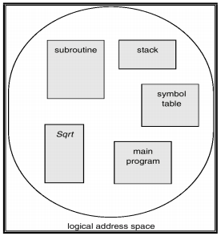
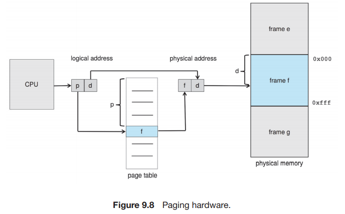
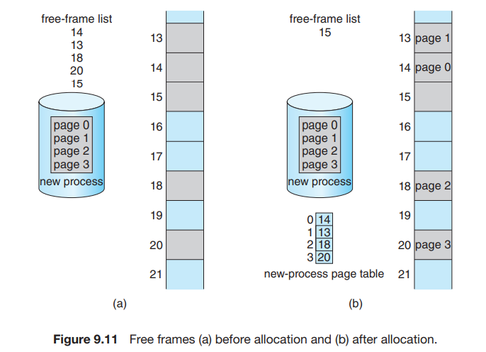
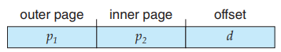
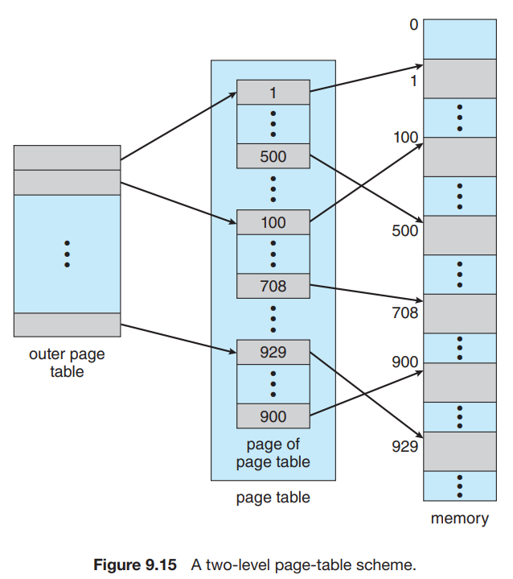

# 9 Main Memory | 主存

## 9.1 Background

### 9.1.1 Memory
内存是一个很大的字节数组，CPU 根据 PC (Program Counter) 的值从内存中提取指令。程序需要运行，至少部分程序及其访问的数据应在内存中（或者更明确地，内存中的一个进程里）。

CPU 可以直接访问的通用存储只有 main memory 和 registers。对 registers 的访问通常可以在一个 CPU 时钟周期中完成，而完成内存的访问可能需要多个时钟周期。在这些时钟周期里，由于没有用来完成指令的数据，这会引起 **stall**（暂停，抛锚）。为了补救，我们在 CPU 芯片上增设更快的内存，称为 **cache** 。

同时，我们需要保护内存空间，防止用户程序修改操作系统或其他用户程序的代码或者数据。

### 9.1.2 Address Binding
如我们前面所说，执行程序必须将其调入内存并放图进程中。源程序中的地址通常是用符号表示（**symbolic**, 例如各种变量、函数名；汇编中的 label 等）；编译器会将其绑定到 **relocatable addresses**，即相对于某一个段/模块等的偏移；链接器或加载器（linker / loader）会将 **relocatable addresses** 绑定到 **absolute addresses**。当然，如果编译器在编译时就知道程序所处的内存地址，则会生成 **absolute code**。

## 9.2 Contiguous Memory Allocation - Partitioning Strategies
在 Batch 系统中，每次只有一个程序被加载入物理内存，并被运行至结束。如果程序所需的存储空间比物理内存大，则将程序分开为可以运行至产生某个结果且大小可以放入空余内存的部分，逐个运行，将运行结果传递给下一个部分。

与这种 "prehistroy"系统不同的是，现在我们需要把多个进程同时放在内存中，并且支持其彼此之间的快速切换。最简单的内存分配方法之一，就是将内存分成许多的 partition，每个 partition 包含一个进程。其要求有：

   - **Protection:** 保证进程之间不会互相闯入对方的存储。
   - **Fast execution:** 不能由于 protection 降低访问内存的效率。
   - **Fast context switch:** 每当进行 context switch 时，可以比较快地找到并访问当前进程的内存。

当进程进入系统，操作系统根据各个进程的内存需要以及当前的空闲内存空间来决定为哪些进程分配内存。当一个进程被分配到了空间，他将被载入到内存中，并与其他进程竞争 CPU 时间。当一个进程结束时，它释放它的空间。

如果一个进程请求空间来运行，但这里没有足够的内存来满足其要求，有两种可选的解决办法。第一种是直接拒绝其请求并给出一个错误信息；另一种是将其加入 waiting queue 中，当有内存被释放时 CPU 来检查是否为其分配内存。

### 9.2.1 Fixed Partition
我们可以考虑固定 partition 的大小（除了 OS 使用的内存）。这种方式非常容易实现，我们只需要记录每个 partition 是否被占用即可。但显然，这种方式会带来很大的内存浪费。如下图：

如图 Process 1 使用了 Partition 1，但其所需空间小于 Partition 1 的大小，因此会导致红色部分的内存没有被使用且不能被别的进程使用（因为每个 partition 只能被一个进程使用）。由于这是 partition 内部的不可用内存，我们称之为 **Internal Fragmentation**。这会带来极大的内存损失，尤其是在进程之间所需存储空间大小差距很大的情况下（因为我们总是需要根据所需空间最大的进程切分内存）。

### 9.2.2 Variable Partition
我们也可以考虑不固定 partition 的大小。在这种方案中，操作系统维护一个表，记录可用和已用的内存。最开始时整个内存就是一大块可用的内存块（将可用内存块称为 **hole**）；经过一段时间的运行后，内存可能会包含一系列不同大小的孔。下图是一个示例。

很可能在进行一段时间的运行后，空闲内存空间被分为大量的 hole，它们总体加起来可以满足进程要求，但它们并不连续，每一个小的 hole 都不可以被利用。我们称这种问题为 **External Fragmentation**，因为这些不可用内存是分布在 partition 之外的。

### 9.2.3 Dynamic Storage-Allocation Problem
根据一组 hole 来分配大小为 n 的请求，称为 **dynamic storage-allocation problem**。这个问题最常用的解决方法包括：

   - **first-fit** - 分配首个足够大的 hole。这种方法会使得分配集中在低地址区，并在此处产生大量的碎片，在每次尝试分配的时候都会遍历到，增大查找的开销。
   - **best-fit** - 分配最小的足够大的 hole。除非空闲列表按大小排序，否则这种方法需要对整个列表进行遍历。这种方法同样会留下许多碎片。
   - **worst-fit** - 分配最大的 hole。同样，除非列表有序，否则我们需要遍历整个列表。这种方法的好处是每次分配后通常不会使剩下的空闲块太小，这在中小进程较多的情况下性能较好，并且产生碎片的几率更小。
> Simulations have shown that both first fit and best fit are better than worst fit in terms of decreasing time and storage utilization. Neither first fit nor best fit is clearly better than the other in terms of storage utilization, but first fit is generally faster.

### 9.2.4 Protection
我们需要保证一个进程能且仅能访问自己空间中的地址。我们可以通过一套 **base** 和 **limit** 寄存器来确定一个程序的空间：

每当 context switch 到一个新的进程时，CPU 会 load 这两个寄存器的值。每当 user mode 想要进行一次内存访问时，CPU 都要检查其是否试图访问非法地址；如果是，则会引发一个 trap 并被当做致命错误处理（通常会 terminate 掉进程）：

## 9.3 Segmentation

### 9.3.1 Basic Method
虽然我们程序中的主函数、数组、符号表、子函数等等内部需要有一定的顺序，但是这些模块之间的先后顺序是无关紧要的。因此，虽然实际上内存是一个线性的字节数组，但是在用户看来，一个程序长成这个样子：

即，一个程序是由一组 **segment** （段）构成的，每个 segment 都有其名称和长度。我们只要知道 segment 在物理内存中的基地址 (base) 和段内偏移地址 (offset) 就可以对应到物理地址中了。对于每一个 segment，我们给其一个编号。即，我们通过二元有序组 <segment-number, offset> 表示了一个地址。这种表示称为 **logical address**（逻辑地址）或 **virtual address**（虚拟地址）。

通常，在编译用户程序时，编译器会自动构造段。

### 9.3.2 Logical Address & MMU
要将逻辑地址映射到物理地址，首先我们需要找到段的基地址。我们有一个 **segment table**，其中每个条目以 segment-number 索引，存储其 **段基地址 segment-base** 和 **段界限 segment-limit**（可能还包含权限位）。因此逻辑地址的映射方式如下图：

这一过程是由硬件设备 **MMU (Memory-Management Unit, 内存管理单元)** 完成的。CPU 使用的是逻辑地址，而内存寻址使用的是物理地址，MMU 完成的是翻译（映射）和保护工作：

这里的 **relocation register** 即为 base register。

### 9.3.3 Problems
分段将一个程序分为数个部分，但是其内存分配的策略与简单的 partition 是一致的。因此，分段仍然会存在 external fragmentation 的问题。再次回顾这个问题：其表征是总空余内存是足够的，但是由于它不连续导致其无法使用。也就是说，这个问题的核心点在于 **not contiguous**。我们有两种思路来解决这一问题：将内存重排使得 holes 连成一块；或者设计方案让程序不再需要连续的地址。

**Compaction** 就是将内存中的内容重排使得所有空闲空间连续。这一操作要求内存中的程序是 **relocatable**  的，即其地址是相对 base 的偏移；这一要求在前面两种内存分配方式中是满足的。但是这一操作需要将内存逐一复制，这将消耗很多时间。

考虑「让程序不再需要连续的地址」。实际上，分段已经是这个方向上做出的一种尝试了，因为它将程序分为了几块，相比于简单的 partition，分段有助于减小 external fragmentation。为了更好地解决这个问题，我们提出 paging。

## 9.4 Paging
Paging （分页）是一种允许进程的物理地址空间不连续的内存管理方案。它避免了 external fragmentation 和 Compaction。各种形式的 paging 被大多数操作系统采用；实现 paging 需要 OS 和硬件的协作。

### 9.4.1 Basic Method
我们将 physical memory 切分成等大小的块（2 的幂，通常为 4KB = 2^12^B），称为 **frames**（帧）；将 logical memory 切分成同样大小的块，称为 **pages**（页）。当一个进程要执行时，其内容填到一些可用的 frame 中，其中的每一个地址可以用这个 frame 的 base 或 number（由于 frame 是被等大切分出来的，因此每个 frame 的 base 也唯一对应一个 frame number）以及相对这个 base 的 offset 表示；同时 CPU 生成逻辑地址，逻辑地址包含一个 page number 和一个 page offset；另有一个 **page table**，它以 page number 索引，其中的第 _i_ 项存储的是 page number 为 _i_ 的 page 所在物理内存的 frame 的 base。这样，每一个 page 将通过其 page number 映射到一个 frame 上；进而 page 中的每一个地址也通过 offset 与对应的 frame 建立映射。

也就是说，当 MMU 需要将一个 logical address 翻译为 physical address 时，它需要获取 page number _p_，在 page table 中找到第 _p_ 个 page 对应的的 frame number（也就是 frame base） _f_ ，在 _f_ 后面连接上 offset _d_ 就得到了对应的 physical address。如我们之前所说，logical address 和 physical address 的 offset 应是一致的。

当一个进程需要执行时，其每一页都需要一帧。因此，如果进程需要 n 页，则内存中需要有 n 个帧。如果有，那么就可以分配给新进程：进程的每一页装入一个帧，frame number 放入进程的 page table 中。

由于操作系统管理物理内存，它应该知道物理内存的分配细节，即共有多少帧、帧是否空闲等。这些信息保存在 **frame table** 中，每个条目对应一个帧，保存其是否被占用；如果被占用，是被哪个进程的哪个页占用。

### 9.4.2 Why "Not Contiguous"
考虑这种方式为什么能够满足「not contiguous」：在前面两种方式，我们需要 contiguous 是因为在运行每条指令过后 PC 会 +1，因此我们要保证 contiguous，从而让 PC+1 确实指向下一条指令。而在 paging 中，我们实际上仍然保证了 PC+1 后确实指向下一条指令，只是 paging 始终保存的都是 logical address。Logical address 的格式如下图所示：

可见，当 _d_ 是 $2^n - 1$ 时， $<p, d> + 1$ 即为 $<p+1, 0>$（就是二进制进了位）。这时虽然一个 page 已经结束，进入到了下一个 page，这两个 page 对应的 frame 不一定连续，但 logical address 是连续的。因此，我们用 logical address 的连续代替了 physical address 的连续。

下图是一个更为具体的例子：假如每个逻辑地址有 4 位，其中 _p_ 和 _d_ 各占 2 位。例如 MMU 需要寻找逻辑地址 1101[13] 对应的物理地址从而获得其中的内容，它首先取 1101[13] 的前 2 位 11[3]，读取 page table 的第 3 项，结果为 010[2]（frame number 不止 2 位，因为 frame 不止 4 个），然后将 frame number 10 与 offset 01 连起来，即 01001[9]，因此 logical address 1101[13] 对应的是 physical address 01001[9]，内容为 _n_ 。

我们也可以看到，虽然在 logical memory 的视角里，h 和 i 是相连的；但实际上，logical address 0111[7] 对应的 physical address 为 11011[27]，logical address 1000[8] 对应的 physical address 为 00100[4]，在 physical memory 中是不连续的。

> Every logical address is bound by the paging hardware to some physical address. Using paging is similar to using a table of base (or relocation) registers, one for each frame of memory.

### 9.4.3 Hardware Support
Page table 是每个进程都有一份的结构，其硬件实现有多种方法。

#### 9.4.3.1 Simplest method
最简单的方法是用一组专用的寄存器来实现。这一实现方法的优点是使用时非常迅速，因为对寄存器的访问是十分高效的。但是，由于成本等原因，寄存器的数量有限，因此这种方法要求 page table 的大小很小；同时，由于专用寄存器只有一组，因此 context switch 时需要存储并重新加载这些寄存器。

#### 9.4.3.2 Page table in memory & PTBR
大多数现代计算机允许页表非常大，因此对于这些机器，采用快速寄存器实现页表就不可行了。我们将页表放在内存中，并用 **Page-Table Base Register (PTBR)** 指向页表。在 context switch 时只需要修改 PTBR。

但是这种方法的效率存在问题。要访问 logical address 对应的 physical address，我们首先要根据 PTBR 和 page number 来找到页表在内存的位置，并在其中得到 page 对应的 frame number，这需要一次内存访问；然后我们根据 frame number 和 page offset 算出真实的 physical address，并访问对应的字节内容。即，访问一个字节需要两次内存访问，这会加倍原本的内存访问的时间，这是难以接受的。

#### 9.4.3.3 TLB
这个问题的解决方法用到一个专用的高速查找硬件 cache (**associative memory**，支持 **parallel search**)，这里称它为 **translation look-aside buffer (TLB)**。TLB 的每个条目由 key & value 组成，分别表示 page number 和 frame number，通常有 64~1024 个条目（PPT 上说 64~1024，课本上说 32~1024，区别不大）。当我们需要找到一个 page number 对应的 frame number 时，TLB 会 **同时** 与其中所有的 key 进行比较：如果找到对应条目，就不必访问内存；如果没有找到（称为 **TLB miss**），则访问内存并将新的 key & value 存入 TLB 中，这会替换掉 TLB 原有的一个条目。替换的策略包括 least recently used (LRU), round-robin, random 等。有些 TLB 支持将某些条目 wired down，即他们不会从 TLB 中被替换。重要的内核代码一般会被 wired down。在 MIPS 架构中，TLB miss 作为 exception 由操作系统处理；在 X86 架构中，TLB miss 由硬件处理。

#### 9.4.3.4 TLB with ASID
如同我们提到过的，每个 process 都有其自己的 page table。因此切换进程时也需要切换 page table。亦即，我们需要保证 TLB 与当前进程的 page table 是一致的。为了保证这一要求，我们可以在每次切换时 **flush** TLB。或者，有些 TLB 还在每个条目中保存 **Address-Space Identifier (ASID)**，每个 ASID 唯一标识一个进程。当 TLB 进行匹配时，除了 page number 外也对 ASID 进行匹配。

#### 9.4.3.5 Effective memory-access time
我们称没有发生 TLB miss 的次数的百分比为 **hit ratio**，这里记为 $r$。设每一次内存访问的用时为 $t$，那么 TLB hit 的情况下访问字节总共用时 $t$；而 TLB miss 的情况下用时 $2t$。因此有效内存访问时间（effective memory-access time）$\text{EAT} = t\cdot r + 2t(1-r) = t(2-r)$，相比将 page table 保存在寄存器中的方式，平均内存访问时间多了 $\cfrac{t(2-r)-t}{t} = 1 - r$。即，如果 hit ratio 为 99%，那么平均内存访问时间只多了 1%。

### 9.4.4 Memory Protection

分页环境下的内存保护由与每个 frame 关联的 protection bits 实现。这些 bits 通常保存在页表中。例如 valid-invalid bit：

如图所示，in a system with a 14-bit address space (0 to 16383), we have a program that should use only addresses 0 to 10468. Given a page size of 2 KB, we have the situation shown in Figure 9.13. Addresses in pages 0, 1, 2, 3, 4, and 5 are mapped normally through the page table. Any attempt to generate an address in pages 6 or 7, however, will find that the valid–invalid bit is set to invalid, and the computer will trap to the operating system (invalid page reference).

Notice that this scheme has created a problem. Because the program extends only to address 10468, any reference beyond that address is illegal. However, references to page 5 are classified as valid, so accesses to addresses up to 12287 are valid. Only the addresses from 12288 to 16383 are invalid. This problem is a result of the 2-KB page size and reflects the internal fragmentation of paging.

Some systems provide hardware, in the form of a **page-table length register (PTLR)** , to indicate the size of the page table. This value is checked against every logical address to verify that the address is in the valid range for the process. Failure of this test causes an error trap to the operating system.

### 9.4.5 Shared Pages
分页可以允许进程间共享代码，例如同一程序的多个进程可以使用同一份代码，只要这份代码是 **reentrant code** （or **non-self-modifying code** : never changes between execution），如下图所示：

图中所述的是多个进程共享一份库代码的情况；共享还可以用于进程之间的交流。当然，每个进程也可以有其自己的代码和数据。

### 9.4.6 Problems
Paging 会导致内部碎片。即，分配是以 frame 为单位执行的，如果进程要求的内存不是 frame 大小的整数倍，那么最后一个 frame 就会用不完，产生内部碎片。最坏的情况下，一个需要 _n pages + 1 byte_ 的进程需要分配 _n+1_ 个 frame，那么就会产生 _FrameSize - 1_ 那么大的 Internal Fragmentation。

如果进程的大小与页大小无关，每个进程中内部碎片的均值为 _1/2 FrameSize_。在实际情况中，平均值比这小很多。当然，我们不能为了减小内部碎片而将 frame 的大小无限减小，因为更小的 frame size 需要更多的页表项。

## 9.5 Structure of Page Table

### 9.5.1 Hierarchical Paging
如我们在 9.4.1 中所述，页表是一个数组， `page_table[i]` 中存储的是 page number 为 i 的 page 所对应的 frame number。考虑我们的逻辑地址结构：

这样的逻辑地址结构需要一个存储 2^p^ 个元素的 page table，即需要这么大的连续内存，这是非常大的消耗。我们考虑将 p 再分为 p~1~ 和 p~2~ ：

我们使用一个两级页表， `outer_page_table[i]` 中存储的是 p~1~ 为 i 的 inner page table，即`inner_page_table[i][]` 的基地址；而 `inner_page_table[i][j]` 中存储的就是 p~1~ 为 i，p~2~ 为 j 的 page 对应的 frame number，即 page number 为 p~1~p~2~ （没有分割时的 p）对应的 frame number。

这里，我们称 p~1~ 为 **page directory number** ，p~2~ 为 **page table number**，d 为 **page offset**。

回顾我们在 9.4.2 中的分析：逻辑地址 **代替** 物理地址满足了程序的 contiguous 要求。考虑这中分两页的 page table 结构，我们可以发现我们只是将 p 分成了两部分；对于程序来说，p+d 构成的整体（即逻辑地址）仍然是 contiguous 的，而且程序并不会意识到我们将 p 分成了 p~1~ 和 p~2~ 两部分，就像曾经它没有意识到我们将 address 分为了 p 和 d 两部分一样。这些划分只是我们为了更好地分配内存所做的、Operating-System-Level 的事情而已。

考虑这样做的好处：hierarchical paging 其实就是对页表的分页（page the page table）。因此，它避免了 page table 必须处在连续内存的问题，这一问题在 _p_ 比较大时尤其严重。

另外，这样做在一般情况下可以节省空间。我们之前提到，页表不一定会全部使用；并且由于逻辑地址是连续的，因此用到的页表项也是连续的，都排在页表的头部。因此如果我们采用了二级页表，那么许多排在后面的 inner page table 将完全为空；此时我们可以直接不给这些 inner page table 分配空间，即我们只分配最大的 p~1~ 那么多个 inner page table。这样我们可以节省很多空间。即使在最差的情况下，所有页表都被使用了，我们的页表所用的总条目数也只有 $2^{p_1}+2^{p_1}\cdot 2^{p_2} = 2^{p_1} + 2^{p_1 + p_2}$ 个，只比单级页表结构多了 $2^{p_1}$，是完全可以接受的。

类似地，我们可以设计更多级的页表。例如，64 位的逻辑地址空间使用二级页表就是不够的，否则它的页表就会长成这样：

这样 outer page 就会超级大。我们可以 page the outer page：

这样，我们就建立了一个三级页表。

实际上，我们不必使用全部的 64 位，即我们不需要一个 64 位那么巨大的 virtual address space。AMD-64 支持 48-bit 的虚拟地址，ARM64 支持 39-bit 和 48-bit 的虚拟地址空间：

### 9.5.2 Hashed Page Tables

前面介绍的页表是使用一个 table 保存 page# 对应的 frame#，这种解决方案面临的问题是空间需求是 $\Theta(\text{Possible Page#})$ 且连续的；我们通过多级页表解决这个问题。而哈希页表给 page# 分配 frame# 并不是随意分配，而是通过哈希计算得到。这样的方式将空间需求降低到 $\Theta(\text{Bucket#} + \text{Used Page#})$ 且每个 page 对应的表项在内存中并不需要连续，从而解决了这个问题。

哈希页表的每一个条目除了 page number 和 frame number 以外，还有一个指向有同一哈希值的下一个页表项的指针。这个结构与一般的哈希表是一致的。

这是 32-bit address spaces 页表的一个常用方案。

### 9.5.3 Inverted Page Tables
在之前的分页方法时，每个进程都有一个页表。这种方法会导致这些表可能使用大量的物理内存。

Inverted page tables 索引 physical address 而不是 logical address，也就是说，整个系统只有一个页表，并且每个物理内存的 frame 只有一条相应的条目。寻址时，CPU 遍历页表，找到对应的 pid 和 page number，其在页表中所处的位置即为 frame number：

这种做法的缺点是，寻址过程需要很长时间。我们也可以用 TLB 或者 hashed table 来加速。

另外一个问题是，这种方法不能够共享内存，因为 page table 的每一个条目（与 frame number 一一对应）只能存储一个 page number。

## 9.6 Swapping
进程的指令和数据必须在内存中以执行，但是我们可以将进程或进程的一部分暂时从内存 **swap** 到 **backing store** （备份存储，通常是一个比较快的磁盘）中，继续运行时从中重新拿回到内存。Swapping 使得所有进程总的物理地址空间总和超过系统中真实的物理地址空间称为可能，提高了系统的 degree of multiprogramming。

当然，在内存比较充足的情况下，swapping 并不必使用。Swapping 可能会导致很长的 context switch 用时，因为下一个进程可能并不在内存中，而由于磁盘的 I/O 很慢，swapping 到内存会花费很长时间。

在分页的机制中，我们可以只 swap out 一些 pages，而不必 swap out 一整个进程：

 

