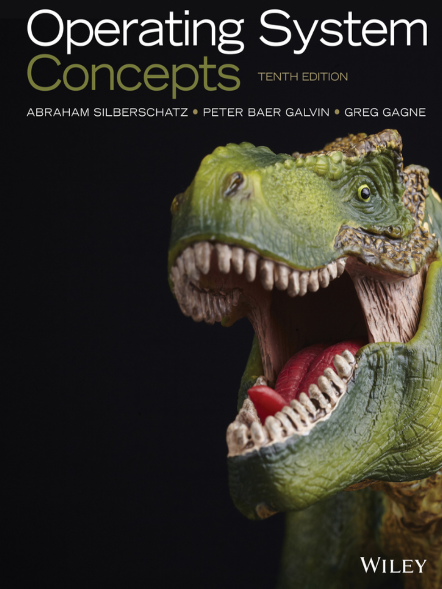

# 1 写在前面

## 朋辈辅学录播上传到了 Bilibili，可以点击 [这里](https://www.bilibili.com/video/BV1EK411D7fM) 观看。

!!! danger ""
    我的笔记所追求的目标是有逻辑、通畅地总结知识；因此如果您在阅读过程中在任何地方发现了不容易读懂的部分，请务必在评论区或者通过其它方式告知我QWQ！非常感谢！

这是操作系统课程的学习记录。

课程使用的课本是 _Operating System Concepts (10th edition)_：

{width=300}

同时参考了 2020-2021 学年秋冬学期浙江大学申文博老师操作系统课程的 PPT 和讲解。

如无特殊说明，本文（指「操作系统」导航下所有文章，后同）中的图片等资料均来源于课本和申文博老师的 PPT。

!!! danger
    本文的内容并没有涵盖课本或者课程的全部内容，也有在上述内容之外的补充。只参考本文进行学习，不一定能够达到课程需要的所有要求。

    本文再次整理主要是为浙江大学计算机学院朋辈辅学（2022-2023 秋冬）操作系统课程的备课工作，因此部分内容可能较为简略。

!!! warning
    本文追求有逻辑地引入和学习各部分知识，因此本文的章节安排、顺序和逻辑相较于课本或者课程可能存在不同。