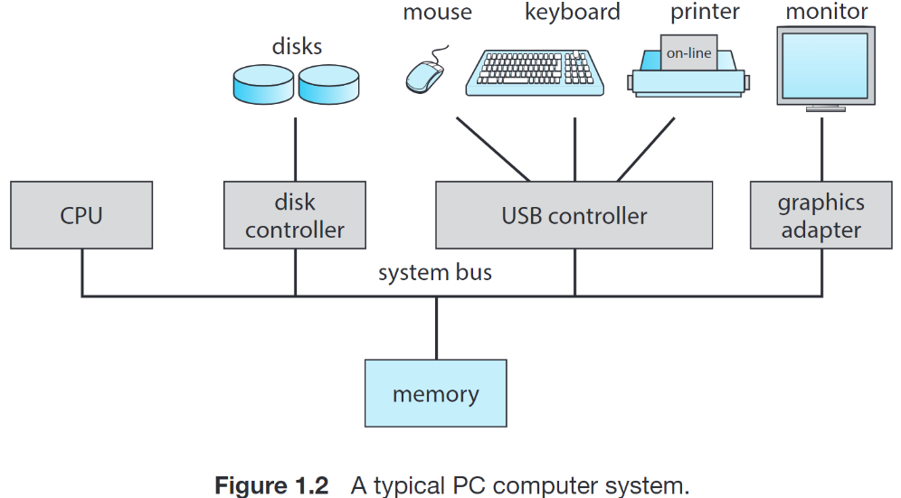

# 2 Overview

## 2.1 操作系统是啥

我们在计组课上搞好了一个 CPU，还有配套的内存之类的设备，现在要用它。可以直接把汇编写到内存里运行。

{width=300}

计算机最开始是为了研究可计算性理论的，但很快就被用于一些专用的计算，例如破译密码等；随后演化出了 general-purpose, multifunction mainframes

如果有很多程序要一个一个运行，怎么办呢？写一个一直运行的程序 (**kernel**)，负责其他程序的运行。

- **批处理系统, Batch Processing Systems**。Jobs 在内存或者外存里，内存始终有一个 job 在运行，操作系统负责在结束后加载下一个开始运行（我们将加载到内存并运行的程序为 **进程, process**）。    
  批处理系统的逻辑简单，弊端也非常明显：当进程执行 I/O 时，CPU 会停下来等待事件完成。I/O 事件有可能是和显示器等设备交互，但更耗时的实际上是等待用户进行输入。在这样的系统里，大多数时间浪费在了等用户输入这件事情上。
- **多道批处理系统, Multiprogramming Batch Systems**。在批处理系统基础上，当当前 job 发生 I/O 时，操作系统负责让 CPU 转而运行另一个 job。    
  多道批处理系统通过这种方式避免了批处理系统等待用户输入等 I/O 事件的 CPU 时间浪费，但是这样的系统仍然对用户不够友好。例如，我们假设视频播放器播放视频需要一个单独的进程，那么如果用户希望同时开两个视频播放器分别播放一个视频，在多道批处理系统中就是不可能实现的，因为 CPU 始终只在执行一个 job，因此只有一个视频能被播放。
- **分时系统, Time Sharing Systems**。将 CPU 时间划分为很小的时间片，操作系统负责安排各个 job 轮流运行。    
  这个设计解决了「两个视频播放器」的问题：由于切换频率很高，远高于人的反应频率，因此可以快速在两个播放进程之间切换，从而让用户看起来「以为」两个视频是同时播放的。  
  分时系统本身也是一种多道 (multiprogramming) 系统，即允许多个 job 并发 (concurrently) 执行。但是不是批处理 (batch) 系统。

除了 kernel 外，操作系统还包含一些 **system programs**，辅助 kernel 工作。其他程序不属于操作系统，称为 **application programs**。

总结来说，操作系统是“软件中最基础的部分”，用以控制和管理系统资源、方便用户使用计算机。

{width=300}

## 2.2 中断

批处理系统的实现是容易理解的；每个程序就像是一个函数一样被操作系统调用。那么其他类型的操作系统是如何实现在程序运行时能够收回控制权呢？这就需要使用到 **中断 (interrupt)**。现代操作系统都是 **中断驱动 (interrupt driven)** 的。

事件发生通常通过硬件或软件的中断通知。CPU 硬件有一条称为 **interrupt-request line** 的线路，CPU 在执行每一条指令后都要检测它一次。当 CPU 侦测到一个设备控制器在这条线路上发出的信号时，会读取 interrupt number 并且以此作为 interrupt vector 中的 index 来跳转到对应的 interrupt-handler routine。

!!! note ""
    **中断向量表 (interrupt vector)** 用来减少确定中断服务时的查找次数，即通过随机访问而不是遍历的方式找到处理程序。

在现在的操作系统上，我们还需要一些更复杂的中断处理功能：

1. 我们需要能够在关键程序处理期间延迟中断的处理；
2. 我们需要一种高效的方法来将设备中断发给正确的中断处理程序；
3. 我们需要多级中断，从而使得操作系统可以区分不同优先级的中断并根据适当的紧急程度进行响应。

在现代的计算机硬件中，这些特性由 CPU 和 interrupt-controller hardware 实现。

大多数 CPU 有两条 interrupt-request line，一条用于 nonmaskable interrupt，为一些不可恢复的内存错误等事件保留；另一条是 maskable 的，它可以在执行不可中断的关键程序之前被 CPU 关闭，用于传送一些设备控制器的中断请求。

我们都知道，在调用函数时需要保存 PC 等现场状态；执行中断时也需要保存。但是，值得注意的是，虽然低级的中断可以被高级的中断打断，但是保存和恢复现场状态的过程是不应当被打断的。

{width=300}

!!! info "计时器与分时系统的实现"
    当操作系统将 CPU 的控制权交给一个程序前，会设定好一个 **计时器 (timer)**。计时器通过一个时钟和一个计数器实现。当计数器的值为 0 时，就会产生一个中断，这时控制权就交给了操作系统。这种方式可以防止程序执行时间过长，也可以用来实现分时系统。

## 2.3 Dual-mode & Multimode

操作系统和用户共享计算机的软件和硬件。因此，一个错误的程序可能会导致整个系统崩溃，或者使得其他用户的数据甚至操作系统本身被修改。因此，操作系统的设计要保证一个错误的程序不会造成其他程序的错误运行。

我们将操作系统代码和用户代码区分执行。出于安全考虑，用户代码不能直接执行部分可能引起损害的指令；我们称这些指令为 **privileged instructions**。CPU 硬件有一个 **mode bit**，值为 0 表示当前处于 **kernel mode (或称为 supervisor mode, system mode, privileged mode)**；值为 1 表示当前处于 **user mode**，此时 CPU 将会把所有 privileged inst. 视为非法指令。

!!! note ""
    所有的 interrupt handler 都运行在 kernel mode。原因之一是，interrupt handler 需要关闭（部分）中断响应，而用户不应当能自由地做这样的事情。

那如果用户程序确实想使用特权指令提供的功能怎么办呢？它们可以通过 **system call** 的方式向操作系统提出请求，由操作系统代为完成。

{width=300}

???+ info "System Calls"
    系统调用可能需要传递参数。参数可以放在寄存器里直接传递；也可以放在一块内存中，用寄存器传递地址；也可以用栈传递。

    系统调用提供的功能（也就是我们不允许用户程序自由完成的功能）包括：

    
{width=300}

    
{width=300}

    课本上给出了一些例子：
    
    
{width=300}

!!! info "Multimode"
    系统设计也可能引入更多 mode，或者叫 **privilege level**。例如在虚拟化的情境下，可能会支持多于 user mode 但是少于 kernel mode 的指令等。

因此，当发生中断、system call、错误（例如除以 0，或者访问未知指令）等情况时，会发生 user mode 到 kernel mode 的转换。

