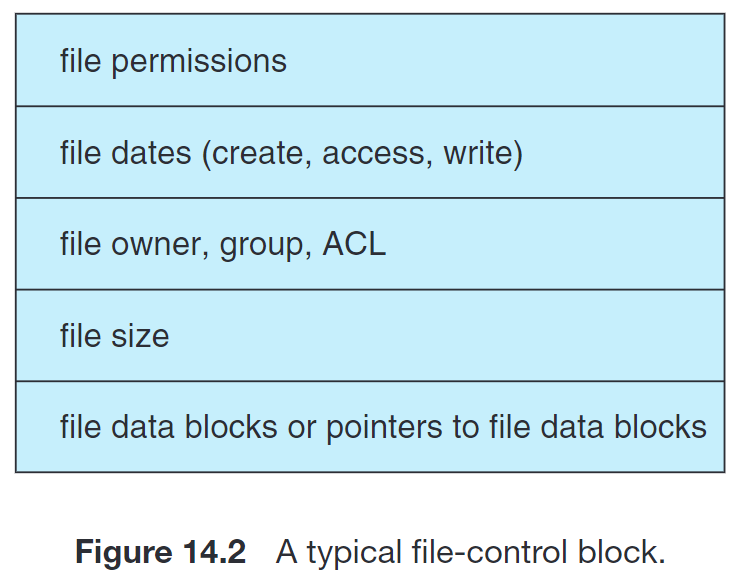
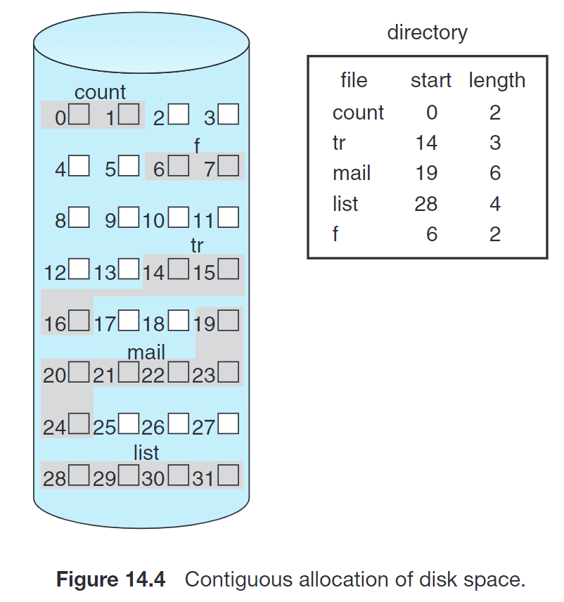
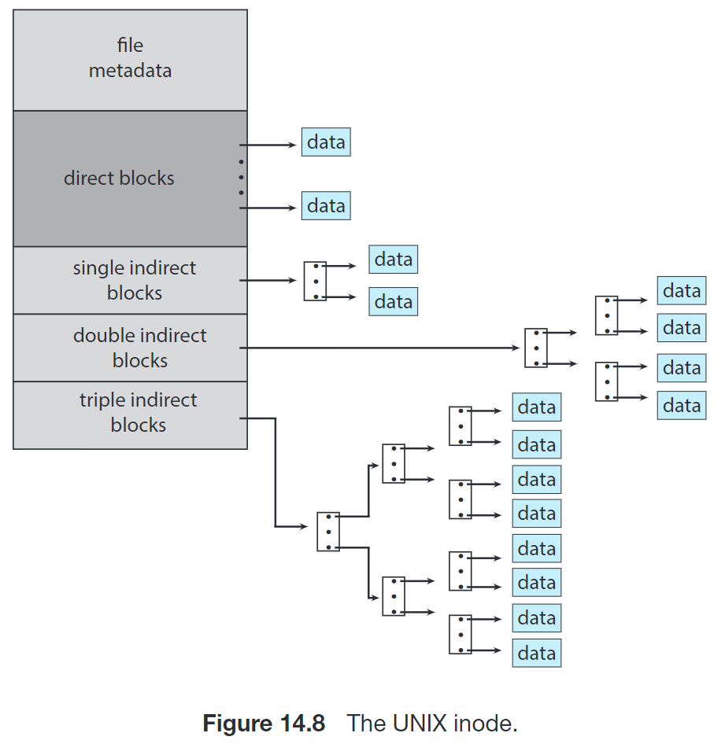

# 14 File System Implementation | 文件系统实现

如我们所说，文件系统利用磁盘驱动器所提供的读写磁盘 blocks 的接口来实现；其发挥的功能是给用户和程序提供存储功能，提供高效和便捷的磁盘访问，并将这种逻辑结构映射到物理的外存设备上。

现存的文件系统由很多种，大多数操作系统也支持多种文件系统。

- Unix 使用 Unix FS (UFS)，它基于 BFFS (Berkeley Fast FS)；
- Windows 支持 File Allocation Table(FAT), FAT32 和 Windows NT File System (NTFS)；
- Linux 的标准文件系统是 extended file system，最常见的是 ext3 和 ext4。不过 Linux 支持 40+ 种 FS。

文件系统的研究仍然是一个活跃的领域。Google 创建了自己的 FS 以满足具体的存储和检索需求；Distributed File Systems 也有很多研究、应用和发展。

## 14.1 File System Structure | 文件系统结构

文件系统本身通常由多个不同的层组成，一个例子是：

{width=200}

**Application programs** 给出 read / write / open 某个 file path 的指令，这个指令被传递给 logical file system——

**Logical file system** 管理所有文件系统所需的 metadata（即除了文件内容之外的所有东西），例如 directory structure。它通过一个叫做 **File Control Block (FCB)** 的数据结构保存这些信息，即我们之前所说的 name, ownership, permissions, ref count, timestamps, pointers to data blocks on disk 等。

Logical file system 将上层给出的 read / write / open 某个 file path 的指令解析为 read / write 某些 logical blocks 的指令，并传递给 file-organization module——

**File-organization module** 负责 logical file blocks 到 physical file blocks 的转换。同时，它还负责管理 free space，即跟踪未被使用的 blocks 并在需要时进行分配。

File-organization module 将 logical file system 给出的对 logical blocks 的指令转换为对 physical file blocks 的转换，并传递给 basic file system——

**Basic file system** 管理包含 file-system, directory 和 data blocks 的缓存，从而提高性能。

如果上层的读取或写入 miss 了，那么 basic file system 将对应的指令传递给 I/O control——

**I/O control** 包括设备驱动程序和中断处理程序，以在主存和磁盘系统之间传递信息。这应用到 12 章 I/O System 的相关实现。

I/O control 将上层的指令转换为 low-level, hardware-specific 的指令来实现相关操作。

分层的文件系统设计可以降低文件系统本身的复杂性和冗余性，但是可能会影响性能。

## 14.2 FS Data Structures

文件系统会使用多种数据结构；有的数据结构会放在磁盘上，而有的会放在内存里。

On-disk structures:

- **File control block(FCB)** (per file)。保存 name, ownership, permissions, ref count, timestamps, pointers to data blocks on disk 等信息；每个 FCB 有一个唯一的标识号以与目录条目相关联。在 UNIX 中，FCB 被称为 **`inode`**；在 NTFS 中，每个 FCB 是一个叫 **master file table** 的结构的一行。  

{width=300}

- **Boot control block** (per volume)。如果一个 volume 是 [boot partition](../../V_storage_management/11_mass_storage/#boot-block)，那么这里保存从该 volume 引导操作系统所需的信息；否则内容为空。它通常是 volume 的第一个 block。UFS 称之为 boot block，NTFS 称之为 partition boot sector。
- **Volume control block** (per volume)。包含当前 volume 的 block #, block size, free-block #, free-block ptrs, free-FCB #, free FCB ptrs 等。UFS 称之为 superblock，NTFS 将其存在 master file table 中。
- **Directory** (per FS)。用来组织文件，包含文件名和对应 FCB 的标识号。在 NTFS 中，它也被存在 master file table 中。

In-memory structures:

- **Mount table**。每个挂载的 volume 占一行，保存相关信息。
- **Directory cache**。
- **Global (a.k.a. system-wide) open-file table**。
- **Per-process open-file table**。
- 用于读写磁盘的 buffer。

### File Creation

当创建新文件时，application programs 调用 logical file system；后者分配一个 FCB。系统随后将对应的 directory 读到内存，并用 filename 和 FCB 更新 directory。

### File Open & Close

系统调用 `open()` 将文件名传给 logical file system，后者搜索 system-wide open-file table 以确定该文件是否正在被其他进程使用：

- 如果不是，则需要在 directory 中找到这个 file name，并将其 FCB 从磁盘加载到内存中，并将其放在 system-wide open-file table 中。然后，在当前进程的 per-process open-file table 中新建一个 entry，指向 system-wide open-file table 中的对应项。
- 如果是，则直接在当前进程的 per-process open-file table 中新建一个 entry，指向 system-wide open-file table 中的对应项即可。这可以节省大量开销。

!!! info
    System-wide open-file table 除了存储 FCB 外，还会存储打开该文件的进程的数量。

    Per-process open-file table 除了保存指向 system-wide open-file table 中一个 entry 的指针外，还会保存一些其他信息，例如 current-file-position pointer 以及打开文件的访问模式等。

然后，`open()` 返回指向 per-process open-file table 中对应 entry 的指针；接下来的文件操作通过这个指针执行。这个 entry 在 UNIX 中被称为 **file descriptor**，在 Windows 中被称为 **file handle**。

!!! info
    文件名不必是 open-file table 的一部分，因为后续的操作并不需要文件名。但是，如前面所述，缓存文件名有助于减省打开同一文件的时间。

当进程关闭文件时，per-process open-file table 中对应 entry 将被删除，system-wide open-file table 中的 counter 将被 -1；如果该 counter 清零，则更新的 metadata 将被写会磁盘上的 directory structure 中，system-wide open-file table 的对应 entry 将被删除。

Unix 等系统将 devices 和 network connections 等也用文件系统来管理，因此除了 files 和 directories 有 inode 之外，上述内容也有 inode 并存在于 open-file table 中。

## 14.3 Virtual FS

我们之前提到，操作系统可以同时支持多种类型的文件系统。这一特性的实现依赖于 **虚拟文件系统 (Virtual FS, VFS)** 机制。

{width=300}

这种机制用面向对象的方法来实现文件系统。具体来说，操作系统定义了一套通用的文件系统访问接口，即 `open(), read(), write(), close()` 和 file descriptors；所有文件系统都需要实现它们，并把它们按照约定排布在函数表中。VFS 将上述通用操作和实现分开，即在需要调用某个函数时，去对应 FS 的函数表的约定位置找到函数指针就可以访问了。这和 C++ 中多态的虚函数表是类似的。

{width=700}

## 14.4 Directory Implementation

目录是一种特殊的文件，它保存 file name 到 FCB 的映射关系。

{width=600}

最简单的实现方式是 **linear list**，即维护 `dir_entry[]`。这种方案的缺点是查找文件很费时。

使用有序数据结构（有序表、平衡树、B+ 树等）能够优化这一问题。

使用 **hash table** 也可以解决这一问题。

## 14.5 Disk Block Allocation

文件需要被保存到具体的 disk blocks 上，我们讨论分配的策略。

### 14.5.1 Contiguous Allocation

这种方法下，每个文件在磁盘上占有的 blocks 是连续的。这种方案在访问磁盘时比较友好，能够显著降低 seek time。同时，目录也只需要维护文件的起始 block 及其长度：

{width=300}

具体的分配方案也可以参考 [Dynamic Storage-Allocation Problem](../../IV_memory_management/9_main_memory/#923-dynamic-storage-allocation-problem) 的 first-fit, best-fit 等。

这也会带来外部碎片，但是 disk 通常够大，我们可能并不在意这些碎片。也可以使用压缩 (compaction) 或者说是清除碎片 (defrag) 操作，虽然它们开销较大。

这种方案的一个重要问题是，如何确定一个文件需要多少空间；这个问题的核心在于，文件本身可能是会扩展的。

解决方案之一是，当出现这种情况时将文件复制到一个新的足够大的空闲空间里去。这种方案会带来比较大的 overhead，尤其是文件可能很大。

另一种解决方案是，让用户确定每个文件的最大大小。这种方案会带来比较大的不便，而且用户可能高估所需空间，导致较大的内部碎片。

还有一种解决方案创建了连续空间的链表来保存一个文件。当空间不够时，添加一块连续空间（称为 **extent**）。FCB 记录的信息除了起始和长度外，还额外维护下一个 extent 的信息。

### 14.5.2 Linked Allocation

这种方法下，每个文件都是 block 组成的链表；每个 block 中有若干字节被用来保存下一块的地址。目录只需要记录起始地址和结束地址即可：

{width=300}

这种方式没有外部碎片。但是也有若干问题：

- 获取一个文件可能需要比较多的 I/O 和 disk seek；
- 每个块中都有若干字节作为 overhead。

解决方案之一是，将多个块组成 cluster。这种方案会增加内部碎片。

另一个问题是如果 pointer 损坏，会出现问题。可以通过一些冗余信息（如双向链表）减少出现问题的概率，但会带来额外开销。

而且，这种实现方式不支持 random access。

!!! info "File-Allocation Table (FAT) 使用的就是 Linked Allocation"
    这种简单的磁盘空间分配方法用于 MS-DOS 操作系统。
    
    
{width=300}

### 14.5.3 Indexed Allocation

这种方式给每个文件记录一个 **索引块 (index block)**，记录这个文件的第 i 个块在磁盘中的哪个块。目录只需要保存索引块放在哪里即可：

{width=300}

这种方案支持 random access，也不会有外部碎片。但是索引块本身是额外的开销，这对小文件来说是更大的 overhead。这种方案还能允许文件中存在 holes。

一个问题是，索引块应当有多大；即，我们希望 overhead 不要太大，但是也要能支持大文件。有若干种可选的实现思路：

- **linked index blocks**。每个 index block 占用一个 disk block，形成一个 disk block 的链表。
- **multiple-level index blocks**。例如，每个 disk block 为 4KiB，那么对于一个二级的索引结构，一级索引就可以有 1024 个 4B 的指针指向二级索引，每个二级索引也能有 1024 个 4B 的指针指向文件块，因此就能够有 $2^20$ 块，即支持 4GiB 的最大文件。
- **comblined scheme**。UNIX 的文件系统采取这种方案。在 inode 中有 15 个指针（下面假设 `block size = 512B, ptr = 4B`）：
    - 前 12 个指向 **direct block**，即文件的前 12 个 block。如果文件小于这个大小 (12 * 512B = 6KiB)，则不需要 index block；
    - 第 13 个指向 **single indirect block**，指向一个一级的索引块，可以索引 128 * 512B = 64KiB 数据；
    - 第 14 个指向 **double indirect block**，指向一个二级的索引块，可以索引 128 * 128 * 512B = 8MiB 数据；
    - 第 15 个指向 **triple indirect block**，指向一个三级的索引块，可以索引 128 * 128 * 128 * 512B = 1GiB 数据。

{width=300}

## 14.6 Free-Space Management

文件系统需要维护 free-space list 以得知空闲的块或 clusters。这个列表在分配空间或者文件被删除时会修改。我们讨论其实现方案。

实现方案之一是用 **bitmap**：每个 block 用 1 bit 表示：1 表示空闲，0 表示占用。为了减少 bitmap 占用的空间，可以以 cluster 为单位分配和表示。

另外也可以把所有的 free space 用 **链表** 连接。这种方案在需要多个空间块时需要比较多的 I/O，效率较低。

{width=300}

为了解决上面的问题，引入 **grouping** 的方案。维护若干个 block 形成的链表，每个 block 保存若干空闲块的地址。这种方案可以减少需要的 I/O。

另外也可以使用 **counting** 的方案。之前链表的方案维护的是空闲块的链表，而现在维护的是 _连续的空闲块_ 的链表，即链表的每个结点是连续的空闲块的首块指针和连续的长度。