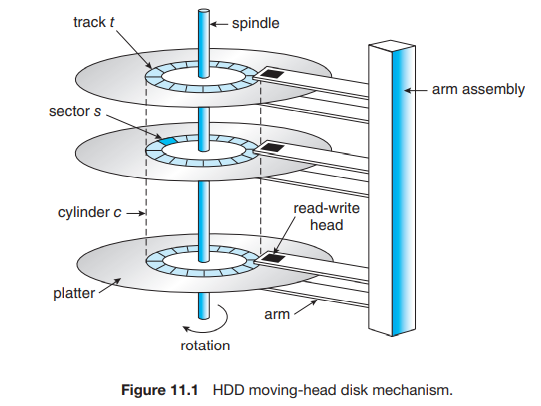
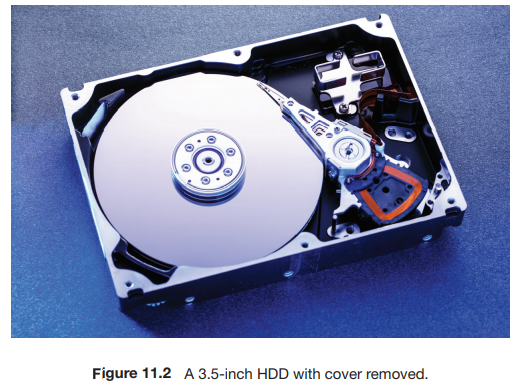

# 11 大容量存储结构

## 11.1 Overview

现代计算机的大部分二级存储由 **hard disk drives (HDDs)** 和 **nonvolatile memory (NVM) devices** 提供。

HDD 就是硬盘驱动器。NVM 设备根据定义是断电后存储的数据还能保持的设备，按定义来说硬盘也是 NVM，但是课本里的 NVM 主要指的是 electrical 的而非 mechanical 的；因此课本里 NVM 并不包含 HDD。

### HDDs

HDD 的结构相对简单。

{width=300}

如上图，每个 disk platter（盘片）长得像 CD，直径一般 1.8~3.5 inches。Disk platter 的两面附着有磁性材料，我们通过磁性记录在其上保存信息，并通过检测其上的磁性模式来读取信息。

每个 platter 附近有一个 read-write head，read-write head 附着在 disk arm 上，arm 会使所有 head 形成整体共同移动。

Platter 表面被分成了很多环形 track（磁道），再细分为 sector（扇区）。在一个 arm position 下的 track 组成一个 cylinder（柱面）。

{width=300}

Sector 被编号，是 logical block address 在 disk drive 上的映射。编号的原则如下：以最外 cylinder 的第一个 track 的第一个 sector 为 0，然后该 track 上的 sector 依次编号，然后是 cylinder 中的其他 track，然后是内部的 cylinder。

使用磁盘时，电机高速旋转磁盘。参数 **Rotation Per Minute (RPM)** 是每分钟旋转的次数，普通的 HDD 通常为 5400, 7200, 10000, 15000RPM。

**Transfer Rate**：在 HDD 和计算机之间数据流的速率（理论 6Gb/sec，实际 1Gb/sec）

**Positioning Time** (a.k.a **random-access time**)：将 disk arm 移动到所需要的 sector 所用的时间。包含两部分：

   - **Seek time** - 将 arm 移动到所需 cylinder 所用时间（3ms - 12ms）
   - **Rotational latency** - 旋转到 head 在所需 sector 上所用时间（与转速有关）

### NVM Devices

包括固态硬盘 (Solid-state disks, SSD), USB drives (thumb drive, flash drive), DRAM disk replacements 等。

NVM devices 比 HDD 更可靠，也更贵，可能寿命更短，容量更小，但是快很多。标准总线可能会太慢，所以有的 SSD 设计成直接连接到系统总线，如 PCI。

没有需要「移动」的部分，因此没有 seek time or rotational latency。

### Magnetic Tape

磁带是早期的二级内存。现在主要用来备份不常用的信息。

空间很大（200GB ~ 1.5TB），访问很慢，随机访问特别慢。

## 11.2 Disk Scheduling

OS 需要负责硬件使用的高效性。对于 disk drives 来说，OS 需要提供一个 fast access time 和 high disk bandwidth。我们讨论 HDD。

   - **access time** : seek time (roughly linear to seek distance) + rotational latency
   - **disk bandwidth** : the speed of data transfer (data bytes / time from request to completion)

每当进程需要进行磁盘 I/O 时，它向 OS 发出一个系统调用，包括信息：输入/输出，磁盘地址，内存地址，扇区数。如果目标磁盘的驱动器和控制器正忙，则加入请求队列（每个 disk 或 device 有一个队列）。

**Disk scheduling** 需要选择队列中的一个请求来使其下一个使用目标磁盘。

通常主要目标是 minimize **seek time**。对计算机来说，rotational latency 很难算。

下面的调度算法，均使用 request queue of cylinders `98, 183, 37, 122, 14, 124, 65, 67` ([0, 199]), and initial head position `53` as the example。

### 11.2.1 First-Come First-Served (FCFS)
Advantages: 

   - Every request gets a fair chance 
   - No indefinite postponement

Disadvantages: 

   - Does not try to optimize seek time 
   - May not provide the best possible service

{width=300}

### 11.2.2 Shortest Seek Time First (SSTF)
类似 SJF，选择离现在 head position 最近的 request。但是 SSTF 不一定最好。

{width=300}

Advantages: 

   - Average Response Time decreases
   - Throughput increases

Disadvantages: 

   - Overhead to calculate seek time in advance
   - Starvation may exist
   - High variance : favors only some requests

### 11.2.3 SCAN / Elevator algorithm
从一边往另一边走，选择路上的 request 不回头，直到到达另一端反向。

{width=300}

Advantages: 

   - Average Response Time
   - High Throughput
   - Low variance of response time

Disadvantages: 

   - Long waiting time for requests for locations just visited by disk arm

### 11.2.4 C-SCAN
Circular-Scan：到达一端时立刻回到开头。

{width=300}

Advantage:

   - Provides more uniform wait time compared to SCAN

### 11.2.5 LOOK / C-LOOK
在 SCAN / C-SCAN 的基础上，只走到一端最后一个任务（look 是否有请求）而不走到头。

{width=300}

Advantage:

   - Prevents the extra delay which occurred due to unnecessary traversal to the end of the disk.

### 11.2.6 Selecting Disk-Scheduling Algorithm
取决于请求的数目和类型。SSTF 最常见，但是当 I/O 负荷较大时，使用 LOOK / C-LOOK 以避免 starvation。

SSD 没有 seek time 就都可以用 SSTF 了。

表现本身依赖于请求的模式，而请求本身又依赖于文件分配策略。文件系统如果注重空间局部性，能够提供很好的表现提升。

## 11.3 Disk Management

操作系统还负责磁盘管理的其他几个方面，例如磁盘初始化、引导、坏块恢复等。

### Disk Formatting | 磁盘格式化

一个新的磁盘是一个空白盘，它需要经过 **低级格式化 (low-level formatting, a.k.a 物理格式化, physical formatting)** 来分成扇区以便磁盘控制器读写。

这一过程中，每个扇区都会放一些特殊的数据供磁盘控制器使用，例如 header information, ECC (Error-Correcting Code) 等。

接下来，操作系统会在磁盘上记录一些自己的数据结构，例如将磁盘分为若干个 **分区 (partition)**，每个分区由若干个 cylinders 组成，每个被视为一个 logical disk。

然后，操作系统将初始的文件系统数据结构存储到磁盘上，以创建一个文件系统。这一步称为 **逻辑格式化 (logical formatting)**。例如，一些文件系统可能预留出一些 blocks 用来 handle bad blocks；一些文件系统也可能将若干 blocks 聚合成一个 cluster，让磁盘 I/O 以 block 为单位完成，文件系统 I/O 以 cluster 为单位完成，以减少 random access 从而提高表现。

包含文件系统的分区通常称为 **卷 (volume)**。

### Boot Block

在刚打开电源或者重启时，计算机需要有一个初始程序来运行；这个程序称为 **自举 (bootstrap)** 程序。这个程序初始化系统的各个部分，例如 CPU 寄存器、设备控制器、内存，然后在磁盘上找到操作系统内核，加载到内存，转到起始地址从而运行操作系统。

对于大多数计算机，bootstrap 程序存在 **ROM (Read-Only Memory)** 中，因为它不需要初始化而且处于固定位置。ROM 是只读的，因此不会受到病毒的影响。

但同时，这样的设计使得要更改 bootstrap 代码就必须更改 ROM 硬件芯片。因此大多数系统在 ROM 中存储一个 tiny bootstrap loader program，它用来从磁盘上调入完整的 bootstrap 程序。包含这个完整的 bootstrap 程序的 partition 称为 **boot partition**，包含这个分区的磁盘称为 **boot disk** 或者 **system disk**。

## 11.4 RAID

HDDs 越来越小和便宜，因此如果一个系统可以拥有大量磁盘，那么就能改善数据的读写速率（因为可以并行）和可靠性（使用冗余来降低出现错误的期望）。这样的磁盘组织技术称为 **磁盘冗余阵列 (Redundant Arrays of Independent Disk, RAID)** 技术。