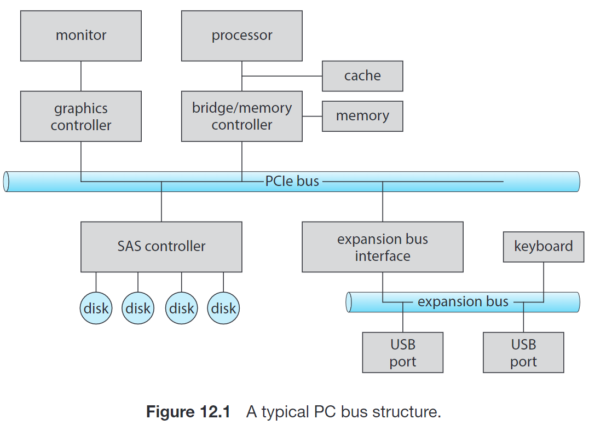

# 12 I/O Systems

{width=400}

## 12.1 I/O 方式

I/O 实现的一种方案是 **轮询 (polling)**：当 PC 需要和某个 I/O 设备交互时，它查询该设备对应的 I/O 控制器 (controller) 中状态寄存器的相关位，当该位表示事件（如写入或读取）可以进行时 PC 进行相关操作并通过状态寄存器通知控制器。

另外，**中断** 是更高效和常用的 I/O 手段，它通过在 interrupt-request line 上发出信号来通知 CPU 响应设备的 I/O 事件。

对于需要大量传输的设备，上面两种操作会过多占用 CPU 资源，因此很多计算机提出了 **直接内存访问 (DMA, Direct Memory Access)**。这一技术将相关的 I/O 任务交给一个专用的处理器（DMA 控制器）来完成，设备直接与内存交互。

有的计算机架构的 DMA 采用物理地址，也有采用虚拟地址的技术，称为 **DVMA, Direct Virtual-Memory Access)**。

## 12.2 Application I/O Interface | 应用程序 I/O 接口

I/O 系统相关的系统调用将不同的 I/O 设备的工作方式封装到一些类中，从而形成较少的通用类型，从而为应用程序隐藏硬件的具体差异。

- Data transfer mode
    - character：逐个字节传输（如 terminal）
    - block：以块为单位传输（如 disk）
- Access method
    - sequential（如 modem）
    - random（如 CD-ROM）
- Transfer method
    - synchronous：需要按预计的响应时间进行传输并和系统的其他方面相协调（如 keyboard）
    - asynchronous：响应时间不需要规则或者可预测，不需要与其他计算机事件协调（如网络 I/O）
- Sharing
    - sharable：可以被多个进程或线程并发使用（如 keyboard）
    - dedicated：不能（如 tape）
- Device speed
- I/O direction：R- (CD-ROM) / -W (graphics controller) / RW (disk)

同时，大多操作系统也支持应用程序透明地向一个设备驱动器传输任意数据。在 UNIX 中，`ioctl()` 系统调用实现这一功能。这一系统调用通过 **文件描述符 (file descriptor)** 来确定一个设备，因为 UNIX 中设备可以通过文件的方式访问。