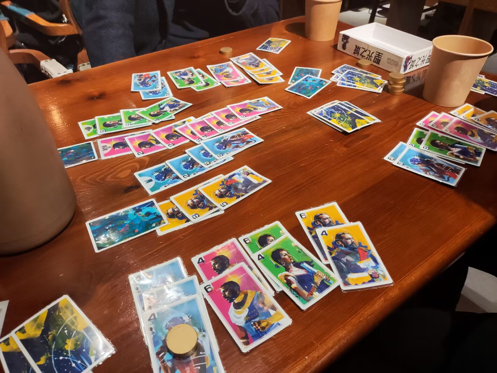

# 桌游游玩记录！

!!! note "关于「评价 :material-star-outline:」"
    这里的「评价 :material-star-outline:」基于个人的体验！
 
    4 ~ 5 分是非常喜欢的，2.5 ~ 3.5 分是愿意再玩的，1 ~ 2 分是还不错但是不想再玩的，1 分以下是后悔玩过的QWQ
    
    另外 `-` 是表示因为各种原因暂时无法或者不足以给出评价的

| :fontawesome-regular-chess-knight: | :material-star-outline: | :material-account-group:/:octicons-clock-16:&nbsp; &nbsp; &nbsp; &nbsp; &nbsp; &nbsp; | :material-text-account: | :material-tooltip-image-outline: |
| :-: | :-: | :-: | :- | :-: |
| **2025-2-2 无忧 5 人局** {: colspan=5}| &#8288 {: style="padding:0"} | &#8288 {: style="padding:0"} | &#8288 {: style="padding:0"} | &#8288 {: style="padding:0"} | &#8288 {: style="padding:0"} | |
| 波多黎各 | 4 | 2~5/长 | 经典德式游戏，设计严谨，互 ~~动~~ 卡方式极多，重开性高。 | {: width="20px"} |
| 圣家族大教堂 | 2.5 | 1~4/短 | 投骰子，坑人可能存在但大家一般不太这么玩，策略成分有一点但不完全有。 | {: width="20px"} |
| 伊斯坦堡 | 3 | 2~5/长 | 竞速游戏，互动性相对比较弱，主要看自己的路线规划；赌狗成分不低 | {: width="20px"} |
| 海上丝路 | 4 | 2~4/短 | 好复刻 比较小品的博弈游戏，规则简单但互动性和策略性都不错，时间也不长。重开性还可以。 | {: width="20px"} |
| **2025-1-27 无忧 5 人局** {: colspan=5}| &#8288 {: style="padding:0"} | &#8288 {: style="padding:0"} | &#8288 {: style="padding:0"} | &#8288 {: style="padding:0"} | &#8288 {: style="padding:0"} | |
| 时空神探：巴黎 1920 | 4 | 1~4/中 | 像剧本杀的图灵机，时间更长、故事性更高，个人信息使得互动性更强一些。一盒能玩 15 个本。 | {: width="20px"} |
| 警爆伦敦 | 4 | 4~8/中 | 好复刻 身份推理嘴炮游戏，比狼人杀规则简单、参与感强、上手快，但运气成分更大一些。 | {: width="20px"} |
| 碰撞机器人 | 2 | x/短 | 做题游戏，几个人都能玩；但是好像没必要是一个桌游。（好像对它不太公平，因为图灵机也差不多） | {: width="20px"} |
| 诺丁汉警长 | 3.5 | 3~5/中 | 吹牛 + 贿赂，人不能总说实话！可惜我不太会说谎，可以在这里练练😋 | {: width="20px"} |
| 凶煞回廊 | 1.5 | 2~7/中 | 无论是合作还是互坑的操作空间都不大；每个人对场面的影响都很重要，但没有人能算到这个程度。策略性和娱乐性都不足。 | {: width="20px"} |
| 印加宝藏 | 3 | 3~8/短 | 好复刻 心理博弈小游戏，成为赌狗或者见好就收。 | {: width="20px"} |
| **2025-1-25 无忧 5 人局** {: colspan=5}| &#8288 {: style="padding:0"} | &#8288 {: style="padding:0"} | &#8288 {: style="padding:0"} | &#8288 {: style="padding:0"} | &#8288 {: style="padding:0"} | |
| 截码战 | 4.5 | 3~8/中 | 有点抽象的有趣聚会小游戏，合作猜词，节目效果很多；随机性还是有一些。 | {: width="20px"} |
| 七大奇迹：建筑师 | 2 | 2~7/中 | 卡牌游戏，带一点点连招，规则简单；从策略角度讲总体发挥空间不大、随机性太高、互动不足，又没有传统随机的节目效果和传统连招的爽度。 | {: width="20px"} |
| 巧手猜图 | 4.5 | 3~5/中 | 特别抽象的聚会小游戏，用 5 种限制颇多的不同工具描绘图片并互相猜；大家都认真地玩的话会很有趣。 | {: width="20px"} |
| **2024-10-5 无忧 4 人局** {: colspan=5}| &#8288 {: style="padding:0"} | &#8288 {: style="padding:0"} | &#8288 {: style="padding:0"} | &#8288 {: style="padding:0"} | &#8288 {: style="padding:0"} | |
| 诈赌巫师 | 3 | 3~6/中 | 赌狗下注，带一点勾心斗角但不多。 | {: width="20px"} |
| 铁路环游 | 3 | 2~5/长 | 规则简单，有互卡，但仔细算的话又太累，性价比不高；随机性也有一些。总体感觉平平。 | {: width="20px"} |
| 战国时代 | 1.5 | 2~6/中 | 纯纯的骰子赌狗游戏，不想带脑子的时候玩玩也行。 | {: width="20px"} |
| 元素棋 | 3.5 | 2~4/中 | 一个设计比较巧妙的抽象棋，可以多玩几次看看。 | {: width="20px"} |
| 王权骰铸 | 2 | 2~6/长 | 对战游戏，桌面网游；阅读量大一点，第一次玩的话会吃点亏。半个赌狗游戏吧，剩下的看理解；不是我喜欢类型的桌游。 | {: width="20px"} |
| **2024-10-3 无忧 3 人局** {: colspan=5}| &#8288 {: style="padding:0"} | &#8288 {: style="padding:0"} | &#8288 {: style="padding:0"} | &#8288 {: style="padding:0"} | &#8288 {: style="padding:0"} | |
| 骑士纹章 | 3 | 2~4/中 | 区控，互相抢地盘，牵制大于战斗。总体感觉设计比较好，没什么毒点；但是也没有特别惊艳的地方。 | {: width="20px"} |
| 赎罪之旅 | 4 | 3~5/短 | 好复刻 轻量级打牌游戏，赌狗成分高，比较无脑，所以有节目效果。不想带脑子的时候可以玩玩。 25-02-02 Update: 3->4 确实无脑好玩 | {: width="20px"} |
| 大宋百商图 | 3 | 2~4/中 | 资源管理滚雪球游戏，但是中期没有那么爽。爽度和互卡的策略性不及同类经典游戏，随机成分也没有带来充分的节目效果。胜在画风不错。 | {: width="20px"} |
| 国家公园：自然之旅 | 3 | 1~5/中 | 资源管理卡牌构建，打连招，也是找爽度。从我喜欢抽象游戏的角度来看，不如香料之类的经典游戏。稍微复杂一点的机制并没有带来更高的爽度或者策略性。大家互动成分并不高。也是画风不错。 | {: width="20px"} |
| nana | 2 | 2~5/短 | 好复刻 小品记忆游戏，运气成分很大，毫无策略可言。 | {: width="20px"} |
| **2024-4-5 无忧 4 人局** {: colspan=5}| &#8288 {: style="padding:0"} | &#8288 {: style="padding:0"} | &#8288 {: style="padding:0"} | &#8288 {: style="padding:0"} | &#8288 {: style="padding:0"} | |
| 丰收季节 | 2.5 | 1~4/中 | 能玩，没有什么特别好的地方，互动性不高，也不是很爽。好看是好看的。 | {: width="20px"} |
| 科尔特快车 | 3 | 2~6/中 | 比较新奇的构造玩法。大家都在算的话容易猪脑过载，有种石头剪刀布的美感；如果有人不算的话就会变得无聊。 | {: width="20px"} |
| **2024-2-14 无忧 3 人局** {: colspan=5}| &#8288 {: style="padding:0"} | &#8288 {: style="padding:0"} | &#8288 {: style="padding:0"} | &#8288 {: style="padding:0"} | &#8288 {: style="padding:0"} | |
| 历史奇旅 | 2 | 2~4/中 | 有一点策略，但是运气成分大；虽然是竞争但是互相影响的空间很小。 | {: width="20px"} |
| 巫师牌 | 5 | 3~6/长 | 好复刻 虽然玩起来很长但是有趣；博弈感非常重，也略受运气影响。很容易逆风翻盘。 | {: width="20px"} {: width="20px"} |
| 巨兽猎踪 | - | 2~4/长 | 规则比较复杂，玩了新手版本，体验不好。节奏有点拖沓，而且实际上并不完全有「策略空间」，因为在每个情形下应该干什么看起来是比较明显的。没有打分是因为也许非新手版本的体验能好一点。但是应该不会想再玩了。 | {: width="20px"} |
| **2024-2-13 无忧 4 人局** {: colspan=5}| &#8288 {: style="padding:0"} | &#8288 {: style="padding:0"} | &#8288 {: style="padding:0"} | &#8288 {: style="padding:0"} | &#8288 {: style="padding:0"} | |
| 嘿！蚊子 | 0.5 | 3~6/短 | 纯纯的无聊。 | {: width="20px"} |
| 苏格兰场 | 3.5 | 2~6/中 | 根据有限的信息包围 & 抓小偷。有一定的策略空间。 | {: width="20px"} |
| 菲力猫 | 4 | 3~5/短 | 好复刻 唬人博弈拍卖。 | {: width="20px"} |
| 政变 | 2 | 2~6/短 | 身份嘴炮游戏；但是交换身份的机制太少，所以牌运好的话一直说实话别人也没办法。 | {: width="20px"} |
| 方舟动物园 | 3 | 1~4/长 | 在我玩过的这个重量的桌游里，机制算是比较清晰的，不至于像有的游戏那样玩一局还不完全明白规则。但问题在于几乎完全是 solo，跟其他玩家没有互动；在此基础之上结算流程还比长，体验并不好。 | {: width="20px"} |
| **2023-7-13 无忧 5 人局** {: colspan=5}| &#8288 {: style="padding:0"} | &#8288 {: style="padding:0"} | &#8288 {: style="padding:0"} | &#8288 {: style="padding:0"} | &#8288 {: style="padding:0"} | |
| 小泥猪  | 1.5 | 2~4/短 | 运气成分极大，比较无聊。 | {: width="20px"} |
| 古墓迷踪  | 3 | 2~5/中 | 游戏进行方式比较新奇，运气成分有点大，不是很有趣。 | {: width="20px"} |
| 牛头王 | - | 2~10/短 | 规则比较简单，有互坑成分，就玩了一局还没太摸到头脑。 | {: width="20px"} |
| 马王争霸  | 2 | 3~8/中 | 赌马游戏，平衡性欠佳，整体时间略长；整体规则和卡牌设计使得赌狗游戏的乐趣被限制，比较无聊。 | {: width="20px"} |
| 御竹园  | 2.5 | 2~4/中 | 画风不错，任务带来了很大的运气成分；不公开的任务选择和任务手牌使得长线策略和互卡变得不太可能，又不像其他游戏可以推测意图。因此类似 solo 的同时又节奏拖沓，体验并不好。 | {: width="20px"} |
| **2023-7-11 无忧 4 人局** {: colspan=5}| &#8288 {: style="padding:0"} | &#8288 {: style="padding:0"} | &#8288 {: style="padding:0"} | &#8288 {: style="padding:0"} | &#8288 {: style="padding:0"} | |
| 卡波  | 4 | 2~4/中 | 好复刻 买了！ 规则极其简单，有点上头，有记忆成分，运气成分有点大。 | {: width="20px"} |
| **2023-7-9 无忧 3 人局** {: colspan=5}| &#8288 {: style="padding:0"} | &#8288 {: style="padding:0"} | &#8288 {: style="padding:0"} | &#8288 {: style="padding:0"} | &#8288 {: style="padding:0"} | |
| 大杀四方  | 2.5 | 2~4/中 | 平衡性欠佳，有的卡用处不大，运气成分太大，体验配不上阅读量。 | {: width="20px"} |
| 图灵机  | 5 | 1~4/短 | 买了！ 适合一个人或者合作玩，竞速也可以，需要动脑子；题目设计比较多，可重开性强。 | {: width="20px"} |
| 金银岛  | 3.5 | 2~5/中 | 感觉比较适合 4~5 人玩，一人饰演两个角色的话得到的信息太多船长很难赢。机制和游戏体验很新鲜。 **2023-7-11 Update:** 4 人玩了一局，感觉体验有显著提升；但是总体感觉运气成分偏高。 | {: width="20px"} |
| 电力公司  | 3.5 | 2~6/中 | 有拍卖有互卡有计算，需要多方面考虑，平衡性也提供了不少的翻盘机会；但是游戏结束条件有点突然，在后期很容易速通结束游戏。 | {: width="20px"} |
| 太公望  | 3 | 2~5/短 | 无脑赌狗游戏。 | {: width="20px"} |
| 形色牌  | 4.5 | 任意/短 | 买了！ 比眼力和反应，简单好玩。 | {: width="20px"} |
| **2023-2-2 无忧 3 人局** {: colspan=5}| &#8288 {: style="padding:0"} | &#8288 {: style="padding:0"} | &#8288 {: style="padding:0"} | &#8288 {: style="padding:0"} | &#8288 {: style="padding:0"} | |
| 三千世界鸦杀尽 | 2.5 |2~4/短|互坑游戏，非常看牌运，没什么策略可言。| {: width="20px"} |
| 花砖物语 AZUL | 3.5 |2~4/短|策略博弈，规则简单，可以互卡。| {: width="20px"} |
| 小传说 | 3 |2~5/短|画风不错，普通的卡牌游戏，没有什么亮点。| {: width="20px"} |
| Cubitos | 2.5 |2~4/中|赌狗竞速游戏，设计不错，但是重复性比较大所以乐趣不多。| {: width="20px"} |
| Vita Mors | 4 |3~6/短|博弈游戏带点嘴炮，但是人数限制导致隐藏身份困难。感觉只有 5 个人玩的时候能好点。| {: width="20px"} |
| 仙境幽谷 | 2.5 |1~4/长|确实没玩到过什么好玩的工放游戏，这个也不例外。等别人操作时间也长，内容重复性大，比较看运气。| {: width="20px"} |
| 幻想国度 | 3.5 |2~6/短|手牌管理凑羁绊，变化比较多；但是互动性差，比较看运气。| {: width="20px"} |
| 圣光之城 | 4 |2~4/中|好复刻 博弈游戏，可以坑人，有一些运气成分。| {: width="20px"} |
| Shear Panic | 4 |2~4/中|配件不错。博弈类的游戏，规则比较简单，体验还可以。| {: width="20px"} |
| **2023-1-25 无忧 4 人局** {: colspan=5}| &#8288 {: style="padding:0"} | &#8288 {: style="padding:0"} | &#8288 {: style="padding:0"} | &#8288 {: style="padding:0"} | &#8288 {: style="padding:0"} | |
| 郁金香泡沫 | 1.5 |3~5/中|博弈游戏，但是随机性比较大，除了节目效果以外没觉得哪里有趣。| {: width="20px"} |
| 空中之城 | 4.5 |2~6/短|想买 规则简单，要骗人、互坑，有赌狗成分；演技和节目效果并存。| {: width="20px"} |
| 诡影寻踪 | 5 |2~5/短|买了！ 高级版的逻辑对决，推理的内容也更多；复杂模式能进一步提高推理难度。| {: width="20px"} |
| 现代艺术 | 4 |3~5/短|买了！ 拍卖游戏，想办法提高自己手里和买过的画的价格。机制非常简单。 **2023-7-13 Update:** 多做一些谈判和发言更能体会到拍卖的感觉。 | {: width="20px"} |
| 山中小屋 | 2 |3~6/长|冒险开图游戏；时间极长、阅读量不小的同时其他人得等着，对桌面大小也有要求。优点是确实有探索的趣味，如果做成电脑游戏会好一些，在桌游吧玩我只能说后悔开了这一局，两个小时都没玩完。| {: width="20px"} {: width="20px"} |
| 展翅翱翔 | 1.5 |1~5/中|从多人角度来说缺乏互动性、等其他人的时间长。从单人角度来说随机性大、combo 也不够爽。除了好看点没找到优点。| {: width="20px"} |
| 平遥：汇通天下 | 3 |1~4/短|配件很好看。游戏过程中规中矩，互动有但不多；汇兑收入 +3 的卡有点太不平衡了？| {: width="20px"} |
| **2023-1-20 无忧 4 人局** {: colspan=5}| &#8288 {: style="padding:0"} | &#8288 {: style="padding:0"} | &#8288 {: style="padding:0"} | &#8288 {: style="padding:0"} | &#8288 {: style="padding:0"} | |
| 阴谋大乱斗 | 3.5 |2~6/短|用各种人物牌夺取荣耀值，对抗性强。作为一个策略游戏，手牌少导致随机性有点大，策略的空间就变小了。有节目效果。| {: width="20px"} |
| 古玩街 | 3 |3~5/短|买古董办展会。好上手，但是交易和鉴定的设定用处不大。结果比较看脸。| {: width="20px"} |
| 罗生门 | 4 |2~4/短| 好复刻 8 个人，有 1 个死者，3 个嫌犯，4 个无辜者。每个人能得到 4 个人的信息，结合前面的人的选择做出自己的判断。有推理，会烧脑，但是不少时候也是在赌。| {: width="20px"} |
| 瘟疫危机 | 1.5 |1~4/中|策略比较固定，全公开合作式游戏，玩一次还行。| {: width="20px"} |
| **2022-7-11 无忧 3 人局** {: colspan=5}| &#8288 {: style="padding:0"} | &#8288 {: style="padding:0"} | &#8288 {: style="padding:0"} | &#8288 {: style="padding:0"} | &#8288 {: style="padding:0"} | |
| 童话舞会 | 2 |2~5/短|猜身份给牌，推理别人行为逻辑。体验总体还可以。| {: width="20px"} |
| 天下鸣动 | 3.5 |2~4/短|场面上有若干地盘，每个地盘有个价值，每次根据骰子点数确定地盘和增兵数量。每人兵数有限。结算按价值由低到高，竞争到的地盘能给周边扩兵。随机不失战略性。| {: width="20px"} |
| 四季物语 | 3 |2~4/长|和诸神之战差不多重的游戏，元素比较多，感觉总体还可以但是不管是策略还是连招都没有很惊艳。| {: width="20px"} |
| 逻辑对决 | 4.5 |2~4/短|买了！ 问答形式的达芬奇密码，轻量的策略，同时有随机性的成分。上限有限。| {: width="20px"} |
| 巴黎圣母院 | 3 |2~5/中|带流派的策略游戏，复杂度是恰好的。多玩几次可能更舒服一些。店里甚至只有洋文说明书 XD| {: width="20px"} |
| 群星 | 0.5 |2~4/中|很好看，不好玩。| {: width="20px"} |
| 圣胡安 | 2 |2~4/中|在能打连招的卡牌里没有很多亮点，但是也不明显比其他的差。听说是简化版的前作波多黎各，评价不如前作高。| {: width="20px"} |
| **2022-2-15 无忧 3 人局** {: colspan=5}| &#8288 {: style="padding:0"} | &#8288 {: style="padding:0"} | &#8288 {: style="padding:0"} | &#8288 {: style="padding:0"} | &#8288 {: style="padding:0"} | |
| 拉密 | 4.5 |2~4/中|买了！ 数学游戏，到后面容易变成合作。我至今还好奇有没有数学解。| {: width="20px"} |
| 石器时代 | 2 |2~4/中|安排人工走路线的策略游戏，没有感觉很惊艳。| {: width="20px"} |
| 卡坦岛 | 1.5 |3~4/中|投骰子运气影响比较大，到后面会有很难发展的感觉，会互坑。| {: width="20px"} |
| 花见小路 | 3 |2/短|游戏简单，有点小策略，也有点靠运气。| {: width="20px"} |
|大搜查|-|1~6/中|拿手机 APP 玩的合作解谜游戏，有参与感地看故事。个人无感。| {: width="20px"} |
| **2022-2-10 无忧 4 人局**（这场玩的基本都是玩过的） {: colspan=5}| &#8288 {: style="padding:0"} | &#8288 {: style="padding:0"} | &#8288 {: style="padding:0"} | &#8288 {: style="padding:0"} | &#8288 {: style="padding:0"} | |
|Jenga|-||抽积木放上去的那种游戏。（真的算桌游吗 XD？）| {: width="20px"} |
| **2020-7-18 无忧 5 人局** {: colspan=5}| &#8288 {: style="padding:0"} | &#8288 {: style="padding:0"} | &#8288 {: style="padding:0"} | &#8288 {: style="padding:0"} | &#8288 {: style="padding:0"} | |
| 爆珠发明 | 4 |2~4/中|买了！ 略带策略的打 combo 卡牌游戏，好上手，很爽，互动性不那么强。| {: width="20px"} |
| 庞氏骗局 | 4 |3~5/中|买了！ 比较烧脑，交易阶段的互坑比较多，至今没找到核心策略所在。| {: width="20px"} |
| **2020-7-4 无忧 4 人局** {: colspan=5}| &#8288 {: style="padding:0"} | &#8288 {: style="padding:0"} | &#8288 {: style="padding:0"} | &#8288 {: style="padding:0"} | &#8288 {: style="padding:0"} | |
| 出包魔法师 | 4.5 |2~5/中| 想买 升级版达芬奇密码，运气成分不小，推理成分也有，甚至看场外。节目效果比较多。| {: width="20px"} |
| 逃离亚特兰蒂斯 | 1.5 |2~4/短|互坑是核心玩法。| {: width="20px"} |
| 雪之时 | 3.5 |3~5/短| 好复刻 博弈，有互坑，规则简单，有节目效果。| {: width="20px"} |
| **2020-5-5 无忧 10 人局** {: colspan=5}| &#8288 {: style="padding:0"} | &#8288 {: style="padding:0"} | &#8288 {: style="padding:0"} | &#8288 {: style="padding:0"} | &#8288 {: style="padding:0"} | |
| 猎巫镇 | 1 |4~12/中|体验稍微平衡一点的狼人杀，但是死了的人同样要等好久。|
| 鲜血盟约 | 3.5 |6~12/短| 好复刻 买了！ 身份推理，两个阵营，参与度高，好上手。但是操作上限有限，节目效果少。|
| 并购 | 3.5 |3~6/中|规则简洁，变化不少，策略游戏，但是随机性也不小。|
| **2020-3-29 无忧 5 人局** {: colspan=5}| &#8288 {: style="padding:0"} | &#8288 {: style="padding:0"} | &#8288 {: style="padding:0"} | &#8288 {: style="padding:0"} | &#8288 {: style="padding:0"} | |
|旭日战魂录|-|3~5/长|规则和计算比较复杂，内容繁多，感觉能半自动化可能好一点XD| {: width="20px"} |
| **2019-10-11 火星工厂 4 人局** {: colspan=5}| &#8288 {: style="padding:0"} | &#8288 {: style="padding:0"} | &#8288 {: style="padding:0"} | &#8288 {: style="padding:0"} | &#8288 {: style="padding:0"} | |
| 我是大老板 | 3.5 |3~6/中|买了！ 谈判游戏，规则自由，不同的人玩的流派会很不一样，不过打出高光很难。| {: width="20px"} |
| 情书 | 2 |2~4/短|规则简单，有点博弈但不多，也因此上限有限。|
| 骆驼大赛 | 2 |2~8/中|运气游戏，能算但是还是看脸。会有节目效果，策略性比较弱。|
| 马尼拉 | 1.5 |3~5/中|机制比较丰富也不难懂，但是运气远大于策略。节目效果也不多。| {: width="20px"} |
| 化妆舞会 | 4 | 2~12/中 | 好复刻 一个忘记了名字的嘴炮身份游戏；规则大概是声称自己的身份，以及可以交换场上的牌。| {: width="20px"} {: width="20px"} |
| **2019-10-4 火星工厂 2 人局** {: colspan=5}| &#8288 {: style="padding:0"} | &#8288 {: style="padding:0"} | &#8288 {: style="padding:0"} | &#8288 {: style="padding:0"} | &#8288 {: style="padding:0"} | |
| 骨米诺 | 0.5 |1~8/短|没什么策略可言，也没什么乐趣，适合当幼儿游戏。|
| 失落的城市 | 1.5 |2/短|规则简单，有点博弈成分，运气成分可能更大。|
| 斋普尔 | 2 |2/短|规则也简单，博弈成分比失落的城市大一点，运气还是比较重要。|
| Patchwork | 2.5 |2/短|规则简单，自己经营不卡对方的话就会比较无聊，要卡的话感觉又上不封顶了XD|
| 拉斯维加斯 | - | 2~5/中 | 忘记了，小时候玩的 | {: width="20px"} |
| **2019-8-14 无忧 4 人局 & 2019-7-30 无忧 4 人局** {: colspan=5}| &#8288 {: style="padding:0"} | &#8288 {: style="padding:0"} | &#8288 {: style="padding:0"} | &#8288 {: style="padding:0"} | &#8288 {: style="padding:0"} | |
| 诸神之战 | 4 |2~5/长|买了！ 好看，规则相对简单，复杂性和随机性设置合理。问题在于单求发展节奏较慢，同时取胜通常需要依靠出其不意。|
| 步步为营 | 2 |2~4/短|规则简单的棋类游戏，需要很多推理。没有什么节目效果。|
| Tiki Topple | 3.5 |2~4/短| 好复刻 规则简单，博弈性强，互坑不少。| {: width="20px"} |
| 侍 | 2.5 |2~4/中|规则比较简单，类似拍卖的博弈，有勾心斗角。|
| 骰子镇 | 3 |2~5/中|骰子游戏，运气带来很多节目效果，同时也有一点点策略。|
| 骰子街 | 4 |2~4/中|买了！ 骰子游戏，规则简单，打连招，会很爽；策略思考量不大，有节目效果。| {: width="20px"} |
| 达芬奇密码 | 3.5 |2~4/短| 好复刻 规则简单，玩起来很快，推理游戏，运气成分也不小。| {: width="20px"} |
| 璀璨宝石 | 5 |2~4/短|买了！ 规则简单，有一点策略性，玩起来很开心。| {: width="20px"} |
| 香料之路 | 4.5 |2~5/短|买了！ 规则简单，凑卡组打连招，可以卡别人，策略算是有一点。感觉没有璀璨宝石爽得纯粹。|
