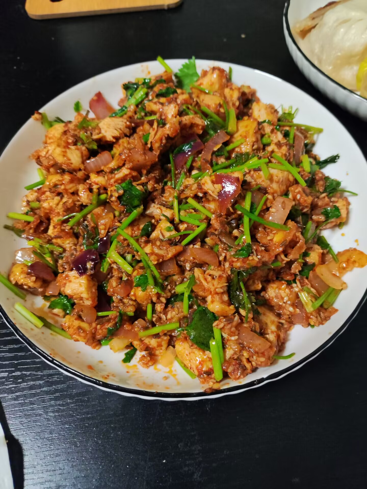
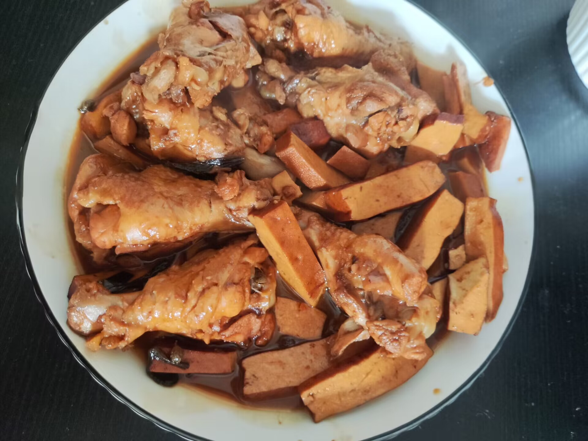

# 咸鱼暄今天吃什么

!!! abstract
    咸鱼暄学做饭！

    记录一下做法和用量，防止之后忘掉。

## 做饭日志

|  日期   | 食物 &nbsp;&nbsp;&nbsp;&nbsp;&nbsp;&nbsp;&nbsp;&nbsp;&nbsp;&nbsp; | 人数 &nbsp;&nbsp; | 材料和评价 |
| :-----: | :-------------: | :----: | :----- | 
| 23/7/22 | [咖喱虾仁](#咖喱) | 2 人份 | 失败 胡萝卜 1 根，土豆 2 个，约 20 只虾；100g 咖喱【略少】 |
| 23/7/22 | [蛋炒饭](#蛋炒饭) | 1 人份 | 一般 170g 米饭，2 个鸡蛋，2 片娃娃菜【水太多，下次别放】，火腿若干；小半根大葱，别的没记 |
| 23/8/2  | [西红柿肥牛](#西红柿肥牛) | 1 人份 | 失败 155g 肥牛，56g 金针菇，450g 西红柿， 水 560mL【太多，所以盐太多】； 葱 10g，蒜 2 瓣，生抽 10g，蚝油 10g，盐 6g【太多】，十三香 4g 【缺主食】 |
| 23/8/5  | [西红柿肥牛](#西红柿肥牛) | 2 人份 | 一般 260g 肥牛，60g 金针菇，950g 西红柿，水 280mL【下次干脆别放】；盐 8g，十三香 6g，生抽 20g，蚝油 15g【略淡】 |
| 23/8/6  | [咖喱鸡肉](#咖喱) | 2 人份 | 一般 土豆 200g，胡萝卜 200g，洋葱 100g，鸡胸肉 340g；  油 10g【不应该放】，咖喱 200g【由于水放的略多，因此咖喱 150g 不够，就放了 200g】 |
| 23/8/6  | [手撕包菜](#手撕包菜) | 2 人份 | 还行 包菜 处理前 500g，干辣椒 6 个【有点辣】，蒜 4 个；生抽 30g，盐 4g，醋 10g |
| 23/8/7  | [孜然炒肉](#孜然炒肉) | 2 人份 | 还行 牛肉 (丝) 220g【略少】，青椒 处理前 250g，生抽 20g，盐 10g，油 35g【略多】，孜然 6g |
| 23/8/8  | [凉拌鸡丝](#凉拌鸡丝) | 2 人份 | 还行 鸡胸肉 450g，麻油 10g【油够了，麻味不够】，生抽 20g，醋 10g，盐 6g，十三香 4g |
| 23/8/9  | [青椒炒蛋](#青椒炒蛋) | 2 人份 | 还行 鸡蛋 3 个，青椒 200g，8g 盐，45g 油【略多】，10g 麻油，10g 蚝油 |
| 23/8/12 | [咖喱肥牛](#咖喱) | 2 人份 | 还行 肥牛 160g【略少】，土豆 170g，胡萝卜 170g，咖喱 150g |
| 23/8/12 | 蒸米饭 | 2 人份 | 失败 125g 米，275mL 水【太多】，电饭锅快蒸 |
| 23/8/13 | [肥牛面](#肥牛面) | 2 人份 | 失败 1 颗浓汤宝【味道怪】，200g 肥牛，300g 面条，100g 豆芽，50g 金针菇 |
| 23/8/12 | [肉末粉条](#肉末粉条) | 2 人份 | 还行 麻婆豆腐调料 80g，红薯粉 (干) 100g【略少】，猪肉 (瘦肉馅) 250g，豆芽 100g，麻油 12g |
| 23/8/15 | [西红柿鸡蛋面](#西红柿鸡蛋面) | 2 人份 | 失败 西红柿 1kg，鸡蛋 4 个，面条 400g；盐 8g【略少】，十三香 4g【别放】，麻油 10g【不应该放麻油，放正常油】，生抽 20g，蚝油 10g【应该放点糖】 |
| 23/8/19 | [孜然鸡丁](#孜然鸡丁) | 2 人份 | 还行 鸡胸肉 400g，洋葱 100g，香菜 50g，油 30g，盐 12g，生抽 15g，鸡蛋 1 个，土豆淀粉（生粉） 20g，十三香 3g |
| 23/8/20 | [红烧翅根](#红烧翅根) | 2 人份 | 还行 翅根带骨 400g【有点少】，豆腐干 150g；1 包炖肉料，20g 油，10g 蚝油，10g 生抽，15g 老抽，2g 麻椒，5 个干辣椒，10g 盐，28g 冰糖，20g 料酒 |
| 23/8/20 | 蒸米饭 | 2 人份 | 还行 150g 米，220mL 水【还可以，可以再少一点点】，电饭锅蒸饭 |

## 饭们

### 咖喱*

比较成功

咖喱配一切！

目前做过的就是咖喱虾仁 / 咖喱鸡肉 / 咖喱肥牛，通用配料是土豆胡萝卜洋葱。

???+ note "一人份食材和用量"
    - 咖喱 75g，即 1.5 块
    - 胡萝卜 100g，大约半根
    - 土豆 100g，大约一个
    - 洋葱 50g
    - 肉类 100~200g (虾仁 / 肥牛 / 鸡胸肉)
    - 不需要其他调味料，可以按需加葱花香菜啥的

    > 不是很健康 除了肉类和主食 (如 米饭)，大概 550 kCal。

???+ note "过程"
    1. 懒惰，所以首先土豆和胡萝卜一起下锅煮。因此此前切块时土豆要比胡萝卜块大一点，因为土豆更容易熟。
        - 水只需要刚刚没过土豆和胡萝卜，之后水实在不够再补水。水少有助于放更少的咖喱，没有控制热量需求当我没说。煮到食材软烂，判断方式为筷子能插进去。
    2. 加入咖喱，水少所以两人份加 150g 咖喱是够的；水多了的话 150g 就不够了。咖喱完全化开之后就可以了。
    3. 洋葱看个人喜好，我喜欢生一点的所以出锅前才加。

    关于肉类：

    - 如果是 虾仁，可以和咖喱同时放进去，甚至更早一点，多煮一会儿没关系。
    - 如果是 肥牛，在完成 [通用处理](#肥牛) 之后，出锅前进去搅一搅确保熟了就行。
    - 如果是 鸡胸肉，在完成 [通用处理](#鸡胸肉) 之后，大概和咖喱一起扔进去，比较好熟。不过鸡胸多煮会儿也无所谓。

??? info "图图"
    23/7/22
    
    

    23/8/6

    

    23/8/12

    

### 蛋炒饭

TODO

???+ note "一人份食材和用量"

???+ note "过程"

??? info "图图"
    23/7/22
    
    

### 西红柿肥牛

需要优化 没搞明白这个东西吃它是为啥

这个东西的好处是，提供了一个通用的、比较健康的，搞出浓郁番茄汤的方案。

坏处是，这个东西配任何主食好像都不太合适。

???+ note "一人份食材和用量"
    - 西红柿 500g
    - 金针菇 随意，例如 50g
    - 肥牛 150g
    - 生抽 10g，蚝油 10g，盐 4g，十三香 6g 未确认，上次加水了所以有点淡，但是不该加水的

???+ note "过程"
    - 西红柿切小块下锅，什么都不放（不要放水！），煮到烂为止，得到 **浓郁番茄汤**！
    - 调味，其他东西扔进去煮就是了，当成番茄锅也没关系

??? info "图图"
    23/8/2

    

    23/8/5

    
    
### 手撕包菜

比较成功

???+ note "一人份食材和用量"
    - 包菜 处理前 500g
    - 油 / 麻油 20g 待确认能不能少点
    - 干辣椒 6 个
    - 蒜 4 瓣
    - 生抽 30g
    - 盐 4g
    - 醋 10g

???+ note "过程"
    - 手撕包菜，去掉硬的地方
    - 开火放油，放干辣椒和蒜，简单炒炒
    - 包菜倒进去炒，放盐、生抽调味
    - 出锅前放醋

??? info "图图"
    23/8/6 炒得有点久

    

### 孜然炒肉

比较成功

???+ note "一人份食材和用量"
    - 牛肉 (丝) 150g
    - 青椒 处理前 150g
    - 油 20g 待确认能不能少点
    - 盐 5g
    - 孜然 5g

???+ note "过程"
    - 牛肉丝提前解冻，提前半小时完成腌制（以下用料对应 100g 牛肉）：
        - 5g 酱油，5g 料酒，2g 盐，1g 糖，抓匀放冰箱
    - 青椒去头去籽，斜切
    - 开火倒油，放入孜然，油热放入牛肉丝，炒到略微变色放青椒，调味出锅

??? info "图图"
    23/8/7 牛肉有点碎了

    

### 凉拌鸡丝

比较成功

???+ note "一人份食材和用量"
    - 鸡胸肉 200g
    - 麻油 5g
    - 生抽 10g
    - 醋 10g
    - 盐 3g
    - 十三香 2g
  
???+ note "过程"
    - 鸡胸肉清水下锅煮熟；可以放点料酒去腥。为了熟得快可以切一切，最好平行着纤维方向切。
    - 确认煮熟后，用凉水冷却，按纤维方向撕开。
    - 和其余调料拌匀。

??? info "图图"
    23/8/8

    

### 青椒炒蛋

比较成功

???+ note "一人份食材和用量"
    - 鸡蛋 2 个
    - 青椒 100g
    - 油 / 麻油 共 20g 待确认能不能少点
    - 蚝油 5g
    - 盐 4g

???+ note "过程"
    - 青椒去头去籽，斜切
    - 打鸡蛋，中途放 2g 盐
    - 放油（大概 15g），炒鸡蛋，差不多熟了盛出来备用
    - 放油（大概 5g），炒青椒，差不多熟了把鸡蛋放进去炒炒，调味

??? info "图图"
    23/8/9

    

### 肥牛面

失败 浓汤宝应当作为提供风味而非提供咸味的工具。浓汤宝应该用来弄一锅汤，然后另外调味，否则味道就会比较怪。

但是至少知道了每个人大概吃 150~250g 面

???+ note "一人份食材和用量"

???+ note "过程"

??? info "图图"
    23/8/13

    

### 肉末粉条

比较成功 赞美调料包

???+ note "一人份食材和用量"
    - 麻婆豆腐调料 40g，即半包
    - 红薯粉 (干) 60g
    - 猪肉 (瘦肉馅) 120g
    - 豆芽 50g
    - 油 / 麻油 5g

???+ note "过程"
    - 红薯粉需要提前用冷水泡 4h，或者热水泡 30min
    - 先用调料里的油以及额外的油炒肉馅，可以加少许 (`<= 10g`) 料酒，变色捞出
    - 将调料放到锅里，放红薯粉，如果调料太少可以加水使得和红薯粉平齐
    - 红薯粉差不多煮熟（尝尝觉得能吃了）的时候，加入豆芽和猪肉炒
    - 确保都熟了就出锅

??? info "图图"
    23/8/13

    

### 西红柿鸡蛋面

失败 有点酸，应该放点糖；缺点盐

???+ note "一人份食材和用量"
    - 西红柿 500g
	- 鸡蛋 2 个
	- 面条 200g
	- 盐 5g 待确认
	- 油 10g
	- 生抽 20g
	- 蚝油 10g
	- 糖 4g 待确认

???+ note "过程"
    - 打鸡蛋，中途放 2g 盐
    - 放油（大概 10g），炒鸡蛋，差不多熟了盛出来备用
    - 西红柿切小块下锅，不要放水，煮到烂为止（提前冷冻西红柿可以易于去皮和加快煮烂进程），得到 **浓郁番茄汤**，放盐、糖、生抽、蚝油等调味
    - 将鸡蛋放进去一起炒，确认味道合适之后备用
    - [煮面](#煮面)
    - 混合

??? info "图图"
    23/8/15

    

### 孜然鸡丁

比较成功

???+ note "==两人份== 食材和用量"
    - 鸡胸肉 400g
	- 洋葱 100g
	- 香菜 50g
	- 油 50g
	- 盐 12g
	- 生抽 15g
	- 鸡蛋 1 个
	- 土豆淀粉（生粉） 20g
	- 十三香 3g
	- 芝麻 15g
	- 辣椒面 15g
	- 孜然粒 15g

???+ note "过程"
    1. 将洋葱切成约 1cm² 的小片备用，将香菜切为 2cm 长的段
    2. 在碗里放 20g 土豆淀粉，加入约 15~25 mL 的水，得到非牛顿流体！
    3. 鸡胸肉切 1.5cm 见方的丁，打入一个鸡蛋，加入上述用量的盐、生抽、十三香和第 2 步准备的淀粉水，抓拌均匀。可以多抓一会儿（例如一分钟）
    4. 在碗里放芝麻、辣椒面、孜然粒各 15g。起锅烧油（大约 30g），油热冒烟后，将油倒入碗中。注意分次倒、不断搅拌，否则芝麻可能会糊。放在旁边备用
    5. 起锅烧油，可以直接炒（会嫩一点），或者先炸再炒（听说会干香一点）：
        1. 炸： 还没试，下次试试
            - 加入一些油，下入鸡胸肉丁，但应让油没过鸡胸肉丁；油较少的话可以分次炸
            - 炸到表面变黄即可捞出；剩下的油可以以后继续用
            - 锅留底油，下入洋葱和鸡丁，香菜也可以炒一下也可以不炒；简单翻炒后加入第 4 步的油泼调料
            - 炒至确认熟透后出锅
        2. 炒：大约 10~20g 油，将鸡胸肉丁下入并不断翻炒，加入第 4 步的油泼调料；基本熟透之后下入洋葱，香菜也可以炒一下也可以不炒，确认熟透后出锅

??? info "图图"
    23/8/19

    

    

### 红烧翅根

比较成功

???+ note "==两人份== 食材和用量"
    - 鸡翅根 带骨 400g【有点少，可以加量】
	- 豆腐干 150g
	- 20g 油
	- 10g 蚝油
	- 10g 生抽
	- 15g 老抽
	- 20g 料酒
	- 10g 盐
	- 28g 冰糖【稍有点多】
	- 1 包炖肉料（超市卖的各种香料一包的，像茶包，不用拆开直接下锅煮，出锅扔掉就行）
	- 小葱 2 根
	- 姜 6 片
	- 2g 麻椒
	- 5 个干辣椒

???+ note "过程"
    1. 翅根凉水下锅，放 10g 料酒和 3 片姜片去腥，水开后捞出，尽可能沥干水分
    2. 与此同时，另烧一锅开水，第 5 步要用
    3. 锅擦干净，起锅烧油（约 20g），放入小葱、姜、干辣椒、麻椒，炒出香味
        - 麻椒可以不放或者少放，我喜欢麻，这个效果大概约等于哥老官重麻加麻
        - 这个干辣椒的量会带来稍微明显的辣味
    4. 将翅根倒入，炒一炒。
        - 油溅警告！ 第一步中翅根水分难以完全沥干，因此这里碰到油会发生油溅。
    5. 加入第 2 步烧的开水至刚刚没过翅根，加入用量所示的豆腐干、炖肉料、冰糖、盐、蚝油、生抽、老抽，以及 10g 料酒。
        - 豆腐干也可以晚点加，反正都是熟的
    6. 盖上锅盖，中小火炖煮，直到汤汁高度少于原先的一半。这个过程大概耗时半小时。
    7. 确认鸡翅根熟透（肉软烂易脱骨，与骨头连接处无红色血丝），且汤汁收到期望的浓度（可以尝一尝）时，即可关火出锅。
        - 出锅前扔掉炖肉料，也可以挑出姜、辣椒、麻椒等，这样拌饭方便。    

??? info "图图"
    23/8/20

    

    

## 通用处理方式

### 肥牛

开水下锅，放点料酒，迅速捞出来，能煮出来很多浮沫之类的东西。不能久，不然会老。

其实不处理，之后直接用好像也没多大问题。

### 鸡胸肉

切块，我的 340g 鸡胸肉切块后用了大概 20g 料酒和 10g 生抽简单腌制了十分钟左右。

### 煮面

- 面条冷水下锅，刚开始可以搅拌防止粘底。
- 视面条种类和个人对软硬度的喜好，重复以下操作 0~2 次：
    - 水沸腾后，加入一碗凉水
- 水沸腾后捞出

<!-- 蔬菜和菌类 -->
*[洋葱]: 约 40 kCal / 100g
*[胡萝卜]: 约 30 kCal / 100g
*[青椒]: 约 20 kCal / 100g
*[西红柿]: 约 15 kCal / 100g
*[包菜]: 约 25 kCal / 100g
*[豆芽]: 约 50 kCal / 100g
*[金针菇]: 约 30 kCal / 100g

<!-- 淀粉类 -->
*[米饭]: 约 120 kCal / 100g 米饭；340 kCal / 100g 生米
*[米]: 约 120 kCal / 100g 米饭；340 kCal / 100g 生米
*[大米]: 约 120 kCal / 100g 米饭；340 kCal / 100g 生米
*[土豆]: 约 81 kCal / 100g
*[面条]: 约 300 kCal / 100g
*[红薯粉]: 约 310 kCal / 100g (泡发前)

<!-- 肉类 -->
*[鸡蛋]: 约 140 kCal / 100g；80 kCal / 个
*[虾仁]: 约 50 kCal / 100g
*[肥牛]: 约 250 kCal / 100g
*[牛肉]: 约 110 kCal / 100g
*[猪肉]: 约 180 kCal / 100g
*[鸡胸肉]: 约 120 kCal / 100g
*[鸡翅根]: 约 210 kCal / 100g；带骨质量减半计算

<!-- 豆制品 -->
*[豆腐干]: 约 200 kCal / 100g

<!-- 调料 -->
*[油]: 约 900 kCal / 100g
*[麻油]: 约 900 kCal / 100g
*[咖喱]: 百梦多咖喱 约 530 kCal / 100g
*[麻婆豆腐调料]: 约 380 kCal / 100g
*[芝麻]: 约 540 kCal / 100g
*[孜然]: 约 380 kCal / 100g
*[香菜]: 约 30 kCal / 100g
*[辣椒面]: 约 400 kCal / 100g
*[冰糖]: 约 400 kCal / 100g
