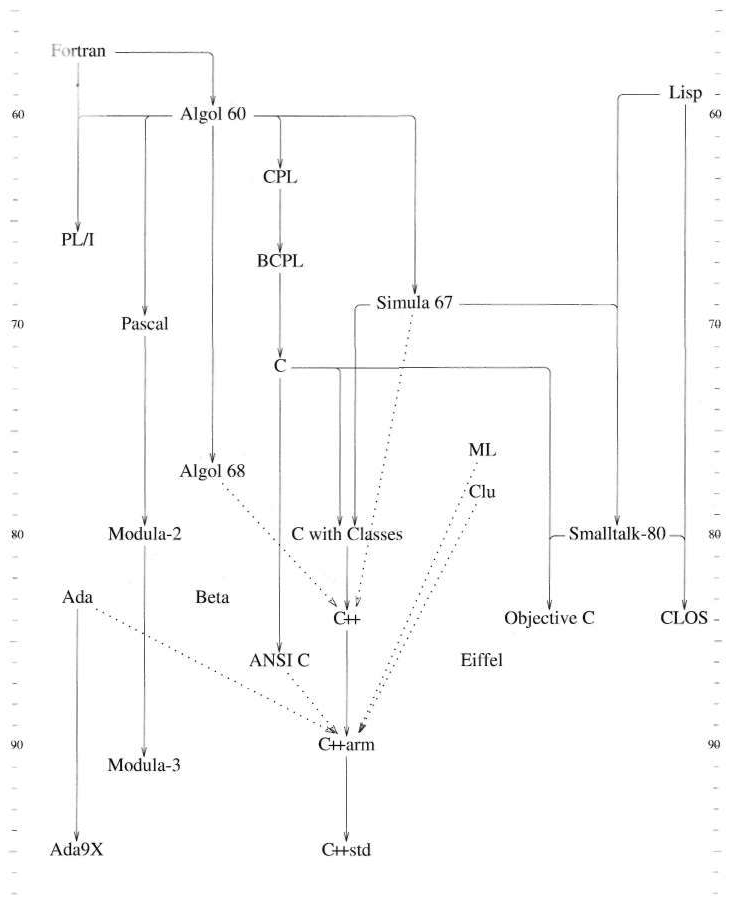
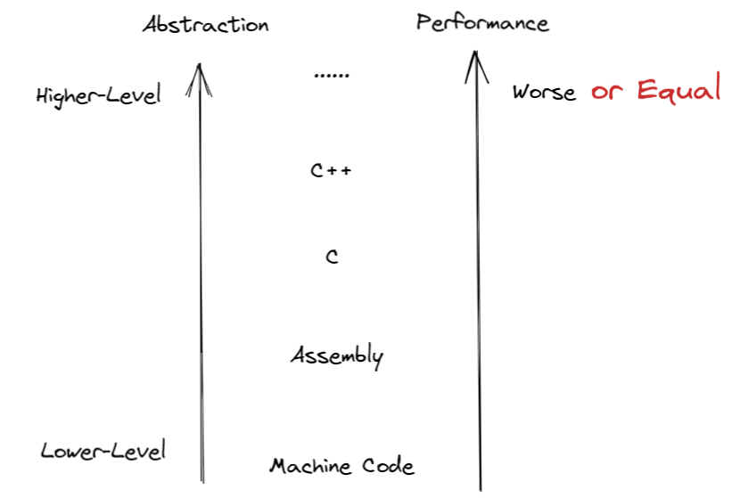
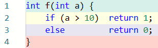
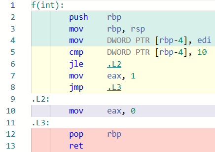

<style type="text/css">
p { text-align: left; }
.reveal section {
  text-align: left;
}
code.basic.hljs { font-size:150%; line-height: 140%; }
</style>

# 探索 C++

---

# 0 写在前面

===

### 关于课程

- 浙江大学计算机学院朋辈辅学活动
- 「试讲」
    - 发现问题（内容 / 逻辑）
    - 互动和答疑
    - 比正式课长最多半小时
    - 进度大约快一周
- 只有正式课的录播会上传 Bilibili
- 课程笔记会放在我的笔记本

===

### 关于我

- 笔记本: https://xuan-insr.github.io/
- Bilibili: 咸鱼暄

===

### 动机

- Push 自己学习和总结 C++
    - 逻辑
    - 详尽
- 「自举」

===

### 内容

在 C 的基础上学习 C++，包括 C++20 (也许还会有 C++23) 及以前的：
- 大多数 language features
- 一部分重要的 library features

</br></br>

这个学期内肯定讲不完！但是会优先讲解基础内容

但会 **很少包括** 代码设计、best practice 等应用层面的内容，因为我也不会！

===

### 适合谁

- 对 C++ 感兴趣而且希望有更多了解的同学
- 面试会被问到很多 C++ 的同学

===

### 不适合谁

内容以 C 为基础，且追求逻辑和详尽，而且会持续较长时间，因此 **不适合**：

- 没学过 C 语言的同学
- 学过学校 OOP 或者 CS 106L 等课程的同学（可以直接看我的笔记本）
- 只是想通过 OOP 或者在该课程拿个高绩点的同学（不如直接去 OOP 朋辈辅学）

---

# 1 C++ 的诞生

</br></br>

C++ 他爹：Bjarne Stroustrup

===

Simula 提供 **类 (class)** 、协程和广泛深入的类型检查

「整个程序更像是若干小程序的组合，因而更容易写、理解和排除错误。」

</br></br>

然而性能很差

「在没有合适工具的情况下绝不去冲击一个问题。」

===

「合适的工具」：

1. 类似 Simula 的对程序组织的支持。
2. 编译、链接、运行应当像 BCPL 一样高效。
3. 应当保证良好的可移植性。

</br></br>

C 语言灵活（通用）、高效，各种平台都有 C 编译器，因此可移植。

===



===

「希望 C++ 一方面能够像 C 一样接近机器，另一方面又能接近需要解决的问题。」

随着抽象程度的增加，程序的性能很有可能受到损失。



C++ 的期望则是，把握这里的「or equal」，即在不损失性能的前提下提供必要的数据抽象。

===

- 1981/12: 设计了 C with Classes 及预处理程序 Cpre，来将 C with Classes 处理成 C

- 1982: C with Classes 是成功的，但是不完全成功

===

从设计一个工具到设计一门语言

</br></br>

C++ 不能带有特别复杂的编译的或运行时的 feature，同时必须能使用原来的链接器，并且产生的代码一开始就要和 C 的一样高效。

===

- 1984/8: Cfront (Release 1.0) - 一个完整的编译器前端，负责对 C++ 程序进行语法和语义的分析和检查
    - 源代码会先通过预处理器 Cpp 完成预处理，然后交给 Cfront 检查并生成 C 代码。
- 1989: Release 2.0
- 1991: Release 3.0
- 标准化: C++98, C++03, C++11, C++14, C++17, C++20

---

# 2 编程范式

</br></br>

类 (class) 的概念来自 **面向对象程序设计 (OOP, Object-Oriented Programming)**

OOP 是一种 **编程范式 (Programming Paradigm)**

===

编程范式说明了编程语言的不同特点
- 代码组织方式
- 运行时模型
- 语法风格

</br></br>

OOP 就是按照「代码组织方式」分类的一种编程语言的特点

===

「按代码组织方式分类」

</br></br>

- 机器码 (machine code)
- 汇编语言 (assembly)
    - 助记符 (mnemonics) 和 labels
- 非结构化的 (non-structured) 编程语言
    - BASIC, Fortran 等

===





汇编中并不存在直接完成「分支」的语言结构，而是通过 **比较** 和 **跳转** 的组合来完成相应的效果的。

===

早期的 BASIC 等编程语言中即使存在表示分支、循环等含义的关键字，但是由于不存在 **代码块** 之类的结构，因此分支、循环之类的控制流仍然需要通过 `jmp` 或者 `goto` 等含义类似的语句来完成：

```basic
10 let a = 6
20 let b = 7
30 if a < b goto 60
40 print(a)
50 goto 70
60 print(b)
70 end
```

上面的代码中，虽然有 `if`，但是为了完成分支的效果，仍然需要 `goto` 来帮助。

这是因为，在这种语言中的代码是以 **单条代码** 为单位的，而不是像 C/C++ 中以 **语句块** 为单位的。

===

```c++
a = 6;
b = 7;
if (a < b) {
    print(b);
} else {
    print(a);
}
```

C 和 C++ 等编程语言都是 **结构化编程语言 (structured programming languages)** ，因为它们有诸如分支、循环、语句块、函数之类的语言结构。

「结构化编程」就是一种编程范式。

===

## 抽象

</br></br>

从非结构化到结构化编程，编程语言从「更贴近计算机行为」向「更接近人类思维」的方向迈了一步。

</br></br>

这就是我们所说的 **抽象 (abstraction)** 。

===

计算机的行为是具体的、与机器和环境高度相关的

而人类思维是更加普遍的、远离细节的

</br></br>

「抽象」的好处就是能够提升程序或者编程语言的通用性、易读性、易写性、可移植性

坏处是可能会损失一些更加精细的控制，也有可能会影响到编译时或运行时的性能

===


===

结构化编程在上世纪 70 年代末 80 年代初被广泛认知；90 年代开始广泛认识 OOP

</br></br>

C++ 支持的 泛型编程 (generic programming) 也是一种编程范式