<link rel="stylesheet" href="custom_light.css">
<link rel="stylesheet" href="../custom_light.css">
<link rel="stylesheet" href="custom.css">
<link rel="stylesheet" href="../custom.css">

# 探索 C++

<br>

## Week 2 - 类(I) 定义、成员、构造、析构

---

## 4.1 类的定义

===

我们在上一节已经看到了类的定义的一些具体例子，例如：

```c++
class Textbox : public Shape {
public:
    char* text;
    int penwidth;

    void do_draw() {
        int old_penwidth = get_penwidth();
        set_penwidth(penwidth);
        // 画出文本框和文本内容
        set_penwidth(old_penwidth);
    }
}
```

===

在 C++ 中，每个类的定义 (class definition) 引入一个新的类型。

因此，有了上面的定义，我们就可以用它来声明一个变量，如 `Textbox tb;` 声明并定义了一个类型为 `Textbox`，名为 `tb` 的变量。

<br>

<div class="fragment">

在 C++ 中，用类来定义变量时，不必像 C 语言那样带有 `struct` 关键字。

即，如果有 `class Foo` 或者 `struct Bar` 的定义，那么 `Foo x;`, `class Foo x;`, `Bar b;`, `struct Bar b;` 都是合法的声明语句。

</div>

===

类的定义：

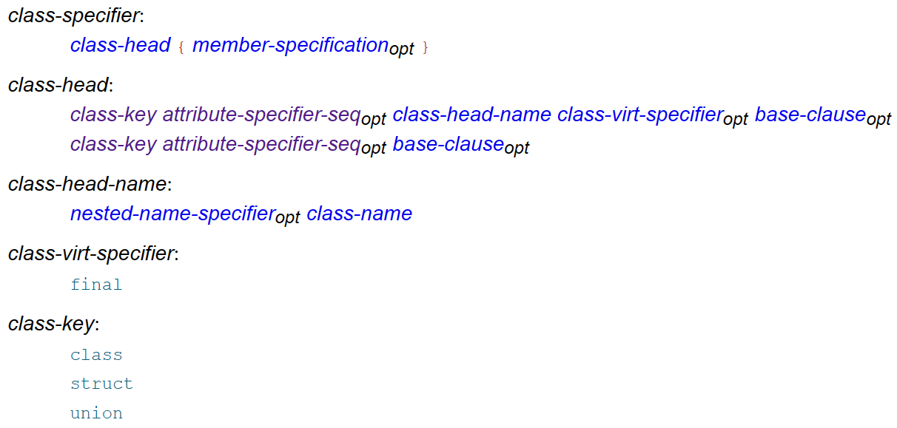

---

## A.1 声明与定义

声明将名字引入或重新引入到程序中。

**定义是声明的一种** ，指的是那些引入的名字对应的实体足以被使用的声明。

===

[[basic.pre#5](https://timsong-cpp.github.io/cppwp/basic.pre#5)]: Every name is introduced by a declaration

[[basic.def#2](https://timsong-cpp.github.io/cppwp/n4868/basic.def#2)]: Each entity declared by a declaration is also _defined_ by that declaration unless:

- it declares a function without specifying the function's body
- it contains the extern specifier or a linkage-specification (`extern "C" {}`) and neither an initializer nor a function-body,
- ...

===

「重新引入」

```c++
extern int i;
extern int i;

int f(int);
int f(int x);
```

上面的例子是合法的。它们只是 `i` 和 `f` 的声明而非定义。

===

下面的语句都是定义：

```c++
int a;                          // defines a
extern const int c = 1;         // defines c
int f(int x) { return x+a; }    // defines f and defines x
struct S { int a; int b; };     // defines S, S​::​a, and S​::​b
enum { up, down };              // defines up and down
S anS;                          // defines anS
```

---

## 4.2 类的成员

===


===

member-specification 说明了类的成员。其结构如下：

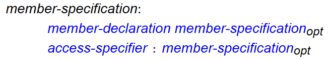

其中 member-declaration 是成员的声明，而 access-specifier 是 `private`, `public`, `protected` 之一

===

成员可以包括成员变量、成员函数，也可以（嵌套的）类、枚举等，还可以包括声明类型的别名（如 `typedef` 和 `using`）等

```c++
class Foo {
public:
  class Bar {
    // ...
  };
  // ...
};

Foo::Bar b;
```

===

### Type Alias

C++11 引入了 `using` 来声明类型别名，它的用途和 `typedef` 类似，如 

```c++
typedef struct arraylist_* arraylist;
``` 

可以写成 

```c++
using arraylist = struct arraylist_ *;
```

===

类型别名的声明也可以是类的成员，其作用域是类的作用域，同样受 access-specifier 的影响。例如：

```c++
struct Foo {
    using elem = int;
    elem x;     // OK, x has type int
    elem add(elem v) { x += v; return x; }
private:
    using type = char;
    type c;     // OK, c has type char
};

// elem y;      // Error: unknown type name 'elem'
Foo::elem z;    // OK, z has type int
// Foo::type c; // Error: 'type' is a private member of 'Foo'   
```

===

`using` 被引入是为了支持模板。我们在讲到模板的时候再来讨论这些问题。

===

类的成员函数可以在类内直接给出定义，也可以在类内只声明，在类外给出定义；这不影响成员函数的 access-specifier：

```C++
class Foo {
    int x = 0;
    void foo(int v) { x += v; }
    void bar(int v);
};

void Foo::bar(int v) { x += v; }

int main() {
    Foo f;
    f.bar(1);  // Error: 'bar' is a private member of 'Foo'
}
```

===

### `this` 指针

```C++
class Foo {
    int x = 0;
    void foo(int v) { x += v; }
    void bar(int v);
};

void Foo::bar(int v) { x += v; }
```

C++ 早期会被编译成 C 语言，然后再编译成汇编。

上面代码中的 `Foo::bar` 函数，如何编译成 C 中的函数呢？

===

每个成员函数都会被视为有一个 implicit object parameter，它即是 calling object。

而在成员函数的函数体中，`this` 表达式的值即是 implicit object parameter 的地址。

===

成员函数的函数体中，访问任何成员时都会被自动添加 `this->`

例如 `void Foo::bar(int v) { x += v; }` 

其中的 `x += v;` 实际是 `this->x += v;`。

===

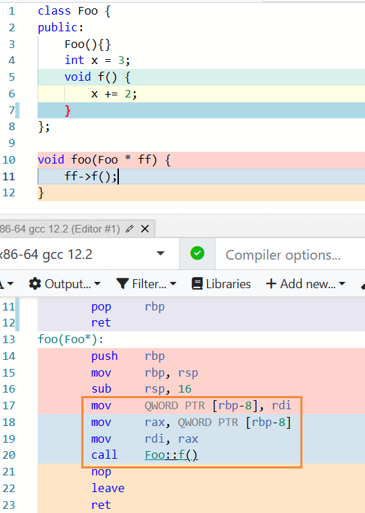

---

## A.2 inline 函数

===

```c++
struct User {
private:
    int id, age;
    char* password;
public:
    bool checkPassword(char* pw); // check if pw == password
    void setAge(int v) {
        if (v >= 0)
            age = v;
    }
    int getAge() { return age; }
    // ...
};
```

===

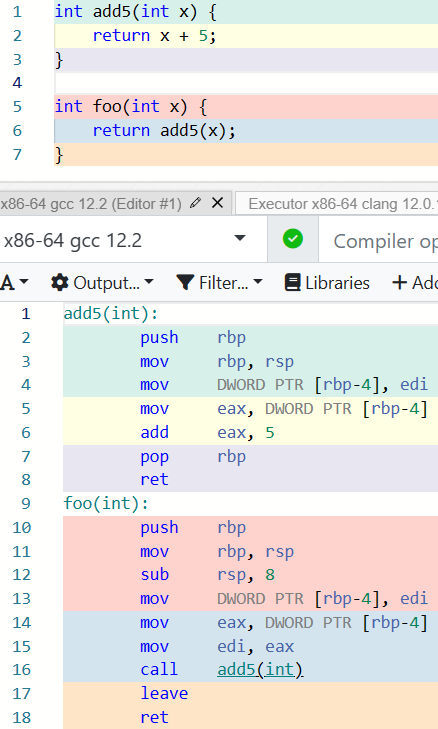

===

不应当因为封装性而带来额外的性能开销

===

### 内联替换 (inline substitution)

```c++
void swap(int *a, int *b) {
    int tmp = *a;
    *a = *b;
    *b = tmp;
}

void foo() {
    // ...
    swap(&a, &b);
    // ...
    swap(&x, &y);
    // ...
}
```

===

```c++
void foo() {
    // ...
    int tmp = a;
    a = b;
    b = tmp;
    // ...
    tmp = x;
    x = y;
    y = tmp;
    // ...
}
```

===

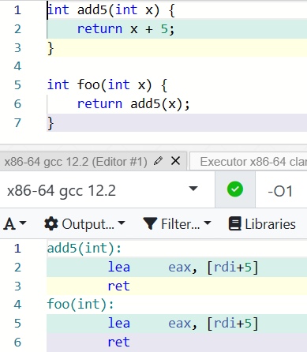

===

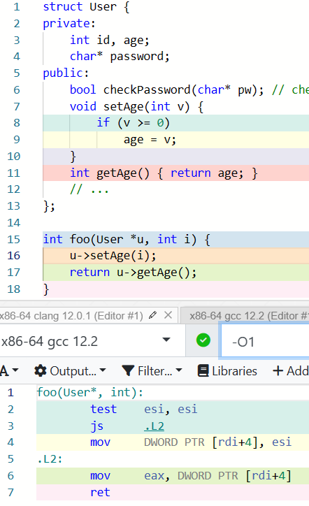

===

那么，什么样的函数会被内联呢？

<div class="fragment">

在 C with Classes 中，只有那些函数体写在类的定义中的成员函数才可能会被内联。

</div>
<div class="fragment">

在后来的 C++ 中，`inline` 关键字被引入；它用在函数声明中，例如

`inline int foo(int x) { return add5(x); }`。

向编译器表明一个 **建议** ：这里应该优先考虑使用内联替换而非通常的函数调用

</div>
<div class="fragment">

编译器通常忽略这个建议。

</div>

===

内联会在 **每处** 调用被展开，因此如果被内联的函数非常大，则会导致生成的目标代码很大，这会带来内存紧张或者局部性问题；这也可能会对性能产生一定影响。

===

内联函数是 C 语言中 function-like macros 的一个好的替换。

「允许用语言本身表达所有重要的东西，而不是在注释里或者通过宏这类黑客手段」

<div class="fragment">

类型检查、作用域、访问控制、括号。

</div>

===

Don't add `inline` just because you think your code will run faster if the compiler inlines it. 

... 

Generally, the compiler will be able to do this better than you.

===

C++17 开始，`inline` 还被用于变量。

实际上在现在的 C++ 中，`inline` 比「让一个函数被内联」更重要的作用在于，帮助实现 header-only 的库。

---

## 4.3 构造函数

===

构造函数 (constructor) 是一种特殊的成员函数，用于初始化该类的对象。

构造函数 constructor 也时常被简写为 ctor 或者 c'tor 等。

===

「使程序员能够建立起某种保证，其他成员函数都能依赖这个保证」

```c++ linenums="1"
class Container {
    elem* val;
    // ...
public:
    Container() {
        val = nullptr;
    }
    // ...
};
```

「保证」：即 `val` 的值要么是 `nullptr`，要么是其他成员函数赋的值，而不会是个随机的值。

===

这样，就可以使用 `Container c = Container();` 构造一个对象了。

<br>

不严谨地说，`Container();` 会返回一个构造出的无名对象，上面的语句将名字 `c` 绑定到了对应的无名对象上。

<br>

为了代码更加简洁紧凑，C++ 允许更加简洁的写法：`Container c;`。

===

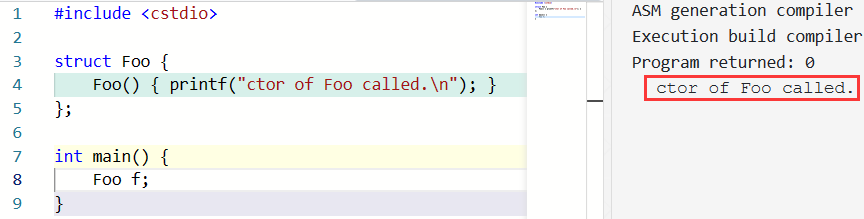

===

由于定义一个对象时需要用到构造函数，因此如果要用的构造函数是 private 的，对象就无法被构造：

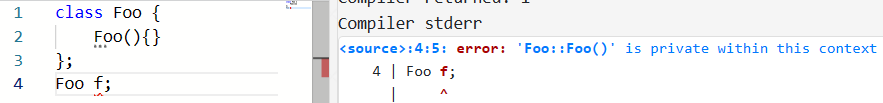

===

### 构造函数的参数

下面的构造函数允许用户传递一个初始大小，然后直接开一个对应大小的空间：

```c++ linenums="1"
class Container {
    elem* val;
    // ...
public:
    Container(unsigned size) {
        val = (elem*)malloc(sizeof(elem) * size);
        // ...
    }
    // ...
};
```

===

可以使用 `Container c2 = Container(64);` 构造一个自定义大小的容器。

同样地，C++ 允许更加简洁的写法：`Container c2(64);`。

<br>

在 C++ 中，声明变量时的 **初始化器 (initializer)** 除了类似 `int a = 4;` 的 `= initializer-clause` 之外，还有类似 `int a(4);` 的 `( expression-list )`。

===

#### most vexing parse

如果无参地构造，则不需要写出括号；如果有参构造，则将参数写在括号中。为什么呢？

```c++
Container c1();
```
<div class="fragment">

```c++
void func();
```

</div>

===

### 动态内存分配

构造函数存在的意义是给该类的每个对象提供一定的「保证」

C++ 通过确保每个对象都执行过构造函数来提供这一保证

<div class="fragment">

```c++
Container *p = (Container *)malloc(sizeof(Container));
```

</div>

===

C++ 引入了新的用于创建动态对象的操作符 `new` 以及对应的用来回收的 `delete`。

`new` 表达式可以用来创建对象或者数组：`int * p1 = new int; int * pa = new int[n];`。

===

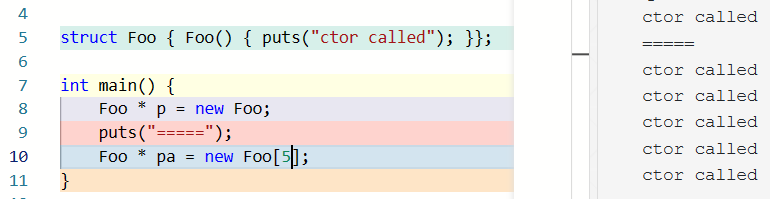


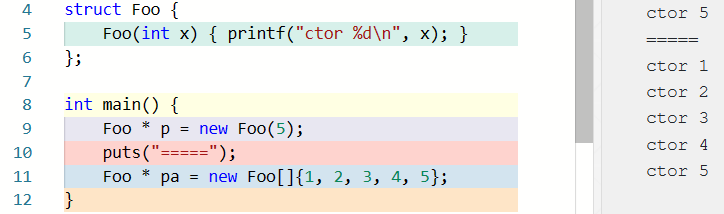

===

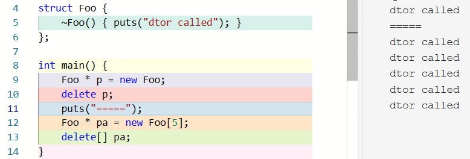

===

如果 `p` 在 `new` 的时候创建的是单个对象，则应该用 `delete p;` 的形式 (single-object delete expression) 回收

如果 `p` 在 `new` 的时候创建的是数组，则应该用 `delete[] p;` (array delete expression) 的形式回收

否则是 **未定义行为 (UB, undefined behavior)**

---

## A.3 函数默认参数与函数重载

===

这样的构造函数允许用户传递一个初始大小，然后直接开一个对应大小的空间：

```c++ linenums="1"
class Container {
    elem* val;
    // ...
public:
    Container(unsigned size) {
        val = (elem*)malloc(sizeof(elem) * size);
        // ...
    }
    // ...
};
```

===

假如我们希望用户既可以给定大小，也能够在不知道要开多大的情况下使用一个默认大小，怎么办呢？

<div class="fragment">

C++ 在函数声明中支持 **默认参数 (default arguments)** ，用来允许函数可以以省略末尾的若干参数的方式调用：

```c++
void point(int x = 3, int y = 4);
 
point(1, 2); // calls point(1, 2)
point(1);    // calls point(1, 4)
point();     // calls point(3, 4)
```

</div>

===

默认参数必须出现在末尾的若干个参数中。

这个要求的合理性容易理解：假如没有这个要求，那么如果有 `void point(int x = 3, int y);`，则 `point(4);` 的含义是容易让人迷惑的。

===

因此，`Container` 类的构造函数可以写成：

```c++ [5]
class Container {
    elem* val;
    // ...
public:
    Container(unsigned size = 512) {
        val = (elem*)malloc(sizeof(elem) * size);
        // ...
    }
    // ...
};

===

可以使用 `Container c1;` 构造一个默认大小 (512) 的容器，或者用 `Container c2(64);` 构造一个自定义大小的容器了。

前者实际上是 `Container(512)`，而后者是 `Container(64)`。

===

那么，假如我希望根据是否传入某个参数来选择不同的构造函数，怎么办呢？例如我们希望 `Container` 的构造函数长这样：

```c++
Container::Container(unsigned size, elem initVal) {
    val = (elem*)malloc(sizeof(elem) * size);   // allocate memory
    for (unsigned i = 0; i < size; i++) {       // set init values
        val[i] = initVal;
    }
}
```

但是！我们希望如果没有传入 `initVal`，就不要做那个 set init values 的循环怎么办呢？

===

C++ 支持这样的操作，这被称为 **函数重载 (function overloading)** ：

```C++
class Container {
    elem* val;
    // ...
public:
    Container() { val = nullptr; }
    Container(unsigned size) {
        val = (elem*)malloc(sizeof(elem) * size);
    }
    Container(unsigned size, elem initVal) {
        val = (elem*)malloc(sizeof(elem) * size);
        for (unsigned i = 0; i < size; i++) {    
            val[i] = initVal;
        }
    }
};
```

===

这样，当我们使用 `Container c1, c2(4), c3(6, 2);` 定义三个对象时，它们会分别使用无参、一个参数和两个参数的构造函数：

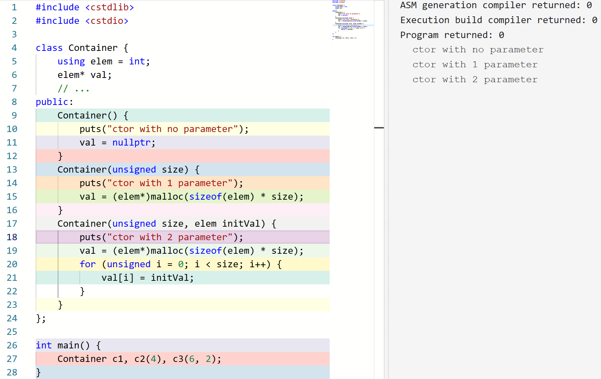


===

不仅是构造函数支持重载，其他的成员函数或者独立的函数也支持重载。例如：

```c++
double abs(double);
int abs(int);

abs(1);             // calls abs(int);
abs(1.0);           // calls abs(double);
```

===

如果一个名字引用多个函数，则称它是 overloaded 的。当使用这样的名字的时候，编译器用来决定使用哪个；这个过程称为 **重载解析 (overload resolution)** 。

<div class="fragment">

简单来说，重载解析首先收集这个名字能找到的函数形成候选函数集 (candidate functions)

</div>
<div class="fragment">

然后检查参数列表来形成可行函数集 (viable functions)

</div>
<div class="fragment">

然后在可行函数集中按照一定的规则比较这些函数

</div>
<div class="fragment">

如果 **恰好** 有一个函数 (best viable function) 优于其他所有函数，则重载解析成功并调用此函数；否则编译失败。

</div>

===

「规则」比较复杂，但是一个简单的例子是，不需要类型转换的比需要的要好：

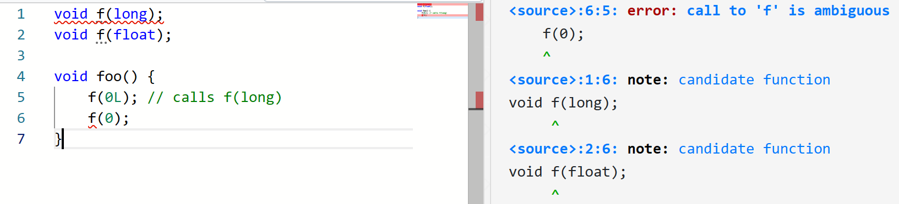

===

也是因此，两个只有返回值类型不同的函数不是合法的重载，因为调用时没有办法完成重载解析：

```c++
int f(int a);
void f(int a);  // error: functions that differ only in 
                // their return type cannot be overloaded
```

===

```c++
void f(int i = 1);
void f();

void foo() {
    f(1);   // OK, call the first one
    f();    // Error: ambiguous
}
```

===

### `nullptr`

为了类型安全，C++ 不允许 `void*` 隐式转换到其他指针类型。因此，如果我们将 `NULL` 定义为 `(void*) 0`，那么 `int * p = NULL;` 会引发编译错误：

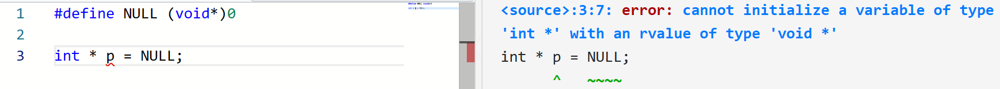

（这是 C++ 与 C 不兼容的例子之一。）

===

既然 C++ 不允许将 `(void*) 0` 当空指针，那么我们用什么表示空指针呢？

在 C++11 之前，空指针常量 (null pointer constant) 是值为 0 的整型字面量。

因此，如果我们将 `NULL` 定义为 `0`，则 `int * p = NULL;` 即 `int * p = 0;` 是合法的（赋值成其他整数是不合法的）。

===

```c++
void f(int *);
void f(int);

#define NULL 0
f(NULL);   // ==> f(0) , so f(int) is called
```

===

因此，C++11 引入了 `nullptr` 来表示空指针常量。这样就解决了上面的问题：

```c++
void f(int *);
void f(int);

f(nullptr);   // f(int *) is called
```

因为 null pointer constant 可以转换到任意指针类型

===

当然，为了兼容，值为 0 的整型字面量仍然是空指针常量。

===

既然有函数重载，为什么要有默认参数呢？

---

## 4.3 构造函数 (Cont.)

===

### implicitly-declared default constructor

我们称一个能够无参调用的构造函数是 default constructor。即，它不接收任何参数，或者所有参数都有默认值。

===

有一个问题是，我们在讲构造函数之前的代码里都没有写构造函数，但是它们也能正常编译运行

<div class="fragment">

对于一个类，如果用户没有提供任何构造函数，则编译器会自动为这个类创建一个 public 的 implicitly-declared default constructor，它不接收任何参数，也什么都不做。

如果有任何用户提供的构造函数，则 implicitly-declared default constructor 是 deleted 的。

deleted 的函数不能被调用。

</div>

===

不过，如果用户提供了构造函数，他仍然可以用 `ClassName() = default;` 来引入默认的构造函数。

用户还可以通过 `ClassName() = delete;` 显式地将 default constructor 设置成 deleted 的。

===

### member initializer lists

```c++ linenums="1"
class User {
    int id, age, failTimes;
    char* password;
public:
    User(int id, int age, char* pw) {
        this->id = id;
        this->age = age;
        failTimes = 0;
        password = copyStr(pw); // assume that `copyStr` gets a string 
                                // and allocate some space and copy it
    }
    // ...
};
```

===

```c++ linenums="1"
class User {
    int id, age, failTimes;
    char* password;
public:
    User(int id, int age, char* pw) : id(id), age(age), 
                    failTimes(0), password(copyStr(pw)) {}
    // ...
};
```

构造函数定义中形如 `: member(expr), member(expr)` 的东西叫做 member initializer lists，用来指明成员变量的初始化器 (initializer)。

这些初始化会在构造函数的函数体执行之前完成。

===

在一些情况下，member initializer lists 是必要的。例如：

```c++ linenums="1"
class Point {
    int x, y;
public:
    Point(int x, int y) : x(x), y(y) {}
};

class Circle {
    Point c;
    int r;
public:
    Circle(int cx, int cy, int r) : c(cx, cy), r(r) {}
};
```

===

C++ 规定，在构造函数的函数体执行之前，所有参数要么按照 member initializer lists 的描述初始化，要么以默认方式初始化。

而对于类的对象，「默认方式初始化」意味着使用 default constructor 构造。

然而，`Point` 类并没有 default constructor，因此如果 member initializer lists 没有指明 `Point` 类的初始化方式，就会出现编译错误：

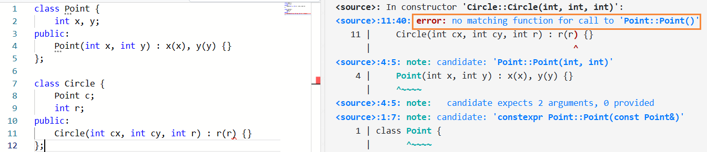

===

在后面的章节中，我们还会看到更多 member initializer lists 是必要的的情况。

===

如果构造函数的声明和定义分离，则 member initializer lists 应当出现在构造函数的定义中。

===

member initializer list 的顺序不影响成员被初始化的顺序，它们按照在类定义中的顺序初始化。例如：

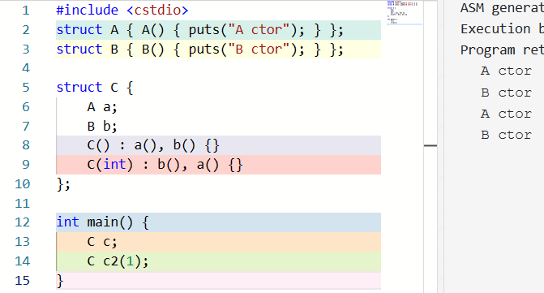

===

#### delegating constructor

member initializer list 可以将构造委托给同一类型的另一个构造函数，做出这一委托的构造函数称为 delegating constructor

如果这样的话，member initializer list 应当只包含这一个项目

目标构造函数由重载解析选取，其运行结束后，delegating constructor 的函数体被执行

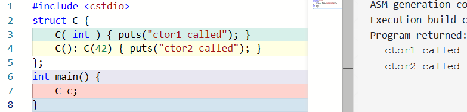

===

一个构造函数不能直接或间接地被委托给自己

```c++
struct C {
    C( int ) { }                  // #1: non-delegating constructor
    C(): C(42) { }                // #2: delegates to #1
    C( char c ) : C(42.0) { }     // #3: ill-formed due to recursion with #4
    C( double d ) : C('a') { }    // #4: ill-formed due to recursion with #3
};
```

===

### default member initializer


```c++ linenums="1"
class User {
    int id, age, failTimes;
    char* password;
public:
    User(int id, int age, char* pw) : id(id), age(age), 
                    failTimes(0), password(copyStr(pw)) {}
    User(int id, int age) : id(id), age(age), 
                    failTimes(0), password(nullptr) {}
    User(int id) : id(id), age(-1), failTimes(0), password(nullptr) {}
    // ...
};
```

===

```c++ linenums="1"
class User {
    int id, age = -1, failTimes = 0;
    char* password = nullptr;
public:
    User(int id, int age, char* pw) : id(id), age(age), 
                                      password(copyStr(pw)) {}
    User(int id, int age) : id(id), age(age) {}
    User(int id) : id(id) {}
    // ...
};
```

如果一个成员变量同时被 member initializer list 指定且有 default member initializer，按前者执行，后者被忽略。

===

default member initializer 只允许 `brace-or-equal-initializer` 即 `= something` 或者 `{ something }`，而不允许用括号的形式。

也就是说，含 default member initializer 的成员可以形如 `Foo f = Foo(...);`，但不能形如 `Foo f(...);`：

```c++ linenums="1"
class Point {
    int x, y;
public:
    Point(int x, int y) : x(x), y(y) {}
};

class Circle {
    // Point c(0, 0);       // error
    Point c = Point(0, 0);  // OK
    int r;
public:
    Circle(int cx, int cy, int r) : c(cx, cy), r(r) {}
};
```

---

## 4.4 析构函数

===

```c++ linenums="1"
class Container {
    elem* val;
    // ...
public:
    Container(unsigned size) {
        val = (elem*)malloc(sizeof(elem) * size);
        // ...
    }
    // ...
};
```

`malloc` 出来的空间需要我们在不用的时候手动 `free` 来回收。什么时候完成这个回收呢？

===

C++ 引入了 **析构函数 (destructors)** ，在每个对象的生命周期结束的时候被调用，大多数情况被用来释放对象在运行过程中可能获取的资源，例如释放申请的内存、关闭打开的文件等。

析构函数形如 `~class-name()`，其中 `~` 也被用作取反运算符，这里来表示「与构造相反」的含义，即析构。

```c++ linenums="1"
class Container {
    elem* val;
    // ...
public:
    Container(unsigned size) {
        val = (elem*)malloc(sizeof(elem) * size);
        // ...
    }
    ~Container() {
        free(val);
    }
};
```

===

析构函数的参数列表永远是空的。显然，析构函数是无法重载的。

析构函数和构造函数一样，如果某个类没有 user-declared destructor，编译器会自动生成一个 public 的 implicitly-declared destructor。因此，当类的成员中没有什么需要释放的资源时，我们就不需要写析构函数了。

析构函数 destructor 也经常被简写为 dtor 或 d'tor 等。

===

当然，自 C++11 起，我们仍然可以通过 `= default;` 或者 `= delete;` 来生成默认的析构函数，或者删除 implicitly-declared destructor。例如：

```c++
class Foo{
private:
    ~Foo() = default;
};
```

这里我们告知编译器在 `private` 范围内显式生成了默认的构造函数。

===

```c++
struct Foo {
    ~Foo() = delete;
};
```

这里我们将 implicitly-declared destructor 标记为 deleted。

===

如果 `Foo` 的析构函数是 deleted 的，或者在当前位置不可访问 (如当前在类外，但是析构函数是 private 的)，那么类似 `Foo f;` 的全局变量、局部变量或者成员变量定义是非法的。

但是，这种情况下，可以通过 `new` 来创建一个动态的对象，因为这样创建的对象并不隐式地在同一个作用域内调用析构函数。

===

### 动态内存分配

`delete` 和 `delete[]` 时，析构函数会被调用：


---

## 4.5 构造和析构的时机和顺序

===

对于一个类对象，它的 **生命周期 (lifetime)** 自它的初始化（构造）完成开始，到它的析构函数调用被启动为止。

任何一个对象都会占据一部分存储；这部分存储的最小生命周期称为这个对象的 **storage duration**。对象的 lifetime 等于或被包含于其 storage duration。

===

在 C++11 之前，任何一个对象的 storage duration 都是如下一种：

- **automatic** storage duration: 没有被定义为 `static`[^auto] 的局部对象。
- **static** storage duration: non-local 对象，或者被定义为 `static` 的局部对象或者类成员对象。我们会在后面的章节讨论 `static` 成员对象。
- **dynamic** storage duration: `new` 出来的对象。

子对象 (subobject，如成员变量) 的 storage duration 是它所在的对象的 storage duration。

===

在下面的情况下，构造函数会被调用：

- 对于全局对象，在 `main()` 函数运行之前，或者在同一个编译单元内定义的任一函数或对象被使用之前。在同一个编译单元内，它们的构造函数按照声明的顺序初始化。
- 对于 static local variables，在第一次运行到它的声明的时候。
- 对于 automatic storage duration 的对象，在其声明被运行时。
- 对于 dynamic storage duration 的对象，在其用 `new` 表达式创建时。

===

在下面的情况下，析构函数会被调用：

- 对于 static storage duration 的对象，在程序结束时，按照与构造相反的顺序。
- 对于 automatic storage duration 的对象，在所在的 block 退出时，按照与构造相反的顺序。
- 对于 dynamic storage duration 的对象，在 `delete` 表达式中。
- 对于临时对象，当其生命周期结束时。我们会在后面的章节讨论临时对象及其生命周期。

===

数组元素的析构函数调用顺序与其构造顺序相反。类的成员的析构函数调用顺序也与其构造顺序相反。


===

作为一个练习，请说明下面的代码的输出：

```c++ linenums="1"
class Count{
    int s = 0;
public:
    ~Count();

    Count(int s) { this->s = s; }
    int getS(){
        return s;
    }
    void sPlus(){
        s++;
    }
};

Count::~Count() { cout << this->s << " ";}

Count count5(555);
static Count count6(666);
Count count7(777);

void f(){
    static Count count9(999);
}

int main() {
    Count *count1 = new Count(111);
    Count *count2 = new Count(222);

    Count count3(333);
    Count count4(444);

    f();

    static Count count8(888);

    delete(count1);

    for(int i = 1; i <= 5; i++)
        for(Count c(1); c.getS() <= i; c.sPlus());

    return 0;
}
```

===

答案是 `111 2 3 4 5 6 444 333 888 999 777 666 555 `。

---

## Takeaway

- 类的定义
  - 定义引入新的类型
  - class-key 通常不必要
- 声明和定义
  - 定义是声明的一种
- 类的成员
  - type alias
  - `this`
- 函数内联
  
===

## Takeaway

- 构造函数
  - 建立起某种「保证」
  - 如何无参或有参地构造对象
  - `new`, `delete`, `new[]`, `delete[]`
  - implicitly-declared default constructor
  - `= default;`, `= delete`
  - member initializer lists
  - delegating constructor
  - default member initializer
- 函数默认参数和函数重载
  - 重载解析
  - 为什么 C++ 引入了 `nullptr`

===

## Takeaway

- 析构函数
  - 用来回收资源
  - 为什么析构函数无法重载
- 构造和析构的时机和顺序
  - lifetime
  - storage duration
    - automatic
    - static
    - dynamic
  - 构造和析构的时机和顺序

---

## 补充

===

### Elaborated type specifiers
        
在 C 语言中 `struct x {}; int x;` 不会引起歧义，因为当 `x` 表示结构体时必须带上 `struct` 关键字。

<div class="fragment">

为了兼容 C，C++ 并没有禁止上述写法，而是规定在 C++ 中，直接使用 `x` 就只能引用到变量 `x` 了，因为此时 `int x;` 的 `x` hides `struct x {};` 的 `x`。

</div>

<div class="fragment">

同时，可以通过 Elaborated type specifiers 显式地来使用结构体 `x`，即使用 `struct x`；对 `class` 也一样。

</div>

===

类的定义：


===

这里的 nested-name-specifier 是 `::` 或者 `Foo::` 之类的东西，例如：

```C++
class Inner { };

class Outer {
public:
    class Inner { int x; };
    Outer::Inner i;
    Inner i2;
    ::Inner i3;     // global Inner
    struct A;       // declares struct Outer::A
};

struct Outer::A {}; // defines struct Outer::A

int main() {
    Outer o;
    Inner i4;
    Outer::Inner i5;
    printf("%d %d %d %d %d", sizeof o.i, sizeof o.i2, 
                  sizeof o.i3, sizeof i4, sizeof i5);
    // Possible output: 4 4 1 1 4
    return 0;
}
```

===

在 C++ 中，类的定义会引入新的作用域，其范围是 member-specification 等。因此这里的 `Outer::Inner` 和外面的 `Inner` 可以同时存在。  

<br>

这里第 7 行访问到 `Outer::Inner` 是因为 Name Hiding，即我们熟悉的作用域屏蔽。

===

C 和 C++ 都是按名等价 (name equivalence) 而非按结构等价 (structural equivalence) 的：

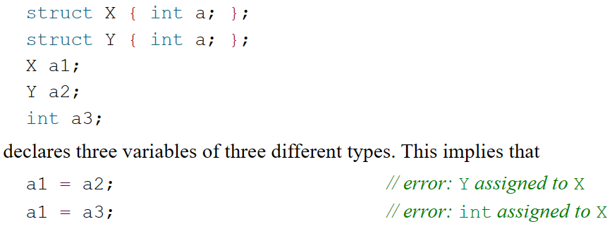

===

### Forward Declaration

```c++ [1-8|2]
struct Y {
    X* ptr;   // Error: unknown X
    X* foo();
};
struct X {
    Y* ptr;
    Y* bar();
};
```

===

我们可以用 Forward Declaration 解决这个问题：

```c++ [1-9|3]
struct X;      // Elaborated type specifiers
struct Y {
    X* ptr;
    X* foo();
};
struct X {
    Y* ptr;
    Y* bar();
};
```

===

如果当前作用域没有名为 `identifier` 的类，那么形如 `class-key attr identifier ;` 的声明是一个 forward declaration。
    
例如 `class Foo;`，它声明了一个叫 `Foo` 的类；但直到这个类被定义之前，它的类型是不完整的。

不完整的类型有一些限制，但是也有一些可以完成的操作。例如不完整的类型不能用来定义变量（包括成员变量）、作为函数声明或定义的参数或者返回值类型等；但是可以定义指向它的指针。

===

```c++ [1-10|4]
struct X;
struct Y {
    X* ptr;
    // X mem; // Error: field has incomplete type 'X'
    X* foo();
};
struct X {
    Y* ptr;
    Y* bar();
};
```
===

### Injected Class Name

`struct Node { Node* next; };`

<div class="fragment">

A class-name is inserted into the scope in which it is declared immediately after the class-name is seen. 

The class-name is also inserted into the scope of the class itself; this is known as the **injected-class-name**.

</div>

===

### `Container()` 是函数调用表达式吗？

```c++
Foo f = Foo();
Foo f2 = Foo::Foo();
```

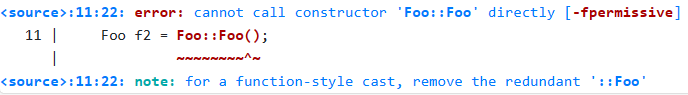

===

我们不能直接调用构造函数，这是因为 **构造函数并没有名字，因此永远无法被用名字找到**。

`Foo();` 的写法并不是对构造函数的调用，而是一个 "function-style cast"。

===

#### Function-style cast

C-style cast: `(int)3.2`

function-style cast: `int(3.2)`

===

`int(3.2)` 将 3.2 显式地转换为了一个临时的 `int` 对象

类似地，`Foo()` 也（什么都不用地）显式地转换出了一个临时的 `Foo` 对象

虽然这个转换本身会使用到构造函数，但是这个表达式本身不是在调用构造函数。
