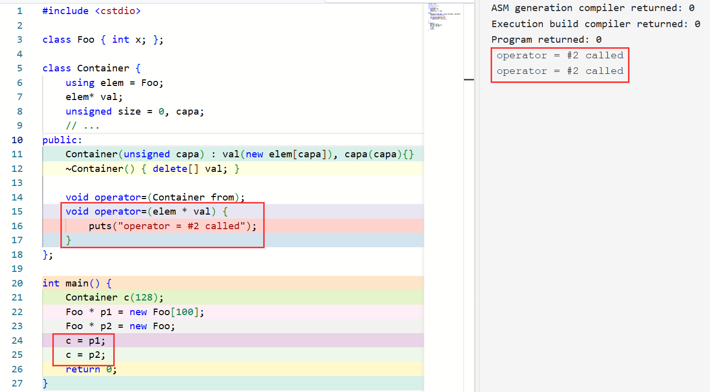
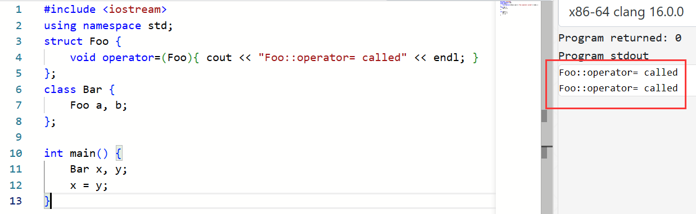
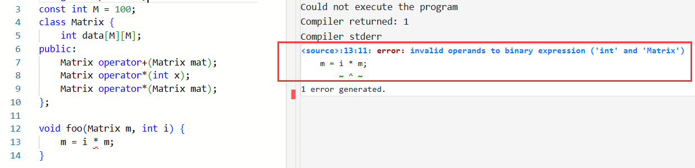
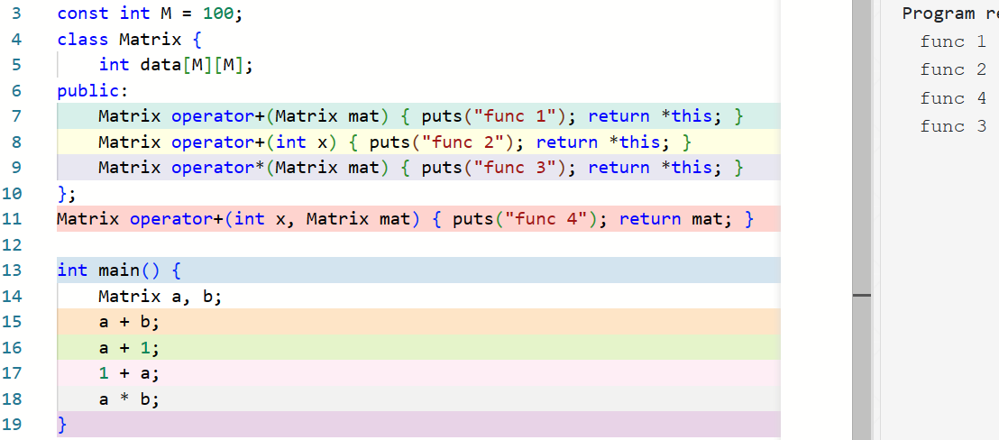
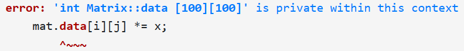
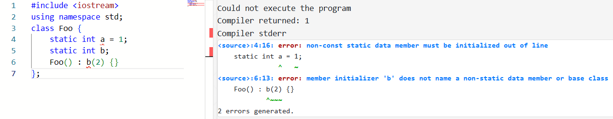
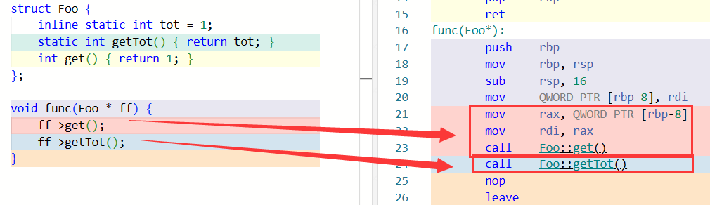
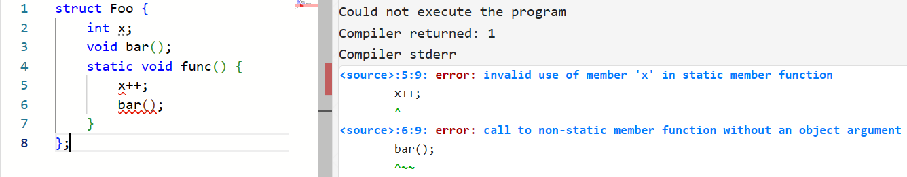

<link rel="stylesheet" href="custom_light.css">
<link rel="stylesheet" href="../custom_light.css">
<link rel="stylesheet" href="custom.css">
<link rel="stylesheet" href="../custom.css">

# 探索 C++

<br>

## Week 3 - 类 (II) 拷贝赋值、运算符重载与引用

---

## 5.1 拷贝赋值运算符

===

在上一节中，我们创建了一个「容器」类：

```c++ linenums="1"
class Container {
    elem* val;
    // ...
};
```

`c1 = c2;` 会发生什么？

===

`c1.val` 的值变得和 `c2.val` 一样了；也就是说，这两个容器现在指向同一块内存。

<br>

1. `c1` 原来的 `val` 也许指向了一块申请来的内存，但是它并没有被释放；
2. 这样的「赋值」实际上完成的是某种「共享」，而并非真正地建立一个副本。

===

```c++
class Container {
    elem* val;
    unsigned size = 0, capa;
    // ...
public:
    Container(unsigned capa) : val(new elem[capa]), capa(capa){}
    ~Container() { delete[] val; }

    void operator=(Container from) {
        delete[] val;
        val = new elem[from->capa];
        for (unsigned i = 0; i < from->size; i++) {
            val[i] = from->val[i];
        }
        size = from->size;
        capa = from->capa;
    }
};
```

===

在一个有运算符的表达式中，如果至少一个操作符是某个类的对象，则由重载解析查找对应的函数。

<br>

例如 `x = y;` 就会被视为 `x.operator=(y);` 进行查找。

===

```c++
void Container::operator=(Container from) {
    delete[] val;
    val = new elem[from->capa];
    for (unsigned i = 0; i < from->size; i++) {
        val[i] = from->val[i];
    }
    size = from->size;
    capa = from->capa;
}
```

`x = x;`

如果 `capa` 和 `from->capa` 的值相同

===

```c++ linenums="1"
class Container {
    elem* val;
    unsigned size = 0, capa;
public:
    // ...
    void operator=(Container from) {
        if (from->val != val) { // avoid self-assignment
            if (from->capa != capa) {
                delete[] val;
                val = new elem[from->capa];
            }
            for (unsigned i = 0; i < from->size; i++) {
                val[i] = from->val[i];
            }
            size = from->size;
            capa = from->capa;
        }
    }
};
```

===

`operator=` 同样可以有重载。例如：

```c++ linenums="1"
class Container {
    // ...
    void operator=(Container from);
    void operator=(elem * val) {
        this->val = val;
    }
};
```

如果有 `Container` 的实例 `c` 和一个 `elem *` 类型的 `ptr`，那么 

`c = ptr;`

是合法的，因为它实际上会被解释为 `c.operator=(ptr);`。

===



===

与之前的讨论类似，如果用户没显式地给出 `operator=`，那么编译器会生成一个 public 的默认拷贝赋值运算符的声明；如果它被使用，则编译器生成它的定义；它完成的内容即为将各个成员变量用它们的 `operator=` 拷贝一遍。



用户也可以将 `operator=` 设置为 `= default;` 或者 `= delete;`。

===

如果 `operator=` 在当前上下文不可见，那么 `a = b;` 这样的表达式非法：

```c++
class Foo { 
    void operator=(Foo){} // private operator=
    void foo() {
        Foo a, b;
        a = b;      // OK, private function available here
    }
};
struct Bar { 
    void operator=(Bar) = delete; // deleted operator=
    void foo() {
        Bar c, d;
        c = d;      // error: use of deleted function 
                    // 'void Bar::operator=(Bar)'
    }
};

void foo() {
    Foo a, b;
    a = b;      // error: 'void Foo::operator=(Foo)' 
                // is private within this context
    Bar c, d;
    c = d;      // error: use of deleted function 
                // 'void Bar::operator=(Bar)'
}
```

---

## A.4 运算符重载

===

既然 `operator=` 可以重载，那么其他运算符可不可以重载呢？

<br>

对于自定义类型，C++ 希望人们能写出 `F = M * A`，而非 `assign(F, mul(M, A))`。

C++ 允许用户重载大多数的运算符从而提高代码的简洁性和可维护性。

===

重载：同一个函数（根据参数列表不同）具有不同的行为。

<br>

`a * b`, `*p`, `a ** p`

`a + b`, `p + i`

===

```c++
const int M = 100;
class Matrix {
    int data[M][M];
    // ...
};
```

希望它能支持 `Matrix + Matrix`, `int * Matrix`, `Matrix * Matrix` 等操作

===

```c++
const int M = 100;
class Matrix {
    int data[M][M];
public:
    Matrix operator+(Matrix mat) { /* */ }
    Matrix operator*(int x) { /* */ }
    Matrix operator*(Matrix mat) { /* */ }
};
```

如果我们写 `m1 * m2`，其实就等价于 `m1.operator*(m2)`

===

`Matrix * int` == `Matrix::operator=(int)`

<span class="fragment">`int * Matrix` == `int::operator=(Matrix)` ?</span>

<span class="fragment">`int` 中并没有这样的重载</span>



===

事实上，运算符重载也可以放在全局，例如：

```c++ linenums="1"
const int M = 100;
class Matrix {
    int data[M][M];
public:
    Matrix operator+(Matrix mat) { /* */ }
    Matrix operator*(int x) { /* */ }
    Matrix operator*(Matrix mat) { /* */ }
};
Matrix operator*(int x, Matrix mat) { /* */ }
```

===

当 `x * y` 的操作数中有类实例时，则重载解析会尝试将它解释为 `x.operator*(y)` 和 `operator*(x, y)`

即 `x` 对应类中的成员 `operator*` 和全局的 `operator*` 都会被纳入候选函数集，然后再根据实际的参数列表完成重载解析

===



===

```c++ linenums="1"
Matrix operator*(int x, Matrix mat) {
    Matrix tmp = mat;   // copy mat
    for (int i = 0; i < M; i++)
        for (int j = 0; j < M; j++)
            tmp.data[i][j] *= x;
    return tmp;
}
```



===

C++ 允许一个类的定义中给一个外部的函数「授予」访问其 private 成员的权限，方式是将对应的函数在该类的定义中将对应的函数声明为一个 **友元 (friend)** ：

```c++ linenums="1"
const int M = 100;
class Matrix {
    int data[M][M];
public:
    // ...
    friend Matrix operator*(int x, Matrix mat); // Designates a function 
                                                // as friend of this class
};
Matrix operator*(int x, Matrix mat) {
    Matrix tmp = mat;   // copy mat
    for (int i = 0; i < M; i++)
        for (int j = 0; j < M; j++)
            tmp.data[i][j] *= x;        // can access private member
    return tmp;
}
```

===

友元只是一种权限授予的声明，友元函数并非类的成员。因此它并不受 access-specifier 的影响。

===

```c++ linenums="1"
const int M = 100;
class Matrix {
    int data[M][M];
public:
    Matrix operator+(Matrix mat) { /* */ }
    Matrix operator*(int x) { /* */ }
    Matrix operator*(Matrix mat) { /* */ }
};
Matrix operator*(int x, Matrix mat) {
    return mat * x;
}
```

===

其他大多数运算符也能重载。对于一元运算符（如作为正负号的 `+`, `-`，以及 `!`, `~`, `++`, `--` 等），`@x` 会调用 `x.operator@()` 或者 `operator@(x)`。

一个例外是，`++` 和 `--` 既可以作为前缀，也可以作为后缀；这如何区分呢？

===

这些运算符不能被重载：`::` (scope resolution), `.` (member access), `.*` (member access through pointer to member), and `?:` (ternary conditional) 

对 `=` (assignment), `()` (function call), `[]` (subscript), `->` (member access) 的重载 **必须是成员**

===

大家容易理解的运算符重载：四则运算，复合赋值运算符 (如 `+=`)，比较运算符 (返回 bool)

之后会讨论的几个典型的运算符重载：下标运算符 `[]`，函数调用运算符 `()`；以及左移右移运算符 `<<` 和 `>>` 的新语义。

---

## A.5 引用

===

```c++ linenums="1"
const int M = 100;
class Matrix {
    int data[M][M];
public:
    Matrix operator-(Matrix mat) {
        Matrix res;
        for (int i = 0; i < M; i++)
            for (int j = 0; j < M; j++)
                res.data[i][j] = data[i][j] - mat.data[i][j];
        return res;
    }
};
```

这个类的对象占据的内存是非常大的，因此我们将对象作为参数传递时会有很大的开销。

===

可以通过传递指针的方式来减少不必要的拷贝。

例如有函数 `int getSum(Matrix mat);` 就可以改为 `int getSum(Matrix * mat);`，调用时通过 `getSum(&m)`，就可以只传递指针而不必拷贝整个对象了。

===

但是，对于运算符重载，如何完成呢？

C++ 并不希望要求程序员在这种情况下将 `m1 - m2` 改为 `&m1 - &m2` 或者 `m1 - &m2` 去写。

<span class="fragment">为了解决这个问题，BS 将 Algol 68 中的 **引用 (reference)** 机制引入了 C++</span>

===

一个引用是一个已经存在的对象或者函数的别名。例如：

```c++
int x = 2;
int & y = x;    // y is an alias for x
```

这样，对 `y` 的所有操作都和对 `x` 的操作一样了；`y` 不是 `x` 的指针，也不是 `x` 的副本，而是 `x` 本身。包括获取它的地址—— `&y` 和 `&x` 的值相同。

===

也是因此，我们无法重新约束一个引用所绑定的变量。因为：

```c++
int z = 3;
y = z;
```

上面的 `y = z` 实际上是给 `x` 赋值为 `z`，而非将 `y` 重新绑定到 `z`。

===

#### 引用作为参数

显然，在同一个作用域内，给一个变量起一个别名并不会有太多的现实意义。引用最广泛的用法是作为参数传递：

```c++ linenums="1"
void swap(int& i, int& j) {
    int tmp = i;
    i = j;
    j = tmp;
}

int main() {
    int x, y;
    // ...
    swap(x,y);
    // ...
}
```

===

我们只需要让 `Matrix` 传递时传递引用即可：

```c++ linenums="1" hl_lines="5"
const int M = 100;
class Matrix {
    int data[M][M];
public:
    Matrix operator-(const Matrix & mat) {
        Matrix res;
        for (int i = 0; i < M; i++)
            for (int j = 0; j < M; j++)
                res.data[i][j] = data[i][j] - mat.data[i][j];
        return res;
    }
};
```

我们这里使用了 `const Matrix &` 而不只是 `Matrix &`，从而说明 `mat` 是只读而不可修改的。虽然后者也能实现我们需要的效果，但是这样能够保证函数中只会读取 `mat` 的值，而不会意外修改它。

===

就像我们可以用一个 `const int *` 保存一个 `int` 的地址一样，这种「给出更强保证」的隐式类型转换对于引用也显然是合法的。即，如果有一个 `int`，我们可以给它一个类型为 `int &` 或者 `const int &` 的别名：

```c++
void foo() {
    int x = 1;
    const int y = 2;

    int & rx1 = x;  // OK
    rx1 = 3;        // OK, now x is 3

    const int & rx2 = x;    // OK
    rx2 = 4;        // Error: assignment of read-only reference 'rx2'

    int & ry1 = y;  // Error: binding reference of type 'int' to value of
                    // type 'const int' drops 'const' qualifier
    const int & ry2 = y;    // OK
}
```

===

#### 引用作为返回值

引用也可以作为函数的返回值。看下面的例子：

```c++ linenums="1"
class Container {
    elem* val;
    // ...
public:
    elem & operator[](unsigned index) {
        return val[index];
    }
    // ...
};
```

可以通过 `c[i]` 的方式访问容器中的值，如读取 `x = c[i]` 或者写入 `c[i] = x`。

这使得我们不再需要写 `c.getVal()[i] = x` 之类的丑陋代码。

===

当然，如果希望 `operator[]` 返回的值是只读的，我们只需要让函数返回 `const elem &` 即可：

```c++
const elem & operator[](unsigned index);
```

这在 `elem` 比较大的时候有助于避免不必要的拷贝。不过，在 `elem` 是比较小的基本类型且没有修改需求的情况下，则直接返回值会更好一些。

===

返回引用时注意避免 dangling reference。例如：

```c++
int & foo () {
    int tmp = 10;
    // ...
    return tmp;
}
```

这里 `tmp` 作为局部变量，在函数结束时就会被销毁；但是函数却返回了一个引用这个已经不存在的变量的引用。这是个 dangling reference，将会导致 undefined behavior

===

从实现的角度而言，我们可以认为引用更类似于 const 指针，即 `int & y = x;` 类似于对 `int * const py = &x;` 的包装，对 `y` 的使用实际上是使用 `*py`。

不过需要注意的是，在实际实现中，引用并不一定会占用存储。

===

 `const int *`, `int const *`, `int * const`, `const int * const`

`const` 是一种 **cv-qualifier**，它可以和任何类型说明符组合，以指定被声明的对象是常量。

===

尝试直接修改 `const` 限定的变量会被编译器拒绝：

```c++
const int i = 3;
i = 0;          // assignment of read-only variable 'i'
```

因此，具有 `const` 限定类型的变量必须被初始化：

```c++
const int i;    // error: uninitialized 'const j'
```

===

`const int *` 和 `int const *` 用来表示「指向一个不可变的 `int` 的指针」，指针本身可以被修改，但是指向的变量是只读的：

```c++ linenums="1"
const int i = 1;
int j = 3;

int * s = &i;   // error: invalid conversion from 'const int *' to 'int *'

const int * p = &i; // OK
const int * q = &j; // OK, assign 'int *' to 'const int *' is valid

i = 4;  // error: assignment of read-only variable 'i'
*p = 4; // error: assignment of read-only location '*p'
j = 4;  // OK
*q = 4; // error: assignment of read-only location '*q'

p = q;  // OK, the pointer itself is not constant
const int * r;  // OK, non-const variable can be defined without initializer

int * s = q;    // error: invalid conversion from 'const int *' to 'int *'
``` 

===

而 `int * const` 用来表示「指向一个 `int` 的不可变的指针」，指针本身不能被修改，但是指向的变量是可以修改的：

```c++  linenums="1"
int i = 3;
int j = 4;
int * const p = &i;

*p = 4; // OK, *p has type 'int', which is not const
p = &j; // error: assignment of read-only variable 'p'

int * const q;  // error: uninitialized 'const q'
```

而 `const int * const` 和 `int const * const` 则表示「指向一个不可变的 `int` 的不可变的指针」，指针本身和指向的变量都不能被修改。

===

这样，我们也很容易理解为什么不存在 `const & const` 这样的东西了——因为引用本身就不能被重新约束。

结合上面的讨论，我们容易理解：引用变量必须被初始化 (extern 除外)：

```c++
int & bad; // error: declaration of reference 
           // variable 'r' requires an initializer
```

===

#### 引用与临时对象

如果写了这样一个表达式：

```c++
m1 - m2;
```

它会调用 `Matrix::operator-` 并返回一个 `Matrix` 类型的值，这个值是一个临时对象。

问题是：这个对象会在什么时候被析构？

===

在这个表达式结束之后立刻被析构。这么做的原因是直观的：我们此后再也无法访问到这个对象，因为它是一个没有名字的 **临时对象 (temporary object)**

事实上，临时对象会在它所在的 **完整表达式 (full-expression)** 结束时被销毁。所谓完整表达式结束时，大多数情况下就是下一个 `;` 所在的位置

===

`void print(const Matrix &);`，显然，`print(m1)` 和 `print(m2)` 之类的函数调用都是合法的。

那么，请问：`print(m1 - m2);` 是合法的吗？

===

不过，我们考虑这样的情况：

```c++
Matrix m = m1 - m2;
```

===

因此，C++ 规定：可以将一个临时对象绑定给一个 `const` 引用，这个临时对象的生命周期被延长以匹配这个 `const` 引用的生命周期。例如：

```c++
void foo() {
    const Matrix & m = m1 - m2;     // temporary `Matrix` 
                                    // has same lifetime as `m`
    
    // ...

    // at the end of this function block, the lifetime of `m` ends,
    // so the lifetime of temporary `Matrix` ends, d'tor called.
}
```

===

上面将临时对象传递给 `const Matrix &` 参数和用临时对象初始化 `const Matrix &` 的两个例子共同反映了一个事实：

**我们可以把一个临时对象绑定给一个 `const` 引用。**

下一个问题是：我们能否将一个临时对象绑定给一个 non-`const` 引用呢？

===

考虑这样一个情形：

```c++
void incr(int & rr) { rr++; }

void g() {
    double ss = 1;
    incr(ss);       // error since Release 2.0
}
```

===

因此，允许将一个临时对象绑定给一个 non-`const` 引用并没有太多的好处，但是会带来一些不慎修改了临时对象引发的错误，这些错误通常十分隐晦。

因此，BS 在 Release 2.0 的时候将它修复了——

**临时对象不允许被绑定给 non-`const` 引用。**

===

#### 引用与重载解析

将一个 `int` 类型的变量传递给 `int` 类型的参数和 `int &` 类型的参数的优先级是一样的

```c++
void f(int x) { puts("int"); }      // Overload #1
void f(int & r) { puts("int &"); }  // Overload #2

int main() {
    int x = 1;
    f(1);       // OK, only #1 valid
    f(x);       // Error: ambiguous overload
}
```

===

将 `int` 类型的变量传递给 `int` 类型的参数和 `const int &` 类型的参数的优先级也是一样的

```c++
void g(int x) { puts("int"); }
void g(const int & r) { puts("const int &"); }

int main() {
    int x = 1;
    const int y = 2;
    g(1);       // Error: ambiguous overload
    g(x);       // Error: ambiguous overload
    g(y);       // Error: ambiguous overload
}
```

===

不过，如果有两个重载，它们在某一个参数上的唯一区别是 `int &` 和 `const int &`，而 `int` 类型的变量绑定给这两种参数都是可行的，此时 `int &` 的更优

```c++
void h(int & r) { puts("int &"); }
void h(const int & r) { puts("const int &"); }

int main() {
    int x = 1;          // Overload #1
    const int y = 2;    // Overload #2

    h(1);   // OK, only #2 valid
    h(x);   // OK, #1 called as x -> 'int&' is better than x -> 'const int&'
    h(y);   // OK, only #2 valid
}
```

===

#### 类的引用成员和 const 成员

引用和 const 变量都需要在定义时给出初始化。那么如果一个类中有引用或者 const 成员怎么办呢？

===

必须由 member initializer list 或者 default member initializer 提供初始化。如：

```c++
int global = 10;

class Foo {
    const int x = 4;    // OK
    const int y;        // must be initialized by member initializer list
    int & rz = global;  // OK
    int & rw;           // must be initialized by member initializer list
public:
    Foo(int m, int & n) : y(m), rw(n) {}  // OK
    Foo() : y(0), rw(global) {}           // OK
    Foo() : y(0) {}         // Error: uninitialized reference member in 'int&'
    Foo() : rw(global) {}   // Error: uninitialized const member in 'const int'
};
```

===

为什么 `this` 不是引用？

===

Keyword arguments 或者 Named Parameter Idiom 是指根据参数的名字而非参数的位置来传参。

这种机制在 C 和 C++ 中并不支持，它们只支持按位置传参。

Python 之类的语言是允许这种传参方式的，即通过 `f(b = 1)` 之类的写法可以指定 `b` 的值是 `1`。

为什么 C++ 不支持这种语法？C++ 有没有方式能够实现这种语法的替代？

---

## A.6 I/O Stream

前面我们聊了运算符重载和引用之类的话题。

在 C++ 中，对它们的一个经典应用是输入输出流。

===

`scanf` 和 `printf`，它们对类型的识别并不是静态的，而是动态地根据格式控制字符串中 `%d` 之类的东西处理的

带来一些安全问题

引发了一个重要问题——没有办法支持用户自定义类型

===

C++ 中，新的头文件 `<iostream>` (input / output stream) 中提供了两个全局对象 `cin` (char input) 和 `cout` (char output) 用来完成输入输出。举一个例子：

```c++ linenums="1"
#include <iostream>

int main() {
    int x;
    double y;
    std::cin >> x >> y;
    std::cout << "x = " << x << ", y = " << y << std::endl;
    return 0;
}
```

通过运算符重载，给 `>>` 和 `<<` 赋予了从流中提取 (stream extraction) 和向流中插入 (stream insertion) 的新语义。

===

```c++
void foo() {
    using std::cin;
    using std::cout;
    cin >> x;   // std::cin
    cin >> y;   // std::cin
    cout << "x = " << x << ", ";        // std::cout
    cout << "y = " << y << std::endl;   // std::cout
}
```

这里 `using std::cin` 就表示「若无特殊说明，`cin` 即指 `std::cin`」。

===

或者使用 `using namespace std;` 表示「若无特殊说明，这里面不知道是什么的东西去 `std` 里找」：

```c++
void foo() {
    using namespace std;
    cin >> x;   // std::cin
    cin >> y;   // std::cin
    cout << "x = " << x << ", ";   // std::cout
    cout << "y = " << y << endl;   // std::cout, std::endl
}
```

`using` 语句也属于其作用域，作用范围持续到其所在块结束。将其放到全局，则其作用范围持续到其所在文件结束。

===

`std::cin` 的类型是 `std::istream` (input stream)，它其中对各种基本类型重载了 `operator>>`，我们上面使用到的两个分别是：

```c++
istream & istream::operator>>(int & value) {
    // ... extract (read) an int from the stream
    return *this;
}
istream & istream::operator>>(double & value) {
    // ... extract (read) a double from the stream
    return *this;
}
```

===

为什么要返回 `istream &` 类型的 `*this`？

`cin >> x >> y;`

`(cin.operator>>(x)) >> y;`

`cin.operator>>(x)` 返回 `cin`

`cin >> y;`

===

与 `cin` 类似，`std::cout` 的类型是 `std::ostream` (output stream)，它同样对各种基本类型重载了 `<<` 运算符。一个例子是 `ostream& ostream::opreator<<(int value);`。

===

```c++ linenums="1"
#include <iostream>
#include <string>

using std::istream;
using std::ostream;
using std::string;
using std::to_string;

class Complex {
private:
	double real, imaginary;
public:
    // ...
    string toString() const;
	friend istream& operator>>(istream& is, Complex& right);
};

string Complex::toString() const {
	string str = to_string(this->real);
	str += " + ";
	str += to_string(this->imaginary);
    str += 'i';
	return str;
}

ostream& operator<<(ostream& os, const Complex& right) {
	return os << right.toString();
}

istream& operator>>(istream& is, Complex& right) {
	char op;
	is >> right.real >> op >> right.imaginary >> op;
	return is;
}

int main() {
    Complex c;
    std::cin >> c;
    std::cout << c;
}
```

===

容易看到，`cin` 和 `cout` 的设计使得代码的可读性和可维护性更好，也一定程度上提高了安全性。

---

## 5.1 拷贝赋值运算符 (Cont.)

===

规范的拷贝赋值运算符一般写成这样：

```c++ linenums="1"
Container & operator=(const Container & from) {
    if (this == &from)      // avoid self-assignment
        return *this;
 
    if (from->capa != capa) {
        delete[] val;
        val = new elem[from->capa];
    }

    for (unsigned i = 0; i < from->size; i++) {
        val[i] = from->val[i];
    }
    size = from->size;
    capa = from->capa;

    return *this;
}
```

===

为什么这个函数接收一个 `const class-name &` 呢？如我们之前所说，这样一方面能够防止不必要的拷贝，另一方面能够接受临时对象。

===

为什么这个函数又返回一个 `class-name &` (具体地，返回 `*this`) 呢？事实上，C 和 C++ 支持这样的表达式：

`a = b = 1;`

赋值运算符都是 group right-to-left 的：`b = 1; a = b;`。

因此如果让 `operator =` 的返回值是 `*this`，就可以完成类似 `c1 = c2 = c3;` 的操作了。

---

## A.6 `const` 和 `static`

===

#### const 成员函数

我们之前看到了 `const` 成员函数：

```c++
class Complex {
    // ...
    string toString() const;
	// ...
};
```

===

声明为 `const` 的成员函数中，`this` 的类型是 `const Complex *`；而如果没有声明为 `const`，则 `this` 的类型是 `Complex *`

===

如果没有这个保证，会出现什么问题呢？

```c++
struct Foo {
    string toString();
};

void bar(Foo & a, const Foo & b) {
    a.toString();   // OK
    b.toString();   // Error: 'this' argument to member function 'toString' 
                    // has type 'const Foo', but function is not marked const
}
```

我们要求 `b` 不能更改，但是函数 `toString()` 没有保证自己不会修改 `*this` 的值

用 `const Foo *` 去初始化 `Foo *` 会丢失 cv-qualifier

===

在 `const` 成员函数中，试图调用其他非 `const` 成员函数，或者更改成员变量都是不合法的：

```c++
struct Foo {
    int a;
    void foo();
    void bar() const {
        a++;    // cannot assign to non-static data member 
                // within const member function
        foo();  // 'this' argument to member function 'foo' has type 
                // 'const Foo', but function is not marked const
    }
};
```

===

`const int Foo::foo();`

===

是 `const` 和非 `const` 的两个同名成员函数实际上是合法的重载，因为它们其实说明了 `this` 的类型是 `T*` 还是 `const T*`：

```c++
struct Foo {
    void foo() { cout << 1 << endl; }
    void foo() const { cout << 2 << endl; }
};

int main() {
    Foo f;
    const Foo cf;
    f.foo();    // #1 called, as Foo* fits Foo* best
    cf.foo();   // #2 called, as const Foo* can only fit const Foo*
}
```

===

```c++
class Container {
    elem * data;
    // ...
public:
          elem & operator[](unsigned index)       { return data[index]; }
    const elem & operator[](unsigned index) const { return data[index]; }
    // ...
}
```

===

#### mutable

===

#### static 成员变量

```c++
int tot = 0;
struct User {
    int id;
    User() : id(tot++) {}
};
```

===

```c++
struct User {
    static int tot;
    int id;
    User() : id(tot++) {}
};
int User::tot = 0;
```

===

`static` 成员不被绑定到类的实例中，也就是上面 `User` 类的每个实例里仍然只有 `id` 而没有 `tot`

由于它是类的成员，因此访问它的时候需要用 `User::tot`

不过，语法仍然允许用一个类的实例访问 `static` 成员，例如 `user.tot`。静态成员也受 access specifier 的影响。

===

需要提示的是，之前我们讨论的 default member initializer 和 member initializer list 是针对 non-static 成员变量的，它们对于 static 成员变量不适用：



===

也就是说，在类中的 static 成员变量 **只是声明**。我们必须在类外给出其定义，才能让编译器知道在哪里构造这些成员：

```c++
class Foo {
    static int a;
    static int b;
};

int Foo::a = 1;
int Foo::b;
```

===

作为一个例外，如果一个 `const` `static` 成员变量是整数类型，则可以在类内给出它的 default member initializer:

```c++
struct Foo {
    const static int i = 1; // OK
};

int main() {
    cout << Foo::i << endl;
}
```

===

另外，自 C++17 起，`static` 成员变量可以声明为 `inline`；它可以在类定义中定义，并且可以指定初始化器：

```c++
struct Foo {
    inline static int i = 1; // OK since C++17
}
```

===

#### static 成员函数

`static` 函数的动机和 `static` 变量一致，都是「属于类，但不需要和具体对象相关」的需求

在这两种情形下，类被简单地当做一种作用域来使用

===

由于 `static` 成员函数不与任何对象关联，因此它在调用时没有 `this` 指针。例如：



我们可以使用 `User::getTot()` 来调用这个函数，当然也允许通过一个具体的对象调用这个函数

===

显然，`static` 成员函数中不应当有对非静态成员变量或非静态成员函数的访问：



===

`static` 成员函数不能设为 `const`。原因很简单：`static` 说明函数没有 `this`，而 `const` 说明函数的 `this` 是 `const X *`，这两个说明是互相矛盾的。

---

## Takeaway

- 拷贝赋值运算符
  - 解决「非平凡拷贝」的问题
  - `Foo & Foo::operator=(const Foo &);`
  - 防止 self-assignment
  - `= default;`, `= delete`
  - 不可见时不能赋值
- 运算符重载
  - 让运算符适配自定义类型
  - 可以是成员或者全局
  - 友元

===

## Takeaway

- 引用
  - 解决运算符重载按引用传参问题
  - 可以作为参数或者返回值
  - 类似于包装了的 `Foo * const`，但是不一定占内存
  - `const Foo &` 可以绑定临时对象
  - 重载解析
  - 类的引用成员和 const 成员的初始化
- I/O Stream
  - `cin`, `cout` 的使用
  - 对 `operator<<` 和 `operator>>` 的重载
- `const` 和 `static` 成员