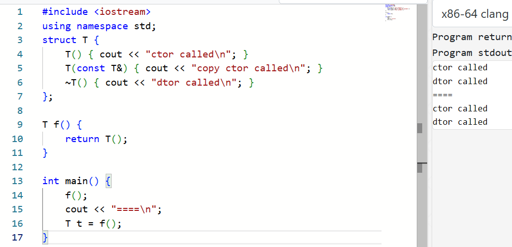
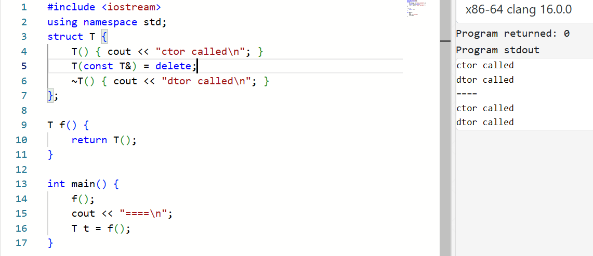

<link rel="stylesheet" href="custom_light.css">
<link rel="stylesheet" href="../custom_light.css">
<link rel="stylesheet" href="custom.css">
<link rel="stylesheet" href="../custom.css">

# 探索 C++

<br>

## Week 4 - 类 (III) 隐式类型转换、拷贝构造、SMFs

---

## A.7 隐式类型转换 | Implicit Conversion

===

那我们来考虑这样一个问题！关于我们实现的复数类：

```c++ linenums="1"
class Complex {
private:
	double real, imaginary;
public:
    Complex(double r) : real(r), imaginary(0) {}
    Complex(double r, double i) : real(r), imaginary(i) {}
    friend Complex operator+(Complex, Complex);
    friend Complex operator-(Complex, Complex);
    friend Complex operator*(Complex, Complex);
    // ...
};
```

===

```c++
void foo() {
    Complex c;
    double d;
    // ...
    Complex c2 = c + d; // Complex + double
    Complex c3 = d + c; // double + Complex
}
```

如何解决这个问题呢？

===

要求调用者显式写出转换，即 `c + Complex(d)` 和 `Complex(d) + c`

<span class="fragment">为每个运算符写 `Complex, Complex`, `double, Complex`, `Complex, double` 三个版本</span>

<span class="fragment">指定一种规则，允许从类型 `double` 到类型 `Complex` 的 **隐式转换** </span>

<span class="fragment">什么是隐式转换？</span>

===

隐式类型转换 (implicit conversion)：这种转换是自动发生的： `i = 'c';`

显式类型转换 (explicit conversion)： `i = (int)'c';` 或者 `i = int('c');`

===

### 标准转换 | Standard Conversion

- 调整或变换
  - <span class="fragment">array-to-pointer conversion: `void f(int *);` `int a[10];` `f(a);`</span>
  - <span class="fragment">qualification conversion: `void f(const int *);` `int *p;` `f(p);`</span>
- Promotion
  - <span class="fragment">integral promotion: `void f(int);` `char c;` `f(c);`</span>
  - <span class="fragment">floating-point promotion: `void f(double);` `float x;` `f(x);`</span>
- Numeric conversions
  - <span class="fragment">integral conversion: `void f(int);` `long long l;` `f(l);`</span>
  - <span class="fragment">floating-point conversion: `void f(float);` `double x;` `f(x);`</span>
  - <span class="fragment">floating-integral conversion: `void f(int);` `double x;` `f(x);`</span>
  - <span class="fragment">pointer conversion: `T * p = nullptr;` `void * p2 = p;`</span>
  - <span class="fragment">boolean conversion: `bool b1 = i, b2 = p, b3 = x;`</span>

===

这种隐式转换能够给编写程序带来很多方便

例如我们求一个 `int` 变量的平方根时就不必写 `sqrt(double(i))`

而是直接写 `sqrt(i)` 就可以了

这个过程发生了 `int` 到 `double` 的 floating-integral conversion

===

#### 用户定义的转换 | User-Defined Conversion

```c++
void foo() {
    Complex c;
    double d;
    // ...
    Complex c2 = c + d; // Complex + double
    Complex c3 = d + c; // double + Complex
}
```

C++ 允许从类型 `A` 到类型 `B` 的隐式转换，只要有对应的 **user-defined conversion**

也就是说，除了前面我们提到的 **standard conversion** 之外，用户还可以自定义转换规则

===

User-defined conversion 有两种：

**转换构造函数 (converting constructor)**

**用户定义的转换函数 (user-defined conversion function)**

===

#### 转换构造函数 | Converting Constructor

转换构造函数 **不是** 一种特殊的构造函数，而是构造函数的一种性质。

简单来说，凡是没有 `explicit` 说明符的构造函数 **都是** 转换构造函数。

===

`Complex::Complex(double r);` 没有 `explicit`

所以它其实就提供了一种 **隐式转换** 的规则：`double` 类型的变量可以隐式转换成一个 `Complex`：

```c++
void g(Complex z, double d) {
    Complex z1 = z + d;     // OK, calls operator+(z, Complex(d));
    Complex z2 = d + z;     // OK, calls operator+(Complex(d), z);
}
```

===

**将运算符重载设为成员还是全局？**

如果是 `Complex::operator+`，会发生什么？

```c++
void g(Complex z, double d) {
    Complex z1 = z + d;     // OK, calls z.operator+(Complex(d));
    Complex z2 = d + z;     // Error: double has no operator+(Complex)
}
```

===

将一个运算符重载设为全局函数能够有更强的 **逻辑对称性**

将其定义为成员函数则能够保证 **第一个操作数不发生转换**

因此对于那些赋值运算符之类的要求第一个操作数是一个实际存在的对象的运算符，设为成员是比较好的。

===

```c++
class String {
    // ...
public:
    // ...
    String& operator+=(const String &);
};

String operator+(const String &s1, const String &s2) {
    String sum = s1;
    sum += s2;
    return sum;
}
```

===

```c++
class Container {
    elem* val;
    unsigned size = 0, capa;
    // ...
public:
    Container(unsigned capa) : val(new elem[capa]), capa(capa){}
    // ...
};
```

`void foo(const Container &);`

`foo(1);`

===

如果一个构造函数有 `explicit`，那么它就不是 converting constructor，不能用作隐式类型转换，而只能用作显式类型转换：

```c++ linenums="1" hl_lines="3 16-17"
class Foo {
public:
    explicit Foo(int i) {}
};

class Bar {
public:
    Bar(int i) {}
};

void foo(Foo f);
void bar(Bar b);

int main() {
    Foo f = Foo(1); // OK, explicit conversion
    Foo g = 1;      // Error: no valid conversion
    foo(1);         // Error: no valid conversion
    Bar b = Bar(1); // OK, explicit conversion
    Bar c = 1;      // OK, implicit conversion
    bar(1);         // OK, implicit conversion
}
```

===

因此，如果不希望前述隐式转换的发生，请将构造函数（尤其是单个参数的构造函数）标记为 `explicit`。

===

```c++
class Bar {
public:
    Bar(int i) {}
};

class Foo {
public:
    Foo(Bar b) {}
};

void foo(Foo f);

int main() {
    foo(Bar(1));    // OK, foo(Foo(Bar(1))), only Foo(Bar) used
    foo(1);         // Error: no conversion from int to Foo
}
```

===

```c++
struct A
{
    A() { }         // converting constructor (since C++11)  
    A(int) { }      // converting constructor
    A(int, int) { } // converting constructor (since C++11)
};

struct B
{
    explicit B() { }
    explicit B(int) { }
    explicit B(int, int) { }
};

int main()
{
    A a1 = 1;      // OK: copy-initialization selects A::A(int)
    A a2(2);       // OK: direct-initialization selects A::A(int)
    A a3{4, 5};    // OK: direct-list-initialization selects A::A(int, int)
    A a4 = {4, 5}; // OK: copy-list-initialization selects A::A(int, int)
    A a5 = (A)1;   // OK: explicit cast performs static_cast, direct-initialization

//  B b1 = 1;      // error: copy-initialization does not consider B::B(int)
    B b2(2);       // OK: direct-initialization selects B::B(int)
    B b3{4, 5};    // OK: direct-list-initialization selects B::B(int, int)
//  B b4 = {4, 5}; // error: copy-list-initialization selected an explicit constructor
                    //        B::B(int, int)
    B b5 = (B)1;   // OK: explicit cast performs static_cast, direct-initialization
    B b6;          // OK, default-initialization
    B b7{};        // OK, direct-list-initialization
//  B b8 = {};     // error: copy-list-initialization selected an explicit constructor
                    //        B::B()
}
```

===

#### 用户定义的转换函数 | User-defined Conversion Function

===

```c++
class Complex {
// ...
public:
    std::string to_string() const;
    double to_double() const;
    bool to_bool() const;
};
```

===

```c++
class Complex {
// ...
public:
    operator std::string() const;
    operator double() const;
    operator bool() const;
};
```

===

```c++
#include <iostream>
#include <string>

using namespace std;

class Complex {
    double r, i;
public:
    Complex(double r) : r(r), i(0) {};
    Complex(double r, double i) : r(r), i(i) {};
    operator string() const {
        cout << "operator string" << endl;
        return to_string(r) + " + " + to_string(i) + 'i';
    }
    explicit operator double() const {
        cout << "operator double" << endl;
        return r;
    }
    explicit operator bool() const {
        cout << "operator bool" << endl;
        return r != 0 || i != 0;
    }
};

void foo(double x) {}

int main() {
    Complex c = 3;      // implicit conversion, calls Complex(3)
    string str = c;     // implicit conversion, calls Complex::string()

    foo(double(c));     // OK, explicit conversion
    foo((double)c);     // OK, explicit conversion
    // foo(c);          // Error: no matching call to 'foo', because no 
                        // implicit conversion from Complex to double

    // bool b = c;      // Error: no implicit conversion from Complex to bool
    if (c) {            // OK, this context considers explicit operator bool
        cout << str;
    }
    return 0;
}
```

===

##### Contextual conversions

在一些上下文中，类型 `bool` 是被希望的

此时即使 `operator bool` 是 `explicit` 的也会被使用

这些上下文包括 `if`, `while`, `for` 的条件、内置逻辑运算符 `!`, `&&`, `||` 的操作数、三元运算符 `?:` 的第一个操作数等

---

## 6.1 拷贝构造函数

===

我们定义了 `operator =`。

形如 `Matrix m = m1;` 的初始化应当如何处理呢？

===

C with Classes 早期，这一问题的解决方案是，首先用无参的构造函数构造 `m`，然后再赋值

即等价于 `Matrix m; m = m1;`

===

```c++
class Container {
    elem* val;
    unsigned size = 0, capa;
    // ...
public:
    Container(unsigned capa) : val(new elem[capa]), capa(capa){}
    ~Container() { delete[] val; }

    Container & operator=(const Container & from) {
        if (this == &from)      // avoid self-assignment
            return *this;

        if (from->capa != capa) {
            delete[] val;
            val = new elem[from->capa];
        }

        for (unsigned i = 0; i < from->size; i++) {
            val[i] = from->val[i];
        }
        size = from->size;
        capa = from->capa;

        return *this;
    }
};
```

===

因此后来的 C++ 引入了 **拷贝构造函数 (copy constructor)**

拷贝构造函数是一种特殊的构造函数

具体而言，对于 class `T`，其构造函数中第一个参数类型为 `T&` 或者 `const T&`，且没有其他参数或者其他参数都有默认参数的那些构造函数称为拷贝构造函数

例如，`X::X(const X&)` 和 `X::X(X&, int = 1)` 都是拷贝构造函数

进一步地说，只要能在 `T t = t1;` 中调用的构造函数，都是拷贝构造函数

===

与构造函数、析构函数、`operator =` 一样，拷贝构造函数也会在没有用户定义的版本时声明一个默认的拷贝构造函数，同时也能够通过 `= default;` 和 `= delete;` 显式要求或避免编译器生成拷贝构造函数。

一个类中可以有多个拷贝构造函数，例如可以同时有 `T(T&) = default;` 和 `T(const T&) = default;`。

===

每当通过同一类型的另一个对象初始化当前对象时，拷贝构造函数会被调用（除非这个调用被省略），具体而言，发生在：

- 初始化，例如 `T t = t1;`, `T t(t1);`, `T t = T(t1);` 等
- 函数参数传递，例如 `f(t);`，其中 `f` 的签名是 `void t(T t)`
- 函数返回，例如函数 `T f()` 的返回语句 `return t;`

因此，形如 `X::X(X)` 的构造函数是不合法的

===

### copy elision

```c++
T f() {
    return T();
}

int main() {
    f();
}
```

===

直接在需要的地方构造，而不是在别处构造然后拷贝过去：



===

自 C++17 开始，在以下两种情况下，对拷贝的省略是强制的：

返回一个与返回值类型相同的临时值：

```c++
T f()
{
    return T();
}
 
f(); // only one call to default constructor of T
```

初始化表达式是相同类型的临时值：

```c++
T x = T(T(f())); // only one call to default constructor of T, to initialize x
```

===

这种对拷贝的省略是强制的。因此，在这种情形下，并不要求拷贝构造函数是可访问的：



===

#### Named Return Value Optimization

在另外的一些情况下，也有可能有优化的空间，例如：

```c++
T f() {
    T tmp;
    // ...
    return tmp;
}

T t = f();
```

C++ 允许但不强制这种优化的发生

因此，即使这一优化发生，C++ 也仍然要求此处拷贝构造函数是可以访问的

---

## 6.2 Special Member Functions

===

默认（可无参调用的）构造函数、拷贝构造函数、拷贝赋值运算符和析构函数被统称为 **Special Member Functions (SMF)**

如果没有用户显式声明的版本，编译器会生成默认的声明；如果需要使用，则编译器生成默认的定义

===

### Rule of Three

如果用户需要自定义一个类的拷贝构造、拷贝赋值或者析构函数，那么基本上这三个都是必要的

===

```c++
class Msg {
    char * content;
    unsigned from, to;
public:
    Msg(const Msg &s) {
        content = new char[strlen(s.content) + 1];
        strcpy(content, s.content);
        from = s.from;
        to = s.to;
    }
    Msg & operator=(const Msg &s) {
        if (this == *s)     return *this;
        if (strlen(content) != strlen(s.content)) {
            delete[] content;
            content = new char[strlen(s.content) + 1];
        }
        strcpy(content, s.content);
        from = s.from;
        to = s.to();
    }
    ~Msg() {
        delete[] content;
    }
};
```

===

如果一个类有用户声明的拷贝赋值运算符或者析构函数，那么不推荐使用隐式定义的拷贝构造函数

对应地，如果一个类有用户声明的拷贝构造函数或者析构函数，那么不推荐使用隐式定义的拷贝赋值函数

在 C++ 的未来版本中，这些隐式定义可能会被删除

===

### Rule of Zero

应当遵循单一职责原则，即一个类要么只用来管理资源，要么就不应该有涉及资源管理的操作

===

```c++
class String {
    char * content;
public:
    String(const String &s) {
        content = new char[strlen(s.content) + 1];
        strcpy(content, s.content);
    }
    String & operator=(const String &s) {
        if (this == *s)     return *this;
        if (strlen(content) != strlen(s.content)) {
            delete[] content;
            content = new char[strlen(s.content) + 1];
        }
        strcpy(content, s.content);
    }
    ~String() {
        delete[] content;
    }
};
```

===

```c++
class Msg {
    String content;
    unsigned from, to;
};
```

我们用一个专门的类 `String` 用来处理资源

由于 `String` 类型有了所有需要的 special functions，因此在 `Msg` 类中，我们不需要做额外的操作了

编译器隐式生成的拷贝构造、拷贝赋值和析构函数会帮我们调用 `String` 类的这些函数。

===

```c++
class Msg {
    std::string content;
    unsigned from, to;
};
```

===

C++11 改进了语言和标准库，提供了对动态分配对象生命周期管理的更好工具，在这种背景下 Rule of Zero 被提出，作为对之前 Rule of Three 的更新

- `std::string` 代为管理字符串
- STL 容器代为管理数据类型，如 `std::vector` 或者 `std::array` 代为管理数组
- 智能指针代为管理动态内存
- `std::fstream` 等代为管理文件读写

---

## Takeaway

- 隐式类型转换
  - Standard Conversion
  - User-defined Conversion
    - Converting Constructor
    - User-defined Conversion Function

===

## Takeaway

- 拷贝构造函数
  - 定义用另一个同类对象初始化新对象的行为
  - 发生的场景
  - copy elision
    - C++17 开始的强制
    - NRVO, Named Return Value Optimization

===

## Takeaway

- SMF, Special Member Functions
  - 默认构造函数、拷贝构造函数、拷贝赋值函数、析构函数
  - 共同特点
  - Rule of Three
  - **Rule of Zero**