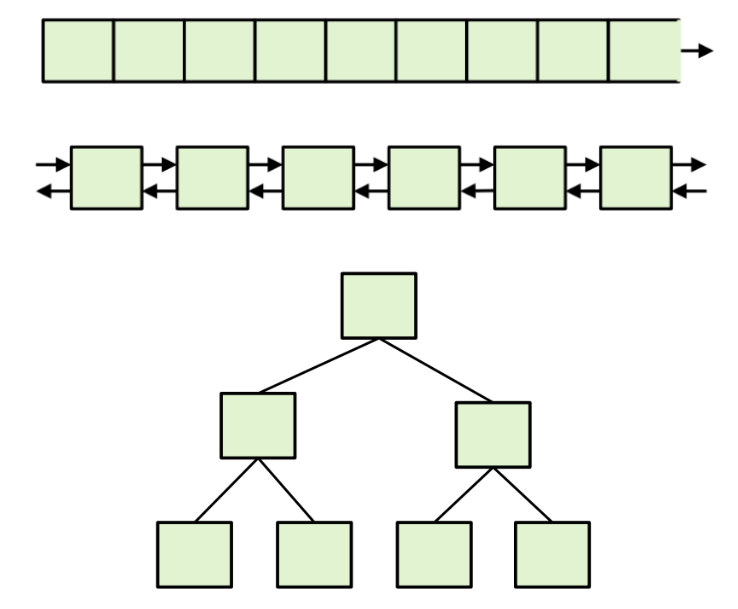
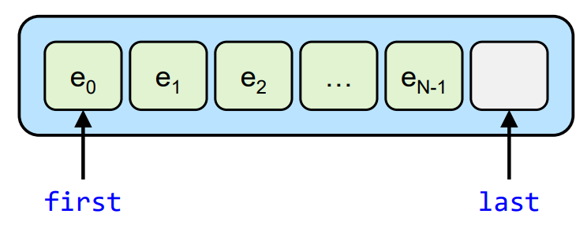
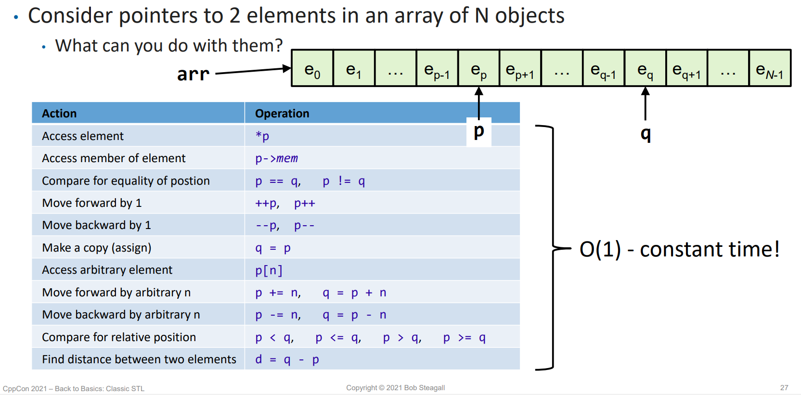
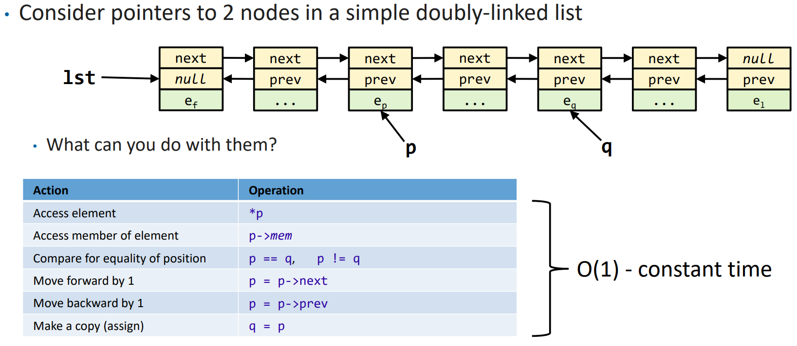
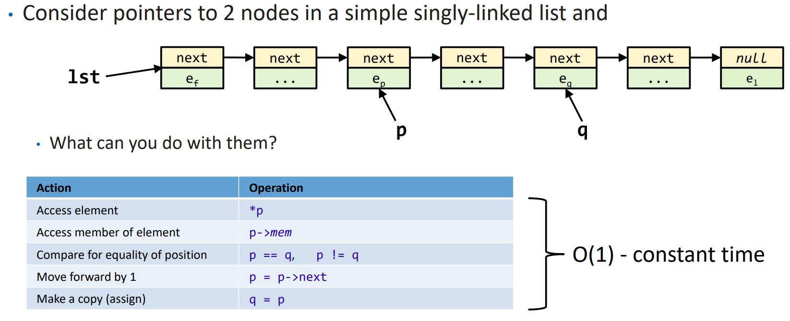
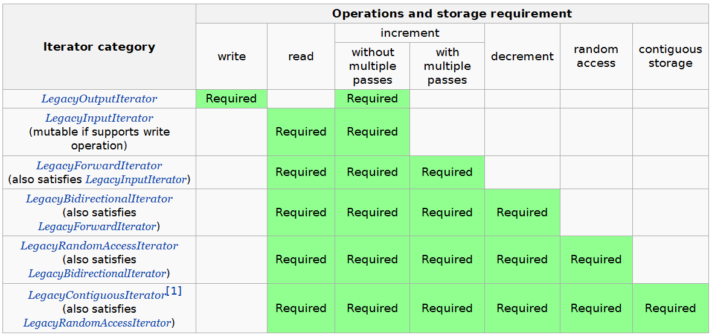
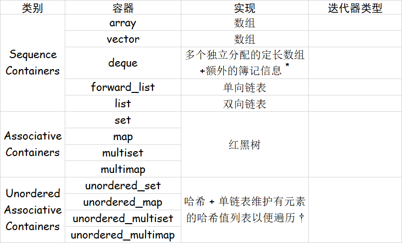
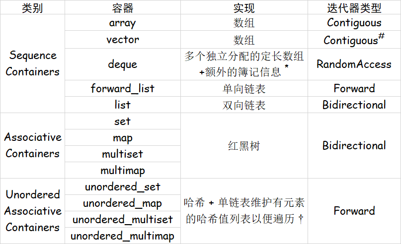
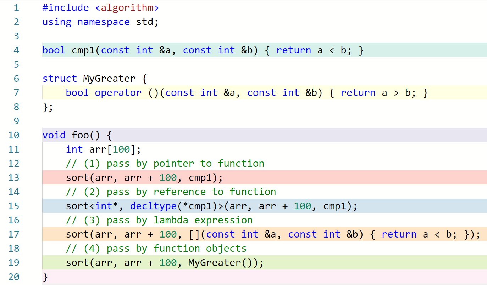
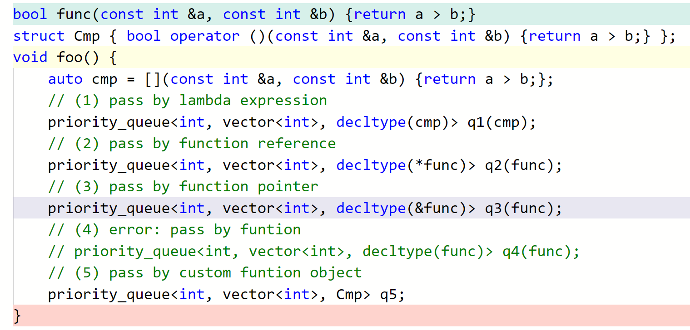

<link rel="stylesheet" href="custom_light.css">
<link rel="stylesheet" href="../custom_light.css">
<link rel="stylesheet" href="custom.css">
<link rel="stylesheet" href="../custom.css">

# 探索 C++

<br>

## Week 6  模板 (II) - 理解 STL：迭代器与函数对象

---

### 8.1 迭代器 (Iterators)

===

$C = 16$ 种容器

$A = 100$ 种算法

$C \times A$ OR $C + A$ ?

<br>

容器和算法是相互独立的；迭代器作为它们之间信息传递的通用单元<!-- .element: class="fragment" -->

===

```c++
#include <algorithm>
#include <iostream>
#include <vector>
#include <set>
#include <list>

int main() {
    std::vector<int> v = {0, 1, 2, 3, 4, 5, 6, 7, 8, 9};
    std::set<int> s = {2, 4, 1, 4, -1};
    std::list<int> l = {1, 5, 6, 2, 7};

    auto print = [](int i){ std::cout << i << ' '; };
    std::for_each(v.begin(), v.end(), print); 
    std::cout << '\n';
    std::for_each(s.begin(), s.end(), print); 
    std::cout << '\n';
    std::for_each(l.begin(), l.end(), print); 
    std::cout << '\n';
}

/* Output:
0 1 2 3 4 5 6 7 8 9 
-1 1 2 4 
1 5 6 2 7
*/
```

===

```c++
int main() {
    std::vector<int> v = {0, 1, 2, 3, 4, 5, 6, 7, 8, 9};
    std::set<int> s = {2, 4, 1, 4, -1};
    std::list<int> l = {1, 5, 6, 2, 7};

    for (int i : v) std::cout << i << ' ';
    std::cout << '\n';
    for (int i : s) std::cout << i << ' ';
    std::cout << '\n';
    for (int i : l) std::cout << i << ' ';
    std::cout << '\n';
}
```

===



===

```c++
for (int i : c) {
    /* Some Operations */
}
```

```c++
for (auto ptr = c.begin(); ptr != c.end(); go_to_next_node(ptr)) {
    int i = get_value(ptr);
    /* Some Operations */
}
```

===

#### Iterator Ranges



`last`: one-past-the-end position

`for (auto ptr = c.begin(); ptr != c.end(); go_to_next_node(ptr))`

===

从哪里开始、到哪里结束、如何找到下一个位置

对于数组呢？<!-- .element: class="fragment" -->

`for (int * ptr = a; ptr != a + N; ++ptr) int i = *ptr;`<!-- .element: class="fragment" -->

`go_to_next_node(ptr)`<!-- .element: class="fragment" -->  

`++ptr`<!-- .element: class="fragment" -->

===

为什么不是 `ptr++`？

```c++
template<typename T> class Iterator {
    T * ptr;
public:
    Iterator & operator++() {
        ptr++;
        return *this;
    }

    Iterator operator++(int) {
        auto tmp = *this;
        this++;
        return tmp;
    }
};
```

===

```c++
template<typename T> struct Node {
    T data;
    Node * next = nullptr;
    Node(const T &data = T()) : data(data) {}
};

template<typename T> class MyLList {
    Node<T> * head = new Node<T>, *tail = head;
public:
    class MyIterator;
    using iterator = MyIterator;
    
    iterator begin() { return iterator(head->next); }
    iterator end()   { return iterator(nullptr); }

    void insert_after(const T& value) {
        tail->next = new Node(value);
        tail = tail->next;
    }
};

template<typename T> class MyLList<T>::MyIterator {
    Node<T> * val;
public:
    MyIterator(Node<T> * val) : val(val) {}
    MyIterator& operator++() { 
        val = val->next;
        return *this;
    }
    bool operator!=(const MyIterator &it) {
        return val != it.val;
    }
    T& operator*() { return val->data; }
};
```

===

```c++
#include <algorithm>
#include <iostream>

int main() {
    MyLList<int> list;
    list.insert_after(3);
    list.insert_after(4);
    list.insert_after(6);
    list.insert_after(5);
    
    using std::cout;
    for (auto i : list)    cout << i << ' ';
    cout << '\n';

    std::for_each(list.begin(), list.end(), [](int &x) { x *= 2; });
    for (auto i : list)    cout << i << ' ';

    return 0;
}
```

> [Complier Explorer](https://godbolt.org/z/P3d5bvf8Y), [CppInsights](https://cppinsights.io/s/90d5fb67)

---

### 8.2 迭代器的分类

===

```c++
#include <unordered_set>
#include <algorithm>

void foo(std::unordered_set<int>& s) {
    std::sort(s.begin(), s.end());
}
```

===

```
In file included from <source>:2:
In file included from /opt/compiler-explorer/gcc-12.2.0/lib/gcc/x86_64-linux-gnu/12.2.0/../../../../include/c++/12.2.0/algorithm:61:
/opt/compiler-explorer/gcc-12.2.0/lib/gcc/x86_64-linux-gnu/12.2.0/../../../../include/c++/12.2.0/bits/stl_algo.h:1938:22: error: invalid operands to binary expression ('std::__detail::_Node_iterator<int, true, false>' and 'std::__detail::_Node_iterator<int, true, false>')
                                std::__lg(__last - __first) * 2,
                                          ~~~~~~ ^ ~~~~~~~
/opt/compiler-explorer/gcc-12.2.0/lib/gcc/x86_64-linux-gnu/12.2.0/../../../../include/c++/12.2.0/bits/stl_algo.h:4820:12: note: in instantiation of function template specialization 'std::__sort<std::__detail::_Node_iterator<int, true, false>, __gnu_cxx::__ops::_Iter_less_iter>' requested here
      std::__sort(__first, __last, __gnu_cxx::__ops::__iter_less_iter());
           ^
<source>:5:10: note: in instantiation of function template specialization 'std::sort<std::__detail::_Node_iterator<int, true, false>>' requested here
    std::sort(s.begin(), s.end());
         ^
/opt/compiler-explorer/gcc-12.2.0/lib/gcc/x86_64-linux-gnu/12.2.0/../../../../include/c++/12.2.0/bits/stl_iterator.h:621:5: note: candidate template ignored: could not match 'reverse_iterator' against '_Node_iterator'
    operator-(const reverse_iterator<_IteratorL>& __x,
    ^
/opt/compiler-explorer/gcc-12.2.0/lib/gcc/x86_64-linux-gnu/12.2.0/../../../../include/c++/12.2.0/bits/stl_iterator.h:1778:5: note: candidate template ignored: could not match 'move_iterator' against '_Node_iterator'
    operator-(const move_iterator<_IteratorL>& __x,
    ^
In file included from <source>:2:
In file included from /opt/compiler-explorer/gcc-12.2.0/lib/gcc/x86_64-linux-gnu/12.2.0/../../../../include/c++/12.2.0/algorithm:61:
/opt/compiler-explorer/gcc-12.2.0/lib/gcc/x86_64-linux-gnu/12.2.0/../../../../include/c++/12.2.0/bits/stl_algo.h:1847:18: error: invalid operands to binary expression ('std::__detail::_Node_iterator<int, true, false>' and 'std::__detail::_Node_iterator<int, true, false>')
      if (__last - __first > int(_S_threshold))
          ~~~~~~ ^ ~~~~~~~
/opt/compiler-explorer/gcc-12.2.0/lib/gcc/x86_64-linux-gnu/12.2.0/../../../../include/c++/12.2.0/bits/stl_algo.h:1940:9: note: in instantiation of function template specialization 'std::__final_insertion_sort<std::__detail::_Node_iterator<int, true, false>, __gnu_cxx::__ops::_Iter_less_iter>' requested here
          std::__final_insertion_sort(__first, __last, __comp);
               ^
/opt/compiler-explorer/gcc-12.2.0/lib/gcc/x86_64-linux-gnu/12.2.0/../../../../include/c++/12.2.0/bits/stl_algo.h:4820:12: note: in instantiation of function template specialization 'std::__sort<std::__detail::_Node_iterator<int, true, false>, __gnu_cxx::__ops::_Iter_less_iter>' requested here
      std::__sort(__first, __last, __gnu_cxx::__ops::__iter_less_iter());
           ^
<source>:5:10: note: in instantiation of function template specialization 'std::sort<std::__detail::_Node_iterator<int, true, false>>' requested here
    std::sort(s.begin(), s.end());
         ^
/opt/compiler-explorer/gcc-12.2.0/lib/gcc/x86_64-linux-gnu/12.2.0/../../../../include/c++/12.2.0/bits/stl_iterator.h:621:5: note: candidate template ignored: could not match 'reverse_iterator' against '_Node_iterator'
    operator-(const reverse_iterator<_IteratorL>& __x,
    ^
/opt/compiler-explorer/gcc-12.2.0/lib/gcc/x86_64-linux-gnu/12.2.0/../../../../include/c++/12.2.0/bits/stl_iterator.h:1778:5: note: candidate template ignored: could not match 'move_iterator' against '_Node_iterator'
    operator-(const move_iterator<_IteratorL>& __x,
    ^
2 errors generated.
```

===


`std::__detail::_Node_iterator<int, true, false>` ?

`std::unordered_set<int>::iterator`<!-- .element: class="fragment" -->

对应的迭代器并不支持计算两个元素之间距离的功能。<!-- .element: class="fragment" -->

===



===



===



===


===


===


===

#### **Input** Iterator 

能够用来标识、 **遍历** 一个容器中的元素，能够从所指的元素中 **读取** 值
- Input Iterator 只需要保证 **单趟** 算法的有效性：一旦一个 Input Iterator `it` 被 `++` 后，它之前所指的值及其所有拷贝都不再需要保证有效性

===

#### **Forward** Iterator

在 Input Iterator  的基础上，能够支持 **多趟** 算法

<br>

#### **Bidirectional** Iterator

在 Forward Iterator 的基础上，能够 **双向移动**

<br>

#### **RandomAccess** Iterator

在 Bidirectional Iterator 的基础上，能够在 **常数** 时间内移动从而指向 **任一** 元素。

===

#### **Contiguous** Iterator (C++17)

在 RandomAccess Iterator 的基础上，逻辑上相邻的元素在内存里 **物理上也相邻**。
- 指向数组中元素的 **指针** 满足 Contiguous Iterator 的所有要求。

===

#### **Output** Iterator

它和 Input Iterator 类似，需要能够用来标识、 **遍历** 一个容器中的元素，能够向所指的元素中 **写入** 值；同样不需要保证多趟算法的有效性。

Output Iterator 和前述 5 个类型是相互独立的。因此，我们称满足前述 5 个中某一个、同时还满足 Output Iterator 的迭代器为 **mutable** 的。

===



===



===

**\***  对于 deque，例如每个定长数组长度为 100，那么访问 `q[514]` 其实就是访问 `a[5][14]` ，也就是第 6 个数组里的第 15 个元素。

<br>

$\dagger$ 上表中 Unordered Associative Containers 的实现考虑了这样一个问题：如果有 $m = 10^6$ 个 bucket，但是只有 $n = 100$ 个元素，如果直接遍历 bucket 的话复杂度是 $O(m+n) >> O(n)$ 的；因此实现中额外用一个单向链表维护所有有元素的 bucket 列表，遍历时根据这个列表去找元素，复杂度就仅是 $O(n)$ 的了。

===



===

**#**  特别地， `vector<bool>` 是 `vector` 的一个显式特化，标准希望实现者可以考虑用更节省空间的方式保存 `vector<bool>` ，但是具体实现方法是 implementation defined 的（标准不指明实现方式，但是具体的实现者需要给出说明）；因此 `vector<bool>` 提供的迭代器满足的具名要求也是 implementation defined 的。

===

除了 `set`, `unordered_set`, `multiset`, `unordered_multiset` 的迭代器只有 const 的版本之外，其他容器的迭代器都有 const 和 mutable 两个版本

即其他容器的迭代器的 mutable 版本符合 output iterator 的要求，可以用它们修改指向元素的值。

===

map 系列容器可以看做键值对的集合，其元素的类型是 `std::pair<const Key, Val>`；可以看到它的 `first` 元素类型是 `const Key`，因此虽然迭代器是 mutable 的，但是只能用来修改 value，而不能用来修改 key。

===

 `sort` 需要传入的迭代器满足 Random Access Iterator；
 
 这一限制的实现方式其实就是， `sort` 的实现中会包含 `it1 - it2` ， `it + n` 之类的运算，如果不支持这些运算就无法通过编译。

===

同时， `lower_bound` 和 `upper_bound` 只需要传入的迭代器满足 Forward Iterator；但是如果还满足 Random Access Iterator，那么复杂度是 $O(\log n)$ 的；否则是 $O(n)$ 的。(我们在后面的章节讨论其实现方式)

因此，对于 `set` , `map` , `multiset` 和 `multimap` ，它们提供的迭代器不满足 Random Access Iterator，但是它们本身类内提供了自己的 `lower_bound` 函数，因此此时应该用类内的这些函数。

---

### 8.3 迭代器何必是迭代器

===

`sort` 的函数签名是什么样的？

即， `template <`_`-1-`_`> void std::sort(`_`-2-`_`)` 的 _-1-_ 和 _-2-_ 两处是什么？具体而言：

a. 为什么它既能对 vector 这样的容器进行排序，也可以对传统的数组进行排序？我们容易理解 `sort` 需要的迭代器类型是 Random Access Iterator，它如何知道 / 检查这一点？<br/>
b. 自定义比较函数是怎么实现的？如何适配有和没有自定义比较函数的两种情况的？

===

作为参数的迭代器 是一种 Random Access Iterator

「is a」relationship

===

为什么有这样的要求？

`end - begin`, `it + n`, `*it`

===


===

```c++
template<typename T>
void demo(T a, T b) {
    auto diff = a - b;
    auto t = a + (diff / 2);
    *t = 1;
}

#include <vector>
#include <map>
void foo() {
    int arr[10];
    std::vector<int> v;
    std::map<int, int> m;

    demo(arr + 2, arr + 7);
    demo(v.begin() + 1, v.end() - 1);
    // demo(m.begin(), m.end());
}
```

===


===

**Duck Typing**: If it walks like a duck and it quacks like a duck, then it must be a duck

<div class="fragment">

If something **behaves** like an iterator, then it **is** an iterator

</div>

<div class="fragment">

迭代器的分类不是一种 **类型**，而是一种 **要求**

</div>

===

在 OOP 中，我们用子类对象 **is a** 父类对象的方式来做抽象

<div class="fragment">

而在泛型编程中，我们用某个类型 **has** 某些操作的方式来做抽象

</div>

代码量、依赖度、自由度<!-- .element: class="fragment" -->

===

Java `Object` https://docs.oracle.com/javase/7/docs/api/java/lang/Object.html

===

`upper_bound`, `lower_bound`

---

### 8.4 函数又何必是函数

===

```c++
bool cmp(const int& a, const int& b) { return a > b; }
vector<int> v = {3, 1, 4, -2, 5, 3};
sort(v.begin(), v.end(), cmp);
```

`cmp`: function of type `bool(const int &, const int &)`

> 如何知道类型：https://godbolt.org/z/P545Yesrn

===

function-to-pointer conversion

`auto fp = cmp;` or `auto fp = &cmp;`

`fp`: pointer to function of type `bool (*)(const int &, const int &)`

===

A pointer to function can be used as the left-hand operand of the function call operator `()`, this invokes the pointed-to function:

```c++
bool cmp(const int& a, const int& b) { return a > b; }
void foo() {
    auto fp = &cmp;
    fp(1, 2);
}
```

===

```c++
template< class RandomIt, class Compare >
void sort( RandomIt first, RandomIt last, Compare comp ) {
    // ...
    if (comp(*it1, *it2)) {
        // ...
    }
    // ...
}
```

===


===

```c++
vector<int> v = {3, 1, 4, -2, 5, 3};
sort(v.begin(), v.end(), greater<int>());
```

```c++
template<typename T>
struct greater {
    bool operator ()(const T &lhs, const T &rhs) {
        return lhs > rhs;
    }
};
```

===

对 `()` 的重载：

`a(/* para list */)` 

等价于

 `(a).operator()(/* para list */)`

===

```c++
vector<int> v = {3, 1, 4, -2, 5, 3};
sort(v.begin(), v.end(), greater<int>());
```

```c++
template< class RandomIt, class Compare >
void sort( RandomIt first, RandomIt last, Compare comp ) {
    // ...
    if (comp(*it1, *it2)) {
        // ...
    }
    // ...
}
```

===

```c++
template<typename T>
struct greater {
    bool operator ()(const T &lhs, const T &rhs) {
        return lhs > rhs;
    }
};
```

```c++
template< class RandomIt, class Compare >
void sort( RandomIt first, RandomIt last, Compare comp ) {
    // ...
    if (comp.operator()(*it1, *it2)) {
        // ...
    }
    // ...
}
```

===

```c++
template<typename Iterator>
void sort(Iterator begin, Iterator end) {
    sort(begin, end, less<decltype(*begin)>());
}
```

```c++
template<typename Iterator>
void sort(Iterator begin, Iterator end) {
    sort(begin, end, less<typename iterator_traits<Iterator>::value_type>());
}
```

===

#### 对象 (object)

对象要有值、类型、size、生命周期等属性，描述的是一块内存上的数据及其含义。下列常见的实体不是对象：

- struct / class，包含其模板及特化，它用来 **描述** 一类对象的内存安排；
- struct / class 的非 static 成员变量；
- **function**，包含其模板及特化，它是一段代码；
- reference，它只是已有对象或函数的别名，编译器不必为它们分配内存（因此不存在引用数组、引用的引用和指向引用的指针）；等。

===

#### 函数对象 (Function Object)

任何定义了 function call operator 的对象统称为函数对象 (Function Object)。具体来说，包括：

- 函数指针；
- 任何能够转化到函数指针的类的值；
- 任何重载了 function call operator 的类的值（如 lambda 表达式）。

===

`E(A...)`, `E` 可以是：

- 函数
- 函数引用
- 函数对象
- 其他值为函数引用或函数对象的表达式

===



> https://cppinsights.io/s/bcf2606b

===

```c++
void foo() {
    int arr[100];
    // (1) pass by pointer to function
    sort(arr, arr + 100, *******cmp1);
    // (2) pass by reference to function
    sort<int *, decltype(*cmp1)>(arr, arr + 100, ****cmp1);
    sort<int *, bool(&)(const int &, const int &)>(arr, arr + 100, cmp1);
    // (3) pass by lambda expression
    sort(arr, arr + 100, [](int a, int b) { return a < b; });
    // (4) pass by function objects
    sort(arr, arr + 100, MyGreater());
}
```

===

```c++
template<class T,
    class Container = std::vector<T>,
    class Compare = std::less<typename Container::value_type> // 默认大根堆
> class priority_queue {
    Compare comp;
public:
    priority_queue() : priority_queue(Compare(), Container()) { }
    explicit priority_queue( const Compare& compare )
        : priority_queue(compare, Container()) { }
    priority_queue( const Compare& compare, Container&& cont );
    /* ... Many Other Constructors and Other Members ... */
}
```

===

```c++
bool cmp(const int& a, const int& b) { return a > b; }

void foo() {
    priority_queue<int, vector<int>, decltype(cmp)> q(cmp);
}
```


===




---

### Takeaway

- 迭代器
  - 为不同的容器提供统一的迭代接口
  - 向算法隐藏容器的不同细节
  - 容器和算法之间的桥梁
- 迭代器的分类
  - Input
  - Forward
  - Bidirectional
  - Random Access
  - Contiguous
  - Output (mutable)
  - 各种容器提供的迭代器类型

===

### Takeaway

- 迭代器何必是迭代器
  - 「要求」，而不是「类型」
  - 泛型的思想是 "has" 而不是 "is"
- 函数又何必是函数
  - 函数对象
  - 如何给 `sort` 或者 `priority_queue` 传递自定义比较器