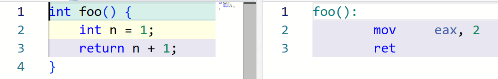
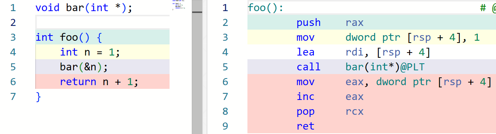
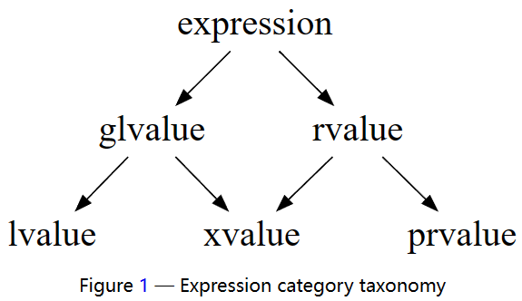
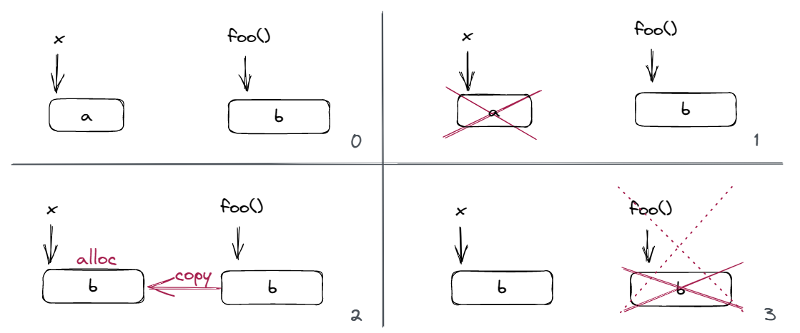
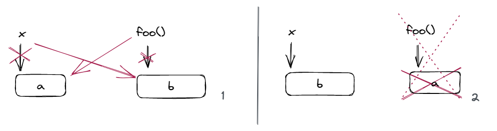
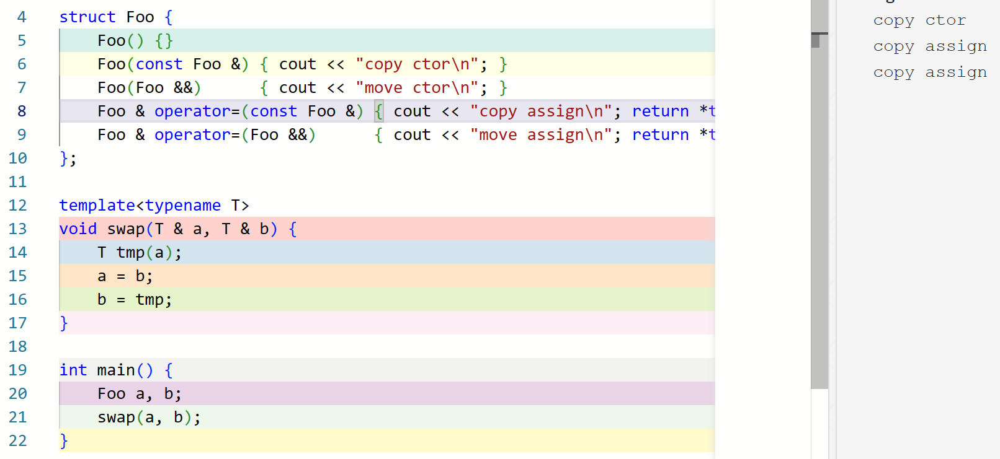
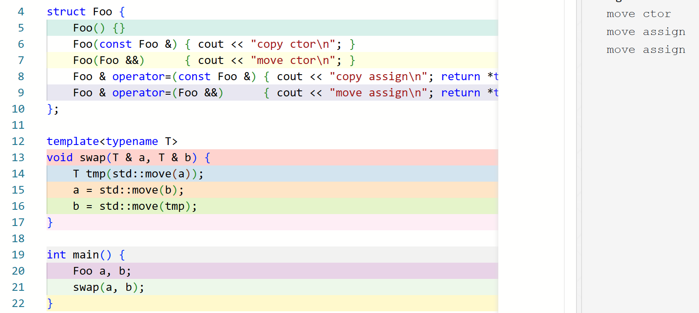
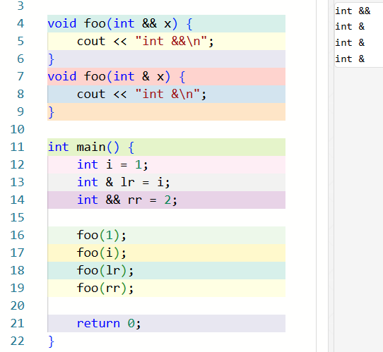

<!-- <link rel="stylesheet" href="custom_light.css">
<link rel="stylesheet" href="../custom_light.css"> -->
<link rel="stylesheet" href="custom.css">
<link rel="stylesheet" href="../custom.css">

# 探索 C++

<br>

## Week 7 右值引用与移动语义

---

`int n;`

`n = 1;`

<div class="fragment">

`1 = n;` ?

</div>

<div class="fragment">

Error: expression `1` is not assignable

</div>

`m + 1 = 2`<!-- .element: class="fragment" -->

`foo() = 3`<!-- .element: class="fragment" -->

===

#### Expressions

表达式是运算符和操作数的序列，用来指明一个计算。

表达式可以产生值，并可能导致副作用。

`std::cout << 1`

===

#### Primary expressions

- `this`
- 字面量，如 `2`, `"Hello, world"`
- `id-expressions`，如 `n`, `std::cout`
- lambda 表达式，如 `[](int& n){ n *= 2; }`
- fold-expressions
- requires-expressions

===

#### Statements

语句是按顺序执行的 C++ 程序的片段。

任何函数的函数体都是语句的序列。

===

C++ includes the following types of statements:

1. labeled statements       `EXIT: return 0;`
2. expression statements    `n = 1;`
3. compound statements      `{ n = i; i++; }`
4. selection statements     `if (n == 1) break;`
5. iteration statements     `while (n--);`
6. jump statements          `break;`, `return 0;`, `goto EXIT;`
7. declaration statements   `int n = 0;`
8. try blocks               
9. atomic and synchronized blocks (TM TS)

===

```c++
int foo() {
    int i;
    cin >> i;
    if (i < 0)
        i++;
    else
        --i;
    return i;
}
```

===

`int n;`

`n = 1;`

`1 = n;` Error: expression `1` is not assignable

`int foo();`, `foo() = 3`

`int m;`, `m + 1 = 2`

`int = int`<!-- .element: class="fragment" -->

===

`n` 和 `1` 这两个表达式的类型都是 `int`，所以它们的区别在哪里呢？

`n` refers to 一个对象，即它它表征着一块内存，其内容表示一个值

`1` 则不指向一个实在的对象，它是一个不与对象关联的值，因此它不必占据内存

`int &foo(); foo() = 3`<!-- .element: class="fragment" -->

===

#### 对象 (object)

对象要有值、类型、size、生命周期等属性，描述的是一块内存上的数据及其含义。下列常见的实体不是对象：

- struct / class，包含其模板及特化，它用来 **描述** 一类对象的内存安排；
- struct / class 的非 static 成员变量；
- function，包含其模板及特化，它是一段代码；
- reference，它只是已有对象或函数的别名，编译器不必为它们分配内存（因此不存在引用数组、引用的引用和指向引用的指针）；等。

===

事实上，每个表达式都有两个性质：

- type<!-- .element: class="fragment" -->
- value category<!-- .element: class="fragment" -->
    - lvalue (左值): 表征 (refers to) 一个对象的表达式，「locator」<!-- .element: class="fragment" -->
    - rvalue (右值): 不与对象关联的表达式<!-- .element: class="fragment" -->

===

### 7.1 lvalue & rvalue

===

为什么要做这样的区分呢？    `n += 1;`<!-- .element: class="fragment" -->

<div class="fragment">

```riscv
la   t3, p
lw   t0, 0(t3)      // t0 = p
la   t4, one       
lw   t1, 0(t4)      // t1 = one
add  t0, t0, t1     // t0 += t1
sw   t0, 0(t3)      // p = t0

p:   .word 0
one: .word 1
```

</div>

<div class="fragment">

```riscv
la   t3, p
lw   t0, 0(t3)      // t0 = p
addi t0, t0, 1      // t0 += 1
sw   t0, 0(t3)      // p = t0

p:   .word 0
```

</div>

===

让一些表达式的值不必占据内存有助于我们实现一些优化

如果我们规定所有表达式的结果都是一个对象的话，那么字面量 `1` 也需要占据一块实际的内存，这会使得代码中的内存操作变得非常多。

===

右值 **不必** 占内存，但可以占内存。前面展示的「不够好的」实现仍然是合法的：

```riscv
la   t3, p
lw   t0, 0(t3)      // t0 = p
la   t4, one       
lw   t1, 0(t4)      // t1 = one
add  t0, t0, t1     // t0 += t1
sw   t0, 0(t3)      // p = t0

p:   .word 0
one: .word 1
```

===

左值表征一个对象，因此从概念上说，它一定占据内存。

<div class="fragment">

虽然编译器有可能会对其做一些优化使其实际上不占内存：



</div>
<div class="fragment">

但这些优化只会发生在我们不会注意到的前提下：



</div>

===

#### lvalue

lvalue 用来表征一个对象，或者说一个位置。因此，lvalue 可以被取地址，以及用来初始化引用。

<div class="fragment">

不是所有左值都能出现在赋值表达式的左边，比如 `const char name [] = "Xuan";`，`name[0] = 'D';` 是非法的，虽然 `name[0]` 是个左值。这样的左值被称为 non-modifiable lvalues。除此之外的左值，可以作为内置赋值操作符 (`=`) 或者复合赋值操作符 (`+=` 等) 的左侧操作数。

</div>

===

**任何有名字的表达式都是左值。** （唯一的例外是枚举）

<div class="fragment">

**内置** 的 `++a`, `a = b`, `a += b`, `*p`, `p->m` 是 lvalue

</div>

<div class="fragment">

如果 `a[n]` 的操作数之一是 array lvalue 或者 pointer，则是 lvalue

</div>

<div class="fragment">

如果 `a` 是 lvalue，`m` 是成员变量，则 `a.m` 是 lvalue；如果`m` 是成员变量，`p->m` 是 lvalue

</div>

<div class="fragment">

目标为引用的 cast expression 是 lvalue，如 `(int&)(x)`，这一操作可以理解为初始化一个引用

</div>

<div class="fragment">

除了字符串字面量是 lvalue 以外，其他字面量都是 rvalue

（因为字符串字面量的类型是 `const char[N]`）

</div>

===

当我们将一个左值放在赋值表达式的右边时，如 `n = m;`，则会发生 lvalue-to-rvalue conversion

因为此时我们关注的是 `m` 这个对象中的值，而不是 `m` 所表征的对象本身

===

#### rvalue

rvalue 并不表征一个对象，非左值的表达式是右值。

右值表达式通常被用来完成以下两件事之一：

- 计算内置运算符的一个操作数
  - 例如 `1 + 2 + 3` 中（假设从左到右计算），`1` 和 `2` 是 rvalue，作为第一个 `+` 的操作数；`1 + 2` 也是 rvalue，作为第二个 `+` 的操作数
- 初始化一个对象
  - 初始化出的对象称为这个表达式的 result object
  - 例如 `int i = 1 + 2;`，或者 `void f(int x);`, `f(1)`。

===

枚举数 (enumerator) 和除了字符串字面量以外的字面量是 rvalue

内置的 `a++`, `a + b`, `a || b`, `a < b`, `&a` 等表达式是 rvalue

目标为非引用类型的 cast expression 是 rvalue，如 `int(3.0)`

`this` 是 rvalue

lambda 表达式是 rvalue

===

简而言之：

lvalue 是 locator，它计算出一个对象（的位置）

而 rvalue 计算出的结果用于初始化对象 (result object)，或者执行进一步的计算

---

上面的一切在大多数情况下工作良好，可惜我们有两个东西：类和引用。它们会给上述内容带来一定的疑惑。

===

```c++
struct Foo {
    int x, y, z;
};
```

`Foo f;`

`f.y` ?

base + offset: `*(f_addr + 4)`

===

`Foo func();`

`int tmp = func().y;` ?

`*(ret_val_addr + 4)`

虽然 `func()` 是个 rvalue，且它的生命周期确实在这个声明语句结束后就结束了，但是此时它必须占内存，才能用来访问字段 `y`

===

`int * p = &1;` 非法，因为 `1` 是 rvalue，无法取地址

因此 `int & r = 1;` 非法

===

「可以将一个临时对象绑定给一个 const 引用，这个临时对象的生命周期被延长以匹配这个 const 引用的生命周期」

`const int & cr = 1;`

`1` 是 rvalue，临时对象从哪来？

必须根据这个 rvalue 建立一个临时对象，用来绑定引用；临时对象本应在这个声明完成后结束，但生命周期被延长了。<!-- .element: class="fragment" -->

「rvalue 用来初始化对象」——当它用来绑定 const ref 时，事实上也是用来初始化了这个「临时对象」。<!-- .element: class="fragment" -->

===

| value category | 是否是临时的 | 是否占内存 |
| :-: | :-: | :-: |
| **lvalue** (left / locator value) | 否 | 是 |
| **rvalue** (right value) | 是 | 否 |
| **?** | 是 | 是 |

===

| value category | 是否是临时的 | 是否占内存 |
| :-: | :-: | :-: |
| **lvalue** (left / locator value) | 否 | 是 |
| **prvalue** (**pure** right value) | 是 | 否 |
| **xvalue** (**eXpiring** value) | 是 | 是 |

===

### 7.2 prvalue & xvalue

===

prvalue 用来完成这两种事情中的一种：

- 计算内置运算符的一个操作数
- 初始化一个对象
  - `int i = 1;`
  - `Foo func();`, `Foo f = func();`
    - copy elision<!-- .element: class="fragment" -->
  - `const int & r = 1;`
    - prvalue 转为 xvalue<!-- .element: class="fragment" -->

===

#### copy elision

自 C++17 开始，在以下两种情况下，对拷贝的省略是强制的：

返回一个与返回值类型相同的临时值：

```c++
T f()
{
    return T();
}
 
f(); // only one call to default constructor of T
```

初始化表达式是相同类型的临时值：

```c++
T x = T(T(f())); // only one call to default constructor of T, to initialize x
```

===

#### copy elision

自 C++17 开始，在以下两种情况下，对拷贝的省略是强制的：

返回一个与返回值类型相同的 **prvalue**：

```c++
T f()
{
    return T();
}
 
f(); // only one call to default constructor of T
```

初始化表达式是相同类型的 **prvalue**：

```c++
T x = T(T(f())); // only one call to default constructor of T, to initialize x
```

===

#### Temporary materialization

任一完整类型 `T` 的 prvalue 都可以转换为 `T` 的 xvalue，这一转换称为 **temporary materialization**

这一转化用 prvalue 初始化一个临时对象，产生表示这个临时对象的 xvalue

===

temporary materialization 发生在如下情形中：

- 将引用绑定到 prvalue，如 `const int & r = 1;`
- 对类 prvalue 进行成员访问，如 `foo().x;`（此时 `x` 也是 xvalue）
- 对于一个数组 prvalue `a`，对其进行 subscript `a[1]` 或者 array-to-pointer convsersion `f(a)` 时
- 当 prvalue 是一个 discarded-value expression 时

===

#### discarded-value expression

这样的表达式只为其副作用而使用，其值本身没有被使用。这样的表达式如果是 prvalue，那么它会被 temporary materialization。例如（以下 `a`, `b` 均为 `int`）：

- `a = 1;`
- `cout << endl;`
- `void(x);`
- `a++, b++;` 中的 `a++`

===

| value category | 是否是临时的 | 是否占内存 |
| :-: | :-: | :-: |
| **lvalue** | 否 | 是 |
| **prvalue** | 是 | 否 |
| **xvalue** | 是 | 是 |

===



我们将原来表示「临时」的 rvalue 拆分成了 prvalue 和 xvalue 两种

将表示「占内存」的 lvalue 和 xvalue 统称为 **glvalue (generalized lvalue)**

lvalue, xvalue 和 prvalue 是 primary categories，表达式属于且仅属于其中之一<!-- .element: class="fragment" -->

rvalue 和 glvalue 是 mixed categories，通常用于简便的表达<!-- .element: class="fragment" -->

===

| Property | lvalue | xvalue | prvalue |
| :-: | :-: | :-: | :-: |
| **取地址** | 是 | 否* | 否 |
| **被赋值** | 是，如果 modifiable | 否 | 否 |
| **初始化引用** | 是 | 仅能初始化 const & | materialize 为 xvalue |

\* 理论上，xvalue 占内存因此可以被允许取地址，但是由于其生命周期通常即将结束，因此获取它的地址在大多数情况下会引发错误。因此，C++ 并不允许对 xvalue 取地址。<!-- .element: class="fragment" -->

===

| value category | 是否是临时的 | 是否占内存 |
| :-: | :-: | :-: |
| **lvalue** | 否 | 是 |
| **prvalue** | 是 | 否 |
| **xvalue** | 是 | 是 |

「临时」有什么意义？

---

```c++ linenums="1"
template<typename T>
class Container {
    T* data;
    unsigned size = 0, capa;
public:
    Container(unsigned capa = 512) : data(new T[capa]), capa(capa) {}
    ~Container() { delete[] data; }
    Container(const Container &) = delete;
    Container & operator=(const Container &rhs) {
        if (this == &rhs)   return *this;
        if (capa != rhs.capa) {
            delete[] data;
            data = new T[rhs.capa];
        }
        for (unsigned i = 0; i < rhs.size; i++)
            data[i] = rhs[i];
        capa = rhs.capa;
        size = rhs.size;
        return *this;
    }

    T& operator[](unsigned index) { return data[index]; }
    const T& operator[](unsigned index) const { return data[index]; }

    unsigned getSize() const { return size; }
    unsigned getCapa() const { return capa; }

    Container & add(const T& val) { 
        /* if full, expand storage */
        data[size++] = val;
        return *this; 
    }
    // ...
};
```

===

```c++
Container<int> foo() {
    Container<int> c;
    // perhaps use c in various ways
    return c;
}

void bar() {
    Container<int> x;
    // perhaps use x in various ways
    x = foo();
}
```

NRVO 不是强制的

===

```c++
Container & operator=(const Container &rhs) {
    // ...
    delete[] data;
    data = new T[rhs.capa];
    // copy ...
    return *this;
}
```



===


```c++
template<typename T>
Container<T> & Container<T>::operator=(/* some type */ rhs) {
    delete[] data;
    data = rhs.data;
    rhs.data = nullptr; // delete nullptr is safe
    // ...
    return *this;
}
```

===

### 移动语义 (moving semantics)<!-- .element: class="fragment" -->



```c++
template<typename T>
Container<T> & Container<T>::operator=(/* some type */ rhs) {
    swap(data, rhs.data);
    swap(size, rhs.size);
    swap(capa, rhs.capa);
    return *this;
}
```

===

`/* some type */` 是什么？

- `Container<T> &`?
    - rvalue 不能绑定给 non-const ref<!-- .element: class="fragment" -->
- `const Container<T> &`?
    - 无法修改成员<!-- .element: class="fragment" -->
- `Container<T> *`?
    - rvalue 不能取地址<!-- .element: class="fragment" -->

===

### 7.3 右值引用 (rvalue reference)

为了实现移动语义，C++11 引入了右值引用。

对于任何类型 `X`，`X&&` 被称为「对 `X` 的右值引用」。右值引用只能绑定右值。

为了与此区分，`X&` 现在被称为「对 `X` 的左值引用」。

===

```c++
template<typename T>
Container<T> & Container<T>::operator=(Container<T>&& rhs) {
    swap(data, rhs.data);
    swap(size, rhs.size);
    swap(capa, rhs.capa);
    return *this;
}
```

由于这样的赋值运算符实现移动语义，因此它也被称为 **移动赋值运算符 (moving assignment operator)** 。

===

右值引用只能绑定右值：

```c++
int z = 1;
int && y = z; // Error: rvalue reference to type 'int' 
              // cannot bind to lvalue of type 'int'

int && x = 1; // OK; materialization occurs
```

左值引用和右值引用在「能做什么事」的方面没有区别，其区别是什么值可以绑定给这个引用。

===

与移动赋值类似，移动构造函数完成通过移动语义构造一个对象。例如：

```c++
template<typename T>
Container<T>::Container(Container<T>&& rhs) :
    data(rhs.data), size(rhs.size), capa(rhs.capa) {
        rhs.data = nullptr;
    }
```

注意：由于 C++17 的强制 copy elision，现在移动构造函数只会在用 xvalue 构造时被调用；用 prvalue 构造时，移动构造不会发生。

===

「临时」意味着可以利用移动语义窃取（重用）其资源，从而避免不必要的拷贝。

```c++
Container<int> foo();

void bar() {
    Container<int> x, y;
    // perhaps use x and y in various ways
    x = foo();  // move assignment (if no copy elision)
    y = x;      // copy assignment
}
```

===

| value category | 是否是临时的 | 是否占内存 |
| :-: | :-: | :-: |
| **lvalue** | 否 | 是 |
| **prvalue** | 是 | 否 |
| **xvalue** | 是 | 是 |

===

| value category | 是否可以复用资源 | 是否占内存 |
| :-: | :-: | :-: |
| **lvalue** | 否 | 是 |
| **prvalue** | 是 (materialize) | 否 |
| **xvalue** | 是 | 是 |

===

| | Has identity (**glvalue**) | Doesn't have identity |
| :-: | :-: | :-: |
| Can't be moved from | lvalue | - |
| Can be moved from (**rvalue**) | xvalue | prvalue's materalization |
===

```c++ linenums="1"
template<class T>
void swap(T& a, T& b) 
{ 
    T tmp(a); 
    a = b;  
    b = tmp;
} 

Container<int> a, b;
swap(a, b);
```

===



===

#### `std::move`<!-- .element: class="fragment" -->

我们希望用移动语义，因为我们明知原来的值不需要保留

<div class="fragment">

`std::move` 帮我们完成「将参数转换为右值」这个事情：

```c++ linenums="1"
template<class T>
void swap(T& a, T& b) 
{ 
    T tmp(std::move(a));
    a = std::move(b); 
    b = std::move(tmp); 
} 

Container<int> a, b;
swap(a, b);
```

</div>

===



===

对于一个函数调用表达式：

- 如果函数返回值类型不是引用，则该表达式是 prvalue
- 如果函数返回值类型是左值引用，则该表达式是 lvalue
- 如果函数返回值类型是对象的右值引用（如 `std::move`），则该表达式是 xvalue

类似地，对于一个 cast 表达式：

- 如果目标不是引用，则该表达式是 prvalue
- 如果目标是左值引用，则该表达式是 lvalue
- 如果目标是对象的右值引用，则该表达式是 xvalue

===

对于一个函数调用表达式：

- 如果函数返回值类型是对象的右值引用（如 `std::move`），则该表达式是 xvalue

对于一个 cast 表达式：

- 如果目标是对象的右值引用，则该表达式是 xvalue

`y = std::move(x);`<!-- .element: class="fragment" -->

`y = (Foo&&)(x);`<!-- .element: class="fragment" -->

`y = static_cast<Foo&&>(x);`<!-- .element: class="fragment" -->

===

```c++
void foo(int && x) {
    cout << "int &&\n";
}
void foo(int & x) {
    cout << "int &\n";
}

int main() {
    int i = 1;
    int & lr = i;
    int && rr = 2;

    foo(1);
    foo(i);
    foo(lr);
    foo(rr);

    return 0;
}
```

===



一个右值引用本身是一个左值。<!-- .element: class="fragment" -->

「有名字的表达式都是左值。」<!-- .element: class="fragment" -->

===

移动语义最开始的场景 `x = foo();` 是在「不影响结果的地方」使用，因为这样一定不会带来问题

`std::move` 的含义则是「程序员明确知道这里使用移动不影响结果」，程序员对这样的移动语义负责

但是，如果右值引用被视为右值：

```c++
template<typename T>
void foo(Container<T> && x) {
    Container<T> y = x;
    // ...
}
```

===

#### member functions with ref-qualifier

非静态成员函数可以有 ref-qualifier，用来在重载解析阶段根据调用者的值类型选择不同的重载：

```c++
struct S {
    void f() &  { std::cout << "lvalue\n"; }
    void f() && { std::cout << "rvalue\n"; }
};
 
int main() {
    S s;
    s.f();            // prints "lvalue"
    std::move(s).f(); // prints "rvalue"
    S().f();          // prints "rvalue"
}
```

===

与 cv-qualification 不同，ref-qualification 不改变 `this` 指针的属性

在 rvalue ref-qualified function 中，`*this` 仍然是 lvalue

> https://andreasfertig.blog/2022/07/the-power-of-ref-qualifiers/

---

### 7.4 移动构造运算符与移动赋值函数

===

```c++
template<typename T>
Container<T> & Container<T>::operator=(Container<T>&& rhs) {
    swap(data, rhs.data);
    swap(size, rhs.size);
    swap(capa, rhs.capa);
    return *this;
}

template<typename T>
Container<T>::Container(Container<T>&& rhs) :
    data(rhs.data), size(rhs.size), capa(rhs.capa) {
        rhs.data = nullptr;
}
```

===

#### SMFs

- **default ctor**
- **dtor**
- **copy ctor**
- **move ctor** (C++11)
- **copy assignment operator**
- **move assignment operator** (C++11)

===

- **default ctor** - `T::T()`
    - 如果没有任何用户声明的构造函数（包括拷贝构造或移动构造），则被隐式声明<!-- .element: class="fragment" -->
    - 隐式声明的构造函数仍有可能被定义为删除，如该类有无 default initializer 的引用或 const 非静态成员，或有无法构造或析构的非静态成员或基类<!-- .element: class="fragment" -->
    - 没有被定义为删除的隐式声明，如果被使用，则被编译器隐式定义；其他 SMFs 也一样<!-- .element: class="fragment" -->
- **dtor** - `T::~T()`
    - 如果没有用户声明的析构函数，则被隐式声明<!-- .element: class="fragment" -->
    - 隐式声明的析构函数仍有可能被定义为删除，如该类有无法析构的非静态成员或基类<!-- .element: class="fragment" -->

===

- **copy ctor** - `T::T(const T&)` or `T::T(T&)`
    - 如果没有用户声明的拷贝构造函数，则被隐式声明<!-- .element: class="fragment" -->
    - 如果每个基类和非静态成员都能以 const ref 的方式构造，则签名为前者，否则为后者<!-- .element: class="fragment" -->
    - 隐式声明被定义为删除，如果该类有无法拷贝构造或析构的非静态成员或基类，或者该类有用户定义的移动构造或移动赋值<!-- .element: class="fragment" -->
- **move ctor** - `T::T(T&&)` (C++11) 
    - 如果没有用户定义的移动构造函数，且该类没有用户声明的拷贝构造、拷贝赋值、移动赋值或析构函数中的任何一种，则被隐式声明<!-- .element: class="fragment" -->
    - 隐式声明被定义为删除，如果该类有不能移动或无法析构的非静态成员或基类；此时重载解析忽略这个函数<!-- .element: class="fragment" -->

===

- **copy assignment operator** - `T& T::operator=(const T&)` or `T& T::operator=(T&)`
    - 如果没有用户声明的拷贝赋值运算符，则被隐式声明<!-- .element: class="fragment" -->
    - 如果每个基类和非静态成员都能以 const ref 的方式拷贝赋值，则签名为前者，否则为后者<!-- .element: class="fragment" -->
    - 隐式声明被定义为删除，如果该类有无法拷贝的非静态成员或基类，或者有引用或 const 非静态成员，或者该类有用户定义的移动构造或移动赋值<!-- .element: class="fragment" -->
- **move assignment operator** - `T& T::operator=(T&&)` (C++11) 
    - 如果没有用户定义的移动赋值运算符，且该类没有用户声明的拷贝构造、移动构造、拷贝赋值或析构函数中的任何一种，则被隐式声明<!-- .element: class="fragment" -->
    - 隐式声明被定义为删除，如果该类有不能移动的非静态成员或基类，或者有引用或 const 非静态成员；此时重载解析忽略这个函数<!-- .element: class="fragment" -->

===

#### Rule of Three

如果用户需要自定义一个类的拷贝构造、拷贝赋值或者析构函数，那么基本上这三个都是必要的。否则，会出现一些错误。

===

#### Rule of Five

如果一个类有用户定义的析构函数、拷贝构造或拷贝赋值，则该类的移动构造和移动赋值的隐式定义会被阻止。因此，这样的类如果希望实现移动语义，则这五个函数都应被定义。否则，会错过一些优化机会。

===

#### Rule of Zero

应当遵循单一职责原则，即一个类要么只用来管理资源，要么就不应该有涉及资源管理的操作

===

```c++
class String {
    char * content = nullptr;
public:
    String(const char * str = "") {
        if (str) {
            content = new char[strlen(str) + 1];
            strcpy(content, str);
        }
    }

    String(const String &s) {
        content = new char[strlen(s.content) + 1];
        strcpy(content, s.content);
    }

    String(String &&s) noexcept
        : content(std::exchange(s.content, nullptr)) {}

    String & operator=(const String &s) {
        if (this == &s)     return *this;
        if (!content || strlen(content) != strlen(s.content)) {
            delete[] content;
            content = new char[strlen(s.content) + 1];
        }
        strcpy(content, s.content);
        return *this;
    }

    String & operator=(String && s) noexcept {
        std::swap(content, s.content);
        return *this;
    }

    ~String() {
        delete[] content;
    }
};

class Msg {
    String content;
    unsigned from, to;
public:
    explicit Msg(const char * content, unsigned from, unsigned to) : 
        content(content), from(from), to(to) {}
};
```

> https://godbolt.org/z/1q9qcK9Pb

===

```c++
class String {
    char * content = nullptr;
public:
    String(const char * str = "") {
        if (str) {
            content = new char[strlen(str) + 1];
            strcpy(content, str);
        }
    }

    String(const String &s) : String(s.content) {}

    String(String &&s) noexcept
        : content(std::exchange(s.content, nullptr)) {}

    String & operator=(const String &s) {
        return *this = String(s);
    }

    String & operator=(String && s) noexcept {
        std::swap(content, s.content);
        return *this;
    }

    ~String() {
        delete[] content;
    }
};
```

> https://godbolt.org/z/K75zo4xM6

===

```c++
class Msg {
    std::string content;
    unsigned from, to;
};
```

---

```c++
struct Foo {
// ...
    Foo(int x);
};

void func(vector<Foo> & v) {
    v.push_back(Foo(0));
}
```

===

```c++ linenums="1"
template<typename T>
class Container {
    T* data;
    unsigned size = 0, capa;
public:
    Container(unsigned capa = 512) : data(new T[capa]), capa(capa) {}
    ~Container() { delete[] data; }
    Container(const Container &) = default;
    Container & operator=(const Container &rhs);

    T& operator[](unsigned index) { return data[index]; }
    const T& operator[](unsigned index) const { return data[index]; }

    unsigned getSize() const { return size; }
    unsigned getCapa() const { return capa; }

    Container & add(const T& val) { 
        /* if full, expand storage */
        data[size++] = val;
        return *this; 
    }
    // ...
};
```

===

===

forward

universial ref

---

### Takeaway

- **value categories**
    - lvalue & rvalue
        - 表达式的两个性质：type 和 value category
        - `n = 1` vs `1 = n`
        - **lvalue**: locator, refer to an object；「有名字的表达式都是左值」
        - **rvalue**: 用于初始化或者计算
    - prvalue & xvalue
        - 有时需要 materialization，即 prvalue 到 xvalue 的转换，产生一个临时对象
        - 发生的情景：用 prvalue 绑定引用，或者成员 / 下标访问等
        - glvalue: lvalue / xvalue
        - rvalue: xvalue / prvalue

===

### Takeaway

- **value categories**


| | Has identity (**glvalue**) | Doesn't have identity |
| :-: | :-: | :-: |
| Can't be moved from | lvalue | - |
| Can be moved from (**rvalue**) | xvalue | prvalue's materalization |

===

### Takeaway

- 右值引用和移动语义
    - 「临时」的意义：可以利用移动语义窃取（重用）其资源，从而避免不必要的拷贝
    - 实现方式：右值引用 `T&&`
    - 左值引用和右值引用在「能做什么事」的方面没有区别，其区别是什么值可以绑定给这个引用
    - 移动赋值运算符 `T& T::operator=(T&&)`，移动构造函数 `T::T(T&&)`
    - 「明知原来的值不需要保留」：`std::move`，将参数转换为右值
    - 右值引用本身是左值
    - member functions with ref-qualifier
- 移动构造运算符与移动赋值函数
    - 对 SMFs 的扩充和总结
    - Rule of Three / Five / Zero

===

### Takeaway

- 完美转发
    - 保留参数的左值 / 右值性
    - `std::forward`
    - 引用折叠与 universal reference
    - `std::move` 的实现