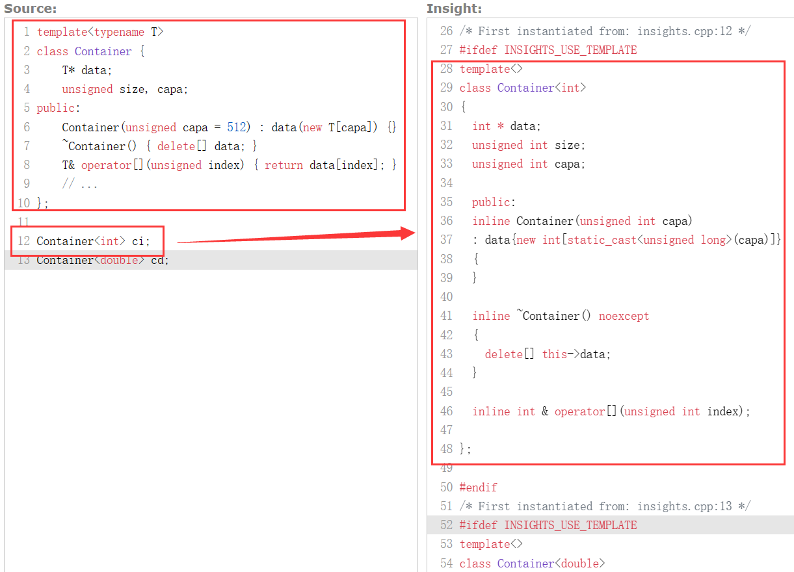
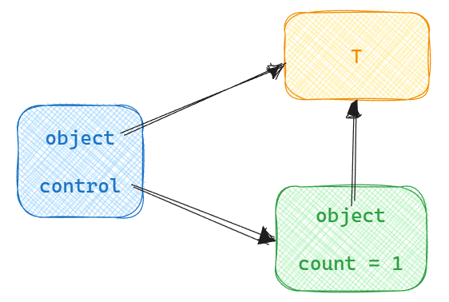
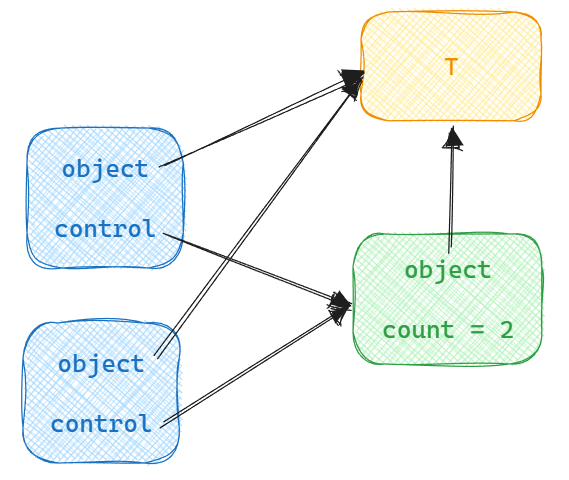
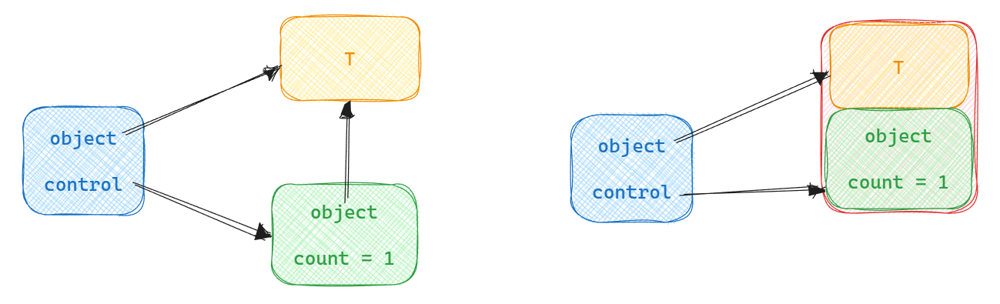

<link rel="stylesheet" href="custom_light.css">
<link rel="stylesheet" href="../custom_light.css">
<link rel="stylesheet" href="custom.css">
<link rel="stylesheet" href="../custom.css">

# 探索 C++

<br>

## Week 8 智能指针基础

===

> 本节部分内容来自以下演讲：
> - [Back to Basics: C++ Smart Pointers - David Olsen - CppCon 2022](https://youtu.be/YokY6HzLkXs)
> - [CppCon 2014: Herb Sutter "Back to the Basics! Essentials of Modern C++ Style"](https://youtu.be/xnqTKD8uD64)
> - [Back to Basics: Templates (part 1 of 2) - Bob Steagall - CppCon 2021](https://youtu.be/XN319NYEOcE)

---

### 补充：模板的显式特化与偏特化

===

隐式实例化：编译器会根据参数和模板生成出一个实际的类

这个类为对应模板的一个 **特化 (specialization)**



===

#### 显式特化 | Explicit Specialization

「当模板参数是 ... 时，做一些特殊的处理」

```c++
template<typename T>
const T & min(const T & a, const T & b) {
    return (a < b) ? a : b;
}

template<>
const char * min(const char * pa, const char * pb) {
    return (strcmp(pa, pb) < 0) ? pa : pb;
}
```

===

```c++
template<typename T>
class Container {...}

template<>
class Container<bool> {...}
```

===

#### 偏特化 | Partial Specialization

「当部分模板参数是 ... 时，做一些特殊的处理」

```c++
template<typename T, typename Allocator = std::allocator<T> >
struct vector { ... };

template<typename Allocator>
struct vector<bool, Allocator> { ... };
```

===

```c++
template <class T> struct Foo {
   const int IsPointer = 0;
};

template <class T> struct Foo<T*> {
   const int IsPointer = 1;
};
```

---

```c++
void science(double* data, int N) {
    double* temp = new double[N*2];
    do_setup(data, temp, N);
    if (!needed(data, temp, N))
        return;
    calculate(data, temp, N);
    delete[] temp;
}
```

===

```c++
void science(double* data, int N) {
    double* temp = new double[N*2];
    do_setup(data, temp, N);
    if (!needed(data, temp, N)) {
        delete[] temp;
        return;
    }
    calculate(data, temp, N);
    delete[] temp;
}
```

===

```c++
float* science(float* x, float* y, int N) {
    float* z = new float[N];
    saxpy(2.5, x, y, z, N);
    delete[] x;
    delete[] y;
    return z;
}
```

===

### 指针包含了太多信息

- **单个对象 / 数组**
  - 单个对象：使用 `new`, `delete`; 不应使用 `++p`, `--p`, `p[n]` (where `n != 0`)
  - 数组：使用 `new[]`, `delete[]`; 可以使用 `++p`, `--p`, `p[n]`

===

### 指针包含了太多信息

- **单个对象 / 数组**
- **所有权**
  - 所有者必须在使用完成后释放内存
  - 非所有者不允许释放内存

```c++
float* science(float* x, float* y, int N) {
    float* z = new float[N];
    saxpy(2.5, x, y, z, N);
    delete[] x;
    delete[] y;
    return z;
}
```

===

### 指针包含了太多信息

- **单个对象 / 数组**
- **所有权**
- **指针是否可以为空**

但是它们看起来都是 `T*`，类型系统本身不能提供任何信息。

===

### 「智能」

- **单个对象 / 数组**：它知道使用 `delete[]` 还是 `delete`
- **所有权**：在使用完成后自动销毁，不需要手动释放
- **指针是否可以为空**：某些时候，可以强制要求指针不为空

===

### 「单一职责原则」

```c++
class String {
    char * content = nullptr;
public:
    String(const char * str = "") {
        if (str) {
            content = new char[strlen(str) + 1];
            strcpy(content, str);
        }
    }

    String(const String &s) : String(s.content) {}

    String(String &&s) noexcept
        : content(std::exchange(s.content, nullptr)) {}

    String & operator=(const String &s) {
        return *this = String(s);
    }

    String & operator=(String && s) noexcept {
        std::swap(content, s.content);
        return *this;
    }

    ~String() {
        delete[] content;
    }
};
```

===

### 「单一职责原则」

```c++
class Msg {
    std::string content;
    unsigned from, to;
};
```

---

## 智能指针 | Smart Pointers

===

「智能」
- 自动回收资源
- 一些限制，例如不允许空指针
- 更多的安全限制或检查

「指针」
- 能像指针一样，指向对象、执行间接访问

===

### 垃圾回收 | Garbage Collection

「回收 **不可达** 的对象」

===

- 如何判断可达性？
  - Reference Counting<!-- .element: class="fragment" -->
  - Mark-and-sweep (From Root set)<!-- .element: class="fragment" -->
    - Memory Compacting<!-- .element: class="fragment" -->
- 知道对象不可达时，回收多大空间？
  - 类型安全<!-- .element: class="fragment" -->
    - `void *`<!-- .element: class="fragment" -->
    - `union`<!-- .element: class="fragment" -->

===

- 需要考虑哪些指标？
  - 总体运行时间
  - 碎片
  - 停顿时间
  - Locality
- 更多考虑
  - 并行 / 并发
  - 类型不安全

===

https://www.iecc.com/gclist/GC-faq.html

---

## `std::unique_ptr`

- `#include <memory>`
- 是对象的所有者，并假设是唯一的所有者
- 自动回收资源
- 只能移动，不能拷贝

===

```c++ [1-8|4|5|6|7|8]
void calculate_more(HelperType&);

ResultType do_work(InputType inputs) {
    std::unique_ptr<HelperType> owner( new HelperType(inputs) );
    owner->calculate();
    calculate_more(*owner);
    return owner->important_result();
}
```

===

```c++ [1-10|6-7|8]
WidgetBase* create_widget(InputType);

class MyClass {
    std::unique_ptr<WidgetBase> owner;
public:
    MyClass(InputType inputs)
        : owner(create_widget(inputs)) { }
    ~MyClass() = default;
    // ... member functions that use owner-> ...
};
```

===

### 实现思路：成员类型

```c++
template <typename T>
struct unique_ptr {
    // ...
    using element_type = T;
    using pointer = T*;
    // ...
};
```

===

### 实现思路：构造与析构

```c++
template <typename T>
class unique_ptr {
    T* ptr;
public:
    unique_ptr() noexcept : ptr(nullptr) { }
    explicit unique_ptr(T* p) noexcept : ptr(p) { }
    ~unique_ptr() noexcept { delete ptr; }
    // ...
};
```

===

### 实现思路：移动构造与移动赋值

```c++ [1-15|3-4|6-7|8-13]
template <typename T> struct unique_ptr {
    // ...
    unique_ptr(unique_ptr const&) = delete;
    unique_ptr& operator=(unique_ptr const&) = delete;

    unique_ptr(unique_ptr&& o) noexcept
        : ptr(std::exchange(o.ptr, nullptr)) { }
    unique_ptr& operator=(unique_ptr&& o) noexcept {
        delete ptr;
        ptr = o.ptr;
        o.ptr = nullptr;
        return *this;
    }
    // ...
};
```

===

### 实现思路：重载运算符

```c++
template <typename T>
struct unique_ptr {
    // ...
    T& operator*() const noexcept {
        return *ptr;
    }
    T* operator->() const noexcept {
        return ptr;
    }
    // ...
    };
```

   `owner->calculate()`  
=> `( owner.operator->() )->calculate()`  
=> `ptr->calculate()`

===

### 实现思路：其他成员函数

```c++
template <typename T> struct unique_ptr {
    T* release() noexcept {
        T* old = ptr;
        ptr = nullptr;
        return old;
    }
    void reset(T* p = nullptr) noexcept {
        delete ptr;
        ptr = p;
    }
    T* get() const noexcept { 
        return ptr; 
    }
    explicit operator bool() const noexcept {
        return ptr != nullptr;
    }
};
```

===

### `std::make_unique`

`std::unique_ptr<HelperType> owner( new HelperType(inputs) );`

写成下面这样更好：

`auto owner = std::make_unique<HelperType>(inputs);`

<br>

「no raw `new`」

===

```c++
template <typename T, typename... Args>
unique_ptr<T> make_unique(Args&&... args);
```

开辟内存、使用 `args` 构造 `T`、放到 `unique_ptr<T>` 里

动机：更好写、异常安全

===

### 数组类型

`std::unique_ptr` 为数组类型做了偏特化 `std::unique_ptr<T[]>`

- 在析构函数中，默认使用 `delete[]` 而非 `delete`
- 提供了 `operator[]`

`std::make_unique` 也为数组类型做了偏特化

- 接受的参数是数组大小而非构造函数参数

===

```c++
void science(double* data, int N) {
    double* temp = new double[N*2];
    do_setup(data, temp, N);
    if (!needed(data, temp, N))
        return;
    calculate(data, temp, N);
    delete[] temp;
}
```

===

```c++
void science(double* data, int N) {
    auto temp = std::make_unique<double[]>(N * 2);
    do_setup(data, temp.get(), N);
    if (!needed(data, temp.get(), N))
        return;
    calculate(data, temp.get(), N);
}
```

===

### 所有权转移

使用移动构造 / 移动赋值完成

```c++
auto a = std::make_unique<T>();
// ...
std::unique_ptr<T> b{ std::move(a) };
// ...
a = std::move(b);
```

===

```c++
float* science(float* x, float* y, int N) {
    float* z = new float[N];
    saxpy(2.5, x, y, z, N);
    delete[] x;
    delete[] y;
    return z;
}
```

===

需要给一个函数传递所有权时，按值传递 `unique_ptr`

需要从一个函数返回所有权时，按值传递 `unique_ptr`

```c++
std::unique_ptr<float[]> science(
        std::unique_ptr<float[]> x,
        std::unique_ptr<float[]> y, int N) {
    auto z = std::make_unique<float[]>(N);
    saxpy(2.5, x.get(), y.get(), z.get(), N);
    return z;
}
```

`auto result = science(std::move(upx), std::move(upy), N);`

===

```c++
unique_ptr<widget> factory();               // source – produces widget
void sink( unique_ptr<widget> );            // sink – consumes widget
void reseat( unique_ptr<widget>& );         // "will" or "might" reseat ptr
void thinko( const unique_ptr<widget>& );   // usually not what you want
```

===

在有所有权转移的地方，使用智能指针；在不涉及所有权转移的地方，仍然继续使用指针和引用即可

```c++
void f(widget & w) {    // if required
    use(w);
}

void g(widget * w) {    // if optional
    if (w) use(*w);
}

auto upw = make_unique<widget>();
f(*upw);
g(upw.get());
```

===

### 陷阱

```c++
T* p = ...;
std::unique_ptr<T> a{p};
std::unique_ptr<T> b{p};
// crash due to double free

auto c = std::make_unique<T>();
std::unique_ptr<T> d{c.get()};
// crash due to double free
```

除非明确知道一个指针来自哪里，而且它确实需要一个所有者，否则不要用它初始化 `unique_ptr`

===

### `unique_ptr` 可以在容器中使用

```c++
std::vector<std::unique_ptr<T>> v;
v.push_back(std::make_unique<T>());
std::unique_ptr<T> a;
v.push_back(std::move(a));
v[0] = std::make_unique<T>();
auto it = v.begin();
v.erase(it);
```

---

## `std::shared_ptr`

- `#include <memory>`
- 是对象的所有者，但可能有若干个 `shared_ptr` 共同指向一个对象
- 可以被拷贝
- 当指向一个对象的最后一个 `shared_ptr` 不再指向它，对象被析构

===

```c++
template <typename T>
struct shared_ptr {
    // ...
    using element_type = T;
    // ...
};
```

===





===

```c++
template <typename T>
struct shared_ptr {
    // ...
    shared_ptr() noexcept;      // Creates empty shared_ptr
    explicit shared_ptr(T*);    // Starts managing an object
    ~shared_ptr() noexcept;     // Decrements count, and ...
                                // Cleanup if count == 0
    // ...
};
```

===

```c++
template <typename T>
struct shared_ptr {
    // ...
    shared_ptr(shared_ptr const&) noexcept;     // copy ptrs, count++
    shared_ptr(shared_ptr&&) noexcept;          // transfer ownership
    shared_ptr(unique_ptr<T>&&);                // transfer ownership
    
    // origin count will decrease, possibly cleanup:
    shared_ptr& operator=(shared_ptr const&) noexcept;
    shared_ptr& operator=(shared_ptr&&) noexcept;
    shared_ptr& operator=(unique_ptr<T>&&);
    // ...
};
```

===

```c++
template <typename T>
struct shared_ptr {
// ...
    T& operator*() const noexcept;
    T* operator->() const noexcept;

    void reset(T*);
    T* get() const noexcept;
    long use_count() const noexcept;
    explicit operator bool() const noexcept;
// ...
};
```

===

### `std::make_shared`

```c++
template <typename T, typename... Args>
shared_ptr<T> make_shared(Args&&... args);
```



===

### 陷阱

```c++
T* p = ...;
std::shared_ptr<T> a(p);
std::shared_ptr<T> b(p);
// runtime error: double free

auto a = std::make_shared<T>();
std::shared_ptr<T> b(a.get());
// runtime error: double free

auto a = std::make_shared<T>();
std::shared_ptr<T> b(a);
std::shared_ptr<T> c;
c = b;
// Good
```

===

### 陷阱

The reentrancy pitfall

```c++
// global (static or heap), or aliased local
... shared_ptr<widget> g_p ...

void f( widget& w ) { g(); use(w); }
void g() { g_p = ... ; }

void my_code() {
    f( *g_p );  // bad
    g_p->foo(); // bad
}
```

===

"Pin" using unaliased local copy

```c++
// global (static or heap), or aliased local
... shared_ptr<widget> g_p ...

void f( widget& w ) { g(); use(w); }
void g() { g_p = ... ; }

void my_code() {
    auto pin = g_p; // 1 ++ for whole tree
    f( *pin ); // ok, *local
    pin->foo(); // ok, local->
}
```

===

```c++
shared_ptr<widget> factory();               // source + shared ownership 
void share( shared_ptr<widget> );           // share: "will" retain refcount
void reseat( shared_ptr<widget>& );         // "will" or "might" reseat ptr
void may_share( const shared_ptr<widget>& );// "might" retain refcount
```

===

`shared_ptr` added support for array types in C++17

`make_shared` added support for array types in C++20

---

## Rule of Zero

C++11 改进了语言和标准库，提供了对动态分配对象生命周期管理的更好工具，在这种背景下 Rule of Zero 被提出，作为对之前 Rule of Three 的更新

- `std::string` 代为管理字符串
- STL 容器代为管理数据类型，如 `std::vector` 或者 `std::array` 代为管理数组
- 智能指针代为管理动态内存
- `std::fstream` 等代为管理文件读写

===

## 高级话题

- 线程安全
- 异常安全
- `std::weak_ptr`
- 自定义 deleters
- 有继承关系的 casts
- `shared_from_this`

---

### Takeaway

- `std::unique_ptr` 和 `std::shared_ptr`
  - 前者没有额外开销，后者有
- 使用 `std::make_unique` 和 `std::make_shared`
- 不要使用 `new` `delete` 以及 owning `*`；用智能指针代替它们，从而明确表现所有权
  - 如果对象需要共享，使用 `shared_ptr`
  - 如果不需要或者不知道需不需要，用 `unique_ptr`
- Non-owning 时，使用 `*` 和 `&` 仍然是好的
- Rule of Zero

===

### Takeaway

```c++
void no_ownership(widget&);                 // when required
void no_ownership(widget*);                 // when optional

unique_ptr<widget> factory();               // source: produces widget
void sink( unique_ptr<widget> );            // sink: consumes widget
void reseat( unique_ptr<widget>& );         // "will" or "might" reseat ptr
void thinko( const unique_ptr<widget>& );   // usually not what you want

shared_ptr<widget> factory();               // source + shared ownership 
void share( shared_ptr<widget> );           // share: "will" retain refcount
void reseat( shared_ptr<widget>& );         // "will" or "might" reseat ptr
void may_share( const shared_ptr<widget>& );// "might" retain refcount
```