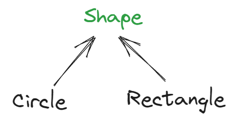
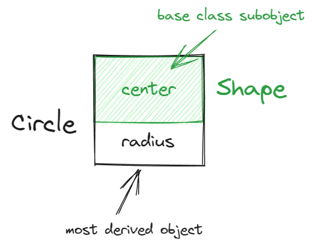
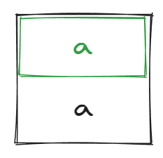
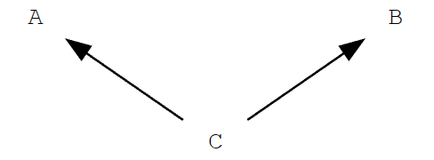
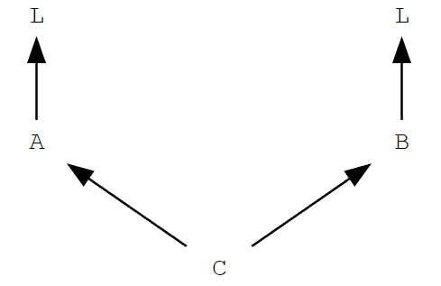
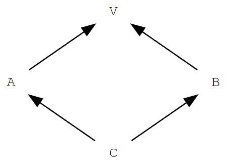
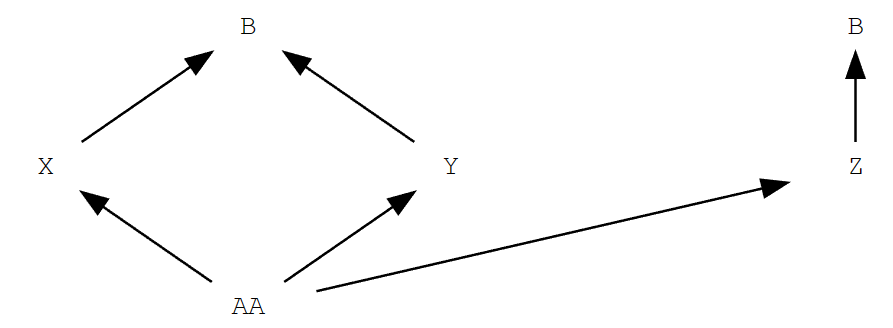
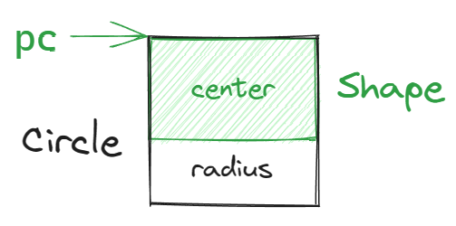

<link rel="stylesheet" href="custom_light.css">
<link rel="stylesheet" href="../custom_light.css">
<link rel="stylesheet" href="custom.css">
<link rel="stylesheet" href="../custom.css">

# 探索 C++

<br>

## 11 类 (IV) - 继承

===

本文部分图片来自以下演讲：

[Back to Basics: Class Layout - Stephen Dewhurst - CppCon 2020](https://youtu.be/SShSV_iV1Ko)

[CppCon 2017: Arthur O'Dwyer “dynamic_cast From Scratch”](https://youtu.be/QzJL-8WbpuU)

---

```c++
class Shape {       // 基类 Shape
private:
    void prepare()  { /* 做一些准备（例如准备画笔）*/ } 
    void finalize() { /* 做一些后续处理（例如重置画笔）*/ }
public:
    Point center;   // 共有的成员变量

    void draw() {   // 共有的成员函数
        prepare();
        do_draw();
        finalize();
    }
    virtual void do_draw() = 0; // 要求所有派生类都实现 do_draw()
};

class Circle : public Shape {   // Circle 继承 Shape
public:
    int radius;     // 独有的成员变量
    void do_draw() override {...}
};

class Rectangle : public Shape { // Rectangle 继承 Shape
public:
    int width, height; // 独有的成员函数
    void do_draw() override {...}
};
```

===





===

```c++ [1-24|14,21-22]
class Shape {       // 基类 Shape
    void prepare()  { /* 做一些准备（例如准备画笔）*/ } 
    void finalize() { /* 做一些后续处理（例如重置画笔）*/ }
    Point center;   // 共有的成员变量
public:
    Shape(int x, int y) : center(x, y) {}
    void draw() { ... }
    virtual void do_draw() = 0; // 要求所有派生类都实现 do_draw()
};

class Circle : public Shape {   // Circle 继承 Shape
    int radius;     // 独有的成员变量
public:
    Circle(int x, int y, int r) : Shape(x, y), radius(r) {}
    void do_draw() override {...}
};

class Rectangle : public Shape { // Rectangle 继承 Shape
    int width, height; // 独有的成员变量
public:
    Rectangle(int x, int y, int w, int h) 
        : Shape(x, y), width(w), height(h) {}
    void do_draw() override {...}
};
```

===

```c++
struct Base {
    Base()  { cout << "Base ctor\n"; }
    ~Base() { cout << "Base dtor\n"; }
};

struct Derived : public Base {
    Derived()  { cout << "Derived ctor\n"; }
    ~Derived() { cout << "Derived dtor\n"; }
};

int main(){
    Base b;
    cout << "****\n";
    Derived d;
    cout << "****\n";
    return 0;
}

/* Output:
Base ctor
****
Base ctor
Derived ctor
****
Derived dtor
Base dtor
Base dtor
*/
```

===

封装

- 将数据组合
- **将函数与之捆绑**
- 访问控制

===

```c++
int a;

void foo() {
    int b = a;
    int a;
    a = 2;
}
```

===

```c++
class Base {
    int a;
};

class Derived : public Base {};
```

```c++
class Base {
    int a;
};

class Derived : public Base {
    int a;
};
```

`Derived d;` `d.a`

<!-- Unless redeclared in the derived class, members of a base class are also considered to be members of the derived class.  -->
<!-- ^[class.derived.general#2](https://timsong-cpp.github.io/cppwp/n4868/class.derived.general#2)^ -->

===

隐藏，而非覆盖



===

```c++
struct Base {
    int a;
};

struct Derived : public Base {
    int a;
};

int main(){
    Derived d;
    d.a = 1;
    d.Base::a = 2;
    cout << d.a << " " << d.Base::a;
    return 0;
}

// Output: 1 2
```

===

```c++
#include<iostream>
using namespace std;

class B {
public:
    int f(int i) { cout << "f(int): "; return i+1; }
    // ...
};

class D : public B {
public:
    double f(double d) { cout << "f(double): "; return d+1.3; }
    // ...
};

int main()
{
    D* pd = new D;
    cout << pd->f(2.3) << '\n';
    cout << pd->f(2) << '\n';
    return 0;
}

/* Output:
f(double): 3.6
f(double): 3.3
*/
```

Attempting to hide (eliminate, revoke, privatize) inherited public member functions is an all-too-common design error.

===

```c++
#include<iostream>
using namespace std;

class B {
public:
    int f(int i) { cout << "f(int): "; return i+1; }
    // ...
};

class D : public B {
public:
    using B::f; // make every f from B available
    double f(double d) { cout << "f(double): "; return d+1.3; }
    // ...
};

int main()
{
    D* pd = new D;
    cout << pd->f(2) << '\n';
    cout << pd->f(2.3) << '\n';
    return 0;
}

/* Output:
f(int): 3
f(double): 3.6
*/
```

---

### 访问控制

```c++
class Base {
    int a;
};

struct Derived : public Base {
    void foo() { 
        a++;    // error: 'a' is a private member of 'Base'
    }
};
```

类外（包括子类）不能访问 `private` 成员，除非声明为 `friend`

但是，派生类和 the general public 可能并不一样：派生类理应看到更多的东西<!-- .element: class="fragment" -->

===

#### `protected`

```c++ [2-3|8|13]
class Base {
protected:
    int a;
};

struct Derived : public Base {
    void foo() { 
        a++;    // OK
    }
};

void bar(Derived & d) {
    d.a++;      // error: 'a' is a protected member of 'Base'
}
```

===

#### `protected` 和 `private` 继承

```c++
class Base {
  public:
    int x;
  protected:
    int y;
  private:
    int z;
};

class PublicDerived: public Base {
    /*
    x is public
    y is protected
    z is not accessible from PublicDerived
    */
};

class ProtectedDerived: protected Base {
    /* 
    x is protected
    y is protected
    z is not accessible from ProtectedDerived
    */
};

class PrivateDerived: private Base {
    /*
    x is private
    y is private
    z is not accessible from PrivateDerived
    */
};
```

===

受控的是访问权而不是可见性

```c++
int a;
class X {
    int a;
};
class XX : public X {
    void f() { a = 1; }     // which a?
};
```

---

```c++
class Base { /* ... */ };
class Derived1 : public Base { /* ... */ };
class Derived2 : public Derived1 { /* ... */ };
```


===

```c++
class A { /* ... */ };
class B { /* ... */ };
class C : public A, public B { /* ... */ };
```



===

```c++
class L { /* ... */ };
class A : public L { /* ... */ };
class B : public L { /* ... */ };
class C : public A, public B { /* ... */ };
```



===

```c++
class V { /* ... */ };
class A : virtual public V { /* ... */ };
class B : virtual public V { /* ... */ };
class C : public A, public B { /* ... */ };
```



===

```c++
class B { /* ... */ };
class X : virtual public B { /* ... */ };
class Y : virtual public B { /* ... */ };
class Z : public B { /* ... */ };
class AA : public X, public Y, public Z { /* ... */ };
```



<!-- https://isocpp.org/wiki/faq/multiple-inheritance -->

===

类的初始化顺序为：

- 首先将 virtual base classes 按深度优先的顺序构造，同深度中则按 base-specifier list 从左到右的顺序初始化
- 然后，所有的 direct base 按照 base-specifier list 从左到右的顺序初始化<!-- .element: class="fragment" -->
- 然后，将所有的 non-static data member 按照其在类定义中声明的顺序初始化<!-- .element: class="fragment" -->
- 最后，运行构造函数的函数体<!-- .element: class="fragment" -->

类的析构顺序与上述描述相反<!-- .element: class="fragment" -->

---

### 向上转型

```c++
Shape * pc = new Circle(0, 0, 1);   // OK
Circle c(1, 1, 2);
Shape & rc = c;                     // OK
```



===

```c++
Shape s = c;
s = c;
```

`Shape::Shape(const Shape &);`<!-- .element: class="fragment" -->

`Shape& Shape::operator=(const Shape &);`<!-- .element: class="fragment" -->

**object slicing**<!-- .element: class="fragment" -->

===

```c++
class B {
public:
    B(const B&) = delete;
    B& operator=(const B&) = delete;
};

class D : public B {};

int main()
{
    D d;        
    B b = d;    // error: call to deleted constructor of 'B'
    b = d;      // error: overload resolution selected deleted operator '='
}
```

===

### 标准转换 | Standard Conversion

- 调整或变换
  - array-to-pointer conversion: `void f(int *);` `int a[10];` `f(a);`
  - qualification conversion: `void f(const int *);` `int *p;` `f(p);`
- Promotion
  - integral promotion: `void f(int);` `char c;` `f(c);`
  - floating-point promotion: `void f(double);` `float x;` `f(x);`
- Numeric conversions
  - integral conversion: `void f(int);` `long long l;` `f(l);`
  - floating-point conversion: `void f(float);` `double x;` `f(x);`
  - floating-integral conversion: `void f(int);` `double x;` `f(x);`
  - pointer conversion: `T * p = nullptr;` `void * p2 = p;` 
    - **Upcast: `Base * pb = &derived;`**
  - boolean conversion: `bool b1 = i, b2 = p, b3 = x;`

---

### `virtual`

`virtual` 关键字说明一个 non-static member function 是一个 **virtual function**

Virtual functions 的行为可以被派生类 **override**（重写 / 覆盖）
- 如果基类有虚函数 `Base::vf`，子类有一个名字、参数列表、cv-qualification、ref-qualifier 都相同的函数 `Derived::vf`，则称后者 override 了前者 

```c++
struct Base {
    virtual void print() { cout << "Base\n"; }
};

struct Derived : public Base {
    void print() override { cout << "Derived\n"; }
};
```

声明或继承了 virtual function 的类称为 **polymorphic class**

===

#### virtual function call

对虚函数的调用称为 virtual call 或者 virtual function call，它会使用调用对象的实际类型中的 the final overrider

```c++
Base b;
Derived d;
Base * pb1 = &b, * pb2 = &d;
Derived * pd = &d;
Base & rb1 = b, & rb2 = d;
Derived & rd = d;

b.print();      // virtual call
d.print();      // virtual call
pb1->print();   // virtual call
pb2->print();   // virtual call
pd->print();    // virtual call
rb1.print();    // virtual call
rb2.print();    // virtual call
rd.print();     // virtual call
pd.Base::print(); // non-virtual call
```

https://godbolt.org/z/v579zT4z1

https://godbolt.org/z/ajs63xz63

===

```c++ [1-19|16-19|8-12|10,13]
class Shape {       // 基类 Shape
private:
    void prepare()  { /* 做一些准备（例如准备画笔）*/ } 
    void finalize() { /* 做一些后续处理（例如重置画笔）*/ }
public:
    Point center;   // 共有的成员变量

    void draw() {   // 共有的成员函数
        prepare();
        do_draw();
        finalize();
    }
    virtual void do_draw() = 0; // 要求所有派生类都实现 do_draw()
};

void drawAll(const std::vector<Shape *> & v) {
    for (auto p : v)
        p->draw();
}
```

===

### 纯虚函数和抽象类

`virtual void do_draw() = 0;` 是 pure virtual function

纯虚函数 **不必** 有实现，但是也可以有

对于一个类，如果它存在至少一个 final overrider 为 pure virtual 的函数，则这个类是一个 **抽象类** (abstract class)

抽象类不能用于声明对象或数据成员，但是可以作为 base class subobject；因此也不能作为参数、返回值和转换的目标类型

可以有抽象类的指针或者引用

===

```c++
struct Abstract {
    virtual void f() = 0;  // pure virtual
}; // "Abstract" is abstract

struct Concrete : public Abstract {
    void f() override {}   // non-pure virtual
    virtual void g();      // non-pure virtual
}; // "Concrete" is non-abstract
 
struct Abstract2 : public Concrete {
    void g() override = 0; // pure virtual overrider
}; // "Abstract2" is abstract

// definition of the pure virtual function
void Abstract::f() {
    std::cout << "A::f()\n";
}

int main() {
    // Abstract a;   // Error: abstract class
    Concrete b;      // OK
    Abstract& a = b; // OK to reference abstract base
    a.f();           // virtual dispatch to Concrete::f()
    a.Abstract::f(); // non-virtual call
    // Abstract2 a2; // Error: abstract class (final overrider of g() is pure)
}
```

===

### `final`

```c++
class Base final {};

struct Derived : public Base {}; // error: base 'Base' is marked 'final'
```

```c++
struct Base {
    virtual void print() final { cout << "Base\n"; }
};

struct Derived : public Base {
    void print() override {} // error: declaration of 'print' overrides a 'final' function
};
```

===

派生类可以重新定义 (类似但不是 override) 非 virtual 成员函数，但通常不要这么做。

做这样的事情的场景一般是，子类有更多的信息，从而能以更高的效率完成 **相同** 的工作；但程序员应当保证子类和基类的这一函数的行为是相同的。

---

### 虚函数的通常实现 - virtual table (vtable)

===

```c++
class Base {
public:
  virtual arbitrary_return_type virt0( /*...arbitrary params...*/ );
  virtual arbitrary_return_type virt1( /*...arbitrary params...*/ );
  virtual arbitrary_return_type virt2( /*...arbitrary params...*/ );
  virtual arbitrary_return_type virt3( /*...arbitrary params...*/ );
  virtual arbitrary_return_type virt4( /*...arbitrary params...*/ );
  // ...
};
```

static vtable:

```c++
FunctionPtr Base::__vtable[5] = {
  &Base::virt0, &Base::virt1, &Base::virt2, &Base::virt3, &Base::virt4
};
```

===

```c++
class Base {
public:
  // ...
  FunctionPtr* __vptr;  // Supplied by the compiler, 
                        // hidden from the programmer
  // ...
};
```

```c++
Base::Base( /*...arbitrary params...*/ )
  : __vptr(&Base::__vtable[0])  // Supplied by the compiler, 
                                // hidden from the programmer
  // ...
{
  // ...
}
```

===

```c++
class Der : public Base {
public:
  virtual arbitrary_return_type virt0( /*...arbitrary params...*/ ) override;
  virtual arbitrary_return_type virt1( /*...arbitrary params...*/ ) override;
  virtual arbitrary_return_type virt2( /*...arbitrary params...*/ ) override;
  // ...
}
```

```c++
FunctionPtr Der::__vtable[5] = {
  &Der::virt0, &Der::virt1, &Der::virt2, &Base::virt3, &Base::virt4
                                          ↑↑↑↑          ↑↑↑↑ // Inherited as-is
};
```

===

```c++
void mycode(Base* p) {
  p->virt3();
}
```

```c++
void mycode(Base* p) {
  p->__vptr[3](p);
}
```

```c++
FunctionPtr Base::__vtable[5] = {
  &Base::virt0, &Base::virt1, &Base::virt2, &Base::virt3, &Base::virt4
};

FunctionPtr Der::__vtable[5] = {
  &Der::virt0, &Der::virt1, &Der::virt2, &Base::virt3, &Base::virt4
};
```

===

### virtual call 的开销

```c++
Base b;
Derived d;
Base * pb1 = &b, * pb2 = &d;
Derived * pd = &d;
Base & rb1 = b, & rb2 = d;
Derived & rd = d;

b.print();      // virtual call
d.print();      // virtual call
pb1->print();   // virtual call
pb2->print();   // virtual call
pd->print();    // virtual call
rb1.print();    // virtual call
rb2.print();    // virtual call
rd.print();     // virtual call
pd.Base::print(); // non-virtual call
```

https://godbolt.org/z/nre68aj4n

===

`undefined reference to 'vtable for Derived'`

通常的编译器实现会将 vtable 放在定义了第一个非 inline virtual 函数被定义的编译单元

https://godbolt.org/z/oq3zPj67s

---

### Takeaway

- 继承：在基类的基础上增加内容
  - 注意作用域引发的问题
- 访问控制: `protected`
- 多继承、虚继承简介
- 构造和析构的顺序
- 向上转型
- 虚函数、纯虚函数、抽象类
- `final` 和 `override` (C++11)
- 虚函数的常见实现：vtable


===

### 没有讨论的话题

- `protected` 和 `private` 继承
- 多继承和虚继承
- RTTI
- vtable 里还有什么
- class layout

TODO：构造和析构与 virtual