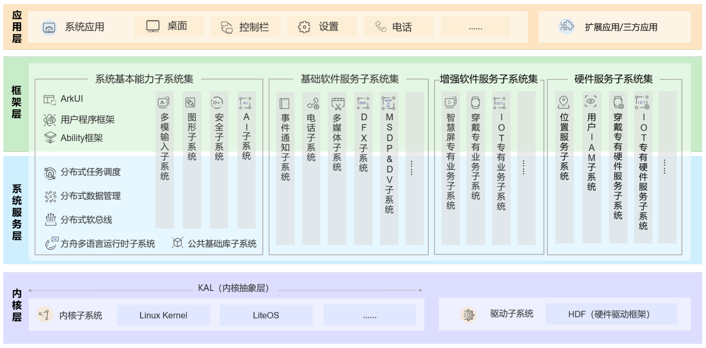
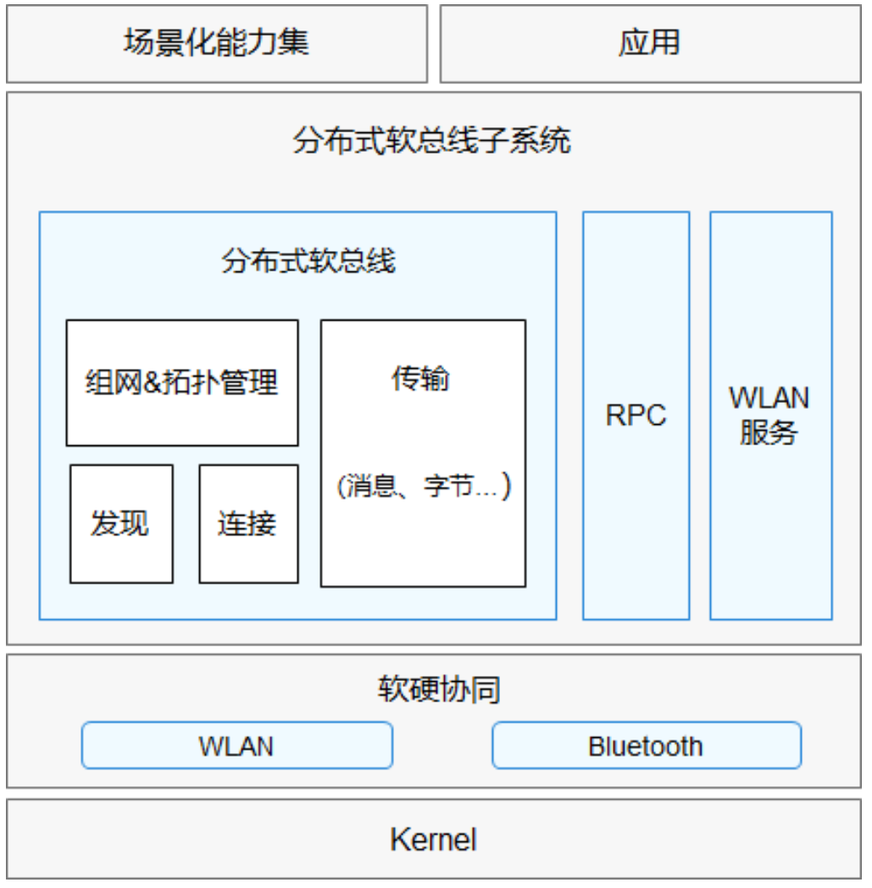
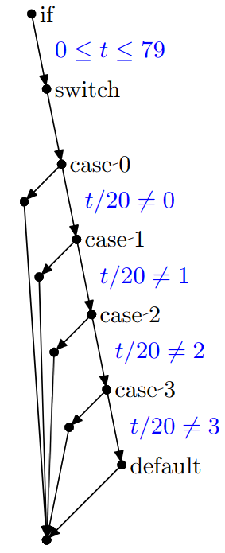
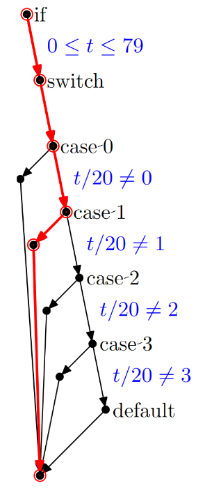
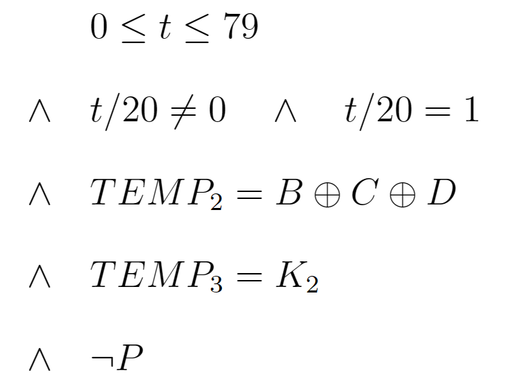

<link rel="stylesheet" href="custom_white.css">
<link rel="stylesheet" href="../custom_white.css">
<link rel="stylesheet" href="custom.css">
<link rel="stylesheet" href="../custom.css">


<!-- .slide: class="custom-background" -->

## 基于 CBMC 的
## OpenHarmony 分布式软总线组件源码
## 自动化验证实践

<br>

<!--  -->

<!-- <br> -->

#### 信息安全1901 解雲暄 3190105871 

<br>

#### 指导教师：赵永望

---

### OpenHarmony 技术架构



智能终端设备操作系统的开源框架和平台

===

### 分布式软总线组件技术架构



提供统一的分布式通信功能，帮助设备之间快速发现、连接和高效传输数据

---

### CBMC | C Bounded Model Checker

```c++
if ((0 <= t) && (t <= 79))
    switch (t / 20) {
    case 0:
        TEMP2 = ((B AND C) OR (~B AND D));
        TEMP3 = (K1);
        break;
    case 1:
        TEMP2 = ((B XOR C XOR D));
        TEMP3 = (K2);
        break;
    case 2:
        TEMP2 = ((B AND C) OR (B AND D) OR (C AND D));
        TEMP3 = (K3);
        break;
    case 3:
        TEMP2 = (B XOR C XOR D);
        TEMP3 = (K4);
        break;
    default:  assert(0);
    }
```

===



===

#### 利用 SAT / SMT 求解器

<style>
.image-container {
    display: flex;
    justify-content: space-between;
  }
</style>

<div class="image-container">
  
  
</div>

===

#### 循环展开

```c++
while (cond)
    Body;
```

```c++
if (cond) {
    Body;
    if (cond) {
        Body;
        if (cond) {
            Body;
            assume(!cond);
        }
    }
}
```

===

### CBMC | C Bounded Model Checker


---

---

### 总结

===

### 局限性

---

## 基于 CBMC 的
## OpenHarmony 分布式软总线组件源码
## 自动化验证实践

<br>

<!--  -->

<!-- <br> -->

#### 信息安全1901 解雲暄 3190105871 

<br>

#### 指导教师：赵永望