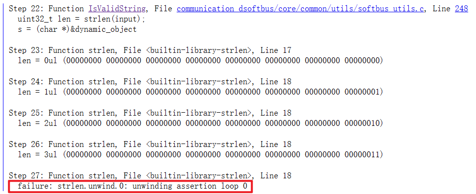

<link rel="stylesheet" href="custom_white.css">
<link rel="stylesheet" href="../custom_white.css">
<link rel="stylesheet" href="custom.css">
<link rel="stylesheet" href="../custom.css">


<!-- .slide: class="custom-background" -->

## 基于 CBMC 的
## OpenHarmony 分布式软总线组件源码
## 自动化验证实践

<br>

<!--  -->

<!-- <br> -->

#### 信息安全1901 解雲暄 3190105871 

<br>

#### 指导教师：赵永望

---

### OpenHarmony 技术架构


智能终端设备操作系统的开源框架和平台

===

### 分布式软总线组件技术架构


提供统一的分布式通信功能，帮助设备之间快速发现、连接和高效传输数据

---

### CBMC | C Bounded Model Checker

```c++
if ((0 <= t) && (t <= 79))
    switch (t / 20) {
    case 0:
        TEMP2 = ((B AND C) OR (~B AND D));
        TEMP3 = (K1);
        break;
    case 1:
        TEMP2 = ((B XOR C XOR D));
        TEMP3 = (K2);
        break;
    case 2:
        TEMP2 = ((B AND C) OR (B AND D) OR (C AND D));
        TEMP3 = (K3);
        break;
    case 3:
        TEMP2 = (B XOR C XOR D);
        TEMP3 = (K4);
        break;
    default:  assert(0);
    }
```

===


===

#### 利用 SAT / SMT 求解器

<style>
.image-container {
    display: flex;
    justify-content: space-between;
  }
</style>

<div class="image-container">
  
  
</div>

===

#### 循环展开

```c++
while (cond)
    Body;
```

```c++
if (cond) {
    Body;
    if (cond) {
        Body;
        if (cond) {
            Body;
            assume(!cond);
        }
    }
}
```

===

### CBMC | C Bounded Model Checker


===

### 性质

用户给定断言：`__CPROVER_assert( cond );`

自动生成断言：`--pointer-check`
- 缓冲区溢出
- 指针安全
- 内存泄漏
- 除以 0
- NaN
- 算术溢出

---

```c++
bool IsValidString(const char *input, uint32_t maxLen) {
    if (input == NULL) 
        return false;

    uint32_t len = strlen(input);
    if (len >= maxLen) 
        return false;

    return true;
}
```

===

```c++
bool IsValidString(const char *input, uint32_t maxLen);
```

```c++
#include "../../include/xyx_proof_includes.h"
#include "softbus_utils.h"

void harness(void) {
    uint32_t maxLen;
    uint32_t size;

    __CPROVER_assume(size > 0);
    char * str = malloc(size);

    bool res = IsValidString(str, maxLen);

    if (!str)
        __CPROVER_assert(res == false, 
            "IsValidString should return false if str is a null pointer.");
}
```

===


===

#### Loop unwinding failure



<center>

`--unwind 3`

`--remove-function-body` <!-- .element: class="fragment" -->

</center>

===

```c++
bool IsValidString(const char *input, uint32_t maxLen);
```

```c++
#include "../../include/xyx_proof_includes.h"
#include "softbus_utils.h"

void harness(void) {
    uint32_t maxLen;
    uint32_t size;

    __CPROVER_assume(size > 0);
    char * str = malloc(size);

    if (str)
        __CPROVER_assume(str[size - 1] == 0);

    bool res = IsValidString(str, maxLen);

    if (!str)
        __CPROVER_assert(res == false, 
            "IsValidString should return false if str is a null pointer.");
}
```
---

### 总结

===

### 局限性

---

## 基于 CBMC 的
## OpenHarmony 分布式软总线组件源码
## 自动化验证实践

<br>

<!--  -->

<!-- <br> -->

#### 信息安全1901 解雲暄 3190105871 

<br>

#### 指导教师：赵永望