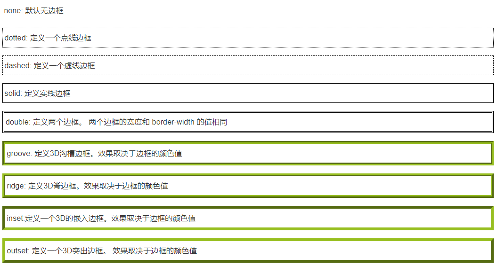
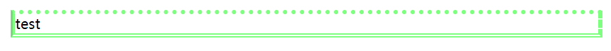

# 0 开始之前

- 本次学习主要参考[CSS 简介 | 菜鸟教程](https://www.runoob.com/css/css-intro.html)以及[CSS 教程 | w3school](https://www.w3school.com.cn/css/index.asp)；

第三部分 **CSS布局** 参考 DIV+CSS(WEB标准) | 标准之路（网站已关闭）。

- 本次学习基于[咸鱼暄的HTML入门](https://www.yuque.com/xianyuxuan/coding/html)（实际上是两边一起学qwq）。

- CSS, Cascading Style Sheets, 层叠样式表。
- **样式** 定义如何显示HTML元素，样式通常存储在 **样式表** 中。
- **外部样式表** 可以极大提高工作效率，通常存储在 **CSS文件** 中。
- 多重样式将层叠（合并）为一个。当同一个HTML元素被多个样式定义时，内联样式（在HTML元素内部）>内部样式表（在标签中的样式声明） >外部样式表 >浏览器缺省设置。


# 1 CSS基础

## 1.1 CSS基本语法

- CSS的语法是 **selector {declaration; ... declaration; }** 即：选择器和一条或多条声明
- **选择器** 是需要改变样式的HTML元素
- **声明** 由一个属性和一个值组成，格式为 **property:value;** 

例如：
```css
p
{
  color:red;
  text-align:center;
}
```
上例表示p元素（即 **段落** ）中文本显示的样式为：红色，居中。


## 1.2 CSS属性
1.1的例子中，color、text-align都是CSS的属性。下面列举出一些CSS的属性：


### 1.2.1 CSS背景（Backgrounds）
CSS背景属性用于定义HTML元素的背景。<br />页面的背景颜色使用在 **body** 的选择器中。

      - **背景颜色    background-color** 

颜色可以通过多种方式定义，如：

         - **颜色名称** ：如red, yellow
         - **十六进制** ：格式为 **#RRGGBB** ，所有RR（红色）、GG（绿色）、BB（蓝色）的值都需要介于00到FF之间（即0到255之间），表示 **对应颜色的明度** 。如 #ff0000 表示红色。
         - **RGB** ：格式为 **RGB(R,G,B)** (大小写不敏感）。其中R, G, B的值可在0至255之间，意义同上。如：rgb(255,0,0)。
         - **RGBA** ：格式为 **RGBA(R,G,B,Alpha)** (大小写不敏感），其中RGB同上，Alpha参数指定 **对象的透明度** ，介于0.0（全透明）至1.0（全不透明）之间。
         - 等。

这也是**一般的颜色设置方式**。

      - **背景图片    background-image** 

如： ` background-image:url('background.jpg')` 。<br />默认情况下，背景图片进行平铺重复展示，覆盖整个元素实体。如果需要更改平铺方式，可以使用下面的属性：

         - **背景图片的平铺方式    background-repeat**

其值可取为：

            - **repeat** ，默认方式，水平和垂直方向平铺重复展示。
            - **repeat-x** ，只在水平方向平铺重复展示。
            - **repeat-y** ，只在竖直方向平铺重复展示。
            - **no-repeat** ，不平铺重复展示。
            - **inherit** ，继承父元素的设置。

我们也可以给背景图片设置定位。这会用到下面的属性：

         - **背景图片的定位    background-position** 

格式为： **background-position:X Y;** 或 **background-position:inherit;（从父元素继承）**<br />其中X、Y表示图片在横、纵方向的定位，可取值为：

            - **关键字** 。X : right, center, left;  Y : top, center, bottom。
            - **页面比例** 。0%至100%。
            - **绝对位置** 。如20px，3mm等。需要注意：数字和单位之间不能有空格。

若未定义，则默认为 **0 0，即左上角** ；若只定义一个，则另一个默认为 **center** 。<br />上述取值可以混用。

         - **背景图片的滚动    background-attachment** 

其值可取为：

            - **scroll** ，默认方式，背景图片随页面滚动而滚动。
            - **fixed** ，背景图片固定。
            - **local** ，背景图片随元素的滚动而滚动。
            - **inherit** ，继承父元素的设置。

为了简化上述代码，我们可以将上述属性合并在同一个属性中。其简写属性为：

      - **背景的简写属性    background** 

各个值用空格隔开，顺序为： **color image repeat attachment position** 。可以省略其中的部分内容，使用其默认设置。


### 1.2.2 CSS文本（Text）
CSS中控制文本格式的属性有：

      - **文本颜色    color** 

参见1.2.1中一般的颜色设置方式。

      - **文本方向    direction** 

其值可取为： **ltr（默认）, rtl** ，分别为从左到右、从右到左。

      - **字符间距    letter-spacing** 

其值为绝对长度，可为负值。

      - **词间距    word-spacing**

可理解为空格的长度。其值为绝对长度，可为负值。

      - **设置行高    line-height** 

其值可为数字（文字高度的倍数），百分比或绝对数值（不能为负值）。

      - **文本对齐方式    text-align** 

其值可取为： **left（默认）, right, center, justify, inherit** 。其中 **justify** 为两端对齐。

      - **文本修饰    text-decoration** 

类似1.2.1中背景的简写属性，text-decoration其实是text-decoration-line/color/style三种属性的缩写。其中：

         - **文本修饰使用的线条类型    text-decoration-line** 

其值可取为：

            - **none** ，默认，无线型。
            - **overline** ，上方显示一条线。
            - **line-through** ，中间显示一条线。
            - **underline** ，下方显示一条线。

这些线型可以叠加，用空格隔开即可。

         - **文本修饰使用的线条颜色    text-decoration-color** 

参见1.2.1中一般的颜色设置方式。

         - **文本修饰使用的线条样式    text-decoration-style** 

其值可取为：

            - **solid** ，默认，实线。
            - **double** ，双实线。
            - **dotted** ，点状线。
            - **dashed** ，虚线。
            - **wavy**，波浪线。 

      - **文本转换    text-transform** 

其值可取为：

            - **none** ，默认，不处理。
            - **capitalize** ，每个单词以大写字母开头。
            - **uppercase** ，所有字母显示为大写。
            - **lowercase** ，所有字母显示为小写。

      - **文本缩进    text-indent** 

其值可为绝对长度或百分比。百分比基于父元素宽度的。

      - **文本阴影    text-shadow** 

格式为： **text-shadow:X Y B color** 。其中X Y表示水平、数值阴影相对文本向右、向下的距离，可为负值，必需；B表示阴影模糊的距离，可选；color表示阴影的颜色，可选。


### 1.2.3 CSS字体（Fonts）
CSS中控制字体的属性是 **font** 

### 1.2.4 CSS链接（Link）（未完成）

### 1.2.5 CSS表单（UL）（未完成）

### 1.2.6 CSS表格（Table）（未完成）


## 1.3 CSS选择器
例如HTML代码：
```html
<!DOCTYPE HTML>
<head>
  <meta charset="utf-8">
  <style>
    p{color:red; margin-left:20px; text-decoration:overline;}
    #title_1{text-align:center;}
    .backg_1{background-color:rgb(255,255,0);}
    p.under{text-decoration:underline;}
    .del p{text-decoration:line-through;}
  </style>
  <title>CSS</title>
</head>
<body>
  <h2 id="title_1" class="under backg_1">Hello?</h2>
  <p class="under backg_1">在吗qwq</p>
  <p class="under">晚上好呀</p>
  <p>晚安安呐</p>
  <div class="del">
    <p>嘻嘻</p>
  </div>
</body>
```
效果是：<br />
其中头部的style元素中包含了4种选择器，下面逐一解释：


### 1.3.1 指定HTML元素
`p{color:red; margin-left:20px; text-decoration:overline;}` ，将所有p元素中的文本定义为：红色，缩进20px，上划线。效果中第四行即为对应的体现。


### 1.3.2 标有特定ID的元素
`#title_1{text-align:center;}` ，将id="title_1"的元素的文本定义为：居中。可以看到，效果中的第一行即为居中，因为这一部分的标签中具有id="title_1"的属性。 **CSS中的ID选择器以“#”来定义** 。


### 1.3.3 具有特定class属性的元素
`.backg_1{background-color:rgb(255,255,0);}`，将class="backg_1"的元素的文本定义为：黄色背景色。可以看到，效果中第一、第二行即为黄色背景。 **CSS中类选择器以“.”来定义** 。<br />`p.under{text-decoration:underline;}`， **指定了特定的HTML元素使用class** 。此语句将所有的p元素中使用class="under"的文本定义为：下划线。效果中第二、第三行即有下划线。<br />`.del p{text-decoration:line-through;}`， **指定了包含特定class的元素中的特定元素** 。此语句将所有class="del"的元素中的p元素的文本定义为：删除线。效果中第五行即有下划线。

需要注意的是：

      - 如HTML中的规则，一个标签 **可以出现多个class，以空格隔开 **。
      - 代码中14行，即效果中的第1行，虽然<h2>也包含class="under"的属性，但由于class="under"指定了特定的元素（段落，p），因此不起作用。
      - 代码中15行，即效果中的第2行，p的规则中有 `text-decoration:overline;` ，即上划线；而class="under"中有`text-decoration:underline;`，即下划线。可以看到，两者冲突时，后者屏蔽了前者。

为了减少代码，多种相同样式的元素，可以使用分组选择器，每个选择器用逗号分隔，如：
```css
h1,h2,p
{
    color:green;
}
```
除了上述的选择器， **CSS组合选择符** 包括了各种简单选择器的组合方式。例如：


### 1.3.4 子元素选择器
子元素选择器用于选取某元素的子元素。如 `div>p{...}` 选择了<div>元素中的所有<p>子元素。

      - 注：子元素指 **直接子元素** ，即，元素的子元素的子元素不属于其子元素，但属于 **后代元素** 。子元素也属于后代元素。


### 1.3.5 后代选择器
后代选择器用于选取某元素的后代元素。如 `div p{...}` 选择了<div>元素中的所有<p>后代元素。


### 1.3.6 相邻兄弟选择器
相邻兄弟选择器用于选择紧接在某元素之后的元素，且两者具有相同的父元素。如`div+p{...}` 。


### 1.3.7 后续兄弟选择器
后续兄弟选择器用于选择指定元素之后的全部兄弟元素（两者具有相同的父元素）。如`div~p{...}` 。


# 2 CSS实用与进阶（未完成）

## 2.1 CSS导航栏

## 2.2 CSS下拉菜单

## 2.3 CSS提示工具

## 2.4 CSS表单

## 2.5 CSS计数器

## 2.6 CSS动画


# 3 CSS布局（DIV+CSS）

## 3.1 CSS盒模型


## 

### 3.1.1 边框（border）
CSS边框属性允许我们指定一个边框的样式和颜色。

      - **border-style** 属性用来定义边框的样式（默认为无边框）。

         - 通过 **border-top-style, border-right-style, border-bottom-style, border-left-style** 分别定义上、右、下、左四个方向的样式。
         - 简写属性： **border-style: **_**top right bottom left**_  。

**border-style** 属性可以有1-4个值。其分别表示：

            - 1个值： **border-style: **_**top&right&bottom&left**_  
            - 2个值： **border-style: **_**top&bottom ****right****&left**_  
            - 3个值： **border-style: **_**top right&left**_ _**bottom**_
            - 4个值： **border-style: **_**top right bottom left**_  
      - **border-color** 属性用来定义边框的颜色（默认为黑色）， **border-width** 属性用来定义边框的宽度。
         - 这两个属性具有与 **border-style** 相同的单独定义方式和简写属性。
      - 简写属性：**border: **_**width style color**_ （如果使用该简写属性，内部的三个属性不能使用简写属性）。

例如：
```css
p
{
	border-style:dotted dashed double groove;
	border-width:5px;
	border-color:rgba(0,255,0,0.5);
}
```
定义的边框为：


      - 另外，CSS3提供了新的边框属性：
         - **border-radius** 可以定义边框的圆角。值为圆角的半径。此属性也可以如border-style分别定义或简写。
         - **box-shadow** 可以定义阴影。形式参见1.2.2中的文本阴影。
         - **border-image** 可以定义图片边框。它其实是下面属性的简写属性：
            - **border-image-source** ，图片的URL。
            - **border-image-slice** ，值为4个长度（绝对数值或百分比）（可以如border-style那样省略部分数值），表示上、右、下、左进行切割的位置。这将图片分隔为9个部分，四个角按照给定的尺寸缩放显示到边框对应的四个角；上、右、下、左的中间切片按照repeat设置的方式进行延伸/平铺/铺满。


            - **border-image-repeat** ，值可以为：
               - **stretch** ，拉伸以填充区域。
               - **repeat** ，平铺图像以填充区域。
               - **round** ，平铺图像以填充区域。如果无法保证每个平铺图像的完整，则会进行缩放以适应区域。


### 3.1.2 轮廓（outline）
轮廓在边框的外边缘，即border与margin之间。其样式设置与 **border** 类似。


### 3.1.3 外边距（margin）

      - 外边距没有背景颜色，是完全透明的。
      - 居中的通常写法是 **margin:0 auto** ，其中auto表示的是浏览器自动分配。
      - margin属性的值可以是绝对长度、百分比或auto。
      - margin属性也可以如border-style分别定义或简写。


### 3.1.4 填充（padding）
轮廓在边框的内边缘，即border与content之间。其值可以是绝对长度或百分比，可以如border-style分别定义或简写。以元素的背景颜色填充。


## 3.2 CSS网页布局
网页布局一般分为几个部分：头部区域、菜单导航区域、内容区域、底部区域。

### 3.2.1 头部区域

### 3.2.2 菜


