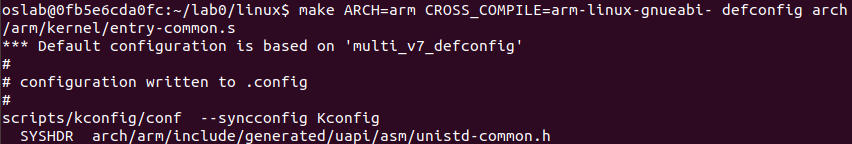
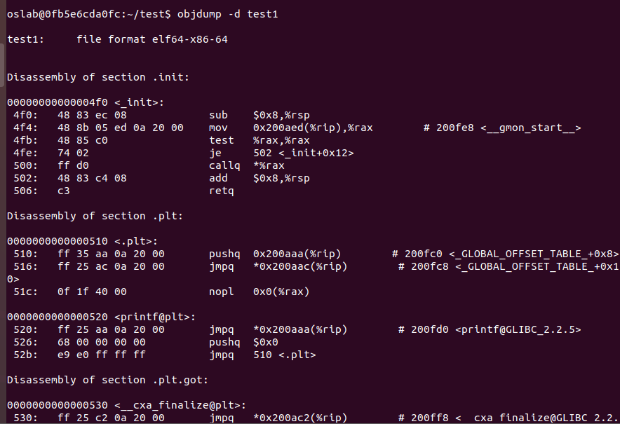

### Problem 1
**Operating System Concepts(10th) Chapter 1 Exercises:1.14, 1.17, 1.19, 1.22**<br />**<br />**1.14 What is the purpose of interrupts?**<br />To enable the CPU pause what it's doing and handle the more important message given from device.<br />**How does an interrupt differ from a trap?**<br />An interrupt is raised by hardware like I/O devices while traps are called by programs with operation or errors (like divided by 0 or overflow).<br />**Can traps be generated intentionally by a user program? If so, for what purpose?**<br />Yes. To use some system functions.

**1.17 Some computer systems do not provide a privileged mode of operation in hardware. Is it possible to construct a secure operating system for these computer systems? Give arguments both that it is and that it is not possible.**<br />Is not possible: No privileged mode of operation in hardware means we cannot pause what's going on in CPU. So when there is something like an error occur in a program, there cannot be some actions to take like pause the process. It can make the error ruin the systems or files.<br />Is possible: To solve this problem, we can limit the program that is run in this system. For example, we can limit the operands can be used in programs to ensure no harmful things can be done.

**1.19 Rank the following storage systems from slowest to fastest:**<br />**a. Hard-disk drives    b. Registers    c. Optical disk    d. Main memory**<br />**e. Nonvolatile memory    f. Magnetic tapes    g. Cache**<br />f c a e g d b

**1.22 Describe a mechanism for enforcing memory protection in order to prevent a program from modifying the memory associated with other programs.**<br />When a program begins to be executed, we sign the memory it's using with its PID. Before it exits, no other program can access these memory unless it gets the running program's permission.


### Problem 2
**Detail your steps about how to get arch/arm64/kernel/sys.i **

   - 安装 aarch64 (arm64)：


      - `-y` 就是提前同意了提示的询问信息

   - make


### Problem 3
**Find system call table for ARM32, RISC-V(32 bit), RISC-V(64 bit), X86(32 bit), X86_64 **<br />**List source code file,  the whole system call table with macro expanded, screenshot every step.**<br />注：下面复制出的系统调用表都是局部，防止文件过大。

#### ARM32
ARM32 的源文件在 linux/arch/arm/kernel/entry-common.S 中。 `.S` 是未经预处理的汇编源文件的后缀名， `.s` 则是已经预处理过的。

      - 确认找到 .S 了


      - 安装并 make

        
               

      - 检查发现出现了 .s 文件，用 `cat` 读取

               
               

      - 宏展开以后的系统调用表（局部）（复制出来的，上面留了一张截图）：
```c
syscall 0, sys_restart_syscall
syscall 1, sys_exit
syscall 2, sys_fork
syscall 3, sys_read
syscall 4, sys_write
syscall 5, sys_open
syscall 6, sys_close
syscall 8, sys_creat
syscall 9, sys_link
syscall 10, sys_unlink
syscall 11, sys_execve
syscall 12, sys_chdir
syscall 14, sys_mknod
syscall 15, sys_chmod
syscall 16, sys_lchown16
syscall 19, sys_lseek
syscall 20, sys_getpid
syscall 21, sys_mount
syscall 23, sys_setuid16
syscall 24, sys_getuid16
syscall 26, sys_ptrace
syscall 29, sys_pause
syscall 33, sys_access
syscall 34, sys_nice
syscall 36, sys_sync
syscall 37, sys_kill
syscall 38, sys_rename
syscall 39, sys_mkdir
syscall 40, sys_rmdir
syscall 41, sys_dup
syscall 42, sys_pipe
syscall 43, sys_times
syscall 45, sys_brk
syscall 46, sys_setgid16
syscall 47, sys_getgid16
syscall 49, sys_geteuid16
syscall 50, sys_getegid16
syscall 51, sys_acct
syscall 52, sys_umount
syscall 54, sys_ioctl
syscall 55, sys_fcntl
syscall 57, sys_setpgid
syscall 60, sys_umask
syscall 61, sys_chroot
syscall 62, sys_ustat
syscall 63, sys_dup2
syscall 64, sys_getppid
syscall 65, sys_getpgrp
syscall 66, sys_setsid
syscall 67, sys_sigaction
syscall 70, sys_setreuid16
syscall 71, sys_setregid16
syscall 72, sys_sigsuspend
syscall 73, sys_sigpending
syscall 74, sys_sethostname
syscall 75, sys_setrlimit
syscall 77, sys_getrusage
syscall 78, sys_gettimeofday
syscall 79, sys_settimeofday
syscall 80, sys_getgroups16
syscall 81, sys_setgroups16
syscall 83, sys_symlink
syscall 85, sys_readlink
syscall 86, sys_uselib
syscall 87, sys_swapon
syscall 88, sys_reboot
syscall 91, sys_munmap
syscall 92, sys_truncate
syscall 93, sys_ftruncate
syscall 94, sys_fchmod
syscall 95, sys_fchown16
syscall 96, sys_getpriority
syscall 97, sys_setpriority
syscall 99, sys_statfs
syscall 100, sys_fstatfs
```

#### RISC-V (64 bit) 
RISC-V 的 32 bit 和 64 bit 的系统调用表都是在 linux/arch/riscv/kernel 下的 syscall_table.c。需要展开则将 .c 编译为 .i 。只是用了不一样的交叉编译器。

64 bit 使用的交叉编译器是 riscv64-unknown-linux-gnu-gcc。这个在 /opt/riscv 里就有。


cat 查看一下。复制出来了部分系统调用表。
```c
[226] = (sys_mprotect),

[227] = (sys_msync),

[228] = (sys_mlock),

[229] = (sys_munlock),

[230] = (sys_mlockall),

[231] = (sys_munlockall),

[232] = (sys_mincore),

[233] = (sys_madvise),

[234] = (sys_remap_file_pages),

[235] = (sys_mbind),

[236] = (sys_get_mempolicy),

[237] = (sys_set_mempolicy),

[238] = (sys_migrate_pages),

[239] = (sys_move_pages),


[240] = (sys_rt_tgsigqueueinfo),


[241] = (sys_perf_event_open),

[242] = (sys_accept4),


[243] = (sys_recvmmsg),
# 707 "./include/uapi/asm-generic/unistd.h"
[260] = (sys_wait4),


[261] = (sys_prlimit64),

[262] = (sys_fanotify_init),

[263] = (sys_fanotify_mark),

[264] = (sys_name_to_handle_at),

[265] = (sys_open_by_handle_at),


[266] = (sys_clock_adjtime),


[267] = (sys_syncfs),

[268] = (sys_setns),

[269] = (sys_sendmmsg),

[270] = (sys_process_vm_readv),


[271] = (sys_process_vm_writev),


[272] = (sys_kcmp),

[273] = (sys_finit_module),

[274] = (sys_sched_setattr),

[275] = (sys_sched_getattr),

[276] = (sys_renameat2),

[277] = (sys_seccomp),

[278] = (sys_getrandom),

[279] = (sys_memfd_create),

[280] = (sys_bpf),

[281] = (sys_execveat),

[282] = (sys_userfaultfd),

[283] = (sys_membarrier),

[284] = (sys_mlock2),

[285] = (sys_copy_file_range),

[286] = (sys_preadv2),

[287] = (sys_pwritev2),

[288] = (sys_pkey_mprotect),

[289] = (sys_pkey_alloc),

[290] = (sys_pkey_free),

[291] = (sys_statx),


[292] = (sys_io_pgetevents),


[293] = (sys_rseq),

[294] = (sys_kexec_file_load),
# 828 "./include/uapi/asm-generic/unistd.h"
[424] = (sys_pidfd_send_signal),

[425] = (sys_io_uring_setup),

[426] = (sys_io_uring_enter),

[427] = (sys_io_uring_register),

[428] = (sys_open_tree),

[429] = (sys_move_mount),

[430] = (sys_fsopen),

[431] = (sys_fsconfig),

[432] = (sys_fsmount),

[433] = (sys_fspick),

[434] = (sys_pidfd_open),


[435] = (sys_clone3),


[437] = (sys_openat2),

[438] = (sys_pidfd_getfd),

[439] = (sys_faccessat2),

```

#### RISC-V (32 bit)
32 bit 使用的交叉编译器是 riscv32-unknown-linux-gnu-gcc。参考了 [Link](https://blog.csdn.net/weiqi7777/article/details/88045720) 进行安装。但是这个 blog 好像有一点点不对，--with-abi 应该是 ilp32 而不是 lp64（ilp32 指 int, long, pointer 都是 32 bits；lp64 指 long, pointer 都是 64 bits）。


系统调用表复制出来是这个样子（局部）：
```c
[223] = (sys_fadvise64_64),


[224] = (sys_swapon),

[225] = (sys_swapoff),

[226] = (sys_mprotect),

[227] = (sys_msync),

[228] = (sys_mlock),

[229] = (sys_munlock),

[230] = (sys_mlockall),

[231] = (sys_munlockall),

[232] = (sys_mincore),

[233] = (sys_madvise),

[234] = (sys_remap_file_pages),

[235] = (sys_mbind),

[236] = (sys_get_mempolicy),

[237] = (sys_set_mempolicy),

[238] = (sys_migrate_pages),

[239] = (sys_move_pages),


[240] = (sys_rt_tgsigqueueinfo),


[241] = (sys_perf_event_open),

[242] = (sys_accept4),


[243] = (sys_recvmmsg),
# 707 "./include/uapi/asm-generic/unistd.h"
[260] = (sys_wait4),


[261] = (sys_prlimit64),

[262] = (sys_fanotify_init),

[263] = (sys_fanotify_mark),

[264] = (sys_name_to_handle_at),

[265] = (sys_open_by_handle_at),


[266] = (sys_clock_adjtime),


[267] = (sys_syncfs),

[268] = (sys_setns),

[269] = (sys_sendmmsg),

[270] = (sys_process_vm_readv),


[271] = (sys_process_vm_writev),


[272] = (sys_kcmp),

[273] = (sys_finit_module),

[274] = (sys_sched_setattr),

[275] = (sys_sched_getattr),

[276] = (sys_renameat2),

[277] = (sys_seccomp),

[278] = (sys_getrandom),

[279] = (sys_memfd_create),

[280] = (sys_bpf),

[281] = (sys_execveat),

[282] = (sys_userfaultfd),

[283] = (sys_membarrier),

[284] = (sys_mlock2),

[285] = (sys_copy_file_range),

[286] = (sys_preadv2),

[287] = (sys_pwritev2),

[288] = (sys_pkey_mprotect),

[289] = (sys_pkey_alloc),

[290] = (sys_pkey_free),

[291] = (sys_statx),


[292] = (sys_io_pgetevents),


[293] = (sys_rseq),

[294] = (sys_kexec_file_load),
# 828 "./include/uapi/asm-generic/unistd.h"
[424] = (sys_pidfd_send_signal),

[425] = (sys_io_uring_setup),

[426] = (sys_io_uring_enter),

[427] = (sys_io_uring_register),

[428] = (sys_open_tree),

[429] = (sys_move_mount),

[430] = (sys_fsopen),

[431] = (sys_fsconfig),

[432] = (sys_fsmount),

[433] = (sys_fspick),

[434] = (sys_pidfd_open),


[435] = (sys_clone3),


[437] = (sys_openat2),

[438] = (sys_pidfd_getfd),

[439] = (sys_faccessat2),

```

#### X86 (32bit)
与前面的类似。这里没有用交叉编译器。

```c
[0 ... 439] = &__ia32_sys_ni_syscall,
# 1 "./arch/x86/include/generated/asm/syscalls_32.h" 1
[0] = __ia32_sys_restart_syscall,
[1] = __ia32_sys_exit,
[2] = __ia32_sys_fork,
[3] = __ia32_sys_read,
[4] = __ia32_sys_write,


[5] = __ia32_compat_sys_open,

[6] = __ia32_sys_close,
[7] = __ia32_sys_waitpid,
[8] = __ia32_sys_creat,
[9] = __ia32_sys_link,
[10] = __ia32_sys_unlink,


[11] = __ia32_compat_sys_execve,

[12] = __ia32_sys_chdir,
[13] = __ia32_sys_time32,
[14] = __ia32_sys_mknod,
[15] = __ia32_sys_chmod,
[16] = __ia32_sys_lchown16,
[18] = __ia32_sys_stat,


[19] = __ia32_compat_sys_lseek,

[20] = __ia32_sys_getpid,


[21] = __ia32_compat_sys_mount,

[22] = __ia32_sys_oldumount,
[23] = __ia32_sys_setuid16,
[24] = __ia32_sys_getuid16,
[25] = __ia32_sys_stime32,


[26] = __ia32_compat_sys_ptrace,

[27] = __ia32_sys_alarm,
[28] = __ia32_sys_fstat,
[29] = __ia32_sys_pause,
[30] = __ia32_sys_utime32,
[33] = __ia32_sys_access,
[34] = __ia32_sys_nice,
[36] = __ia32_sys_sync,
[37] = __ia32_sys_kill,
[38] = __ia32_sys_rename,
[39] = __ia32_sys_mkdir,
[40] = __ia32_sys_rmdir,
[41] = __ia32_sys_dup,
[42] = __ia32_sys_pipe,


[43] = __ia32_compat_sys_times,

[45] = __ia32_sys_brk,
[46] = __ia32_sys_setgid16,
[47] = __ia32_sys_getgid16,
[48] = __ia32_sys_signal,
[49] = __ia32_sys_geteuid16,
[50] = __ia32_sys_getegid16,
[51] = __ia32_sys_acct,
[52] = __ia32_sys_umount,


[54] = __ia32_compat_sys_ioctl,


[55] = __ia32_compat_sys_fcntl64,

[57] = __ia32_sys_setpgid,
[59] = __ia32_sys_olduname,
[60] = __ia32_sys_umask,
[61] = __ia32_sys_chroot,


[62] = __ia32_compat_sys_ustat,

[63] = __ia32_sys_dup2,
[64] = __ia32_sys_getppid,
[65] = __ia32_sys_getpgrp,
[66] = __ia32_sys_setsid,

```


#### X86_64

```c
[333] = __ia32_compat_sys_preadv,


[334] = __ia32_compat_sys_pwritev,


[335] = __ia32_compat_sys_rt_tgsigqueueinfo,

[336] = __ia32_sys_perf_event_open,


[337] = __ia32_compat_sys_recvmmsg_time32,

[338] = __ia32_sys_fanotify_init,


[339] = __ia32_compat_sys_fanotify_mark,

[340] = __ia32_sys_prlimit64,
[341] = __ia32_sys_name_to_handle_at,


[342] = __ia32_compat_sys_open_by_handle_at,

[343] = __ia32_sys_clock_adjtime32,
[344] = __ia32_sys_syncfs,


[345] = __ia32_compat_sys_sendmmsg,

[346] = __ia32_sys_setns,


[347] = __ia32_compat_sys_process_vm_readv,


[348] = __ia32_compat_sys_process_vm_writev,

[349] = __ia32_sys_kcmp,
[350] = __ia32_sys_finit_module,
[351] = __ia32_sys_sched_setattr,
[352] = __ia32_sys_sched_getattr,
[353] = __ia32_sys_renameat2,
[354] = __ia32_sys_seccomp,
[355] = __ia32_sys_getrandom,
[356] = __ia32_sys_memfd_create,
[357] = __ia32_sys_bpf,


[358] = __ia32_compat_sys_execveat,

[359] = __ia32_sys_socket,
[360] = __ia32_sys_socketpair,
[361] = __ia32_sys_bind,
[362] = __ia32_sys_connect,
[363] = __ia32_sys_listen,
[364] = __ia32_sys_accept4,


[365] = __ia32_compat_sys_getsockopt,


[366] = __ia32_compat_sys_setsockopt,

[367] = __ia32_sys_getsockname,
[368] = __ia32_sys_getpeername,
[369] = __ia32_sys_sendto,


[370] = __ia32_compat_sys_sendmsg,


[371] = __ia32_compat_sys_recvfrom,


[372] = __ia32_compat_sys_recvmsg,

[373] = __ia32_sys_shutdown,
[374] = __ia32_sys_userfaultfd,
[375] = __ia32_sys_membarrier,
[376] = __ia32_sys_mlock2,
[377] = __ia32_sys_copy_file_range,


[378] = __ia32_compat_sys_preadv2,


[379] = __ia32_compat_sys_pwritev2,

[380] = __ia32_sys_pkey_mprotect,
[381] = __ia32_sys_pkey_alloc,
[382] = __ia32_sys_pkey_free,
[383] = __ia32_sys_statx,


[384] = __ia32_compat_sys_arch_prctl,


[385] = __ia32_compat_sys_io_pgetevents,

[386] = __ia32_sys_rseq,
[393] = __ia32_sys_semget,


[394] = __ia32_compat_sys_semctl,

[395] = __ia32_sys_shmget,


[396] = __ia32_compat_sys_shmctl,


[397] = __ia32_compat_sys_shmat,

[398] = __ia32_sys_shmdt,
[399] = __ia32_sys_msgget,


[400] = __ia32_compat_sys_msgsnd,


[401] = __ia32_compat_sys_msgrcv,


[402] = __ia32_compat_sys_msgctl,

[403] = __ia32_sys_clock_gettime,
[404] = __ia32_sys_clock_settime,
[405] = __ia32_sys_clock_adjtime,
[406] = __ia32_sys_clock_getres,
[407] = __ia32_sys_clock_nanosleep,
[408] = __ia32_sys_timer_gettime,
[409] = __ia32_sys_timer_settime,
[410] = __ia32_sys_timerfd_gettime,
[411] = __ia32_sys_timerfd_settime,
[412] = __ia32_sys_utimensat,


[413] = __ia32_compat_sys_pselect6_time64,


[414] = __ia32_compat_sys_ppoll_time64,

[416] = __ia32_sys_io_pgetevents,


[417] = __ia32_compat_sys_recvmmsg_time64,

[418] = __ia32_sys_mq_timedsend,
[419] = __ia32_sys_mq_timedreceive,
[420] = __ia32_sys_semtimedop,


[421] = __ia32_compat_sys_rt_sigtimedwait_time64,

[422] = __ia32_sys_futex,
[423] = __ia32_sys_sched_rr_get_interval,
[424] = __ia32_sys_pidfd_send_signal,
[425] = __ia32_sys_io_uring_setup,
[426] = __ia32_sys_io_uring_enter,
[427] = __ia32_sys_io_uring_register,
[428] = __ia32_sys_open_tree,
[429] = __ia32_sys_move_mount,
[430] = __ia32_sys_fsopen,
[431] = __ia32_sys_fsconfig,
[432] = __ia32_sys_fsmount,
[433] = __ia32_sys_fspick,
[434] = __ia32_sys_pidfd_open,
[435] = __ia32_sys_clone3,
[437] = __ia32_sys_openat2,
[438] = __ia32_sys_pidfd_getfd,
[439] = __ia32_sys_faccessat2,
```

### Problem 4
**Explain what is ELF file? **<br />ELF, Executable and Linkable Format，可执行与可链接格式。它是 Linux 中二进制可执行文件的标准格式。ELF file 就是 Linux 中的二进制可执行文件。<br />**Try readelf and objdump command on an ELF file, give screenshot of the output. **



**Run an ELF file and cat /proc/PID /maps to give its memory layout**

如图，1 区域可运行，不可写，2 区域为制度数据段，只读，3 区域为数据段，可读写不可运行。

