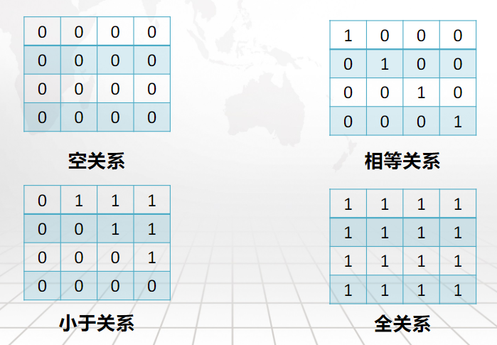

## 1.4 集合论
集合论是以集合概念为基础，研究集合一般性质的数学分支学科。

   - “集合”是比“数”更简单的概念
   - 集合论试图从研究集合出发，定义“数”和数的“运算”，进而发展到整个数学，是研究数学基础的学科。

集合是简单而又基本的不做定义的初始概念。通常，“集合”是一些确定的、相异的事物的总体。 集合按照其中事物数目是否有限，可以分为有限集合和无限集合。无限集合是集合论研究的主要对象，也是集合论建立的关键和难点。

   - 潜无限：作为过程的无限，即永远延伸、完成不了的进程，如自然数列 0, 1, 2, ..., n, ...
   - 实无限：作为已经完成的整体的无限，如自然数的全体组成的整体 {0, 1, 2, ..., n, ...}  

### 1.4.1 集合的基本概念
集合（set）：作为整体识别的、确定的、互相区别的一些对象的总体。

      - 整体识别：不再分割。
      - 确定：任何一个对象或者属于集合，或者不属于集合。
      - 互相区别：对象是各异的。

组成集合的对象称为 **成员（member）**或者 **元素（element）**。

      - 元素可以是任何具体的或者抽象的事物
      - 元素也可以是集合

#### 元素和集合的隶属关系

         - 当对象 a 是集合 A 的成员时，称 a 属于 A，记作 。
         - 当对象 a 不是集合 A 的成员时，称 a 不属于 A，记作  或 。

#### 规定集合的方式

         - 列举法：将所有元素列举
            - B = {{1,2}, 3}
         - 描述法：将集合中元素的特征用 **谓词公式** 描述
            - A = { x | P(x) } 或 A = { x : P(x) }，表示 xA 当且仅当 P(x) 为真。
         - 归纳法：参见 1.4.7

      - **空集**：没有任何元素的特定集合，记作 。
         - 
      - 如果一个集合是空集，或者只含有有限多个元素，则称其为**有限集（finite sets）**。否则，称为**无限集（infinite sets）**。
         - 有限集 A 中成员的个数称作集合的**基数（cardinality）**，记作 |A|。

### 1.4.2 集合论三大基本原理

      - 外延公理（extensionality axiom）：两个集合 A 和 B 相等当且仅当它们具有相同的元素
         - 即，。
         - 这说明了集合元素的 **无序性** 和集合表示形式的 **不唯一性**。

      - 概括公理（comprehension axiom）：对于任一个体域 U，任一谓词公式 P 都能够确定一个以该个体域中的对象为元素的集合 。
         - 即，。
         - 这说明了集合成员的 **确定性**。
         - 空集：即 P(x) 为永假式。

      - 正规定理（regularity axiom）：不存在集合  使得 。
         - 即，集合有限可分，个体域的元素是基本粒子。
         - 确定了元素和集合的不同层次性，集合不能是自己的成员。

### 1.4.3 子集合
集合 A 称作 B 的 **子集合**，如果 A 的每一个元素都是 B 的元素，即，记作。 集合的两个基本关系：隶属和包含。这两个关系可能同时成立。

      - 
      - 
      - 

#### 子集合的性质

      - 定理 1：对于任意集合 A 和 B， 当且仅当  且 。证明：

      - 定理 2：设 A, B, C 为任意集合，若 则 。证明：

      - 定理 3：对于任意集合 A，（U 为个体域）。证明：

      - 定理 4：对于任意集合 A，。证明：

      - 定理 5：空集是唯一的。证明：

           

      - 定理 6：设 A 为一个有限集合，|A|=n，则 A 的子集合个数为 2 。

### 1.4.4 真子集
如果  且 ，则称 A 是 B 的真子集，记为 。

:::success
判断：

   - 
   - 
   - 
   - 
   - 
   - 
   - Answer: F T F T T T
:::

### 1.4.5 集合的基本运算

#### 并运算（Union）

#### 交运算（Intersection）

#### 交运算和并运算的性质

#### 差运算（Difference）

例如，{1, 2, 3} - {2, 3, 4, 5} = {1}。

#### 补运算（Complement）

例如，U = N，{0, 1, 2}~ = {3, 4, 5, 6, ...}

#### 差运算和补运算的性质

#### 集合运算和子集关系

:::success
例题 利用运算性质证明 求证：对于任意集合 A, B，如果有  且 ，那么 。      
:::

#### 幂集（power set）
对于任意集合 A，定义  为 A 的幂集，即 A 的所有子集构成的集合。 由定义，必有 。幂集的基数：。

#### 幂集的性质
设 A, B 为任意集合， 当且仅当 。

证明： 必要性：

充分性：

### 1.4.6 集合族
如果集合 C 中每个元素都是集合，则称 C 是 **集合族（collections）**。 如果集合族 C 可以表示为下标的形式，如  ，那么这些下标组成的集合 D 称作集合族 C 的 **标志集** 。 标志集可以是自然数，或某些连续的符号。

:::info
C = {{0}, {0, 1}, {0, 1, 2}, ...} 是集合族，但是没有标志集。 但如果此时定义 N = {0, 1, 2, ..., n-1}，那么 C 就可以表示为 {N | nZ+}， C 的标志集就是 Z+。

集合族 B = {S, S} = {S | d{a, b}}，那么 B 的标志集就是 {a, b}。
:::

#### 集合族的运算

   - 广义并：集合族中所有集合的并集。。
   - 广义交：集合族中所有集合的交集。。
   - 若 ，可记 。
      - 理解 ：类似连加、连乘符号， 即表示对所有满足  的  取并集。

### 1.4.7 归纳定义
一个集合的归纳定义（inductive definition）包含：

      - 基础条款：规定某些元素为待定义集合的成员
      - 归纳条款：规定由已确定的集合元素进一步确定其他元素的规则
         - 基础条款和归纳条款称为“完备性条款”，必须保证毫无遗漏地产生集合中的所有成员
      - 终极条款：规定待定义集合只含有基础条款和归纳条款所确定的成员
         - 终极条款又称“纯粹性条款”，保证集合仅包含满足完备性条款的对象

:::info
归纳法定义咸鱼暄的生日：

   - 基础条款：咸鱼暄出生的那天是咸鱼暄的生日；
   - 归纳条款：如果某天是咸鱼暄的生日，那么这一天的整一年以后也是咸鱼暄的生日；
   - 终极条款：除了上面两条包括的日子，其他任何一天都不是咸鱼暄的生日。
:::

_自然数及其运算的归纳定义_

### 1.4.8 有序组

#### 二元有序组
设 a, b 为任意对象，称集合族 {{a}, {a, b}} 为**二元有序组**，也称为**二元组（2-tuple）**或**序偶（ordered pairs）**，简记为 <a, b>。 其中，称 a 为 <a, b> 的第一分量，b 为第二分量。

对于任意序偶 <a, b>, <c, d>，<a, b> = <c, d> 当且仅当 a = c 且 b = d。证明： 充分性是显然的。 必要性： <a, b> = <c, d>，故 {{a}, {a, b}} = {{c}, {c, d}}。 则有 {{a}, {a, b}} = {{c}, {c, d}}，即 {a, b} = {c, d}。 又有 {{a}, {a, b}} = {{c}, {c, d}}，即 {a} = {c}。

由上面两式有 a = c 且 b = d。 即，若 a ≠ b，则 <a, b> ≠ <b, a>。

#### N 元有序组
我们可以递归定义 N 元有序组：

            - N = 2 时，<a, a> = {{a1}, {a1, a2}}
            - N > 2 时，<a, a, ..., a> = <<a, a, ..., a>, a>

其中 a称为 N 元组的第 i 分量。

### 1.4.9 笛卡尔积
对任意集合 A, A, ..., A ，A×A 称为集合 A, A 的笛卡尔积，定义如下：

      - A×A = {<u, v> | uA, vA}
      - A×A×...×A = (A×A×...×A)×A

因此，有 。
:::info
例如，A = {1, 2}, B = {a, b}，则 A × B = {<1, a>, <1, b>, <2, a>, <2, b>}

又例如，分别表示笛卡尔平面和三维笛卡尔空间。

   - 笛卡尔是解析几何的创始人，首次用三元组表示空间中的点，统一了代数与几何。
:::

一般来说，笛卡尔积不满足交换律和结合律。

**笛卡尔积满足对集合运算的分配律**： 设 A, B, C 为任意集合，# 表示  之一，那么：

      - A×(B#C) = (A×B)#(A×C)
      - (B#C)×A = (B×A)#(C×A)

下面证明 ： 

**笛卡尔积的基数**： |A×A×...×A| = |A|×|A|×...×|A|

### 1.4.10 关系
关系是各个对象之间的联系和对应。采用二元组或多元组的集合来表示关系。

:::info
例如三组对象之间的联系和对应：学生 - 班级 - 学院 的隶属关系： S = {<咸鱼暄, 1915, 计算机学院>, <憨包, 1902, 生工食品学院>, ...}
:::

如果 R 是 A×A×...×A 的一个子集，则称其为**集合 A×A×...×A到 A 的 n 元关系**。 当 A = A (i = 1, 2, ..., n) 时，也称 R 为 **A 上的 n 元关系**。 例如，R 是 A×B 的一个子集，则称其为 **A 到 B 的二元关系**。 又如，R 是 A×A 的一个子集，则称其为 **A 上的二元关系**。

#### 关系的表示（举例） 
自然数的：

         - 相等关系（**列举法**）：E = {<0, 0>, <1, 1>, <2, 2>, ...}
         - 整除关系（**描述法**）：D = {<x, y> | x 整除 y}
         - 小于关系（**归纳法**）：L
            - 基础条款：<0, 1> L
            - 归纳条款：如果 <x, y> L，则 <x, y+1> L, <x+1, y+1> L
            - 终极条款：除了上述两个条款包含的元素，其他元素均不属于 L。
         - 另外，关系的表示法还有 **关系图法**。参见后文。 

#### 二元关系
二元关系的 **空关系 **：，称  为 A 到 B 的空关系 二元关系的 **全关系** ：笛卡尔积  是 A 到 B 的全关系 二元关系的 **相等关系** E ：E = {<x, x> | xA}，称 E 为 A 上的相等关系

定义：设 R 为 A 到 B 的二元关系，即 ，则用  表示<x, y> R，用  表示<x, y> R。

R 的**定义域**（domain）：
R 的**值域**（range）：
称 A 为 R 的**前域**，B 为 R 的**陪域**。

#### 关系的表示法：关系图法

         - 仅适合于前域和陪域都是有限集合
         - 一般的关系图用有向箭头表示元素之间存在关系
         - 关系图的前域和陪域可以相同，也可以不同

前域和陪域不同（左）和相同（右）的关系图

#### 关系的表示法：矩阵法

         - 仅适合前域和陪域都是有序集合
         - 设关系 
         - 关系 R 的矩阵 M 的定义：m = 1 当且仅当 aRb，m = 0 当且仅当 aRb

  一个例子。这个例子中定义域和值域均为 {1, 2, 3, 4}。

#### 关系相等
如果关系 R 和 S 具有相同的前域和陪域，并且 ，则称这两个关系 **相等** 。

#### 关系运算
参与运算的两个关系应该具有相同的前域和陪域，如果不具有的话，可以对前域和陪域作扩充使其相等。 R, S 是 A 到 B 的二元关系，，关系作为集合，存在下面的运算：

         - 并：
         - 交：
         - 差：
         - 补：
            - 注意，此处全集 
         - 逆：
            - 显然，

这些运算对应关系矩阵的运算： 若 分别表示 R, S 的关系矩阵，则：

         - 并：（矩阵中每一个对应的元素作析取，得到运算结果矩阵的对应元素）
         - 交：
         - 补： （矩阵中每一个元素作否定）
         - 差：
         - 逆：（矩阵转置）

#### 关系运算的性质
下面 ，$ 代表并、交、差运算之一。

         1. 上述 5 种运算均满足分配律；
         2. 
         3. 
         4. 
         5. 

#### 关系的合成
R 为 A 到 B 的二元关系，S 为 B 到 C 的二元关系。R 到 S 的合成关系定义为：     
简化形式可写为：     

 是 A 到 C 的二元关系，即 。

显然，关系的合成不满足交换律。 设  分别为 A, B 上的相等关系，R 是 A 到 B 的二元关系，则有：     
    
    
    

##### 用关系图表示合成运算

##### 用关系矩阵表示合成运算
关系合成运算对应关系矩阵的乘法，其中数乘换成合取、数加换成析取。 设
则 ，其中 

##### 合成运算的性质
（左分配律） （右分配律） 证明思路：

证明思路：

证明 :    设  ， 即 
即 
即 
即 %5C%20%5Cland%20%3Cv%2Cy%3E%5Cin%20T)#card=math&code=%5Cexists%20v%5C%20%28%5Cexists%20u%5C%20%28%3Cx%2Cu%3E%5Cin%20R%5C%20%5Cland%20%3Cu%2Cv%3E%5Cin%20S%29%5C%20%5Cland%20%3Cv%2Cy%3E%5Cin%20T%29&height=20&width=377)
即  #card=math&code=%5C%21%5Cexists%20v%5C%20%28%3Cx%2Cv%3E%5Cin%20R%5Ccirc%20S%20%5C%20%5Cland%20%3Cv%2Cy%3E%5Cin%20T%29&height=20&width=258)
即  

#### 关系的幂运算

性质：。可将 m 看成参数，对 n 进行数学归纳法证明。

##### 幂关系有限定理
设 ，则存在  使得 。 说明：R 的任意次幂仍然是 A 上的二元关系，而 A 上的二元关系的数量为 个。根据鸽笼原理即得。

#### A 上具有特殊性质的二元关系

##### 自反关系（reflexive）
      
关系图：每个节点都有环 关系矩阵：对角线全为 1 

##### 反自反关系（irreflexive）
      
关系图：每个节点都没有环 关系矩阵：对角线全为 0 

##### 对称关系（symmetric）
      
关系图：每两个节点之间只要有边必有反向边 关系矩阵：对称矩阵

##### 反对称关系（antisymmetric）
      
关系图：两个节点之间只能有单向边 关系矩阵：

##### 传递关系（transitive）
      
关系图：如果有边 ，则有边 。

5 种特殊性质的二元关系的关系图实例。 左起依次为：自反关系，反自反关系，对称关系，反对称关系，传递关系。

所有非空集合上的空关系是反自反、对称、反对称、传递的；全关系是自反、对称、传递的；相等关系是自反、对称、反对称、传递的。 整数集合上的整除关系是自反、反对称、传递的。

#### 关系特性的一些定理
R 自反 当且仅当 
R 反自反 当且仅当 
R 对称 当且仅当   证明：

R 反对称 当且仅当 
R 传递 当且仅当 
证明：

#### 关系特性的运算封闭性
关系的某种特性在运算后仍保持原特性的性质称为运算封闭性。

         - 所有的 5 个特性对交运算封闭。
            - 例证：
         - 自反、反自反、对称对并运算封闭。
         - 反自反、对称、反对称对差运算封闭。
         - 对称性对补运算封闭。
         - 所有的 5 个特性对求逆运算封闭。
         - 自反对合成运算封闭。

#### 等价关系
如果 A 上的一个二元关系具有自反、对称、传递性，则称它是一个 **等价关系**（equivalent relation）。 例如：

         - 三角形的相似、全等
         - 亲戚关系
         - 

#### 等价类
设 R 是 A 上的等价关系，对于每个 ，定义其 **等价类** 为 ，简记为 
a 称作  的代表元素。每个代表元素确定一个等价类。等价类是 A 的子集。
:::info

   - 
   - 相等关系  有 |A| 个等价类，每个等价类都是单元素集合
   - 全关系 A×A 只有 1 个等价类
:::
 

##### 等价类的性质

         - A 上的任何一个等价关系 R，任何一个元素 a，[a] 都不会是空集，因为根据等价关系的自反性，必有 aRa。
         - 同一个等价类可能有不同的代表元素，即，不同的元素可能有相同的等价类。

##### 等价类定理

         - R 是 A 上的等价关系，则任意的 a,b∈A，aRb 当且仅当 [a]=[b]。

证明： 设 aRb, x∈[a]，则 xRa。由传递性有 xRb，因此 x∈[b]。同理 x∈[b] 可推出 x∈[a]，因此 [a]=[b] 设 [a]=[b]，则 aRa，故 aRb。即证。

         - R 是 A 上的等价关系，则任意的 a,b∈A，要么 [a]=[b] 要么 [a]∩[b]=∅

证明：（思路：） 设 [a]∩[b]≠∅，则有 x∈[a]∩[b]，即 xRa 且 xRb。又由对称性，有 aRx, xRb；由传递性有 aRb。又由前定理有 [a]=[b]。即证。

#### 序关系
如果 A 上的一个二元关系具有自反、反对称、传递性，则称其为一个 **序关系** (ordered relation)。 存在序关系 R 的集合 A 称作 **有序集** (ordered set)，用二元有序组 <A, R> 表示。 例如：

         - 自然数集  上的“小于或等于”关系是序关系，有序集记作 <, ≤>。
         - 集合 A 的幂集 ρ(A) 上的“包含”关系是序关系，有序集记作 <ρ(A), >。
         - 正整数集合  上的“整除”关系是序关系，有序集记作 <, |>。

##### 哈斯图（Hasse graph）
哈斯图是对序关系的关系图的一种简化画法：

            - 由于序关系自反，因此各节点都有自环，在哈斯图中省去
            - 由于序关系反对称且传递，因此关系图中任何两个不同的结点直接不会有双向的边或通路，所以省去边的箭头，把向上的方向定位箭头方向
            - 由于序关系传递，所以省去所有推定的边，即如果 a≤b，b≤c 有 a≤c，省去 ac 边

哈斯图的几个例子

##### 有序集中集合元素的排序
a≤b，称 a **先于或者等于** b，或 a **小于或者等于** b 如果 ¬(a≤b)，则称 a，b **不可比较**或者**不可排序**

<A,≤>为有序集，B⊆A：

            - B 的 **最小元 **b：b∈B ∧ ∀x (x∈B→b≤x)
            - B 的 **最大元 **b：b∈B ∧ ∀x (x∈B→x≤b)
            - B 的 **极小元 **b：b∈B ∧ ¬∃x (x∈B∧x≠b∧x≤b)
            - B 的 **极大元 **b：b∈B ∧ ¬∃x (x∈B∧x≠b∧b≤x)

极大和最大的差别在于 B 中是否包含不可比较的元素：

最大（小）元和极大（小）元的区别举例

有定理：

            - B 的最大（小）元必为 B 的极大（小）元
            - B 不一定存在最大（小）元，但存在则是唯一的
            - 如果 B 是有限集，则 B 必存在极大（小）元，但未必唯一

##### 上（下）界
<A,≤>为有序集，B⊆A： B 的上界 a：a∈A ∧ ∀x (x∈B→x≤a)
B 的下界 a：a∈A ∧ ∀x (x∈B→a≤x)
B 的上确界 a：a 是 B 的所有上界的集合最小元 B 的下确界 a：a 是 B 的所有下界的集合最大元     
上（下）界举例

有定理：

            - 如果 b 是 B 的最大（小）元，则 b 是 B 的上（下）确界
            - 如果 b 是 B 的上（下）确界，而且 b∈B，则 b 一定是 B 的最大（小）元
            - 如果 B 有上（下）确界，则上（下）确界是唯一的
            - 上下界未必存在，存在时也未必唯一
            - 有上（下）界，也未必存在上（下）确界

##### 链和反链
对于有序集 <A, R>, 如果它的子集 B 中的任意两个元素都是可以比较的，则称 B 是一个 **链** (chain)；如果 B 中的任意两个元素都是不可比较的，则称 B 是一个 **反链** (anti-chain)。 例如右图中，子集 {2, 6, 12, 36} 是一个链，{2, 3} 是一个反链。
有定理：如果 A 中最长的链长度为 n，则 A 存在一个划分，划分有 n 个单元，每个单元都是一个反链。

#### 半序关系
如果 A 上的一个二元关系具有反自反、反对称、传递性，则称其为一个 **序关系** (partially ordered relation)。 存在序关系 R 的集合 A 称作 **半序集** (partially ordered set)，用二元有序组 <A, R> 表示。 例如：实数集合上的“大于”关系。半序集表示为 <, >>。 

### 1.4.11 划分
划分是满足下列条件的集合 A 的子集族 π：

      - 不空 
      - 不漏 
      - 不交

π 中的元素称为划分的**单元**

特别约定 A=∅ 时只划分为 ∅
:::info
例如 A = {1,2,3,4} 可划分为： π = {{1},{2},{3},{4}} π2 = {{1,2},{3},{4}} π3 = {{1,3,4},{2}} 等
:::

#### 等价关系与划分
A 上的等价关系 R 的所有等价类的集合  构成 A 的一个划分，称作等价关系 R 对应的划分。 集合 A 的一个划分 π 对应一个 A 上的等价关系，即 ，称为划分 π 对应的等价关系。

#### 等价关系和划分的一一对应
对应 π 的等价关系为 R，当且仅当 R 对应的划分为 π。证明： 必要性：设对应 π 的等价关系为 R，R 对应的划分为 π'，要证明 π=π'： ![](https://cdn.nlark.com/yuque/__latex/ef69fc51bcf7a51dbcbf95e7e191d624.svg#card=math&code=%5Cbegin%7Barray%7D%0A%5C%20%E8%AE%BE%E4%BB%BB%E6%84%8F%5C%20a%5Cin%20A%2C%5C%20a%5Cin%20B%5Cin%5Cpi%2C%5C%20a%5Cin%20B%27%5Cin%5Cpi%27%0A%5C%5C%20b%5Cin%20B%5CLeftrightarrow%20aRb%5CLeftrightarrow%20b%5Cin%20%5Ba%5D_R%5CLeftrightarrow%20b%5Cin%20B%27%5Cquad%20%5C%20%0A%5C%5C%EF%BC%88%E8%A7%A3%E9%87%8A%E4%B8%80%E4%B8%8B%3A%E5%AF%B9%5C%20B%5C%20%E7%9A%84%E4%BB%BB%E4%B8%80%E5%85%83%E7%B4%A0%5C%20b%EF%BC%8C%E7%94%B1%E4%BA%8E%5C%20B%5Cin%5Cpi%EF%BC%8C%5Cpi%5C%20%E6%98%AF%5C%20A%5C%20%E7%9A%84%E5%88%92%E5%88%86%EF%BC%8C%E5%9B%A0%E6%AD%A4%5C%20a%2Cb%5C%20%E5%9C%A8%E5%90%8C%E4%B8%80%E7%AD%89%E4%BB%B7%E7%B1%BB%E4%B8%AD%E3%80%82%0A%5C%5C%E8%80%8C%E7%AD%89%E4%BB%B7%E5%85%B3%E7%B3%BB%5C%20R%5C%20%E7%9A%84%E5%88%92%E5%88%86%E6%98%AF%5C%20%5Cpi%27%EF%BC%8C%E5%9B%A0%E6%AD%A4%5C%20a%2Cb%5C%20%E5%BF%85%E5%9C%A8%E5%88%92%E5%88%86%5C%20%5Cpi%27%5C%20%E7%9A%84%E5%90%8C%E4%B8%80%E4%B8%AA%E5%8D%95%E5%85%83%E5%86%85%EF%BC%8C%E5%9B%A0%E6%AD%A4%5C%20b%5Cin%20B%27%E3%80%82%EF%BC%89%0A%5C%5C%E5%9B%A0%E6%AD%A4%5C%20B%3DB%27%E3%80%82%E5%8F%88%E7%94%B1%E4%BA%8E%5C%20a%5C%20%E6%98%AF%E4%BB%BB%E6%84%8F%E7%9A%84%EF%BC%8C%E5%9B%A0%E6%AD%A4%5C%20%5Cpi%3D%5Cpi%27%0A%5Cend%7Barray%7D&height=134&width=637)
充分性：设 R 对应的划分为 π，对应 π 的等价关系为 R'，要证明 R=R'： 
QED

#### 划分之间的关系
自然的，|π| 越大，划分 π 越 **细**。

如果 π 的每一个单元都包含于 π 的某个单元，称 π **细于** π，记作 π ≤ π  如果 π **细于** π，且 π ≠ π，则称 π **真细于** π，记作 π ＜ π

 π 真细于 π

##### 划分的“细于”与等价关系的子集
![](https://cdn.nlark.com/yuque/__latex/5eac8dbc9edb874223806163fa210acd.svg#card=math&code=%5Cbegin%7Barray%7D%0A%5C%20%5Cpi_1%2C%5Cpi_2%5C%20%E5%88%86%E5%88%AB%E6%98%AF%E7%AD%89%E4%BB%B7%E5%85%B3%E7%B3%BB%5C%20R_1%2CR_2%5C%20%E5%AF%B9%E5%BA%94%E7%9A%84%E5%88%92%E5%88%86%EF%BC%8C%E9%82%A3%E4%B9%88%5C%20R_1%5Csubseteq%20R_2%5Cleftrightarrow%20%5Cpi_1%5Cleq%5Cpi_2.%5C%20%E8%AF%81%E6%98%8E%EF%BC%9A%0A%5C%5C%5C%5C%E5%BF%85%E8%A6%81%E6%80%A7%EF%BC%9A%E8%AE%BE%5C%20R_1%5Csubseteq%20R_2%EF%BC%8CB_1%5C%20%E4%B8%BA%5C%20%5Cpi_1%5C%20%E4%B8%AD%E4%BB%BB%E6%84%8F%E4%B8%80%E4%B8%AA%E5%8D%95%E5%85%83%EF%BC%8C%E4%BB%A4%5C%20B_1%3D%5Ba%5D_%7BR_1%7D%2Ca%5Cin%20A%E3%80%82%E8%A6%81%E8%AF%81%E6%98%8E%EF%BC%9A%0A%5C%5CB_1%5C%20%E5%8C%85%E5%90%AB%E4%BA%8E%5C%20%5Cpi_2%5C%20%E7%9A%84%E6%9F%90%E4%B8%AA%E5%8D%95%E5%85%83%E3%80%82%0A%5C%5Cb%5Cin%20B_1%5CRightarrow%20bR_1a%5CRightarrow%20bR_2a%5CRightarrow%20b%5Cin%20%5Ba%5D_%7BR_2%7D%EF%BC%8C%E5%8D%B3%E8%AF%81%E3%80%82%0A%5C%5C%5C%5C%E5%85%85%E5%88%86%E6%80%A7%EF%BC%9A%E8%AE%BE%5C%20%5Cpi_1%5Cleq%5Cpi_2%2C%5C%20xR_1y%EF%BC%8C%E8%A6%81%E8%AF%81%E6%98%8E%5C%20R_1%5Csubseteq%20R_2%EF%BC%9A%0A%5C%5CxR_1y%5Cland%20%5Cpi_1%5Cleq%5Cpi_2%5CRightarrow%20%5Cexists%20B_1%5C%20%28B_1%5Cin%20%5Cpi_1%5Cland%20x%5Cin%20B_1%5Cland%20y%5Cin%20B_1%29%5Cland%5Cexists%20B_2%5C%20%28B_2%5Cin%20%5Cpi_2%0A%5Cland%5C%20B_1%5Csubseteq%20B_2%29%5C%5C%5CRightarrow%20x%2Cy%5Cin%20B_2%5CRightarrow%20y%5Cin%20%5Bx%5D_%7BR_2%7D%5CRightarrow%20xR_2y%EF%BC%8C%E5%8D%B3%E8%AF%81%E3%80%82%0A%5Cend%7Barray%7D&height=240&width=598)

定理说明，越小的等价关系（关系是二元组的集合，等价关系较小即包含的二元组较少）应越细的划分。 最小的等价关系是相等关系 E，对应最细的划分：每个单元仅含一个元素。 最大的等价关系是全关系，对应最粗的划分：仅有一个单元。

如：模 2 相等关系，模 3 相等关系和模 6 相等关系三个等价关系中：

            - 模 2 相等关系对应的划分包含 2 个单元
            - 模 3 相等关系对应的划分包含 3 个单元
            - 模 6 相等关系对应的划分包含 6 个单元。
            - 模 6 的划分细于模 3 的划分：
            - 模 6 的划分细于模 2 的划分：

#### 划分的运算

##### 积划分运算
划分 π 和 π 的 **积划分**  π · π 是细于 π 和 π 的最粗划分。即： 

积划分运算

**积划分对应等价关系的交运算** **** **

##### 和划分运算
划分 π 和 π 的 **和划分**  π + π 是粗于 π 和 π 的最细划分。即： 

和划分运算 ** **和划分对应等价关系并运算结果的传递闭包** 由于等价关系中的传递性质对并运算不封闭，因此和划分不对应于等价关系的并运算。 定义：二元关系 R 的传递闭包 t(R)：t(R) 是 A 上具有传递性质且包含 R 的最小关系。**        ** **

#### 商集
R 是 A 上的等价关系，称 A 的划分 {[a]｜a∈A} 为 A 的 R 商集，记作 A/R 每一个划分 π 均为 A 上的一个商集，相应的商集的和、积对应于划分的和与积，即： 

         - A/(R1∩R2) = A/R1 · A/R2
         - A/t(R1∪R2) = A/R1+A/R2

### 1.4.12 函数
如果 X 到 Y 的二元关系  中，对于每个 ，都有唯一的  使得 ，则称 f 是 X 到 Y 的 **函数（function）** ，记为 f: X→Y。 当 X = X×X×...×X  时，称 f 为 n 元函数。 函数也称为映射（mapping）或者变换（transformation）。

函数是特殊的关系：

      - **前域和定义域重合**（前域中每个元素都在定义域中）
      - **单值性**： 

由于函数的单值性，我们可以将函数表示为 y=f(x)，其中 x 为自变元，y 为函数在 x 处的值。即 y 为 x 的像点，x 为 y 的源点。

:::info

   - 任意集合 A 上的相等关系  是一个函数，称为 **恒等函数（identical function）**，表示为 。
   - 自然数集合上的两倍关系是一个函数 。
   - 正整数集合上的整除关系不是函数，因为 2 | 4 且 2 | 8，不满足单值性。
   - 当 X ≠  时，空关系  不是函数（前域 X 和定义域  不重合）；当 X = 时，空关系  是函数，称为 **空函数** 。
   - 自然数加法 为自然数集上的二元函数。
:::

#### 函数的规定方法

         - 列表法：将函数包含的所有序偶排成一个表
         - 图表法：用平面直角坐标系上的点集合表示函数
         - 解析法：采用算术表达式或者其他命名式表示函数
         - 归纳定义/递归定义：函数初值定义 + 函数调用自身部分的定义

#### **函数的相等和包含**
     

#### 函数的个数
如果 |X|=m, |Y|=n，则 {f | f : X→Y} 的基数为 n ，即共有 n个 X 到 Y 的函数。 X 到 Y 的全体函数的集合表示为 Y 。

#### 函数的合成
** **是一个 X 到 Z 的函数。证明： 先证明 ：   
  
  
再证明  的单值性：         
        
        。

习惯上，f(x) 和 g(x) 的合成记为 g(f(x))，也记为 （有时记为 ，以定义为准）。

函数合成满足结合律，不满足交换律。

。

函数 f 的 n 次迭代记作 fn 。如果 fn = f，则称 f 为等幂函数。

#### 函数的分类
**单射函数（injection）** 如果任意 ，有 ，则称 f 为单射函数。 如果 f 和 g 都是单射函数，则其合成  也是单射函数。 如果  是单射函数，则 f 是单射函数（g 不一定）。 **满射函数（surjection）** 如果任意 y 都有 x 使得 y=f(x)，即 Ran(f)=y，则称 f 为满射函数。 如果 f 和 g 都是满射函数，则其合成  也是满射函数。 如果  是满射函数，则 g 是满射函数（f 不一定）。 **双射函数（bijection）** 既是单射函数也是满射函数的函数。 如果 f 和 g 都是双射函数，则其合成  也是双射函数。 如果  是双射函数，则 f 是单射函数，则 g 是满射函数。

#### 逆函数（inverse function）
函数作为关系，可以求逆。f 的逆记为 f 。但是，如果 f 不是单射函数，则 f 不具有单值性；如果 f 不是满射函数，则 Dom(f)≠Y。因此只有双射函数存在逆函数，其逆函数仍为双射函数。 
