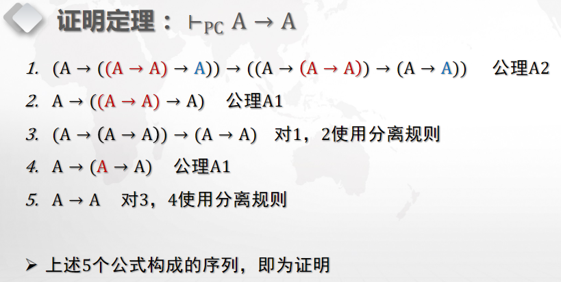
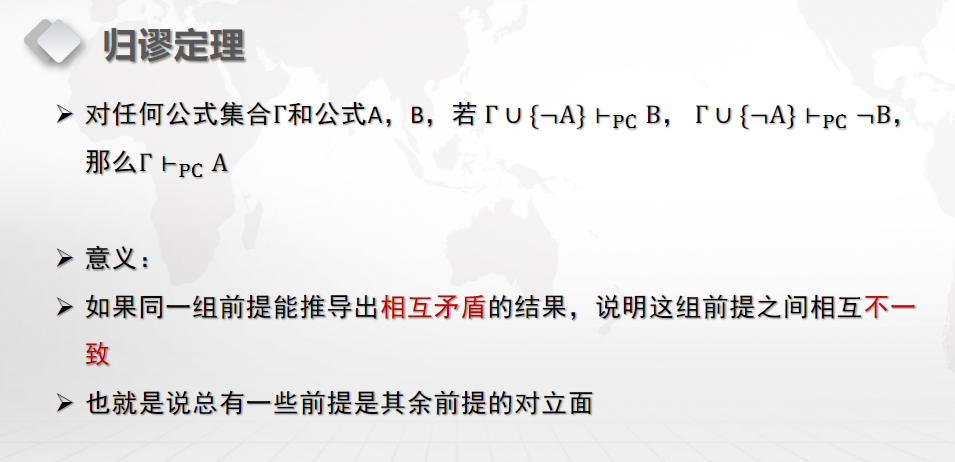

## 1.5 代数系统

### 1.5.1 运算
运算是 S 到 S 的一个函数，称为 n 元运算。 常用 * 表示二元运算，*(x, y) 常记作 x*y；用 Δ 表示一元运算。 ** **运算的基本性质：**

         - 普遍性：S 中所有元素都可以参加运算，即 
         - 单值性：相同的元素运算结果相同且唯一，

即 

         - 封闭性：S 中任何元素参加运算的结果也是 S 中的元素，即 

:::info

   - 求负是有理数集合上的一元运算
   - 加法是自然数集合上的二元运算
   - 减法不是自然数集合上的二元运算，因为 1-4=-3，不满足封闭性
   - 除法不是实数集合上的二元运算，因为除以 0 无意义
:::

**二元运算的一般性质：**

         - 结合律，如果二元运算满足：
         - 交换律，如果二元运算满足：
         - * 运算对 # 运算满足分配律，如果：

### 1.5.2 代数结构
代数结构由载体（非空集合 S）、载体上的若干运算和一组刻画载体上各运算性质的公理组成。

:::info

   - <, +> 是一个代数结构
   - <ρ(A), , , ~> 是一个代数结构 
:::

#### 幺元（identity element）
代数结构 <S, *> 中的元素 e，如果 ，则称 e 为 **幺元** 。 如果仅满足 ，称为 **右幺元** ；如果仅满足  ，称为 **左幺元** 。 左右幺元可能有多个。但如果存在幺元，则幺元必是唯一的：。

:::info

   - <, +> 中 0 是幺元
   - <ρ(A), > 中  是幺元
:::

#### 零元（zero element）
代数结构 <S, *> 中的元素 o，如果 ，则称 o 为 **零元** 。 左右零元定义类似左右幺元。并且，左右零元可能有多个。但如果存在零元，则零元必是唯一的。

:::info

   - <, +> 中没有零元
   - <ρ(A), > 中 A 是零元
:::

#### 逆元（inverse element）
对代数结构 <S, *> 中的元素 e，如果 x*y=e 那么 x 称作 y 的 **左逆元** ，y 称作 x 的 **右逆元** 。 如果 x*y=y*x=e，那么 x, y 互称 **逆元** 。x 的逆元通常记作 x 。 逆元是载体元素之间的关系。

**逆元的性质**

         - 多于 1 个元素的载体集上的零元没有（左右）逆元，证明：

即证：<S, *> 有幺元 e，零元 o，且 |S|>1，则 o 没有（左右）逆元： 首先，o≠e，否则有 a≠o 使得 o=o*a=e*a=a，矛盾。 如果 o 有左逆元，则 o=x*o=e，与 o≠e 矛盾，右逆元同理。

         - 在满足结合律的代数结构中，逆元是唯一的，证明：

即证：<S, *> 有幺元 e，且 * 满足结合律，若元素 x 有左逆元 l 和右逆元 r，则 l=r=x： l = l*e = l*(x*r) = (l*x)*r = e*r = r

:::info

   - <, +, ×> 中，加法幺元是 0，每个整数 x 都有加法逆元 -x；乘法幺元是 1，仅 1, -1 有乘法逆元。
   - <, +, ×> 中，加法幺元是 0，每个整数 x 都有加法逆元 -x；乘法幺元是 1，每个整数 x 都有加法逆元 1/x。
:::

#### 可约元素（cancelable element）
对代数结构 <S, *> 中的元素 a，如果对任意 x, yS，有 a*x=a*y  x=y（左可约），x*a=x*y  x=y（右可约），则称 a 是可约的。 可约是载体元素的一种性质。

满足结合律的代数结构中，有逆元的元素是可约的。证明： 

右可约同理。

### 1.5.3 代数结构的类型

      - 运算满足结合律的代数结构称为 **半群（semigroup）**
      - 含有幺元的半群称为 **独异点（monoid）**
      - 每个元素都有逆元（即，一定没有零元）的独异点称为 **群（group）**
      - 满足交换律的群称为 **交换群** 或 **阿贝尔群（Abel group）**

      - 代数结构 <R, +, *> 是一个 **环（ring）**，如果它满足：
         - <R, +> 是阿贝尔群
         - <R, *> 是半群
         - * 对 + 可分配：a*(b+c) = (a*b)+(a*c)，(b+c)*a = (b*a)+(c*a)
      - 代数结构 <F, +, *> 是一个 **域（field）**，如果它满足：
         - <F, +, *> 是环
         - <F-{0}, *> 是阿贝尔群

### 1.5.4 同态

      - 如果两个代数结构 <S, *> 和 <S', +> 的载体集合 S 和 S' 的元素个数相同，运算的元数也相同，那么我们称它们是 **同类型的代数结构**。
      - 如果存在 S → S' 的一一映射 h，使得 h(x*y) = h(x) + h(y)，即 S 中的运算结果在 S' 中的像等于 S 中运算数到 S' 的像在 S' 中的运算结果，那么我们称这两个代数结构是 **同构的代数结构**。

:::info
  和  是同构的：

:::

      - 如果两个代数结构  和  有函数 ，对 S 中任意元素 a, b 有

 )%3D%5CDelta'(h(a))%2C%5C%20h(a%5C%23b)%3Dh(a)%5C%23'h(b)#card=math&code=h%28%5CDelta%28a%29%29%3D%5CDelta%27%28h%28a%29%29%2C%5C%20h%28a%5C%23b%29%3Dh%28a%29%5C%23%27h%28b%29&height=21&width=312)
则函数 h 称为代数结构 S 到 S' 的 **同态映射** (homomorphism)

         - 如果 h 是单射函数，称为 **单一同态映射** 
         - 如果 h 是满射函数，称为 **满同态映射** 
         - 如果 h 是双射函数，称为 **同构映射** (isomorphism)

:::info
 <, +> 和 <, > 之间存在单一同态映射 f(x) = 2x ，即 
而 f(x) 的定义域为 ，值域为 ，因此 f 是单射函数。 而 <, +> 和 <, > 之间的映射 f(x) = 2x 即为同构映射。
:::

### 1.5.5 数学归纳法

#### 归纳原理
设集合 A 为归纳定义的集合，要证明，只要证明：

         - 归纳基础：证明归纳定义的基础条款中所有元素 x 均能使 P(x) 为真；
         - 归纳推理：证明归纳条款是保持性质 P 的。 

:::success
证明：对任意自然数有 (0+1+2+⋯+n)=0+1+2+⋯+n 归纳基础：当 n=0 时，02=03 归纳推理：

      - 设当 n=k 时，(0+1+2+⋯+k)=0+1+2+⋯+k成立
      - 当 n=k+1 时，(0+1+2+⋯+(k+1))=0+1+2+⋯+k+(k+1)2+2(0+1+2+⋯+k)(k+1)

=0+1+2+⋯+k+(k+1)2+k(k+1)2=0+1+2+⋯+k+(k+1)3 QED

:::

#### 数学归纳法的变种

         - 起始于任意自然数 n 的数学归纳法：可证明所有大于等于 n 的自然数都具有性质 P。
         - 起始于多个自然数的数学归纳法：归纳基础 - 证明 P(0), P(1) 为真，归纳过程 - 对任意 k>=0，P(k) 为真时推出 P(k+2) 也为真，结论：所有自然数都具有性质 P。
         - _有参变量的数学归纳法_

#### _数学归纳法的正确性证明_ 
（反证法，不想写了）

### 1.5.6 命题演算形式系统 PC (Proposition Calculus)
我们将命题以及重言式变换演算构造为形式系统，称为命题演算形式系统 PC。 复习一下形式系统：[1.2.13 形式系统](https://www.yuque.com/xianyuxuan/coding/sfs9gg#cqQpp)

#### PC 的符号系统

            - 命题变元：
            - 命题常元：T, F
            - 联结词：,  （这是一个功能完备集）
            - 括号：(, )
            - 命题公式：A, B, C, ...（高级成分，规定了符号的合法组合模式，即 **词** ）
               - 命题常元和命题变元是命题公式，称作原子公式。
               - 如果 A, B 是命题公式，那么 (A),  (AB) 也是命题公式。
               - 只有有限步引用上述两条所组成的符号串才是命题公式。

#### PC 的公理
（公理：若干基本的重言式） A, B, C 表示任意公式：  

#### PC 的推理规则
（推理规则：确保由重言式导出重言式的规则。公理和推理规则确保系统内由正确的前提总能得到正确的推理结果。） A, B 表示任意公式： ，即如果 A 和 A→B 均为真，则有 B 真。

#### PC 的性质
**合理性 Soundness**  如果公式 A 是系统 PC 中的定理，则 A 是重言式（如果 ，则 ） 如果 A 是公式集合 Γ 的演绎结果，那么 A 是 Γ 的逻辑结果（如果 Γ ，则 Γ） 说明了 PC 中的定理和演绎结果都合乎逻辑：根据分离规则，我们的公理是重言式，推导关系也成立，因此由公理和推理规则导出的定理都是重言式；由 Γ 中的公式、公理和推导规则导出的定理在 Γ 中的公式都为真的前提下也为真。

**一致性 Consistency**  没有公式 A 使得  和  同时成立。

**完备性 Completeness**  如果公式 A 是重言式，则 A 一定是 PC 中的定理（如果 ，则 ） 如果 A 是公式集合 Γ 的逻辑结果，则 A 一定是 Γ 的演绎结果（如果 Γ ，则 Γ） 即，合乎逻辑的命题，在 PC 中一定能推导出来。

:::success
例：懒得打了 反正也不会

:::

#### 元定理
在所有地方都成立的定理 同样懒得打了 要用再学吧

:::success
例：懒得打了

  
        
:::

#### PC 的一个重要同构：真值函数运算系统

### 1.5.7 一个简单的形式系统 MIU

      - 符号系统：M, I, U 组成的串
      - 初始串（公理）：MI
      - 规则：

(x, y 表示任何一个 M, I, U 组成的串)

         - 规则 1：如果串的最后一个符号是 I，则可以加上一个 U
            - 如果 xI 是定理，那么 xIU 也是定理
         - 规则2：如果串符号 Mx，则可以再加上 x 而生成 Mxx
            - 如果 Mx 是定理，那么 Mxx 也是定理
         - 规则3：如果串中出现连续 3 个 I，则可以用 U 代替 III 得到新串
            - 如果 xIIIy 是定理，那么 xUy 也是定理
         - 规则4：如果串出现 UU，则可以将 UU 删去得到新串
            - 如果 xUUy 是定理，那么 xy 也是定理

判断：MU 是不是定理？

#### MIU 的一个同构系统 310

         - M 对应 3，I 对应 1，U 对应 0
         - 公理：自然数 31 在集合中
         - 规则（略）

         - 分析：4 条规则并没有改变自然数对 3 取模的结果。31 在集合中，因此集合中所有自然数除以 3 的余数为 1，而 MU 对应 30，余数是 0，因此 MU 不在集合中。

### 1.5.8 一阶谓词演算形式系统 FC (First order predicate Calculus)

#### FC 的符号系统

         - 个体变元：x, y, z, u, v, w, ...
         - 个体常元：a, b, c, d, e, ...
         - 个体间运算符号（函数符）：f, g, h, ... （n 为正整数，表示函数的元数）
         - 谓词符号： P, Q, S, ... （n 为自然数，表示谓词的元数；当 n = 0 时，谓词公式退化为命题常元）
         - 真值联结词：,  （这是一个功能完备集）
         - 量词： ( 等价于 )
         - 括号：(, )
         - 个体项 (term)，简称项：
            - 个体变元和个体常元是项
            - 对任意正整数 n，如果  为项，则  也是项。
         - 合式公式 (well-formed formula)，简称公式：
            - （命题常元）是公式；对任意非负整数 n，如果如果  为项，则  是公式。
            - 如果 A, B 是公式，v 为任意一个个体变元，那么均为公式
            - 只有有限次使用上述两个条款确定的符号串是公式。
         - 全称封闭式 (generalization closure)
            - 设  为公式 A 中的自由变元，那么公式 称为 A 的全称封闭式。
            - A 中不含自由变元时，A 的全称封闭式是其自身。

#### FC 的公理
A, B, C 表示任意公式： 

#### FC 的推理规则
A, B 表示任意公式： ，即如果 A 和 A→B 均为真，则有 B 真。

#### FC 的重要性质

         - 合理性、一致性、完备性
         - 演绎定理、归谬定理、穷举定理

这块真学不下去了 第12课.pdf 的 16 - 31 页先跳过

### 1.5.9 自然推理系统 ND（Natural Deduction）

一并跳过了

