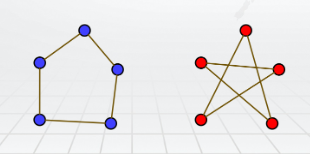
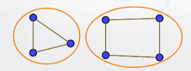

## 1.6 图论

### 1.6.1 图

#### 图的相关定义

         - **图** (graph) 是由 **结点** (vertex, [pl.]vertices) 和联结结点的 **边** (edge) 所构成的离散结构。
         - 图记作 G=<V, E>，其中非空集合 V 是结点的集合，多重集合 E 是边的集合。
            - 多重集合是允许有多个相同元素的集合，元素的重数表示多重集合中同一个元素的个数。
            - 边集是多重集合说明图可以有多个相同的边。
         - V, E 都是有限集的图称为 **有限图** ，否则称为 **无限图** 。

         - **有向边** (directed edge) 用 **结点的二元有序组** 表示，第一分量称为 **起点** ，第二分量称为 **终点** 。
         - **无向边** (indirected edge) 用 **结点的两元素多重集合** 表示。无向边的端点称为 **邻接节点** (adjacent vertices)。
            - 无向边用多重集合表示，即允许 {a, a} 这样的边，即 **无向环** (indirected loop) 的存在。
         - **环** (loop)，两端点为同一结点的边。

 
图的例子

         - **重边** (multiple edge)：E 中重数大于 1 的边。也称 **平行边** 。
         - **重图** (multigraph)：有重边的图。
         - **单图** ：没有重边的图。

         - **简单图** (simple graph)：没有环和重边的无向图
         - **完全图** (complete graph)：任何两个不同结点间都有边关联的简单图，记作 K 。

完全图

         - **孤立结点** (isolated vertex)：不是任何边的端点的节点。
         - **零图** ：仅由孤立结点构成的图 (E=∅)。

#### 赋权图

         - 赋权图 G=<V,E,f,g>
         - 结点权函数：f：V→W
         - 边权函数：g：E→W
         - W可以是任何集合，常为实数的子集

         - 普通的图研究结点和边之间的拓扑关系，如：邻接、连通、通路、划分等性质
         - 赋权图给普通图附加了数量关系，如：研究距离、成本、代价、规模等性质，是 GIS（Geographic Information System）应用的基础。

赋权图

#### 结点的度

         - 无向图中端点 v 的 **度 **(degree，记作 **d(v)** ) 定义为关联端点 v 的边的数目（如果是环，记 2 条）。
         - 有向图中，度分为 **出度** (out-degree，记作 **d(v)** ) 和 **入度** (in-degree，记作 **d(v) **)，分别是端点 v 作为有向边起点和终点的数目。有向图的度 d(v) 是出度和入度的总和。
         - 度为 1 的顶点称为 **悬挂点** (pendant node)。

d(c) = 5

性质：

         - 所有端点的度的总和是偶数，且是边数目的两倍。
         - 有向图中出度的总和等于入度的总和。
         - 奇数度结点必为偶数个。

#### 正则图
所有顶点的度均相同的图称为 **正则图** (regular graph)，按照顶点的度数 k 称作 k-正则图。

         - K是 (n-1)-正则图

1-正则图，3-正则图和 4-正则图

#### 子图

         - G1=<V1,E1>，G2=<V2,E2>
         - V1⊆V2，E1⊆E2，称 G1 是 G2 的 **子图** (subgraph)
         - 如果 G1 是 G2 的子图，且 G1≠G2，则 G1 是 G2 的 **真子图** 
         - 如果 G1 是 G2 的子图，且 V1=V2，则 G1 是 G2 的 **生成子图 **(spanning subgraph)

 G2 是 G1 的生成子图，G3 是 G1 的真子图

#### 补图

         - G1=<V1,E1>，G2=<V2,E2>
         - V1=V2，E1∩E2=∅， <V1,E1∪E2> 是完全图，则称 G1, G2 互为补图。

G1 是完全图，G2, G3 互为补图

### 1.6.2 图的同构
设 G1=<V1,E1>，G2=<V2,E2>，如果 |V1|=|V2|，|E1|=|E2| ，且可以将 G1 中 V1 中所有的结点一一对应地置换为 V2 中的结点名后得到的图等于 G2，则称 G1, G2 **同构** (isomorphic)。

同构的两个图

两个同分异构体是不同构的

### 1.6.3 路径 图的连通性

#### 拟路径
顶点 v 到 v 的 **拟路径**：，其中  或 。 拟路径的边数称为拟路径的 **长度** 。 例如，下图中 a 到 b 的拟路径可以是 a,1,e,7,b,3,c,3,b，或 a,1,e,7,b 等等。

#### 路径

         - 如果拟路径中的边各不相同，称作 **路径 **(walk)。如（见上图，下同）：a,1,e,7,b,3,c,4,e,6,d
         - 如果路径中的顶点各不相同，称作 **通路 **(path)。如：a,1,e,7,b,3,c,5,d
         - v=v 的路径称为 **闭路径**，如：a,2,b,7,e,4,c,5,d,6,e,1,a
         - v=v 的通路称为 **回路**，如：a,1,e,6,d,5,c,3,b,2,a

#### 路径与通路的性质

##### 路径和通路定理
在有 n 个顶点的图 G 中，如果有 u 到 v 的拟路径，则必有 u 到 v 的路径，且必有 u 到 v 的长度不大于 n-1 的通路。

##### 闭路径和回路定理
在有 n 个顶点的图 G 中，如果有顶点 v 到 v 的闭路径，则必定有一条 v 到 v 的长度不大于 n 的回路。

#### 图的连通性

         - 如果结点 u=v，或者存在一条 u 到 v 的路径，则称 u **可达** v (accessible)。
         - 如果无向图中任意两个顶点都是可达的，则称这个无向图是 **连通** (connected) 的。（图1）
         - 如果有向图中任意两个顶点都互相可达，则称这个有向图是 **强连通** 的。（图2）
         - 如果有向图中任意两个顶点，至少从一个顶点到另一个顶点是可达的，则称这个有向图是 **单向连通** 的。（图3）
         - 如果将有向图看为无向图时是连通的，则称这个有向图是 **弱连通** 的。（图4）

#### 连通分支（连通分量）
如果图 G 的子图 G' 是连通的，且它不是 G 的其他连通子图的真子图（保证最大），则称 G' 是 G 的连通分支（connected component）。

这个图中两个橙色圆圈圈起的部分都是这个图的连通分支

### 1.6.4 欧拉图 哈密顿图

### 1.6.5 图的矩阵表示

### 1.6.6 二分图 平面图 树
