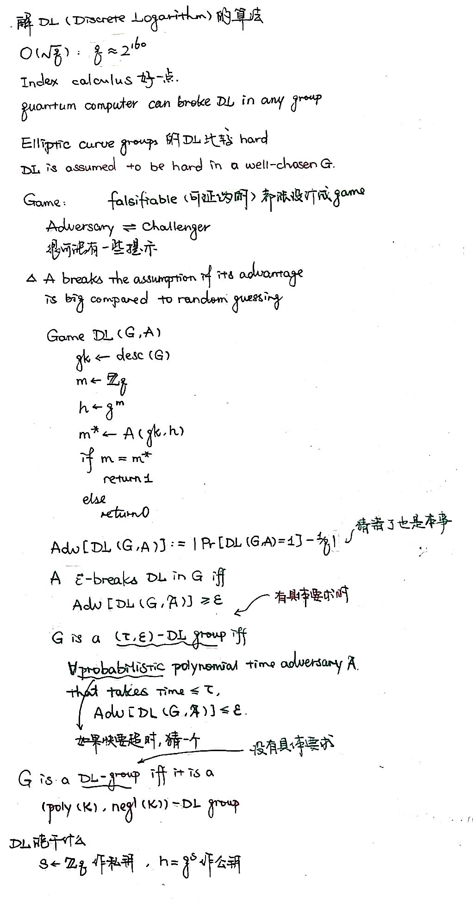

“有不懂中文的吗” “就跟着 Enigma 走？那都不用数学” “那那那算了，反正你们也不知道” “当然这个武术教练是真的嗷”

感谢 jgqgg 的笔记！[https://reticenceji.github.io/Crypto/index.html](https://reticenceji.github.io/Crypto/index.html)

## Topics

1. 引入 / 数论
2. Provable Security
3. Secure Multiparty Computation
4. Zero Knowledge Proofs
5. Encrypted Database
6. Private Information Retrieval
7. Private Set Intersection
8. Secure Multiparty Computation
9. Oblivious RAM
10. ~~Oblivious Neural Network Prediction~~
11. Federated Learning
12. ~~Blockchain Consensus~~

## 1 数论 | Number Theory

- **Divisibility**
- **Primality**
- **Greatest Common Divisor**
- **Ideal** is a non-empty set of integers that is closed under addition, and closed under multiplication by an arbitrary integer.

Semi-honest，诚实地遵守协议，但是尝试获取所有根据协议能够看到的信息 Proof of erasion

## 2 可证明安全 | Provable Security

### 群 | Group

### 环 | Ring

### 证明安全的思路

### 同态 | Isomorphism

### 安全性评价

### 离散对数问题、Game、安全性定义

### Diffie-Hellman Key Exchange

### CDH, Computational Diffie-Hellman Assumption

### INDistinguishability Security

### DDH, Dicisional Diffie-Hellman

## 3 安全多方计算 | Secure Multi-Party Computation

### Elgamal & Lifted Elgamal

### IND-CPA 和 IND-CCA

### 同态加密 | Homomorphic Encryption

### 安全两方计算；可信第三方

### Linearization, Rerandomize, 2-MAH

为什么要 rerandomize 呢？因为 b=0 时 Enc(ab; rb) = Enc(0; 0) 太明显了 

### Computational PIR; Oblivious Transfer

### Trapdoor DL; Paillier

## 4 Zero Knowledge Proofs

## 5 Encrypted Database

### 保序加密 | OPE, Order-Preserving Encryption

#### The first practical OPE scheme: BCLO (2009)

类似折半查找，但是随机（超几何分布 | HG, HyperGeometric Distribution），而且要保存 key table 问题：Ciphertexts leak almost the entire first half of plaintexts. 

#### Modular OPE (2011)

#### MOPE, Mutable OPE (2013)

构建 AVL Tree；服务端存的其实是 AES(plaintext)
Encoding：在第 i 层则第 i 位是 1；后面都是 0；前面各位往左则为 0，往右为 1 问题：O(log n) 次交互

#### Efficient MOPE

本地要备份一份映射关系 O(n)，但查询是 O(1)
适合保存年龄之类的 |{data}| >> |{plaintext}| 的情况

#### POPE, Partial OPE (2016)
[https://www.youtube.com/watch?v=GeLvmRkq_JM](https://www.youtube.com/watch?v=GeLvmRkq_JM)
用 B Tree；都插到 root

Server 一次给不了那么多，就随机挑 L 个让 Client 排个序

Client 随后给 Server 对应的顺序信息

即工作量都在查询过程中；插入过程没啥工作量

#### 比较

### 针对 OPE 的攻击

#### 基于 Order

假设顺序是可知的；考虑 Efficient OPE 那里讨论的加密年龄的情况，那用密文排个序其实也泄露了明文

#### 基于 Order + Frequency

Bank B 的信息是明文提供的（auxiliary data）

#### 基于 column 之间的关系

### SDB (2014)

**比较**：ck = (1, 0) 的时候明文 == 密文；因此相减以后 KeyUpdate 到 (1, 0)。为了避免泄露信息，KeyUpdate 之前乘一个随机数

**求和**：由于  的存在，只有另  才能做加和：

#### 一些问题
前置知识：互质概率

问题 1：无法加密 0，因为 0 加密后必然为 0

问题 2：加法和乘法 KeyUpdate 后根据密文比值可以算出明文比值

问题 3：大意是 KeyUpdate 可逆

问题 4：做多次比较会泄露

### SDB+
大概就是 SDB + Paillier

具体的听不懂

## 6 Private Information Retrieval
从数据库拿信息，但是数据库不知道拿的啥

- 全拿下来：Overhead 太大

### CGKS95 | PIR

- 

为什么 Communication cost 𝑂(𝑛) 呢？因为我们需要保证服务器猜中用户拿走的是哪个的概率仍约等于 1/n。服务器有 1/2 的概率猜中自己收到的这个集合包不包含 i，猜中的情况下有 1/m 的概率猜中拿走的那个，因此猜中的总概率是 1/(2m)。所以我们需要让 m = n/2。

- 
- 

问题：基于保证 server 之间不串通 属于 Information-Theoretic Private，即不对算力做假设的安全；单个 server 无法实现 IPIR，只能实现 CPIR：

### KO97 | Single DB cPIR
computational private：多项式算力条件下安全；即基于一些密码学假设

为什么 0 0 1 不会被发现呢？我们用的加密方法一般不是 deterministic 的

### Gentry09 | FHE Scheme
基于全同态加密 (FHE, Fully Homomorphic Encryption)

![L[[8W63NJAK1FDSQEL]T4PN.png](./assets/1641727742346-b67e0fa4-2fad-4efc-a828-81e487092eb1.png)
（黄底表示加密） XOR 通过模 2 加法算出；即同态加密用的 N 就是 2

计算太多了；FHE 由于添加了噪声只能做有限次操作

### ACLS2017 | SealPIR
想实现这样的效果：

引入这样一个加密系统：

即 Sub(Enc(x), N) = Enc(x^N)
由于 mod x^N + 1，因此 x^N + 1 = 0 => x^N = -1 => x^(N+1) = -x。 

后面讲了什么 25% Fewer Operations，没看懂

### PPY18 | PSIR
Private Stateful Information Retrieval 本地先存：

想要 0，可以请求 {0, 2, 4} 的和

希望让它变成 0 2 4 在一行

怎么变呢？ 首先让 0 在左下角。选一个随机的 k1，做一个哈希 F(k1, index)：

其中 F(k1, 2) 结果是 5，因为有了所以跳过

给结果 +5 可以使得最下面的结果是 0，因此填入 1 7 0：

第一列用 (k1, 5) 生成；删除这三个数：

搞第二列。注意哈希算出来的是下标：

+3 使得最下面是 0；因为 a[0] = 2：

发现有 4！我们希望 4 在右下角，所以重新选个 k2：

搞好了：

最后一个：

可以用 cPIR 取一行了：

扔掉 2+4，不然服务器容易知道你拿的是什么：

## 7 Private Set Intersection

- B 把所有 item 的 hash 发给 A，然后 A 逐个做 hash 进行比对
   - 问题：字典攻击

- 基于 DDH

由于 RSA，r^(ed) = r mod N

### (8) 突然讲 MPC

#### 1 混淆电路 | Garbled Circuit
混淆电路 [https://baijiahao.baidu.com/s?id=1680159161472356331&wfr=spider&for=pc](https://baijiahao.baidu.com/s?id=1680159161472356331&wfr=spider&for=pc)

#### 2 秘密共享 | Secret Sharing

### 基于 OT 的 PSI

(whp, with high probability)

O(λn) 的 n 优化不了了，优化 λ

### Unbalanced PSI
比如你的通讯录和 server 的通讯录求交集，m << n，能不能用 O(m) 而不是 O(n) 的呢？

全同态加密做很多乘法很慢而且有可能做不了

Cuckoo hashing：算 hash；如果冲突了就把那个人踢了让他用下一个 hash 函数算一遍 3-way 的版本：二维的；都算出来；不踢出去了 放他后面就好了

左边是 client 的存储方式，右边是 server 的存储方式；client 发来要查询的内容，server 在对应行查询即可

把一部分幂的计算结果发过去，服务器就不用算乘法了

### 基于可信硬件 Trusted Execution Environments (TEE) 的 PSI

会泄露 memory access patterns：如果走一半不走了服务器就知道了；都走一遍又太慢了。

怎么办呢？

## 9 Oblivious RAM

 

用冒泡之类的；核心：取两个，在本地换或不换，再放回去

### Hierarchical ORAM

### Practical ORAM

若干个一起用；一个在 shuffle 的时候别的还能用

从下往上写

## 11 Federated Learning

把训练出的模型而不是数据给云端；云端进一步训练后返还给各方；循环若干次 由于模型可能会泄露信息，因此云端可以用安全多方计算只计算模型的加和等计算结果，而不是看到模型本身；也可以不用安全多方计算

PRG - pseudo random generator

