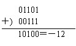

本文中部分内容来自太原理工大学的相关资料。

### 1 无符号数
所谓无符号数，通常表示一个数的绝对值，即数的各位都用来表示数值的大小。一个字节（8位）二进制数只能表示0～255范围内的数。因此，要表示大于255的数，必须采用多个字节来表示，它的长度可以为任意倍字节长。

### 2 有符号数

#### 2.1 原码、反码、补码
所谓有符号数，即用来表示一个任意位长的正数或负数。

用 + 或 - 来表示正负的二进制数叫 **真值** ，用 0 或 1 来表示正负的二进制数叫 **机器数** 。

带符号的机器数可以用原码、反码和补码来表示。一般计算机中大多采用补码表示。

**原码** ：正数的符号位用“0”表示，负数的符号位用“1”表示，其余数字位表示数值本身。

      - 0有两个表示，分别为正零（00000000）和负零（10000000）。这是原码的一个缺点。
      - 0有两个表示也导致了位数为8时，原码数的表示范围是-127（11111111）~+127（01111111）。
      - 另外，虽然原码表示数的方法很简单，只需要在真值的基础上，将符号位用数码“0”和“1”表示即可。但采用原码表示的数在计算机中进行加减运算时很麻烦。如：遇到两个异号数相加，或两个同号数相减时，就要用减法运算。为了把减法运算转变成加法运算，则引入了反码和补码。

**反码** ：正数的反码与原码相同，而负数的反码则是在原码的基础上，符号位不变（仍为1），其余数位按位求反，即0→1，1→0。

**补码** ：如果是正数，补码同原码也同反码，如果是负数，则在反码的基础上最末位加1。实际上，补码的定义为：[X]补=M+X (Mod M)，其中M根据机器数的位数决定。如机器数为8位，则M=11111111B。

      - 注：符号位的进位自动丢失（溢出）。
      - 补码中，0只有一种表示。[0]补=00000000。
      - 位数为8时，补码数的表示范围是-128（10000000）~+127（01111111）。

（下面是 [ICS 的笔记](https://www.yuque.com/xianyuxuan/coding/ez9cdg#jiVzt)，补过来：）

**Integer Data Types.** **Unsigned Integers.** With _k_ bits, we can represent in this positional notation (位值制记数法) exactly 2__ integers, ranging from 0 to 2__ - 1.  For example, 10101 corresponds to:.

**Signed Integers.** It's often necessary to be able to deal with negative quantities. The first thought is a leading 0 signifies a positive integer, while a leading 1 signify a negative integer. It is called **signed magnitude **(符号位表示法). A second idea to represent a negative number is flipping all the bits of the positive number which has the same magnitude. It is called **1's complement** (反码). However, we can easily find that these two representations of signed integets make 1 + (-1) ≠ 0. Almost all computers use **ALU** (arithmetic and logic unit, 算术逻辑运算单元) to do addition. It only does addition and does not care about whether the operands are signed or not. It would be nice when the ALU adds the representation for an arbitrary integer to the integer of the same magnitude and opposite sign, the sum is 0. To accomplish that, the **2's complement** (补码) data type specifies the representation for each negative integer so that when the ALU adds it to the representation of the positive integer of the same magnitude, the result will be the representation for 0. Moreover, and more importantly, as we sequence from representations of -15 to +15, the ALU is adding 00001 to each successive representation.  If we know the representation of _A_, we flip all the bits of _A_ and add 1 to it, the result is the 2's complement of _-A_.

#### 2.2 补码的加减运算
运算规则： **[X+Y]补=[X]补+[Y]补** **[X-Y]补=[X]补-[Y]补=[X]补+[-Y]补** **[[X]补]补=[X]原** **[-Y]补** 的计算：对**[Y]补**按位取反（含符号位），再在最低位加1。

例如： 
由最右例可知，当带符号的数采用补码形式进行相加时，可把符号位也当作普通数字一样与数值部分一起进行加法运算，若符号位上产生进位时，则自动丢失，所得的结果为两数之和的补码形式。

又如： _X_＝96，_Y_＝19 则[_X_]补＝01100000  [_Y_]补＝00010011  [-_Y_]补＝11101101 故[_X-__Y_]补： 

#### 2.3 补码溢出
某运算装置共有五位，除最高位表示符号位外，还有四位用来表示数值。此时用反码计算13+7的值时： 
运算结果显然是错误的，因为两个正数相加不可能得到负数的结果，产生错误的原因是由于两个数相加后的数值超出了加法装置所允许位数（数值部分4位，可以表示的最大数值为24 ＝16），因而从数值的最高位向符号位产生了进位，或说这种现象是由于“溢出”而造成的。

为了保证运算结果的正确性，计算机必须能够判别出是正常进位还是发生了溢出错误。微机中常用的溢出判别称为 **双高位判别法** ，并常用“异或”电路来实现溢出判别。 其判别方法为。其中表示符号位是否进位，而表示数值部分的最高位是否进位。⊕表示异或(xor)。容易证明，若与值相同时，即异或值为0，则未发生溢出；值不同时，即异或值为1，则发生了溢出。
