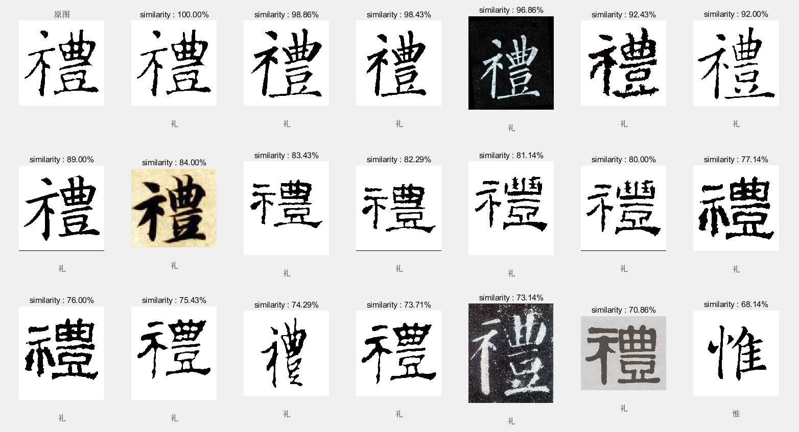
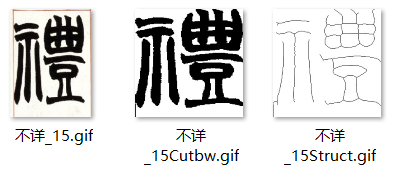

2020 年 9 月 12 日

## 使用说明
图片库是已经经过处理、存储处理结果了的，因此请不要更换图片库。请**直接运行 CmpAll.m**，选择一张书法图片就可以进行对比识别。结果显示为识别出库中最相似的 20 个书法字，例如：

## 算法简介
这个部分记录了这个程序的基本算法以及采取相关算法的理由，没有具体说明代码实现的细节。我们将重点用黄色背景标出。

### 步骤一：图像预处理
相关代码： 函数 **ImageCut.m** ：将所给 BW 书法图片去除边框并化为 256*256。 函数** ImgInit.m **：将所给图像初始化并保存。 运行代码段 **InitAll.m** ：遍历文件夹下的所有图像，依次用 ImgInit.m 进行初始化。

在图像预处理中，我们主要进行了：

      - 将图像**转换为二值图像**

所给的图像库中有各种类型的图像。书法的识别与颜色、灰度等基本无关，因此我们统一将图片转为二值图像，方便后续处理。 我们起初发现有一些图片读入后用 imshow 直接输出会显示全黑。排查之后发现这些图片原来是索引图像。在之前的处理中我们没有处理过索引图像，因此起初在这里的思考出现了遗漏。

      - 判断是否白色过少。如果是，则判定为黑底白字，**翻转图片颜色**

图像库中包含一部分碑帖。这些碑帖中相当一部分是阴文。为了保证识别的准确性，我们将其作反色。

      - **图像去噪**（调用 bwareaopen）

如前，图像库中的碑文可能包含很多干扰点。经过查阅资料，我们调用了 bwareaopen 函数去除这些干扰点。经测试，我们认为将规模小于 _图像大小 * 0.001_ 的连通块识别为干扰点是合理的（与 0.01 和 0.0001 相比）。 但是，仍有一些碑文、帖文由于干扰元素过多（如缺损、印章、背景颜色等），去噪后的结果仍不尽人意。

      - **裁剪** 

图像库中的图片的边界大小不尽相同，图片的尺寸也存在差异。这并不利于 MATLAB 中以矩阵方式对图像的分析处理。因此我们对去除了图片的空白边框，并将其统一转为 256*256 大小以便后续比较。 我们进行裁剪的方式是：分别从四个边界向内进行判断，直至某一行的黑色像素个数为 256 的 5%~50%，判定此处为文字边界，按四个边界作裁剪。其中，5% 是我们经过一定测试认为合理的、识别为字形部分的比例（舍弃掉笔画的末尾部分是无伤大雅的）；50% 是我们针对一些含有边框的图片设置的上限：我们认为文字最边界有超过 50% 的黑色是不合理的。

裁剪过后，我们将上述几步处理过后的结果存为文件名带 Cutbw 后缀的图片，例如：

第一次图像预处理结果

      - **结构化** 

我们希望对书法的结构进行比较。但是，图像库中不同文字的粗细有别，这极大影响了相关识别和判断。经过查阅资料，我们使用 bwmorph 函数，应用 thin 操作对上述处理后的 BW 图像进行处理。将结果存为文件名带 Struct 后缀的图片，例如：

第二次图像预处理结果

我们对图像进行预处理后直接存储在文件夹中，这样便无需在后续对比识别时每次进行初始化，节省了一部分时间。

### 步骤二：相似度对比
相关代码： 函数 **ImageVec.m** ：返回 4 个向量，分别表征图像的某种结构分布特点。 函数 **ImageCmp.m** ：返回一个 1*4 向量。第一个值为了存储图片在表中的编号，是为了后续排序方便，在此不再赘述。后三个值表征图像间按几种不同方法匹配的相似度。

这部分的核心之一是**相似度对比的思路和算法**，下面根据实际编程时的算法设计一一说明：

#### 重叠度 （返回向量中的第 3 个值）
即使一般通过两个图像作差判断相似度的方法是不可行的，但是我们分析认为，在书法识别中这种方法是存在一定的可信度的。因此我们首先采用了这种算法进行识别。 我们的算法是：对两个图片的 Cutbw 处理结果作异或，计算结果中 1 数目（即不相同的像素数目）overlayCnt，重叠相似度 smlOne = 1 - overlayCnt / 256²。 实际上，这里相似度的绝对数值并不重要，我们**只关注其相对大小**。原因参见 **步骤三：各相似度的结合**。 这里采用 Cutbw 而不是 Struct 进行比较的原因是：结构的像素数太少，稍有偏移就会引起很大的差异，不适合用重叠度进行比较。

#### 像素数 （未采用）
起初我们希望通过统计黑色像素数目来作为判断的一个重要依据，但是由于各个图像运笔粗细不同而放弃。 后来我们对图像增加了结构化处理后再次采用像素数来做判断（因为结构化后的黑色像素数确实反映出了字的笔画数目，是一个合理的判断依据），有一定成效。 但是最后，我们将结构相似度中对向量距离的距离由余弦距离改为了欧几里得距离（参见下文），而欧氏距离本就反映出了笔画数目即文字复杂度的特征，另外由于一些碑文的处理结果中仍有较多的干扰（如下右图）导致像素数的统计出现偏差，因此最后我们没有采用像素数作为判断依据。

起初的像素数比较代码 和 “干扰”的示例

#### 分布相似度（返回向量中的第 4 个值）
分布相似度是这些相似度中最复杂和最难以设计的一个。实际上，最终版本的分布相似度是对四个向量进行运算的结果；算法设计历程中的分布向量更多。下面对其进行介绍：

      - **Part 1：分布向量设计**

统计分布规律时，我们对 Struct 图像做操作。

         - **平均切割** （未采用）

在设计分布相似度算法时，我首先尝试对图像进行 3*3 切割，但效果欠佳。此后，我们尝试了各种规模的切割（下图为当时的测试结果，参数仅有切割向量。由于选取的测试字形复杂且为正楷，正确率普遍偏高。）
    3*3 切割，正确率 10%             8*8 切割，正确率 50%

16*16切割，正确率 60%           32*32切割，正确率 30%

经测试，我们选择 16*16 为我们的切割规模。但是，我们使用了加权切割替代了这种切割方法，参见下文。

         - **环形切割 **（未采用）

参考文献中有这样的一种切割方法：

分别来自参考文献 [2] 和 [3] 由于我没能找到极坐标化的相关函数，我粗略地编写了一个环形切割向量：

经过测试发现，这种环形切割的方式不太稳定。最终我将环形切割和平均切割结合起来，形成了如下的加权切割。

         - **加权切割** 

结合上述两种方法，我们设计了两个分布向量，均为 16*16 切割后的结果乘一个系数。两个分布向量中的系数分别与切割块到中心的距离正相关和负相关。这样就将上述两种方法结合了起来，更好地反映了结构特点。

         - **横纵向分布** 

我们统计字体在横向和纵向上的分布，可以辅助性地剔除一些不相似的字。我们设计了两个分布向量，分别为每 8 行的和以及每 8 列的和。

      - **Part 2：分布向量的处理** 

关于分布向量的处理，起初我们使用了余弦距离表征向量之间的差距。但是后来我们发现这样的差距过于微小，不便于区分。另外，由于我们从原本的切割后的图像增加了变为结构化的一步，像素数有了实际意义，因此我们改用欧几里得距离，这样可以更好地反映结构上的分布特点。

#### 结构相似积分（返回向量中的第 2 个值）
我们考虑对图片库中每一个偏旁部首进行一定的特点分析。根据这一灵感并经过对字库的分析，我想到了将字分为三种的方法：

         - 左右 1/2 处分开：散、我、节、知、物、仰
         - 左右 1/3 处分开：论、惟、礼、枝
         - 非左右结构：其他

我们在识别相似度的时候，分别对 Struct 图片判断其是否为 1/2 分割和 1/3 分割。两个图片同为或同不为某分割则记 0.5 分。即结构相似积分赋 0，0.5，1 三种。 识别图像是否在某处为分割的方法是：计算此处几列的像素总数，与全图平均进行对比，判断是否显著少于平均值。

### 步骤三：各相似度的结合
相关代码： 运行代码段 **CmpAll.m** ：用户选择一张图片，显示库中匹配出最相似的 20 个结果。

这部分的核心是 **如何将步骤二中的各种相似度结合起来** 。我们起初试图在几个相似度中找出一个合理的配比，但经过大量尝试后仍然不尽人意。在与对面寝室舍友的交流中，我们最终想到了这样的一个方法：按照相对大小即在各个相似度下的排名赋分，然后统计总分得出相似度。（感谢刘腾、杨子晗同学的提示。）

经过一定尝试和比较后，我们最终采取了如下赋分方式：

      - **结构相似积分** ：直接采用，占 1 分。
      - **重叠相似度** ：占 0.5 分。排名 1~100 的赋 0.5~0.005 分，以 0.005 步长顺次递减。
      - **分布相似度** ：占 2 分。排名 1~100 的赋 2~0.02 分，以 0.02 步长顺次递减。另外，分布相似度排名 500 之后的，赋 -5 分，即直接出局。

将上述积分除以 3.5 的结果作为最终显示的相似度百分比。

## 测试与评价
测试代码： **TestCmp.m** 我们在 1~3767（即图片库大小）中随机生成一个数，将其代表的图片作为对比调用 CmpAll.m 查看结果。重复数次，得到的结果分别如下：

行书“论”：正确率 60%

楷书“声”：正确率 75%

行书“重”：正确率 95%

行书“万”：正确率 90%

草书“天”：正确率 35%

行书“春”：正确率 90%

程序对草书的识别能力较弱，尤其是对行书楷书与草书篆书之间的相互识别能力较弱。这是程序机械化的识别和判断带来的弊端。

## 参考文献
[1]邓学雄,李京陶,李牧.毛笔书法临帖的计算机评价[J].图学学报,2014,35(6):899-904. [2]章夏芬,庄越挺,鲁伟明,吴飞.根据形状相似性的书法内容检索[J].计算机辅助设计与图形学学报,2005,17(11):2565-2569. [3]俞凯,吴江琴,庄越挺.基于骨架相似性的书法字检索[J].计算机辅助设计与图形学学报,2009,21(6):746-751.
