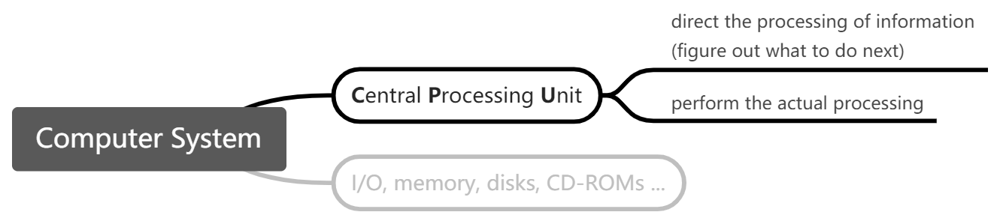
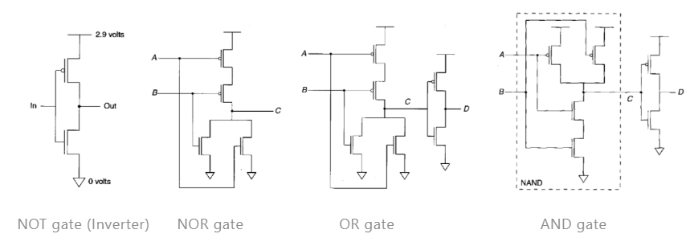
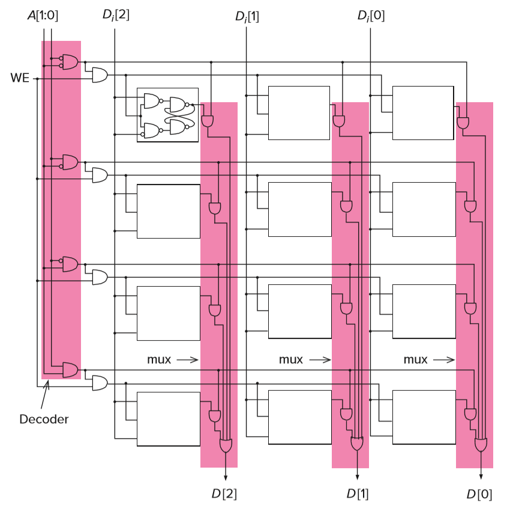

---

2020/7/3 ~ 2020/7/27

**Assessment:** Homework 10 * 2% = 20% Labs 40% Final Exam 40%

本文是《计算机系统概论》课程笔记和读书笔记。荣幸的是，本课程在大一暑短学期由 Patt 教授亲自讲解。因此我将尝试使用非常不纯正的英文结合中文一起完成这篇笔记， 这也是学习同时提高英文水平的一种尝试。 本文主要参考《计算机系统概论》图书（中文第二版，英文二、三版）。相对于课程，本文的内容可能更贴近课本。实际的笔记顺序和章节分块根据学习情况与图书有所不同。若无特殊说明，本文中插图均来自该书。 本文中特别重要的部分将用特殊的字体颜色或背景色标出。我们用蓝色方框中的表示其中的内容是一些补充说明，用绿色方框表示其中的内容是针对邻近知识点的引例说明。

---

## 1 Welcome Aboard

**What we are trying to do.** The computer is an eletronic idiot. We are trying to understand when using the sophisticated features of a high-level programming language, what's going on underneath inside the computer.

**0 & 1.** Every wire in the computer, at every moment in time, is either at a high voltage or a low voltage (absence or presence of a large voltage relative to 0 volts; 0 or 1). We will encode all information (including operations) as sequences of 0's and 1's.

**Notion of abstraction.** We'd assume that everything about the detail is just fine, and only focus on the essential aspects. Only when there is a problem, we go from the abstration back to its compunent parts. That is, our ability to abstract must be combined with our ability to deconstruct. We're trying to continually raise the level of abstraction, with the ability to go below it at the same time.

**Hardware & Software.** Break the wall between them. We'd take into account the capabilities and limitations of both.

**Computer System.** Figure. 

**Computers as Universal Computational Devices.** Computer scientists believe that anything can be computed. We can give the old computer a new set of instructions to carry out a new kind of computation. This is why computers are different from other mathines.

**From Problems to Devices.**  **Problems.** _Time flies like an arrow, fruit flies like a banana._ Natural languages is filled with ambiguity, which would be unacceptable in instructions provided to a computer, an electronic idiot as it is. ↓ **_Software Design_** **The Algorithm.** The first step in the sequence of transformations is to transform the natural language description of the problem to an algorithm. We use terms below to describe properties of an algorithm:

   - Definiteness: Each step is precisely stated.
   - Effective computability: each step can be carried out by a computer.
   - Finiteness: The procedure terminates.

↓ **_Program_** **The Program.** The next step is to transform the algorithm into a computer program (C, for example). ↓ **_Compile / Interprete_** **The I**nstruction** S**et** A**rchitecture**.** The next step is to transform the program into the instruction set of particular computer that will be used to carry out the work of the program. The ISA specifies:

   - What operations the computer can perform and what data is needed by each operation (_operand, _操作数);
   - The acceptable representations for operands (_data type_);
   - The mechanisms that the computer can use to figure out where operands are located (_addressing modes, _寻址方式).

↓ **_Processor Design_** **The Microarchitecture.** The next step is to transform the ISA into an implementation. A certain ISA provides the same interface, but there can be different detailed organizations of implemetation. These are the different microarchitectures of microprocessors. ↓ **_Logic Circuit Design_** **The Logic Circuit.** The next step is to implement each element of the microarchitecture out of simple logic circuits. ↓ **_Process Engineering & Fabrication_** **The Devices.** Finally, each basic logic circuit is implemented in accordance with the requirements of the particular device technology used.

**小结**。这里主要讲解了本书（课程）的基本思路和一些基本概念。这里的核心是从问题到电子器件的转换层次，每一个层次都有多种实现选择，这些决策和选择决定了系统实现的性能和成本。

## 2 Bits, Data Types, and Operations

**The Bit as the Unit of Information.** We refer to each 0 and each 1 as a bit (**bi**naty digi**t**). With _k_ bits, we can distinguish at most 2_k_ distinct items. Each pattern of these _k_ bits is a **code**, it corresponds to a particular value.

**Integer Data Types.**  **Unsigned Integers.** With _k_ bits, we can represent in this positional notation (位值制记数法) exactly 2_k_ integers, ranging from 0 to 2_k_ - 1.  For example, 10101 corresponds to:.

**Signed Integers.** It's often necessary to be able to deal with negative quantities. The first thought is a leading 0 signifies a positive integer, while a leading 1 signify a negative integer. It is called **signed magnitude **(符号位表示法). A second idea to represent a negative number is flipping all the bits of the positive number which has the same magnitude. It is called **1's complement** (反码). However, we can easily find that these two representations of signed integets make 1 + (-1) ≠ 0. Almost all computers use **ALU** (arithmetic and logic unit, 算术逻辑运算单元) to do addition. It only does addition and does not care about whether the operands are signed or not. It would be nice when the ALU adds the representation for an arbitrary integer to the integer of the same magnitude and opposite sign, the sum is 0. To accomplish that, the **2's complement** (补码) data type specifies the representation for each negative integer so that when the ALU adds it to the representation of the positive integer of the same magnitude, the result will be the representation for 0. Moreover, and more importantly, as we sequence from representations of -15 to +15, the ALU is adding 00001 to each successive representation.  If we know the representation of _A_, we flip all the bits of _A_ and add 1 to it, the result is the 2's complement of _-A_.

**Binary-Decimal Conversion.** [Link](https://www.yuque.com/xianyuxuan/coding/sca002)

**Operations on Bits.**  **Airthmetic.**  **Sign-Extension (SEXT).** The value of a positive number does not change if we extend the sign bit 0 as many bit positions to the left as desired (E.g. 01011 -> 00001011). Similarly, the value of a negative number does not change by extending the sign bit 1 (E.g. 10101 -> 11110101). Sign-extension is performed in order to be able to operate on bit patterns of different lengths.

**Overflow.** In the case of unsigned arithmetic, overflow is a carry out of the leading digit. In signed arithmetic, when the sum is larger than the largest positive number or smaller than the smallest negative number that can be represent with a given number of bits,  it generates a carry into the leading bit position, which is used to indicate the sign of a value, so things goes wrong.

**Logical Operations.**  **AND.** **NOT. OR. Exclusive-OR (XOR).** 

**The Bit Vector (位矢量).** If we have _n_ units which is individually and independently _busy(0)_ or _avaliable(1)_. We can keep track of these _n_ units with an _n_-bit binary pattern we call a bit vector.

**Floating Point Data Type.** Figure (IEEE Floating Point Arithmetic). There is:

- 1 bit for the sign (positive or negative)
- 8 bits for the range (exponent, 指数, 表示范围). The actural exponent being represented is the unsigned number in the data type minus 127.
- 23 bits for precision (fraction, 尾数, 表示精度). As the fraction is normalized, that is, exactly 1 nonzero binary digit appears to the left of the binary point, which has to be 1. So there is no need to represent that bit explicitly. Thus the fraction in data type is the numbers appear to the right of the point.

**ASCII Codes.**  **Hexadecimal Notation.** 

**小结。**本节主要讲解的是二进制 bit 以及相关的数据类型和运算，比较陌生的知识点主要是补码的计算、符号扩展和浮点数的表示。

## 3 Digital Logic Structures

**MOS Transistors **(metal-oxide semiconductor transistors, 金属氧化物半导体晶体管)**. **Figure.

The n-type (left) and p-type (right) MOS transistor When the Gate (栅极) of the n-type transistor is supplied with 2.9 volts, the connection from source (源极) to drain (漏极) acts like a piece of wire: we have a closed circuit between the source and drain. If the gate of n-type transistor is supplied with 0 volts, the connection between the sourcr and drain is broken: we have an open circuit. The p-type transistor works in exactly the opposite fashion from the n-type transistor. We refer to circuits that contain both p-type and n-type transistors as **CMOS** (complementary metal-oxide semiconductor) circuits. 

**Logic Gates **(逻辑门)**.** We can construct basic logic structures out of individual MOS transistors: AND, OR and NOT gates. Figure. 
The horizontal line and the triangle are the terminals of the power supply.

:::info
**Why We Can't Simply Connect P-Type to Ground**

We might want to connect the transistors as shown on the figure above to get an OR gate. However, when we connect a P-type transistor to ground or an N-type transistor to 1.2 volts, because of the electrical characteristics of the transistors, we get what is usually referred to as a transmission voltage of approximately 0.5 volts across the transistor. This results in the output of the transistor circuit of figure above being 0.5 volts + 0.5 volts, or 1.0 volt if A and B are both 0, and 0.7 volts (1.2 volts minus 0.5 volts) otherwise. It will make things wrong.  On the other hand, when we connect a P-type transistor to 1.2 volts or an N-type transistor to ground, there is no voltage across the transistor. That is why we design a NOR gate first to get an OR gate.
:::

We'll use the symbols below instead of drawing circuits whowing the individual transistors.

**DeMorgan's Law.**     

**Larger Gates.** Figure.

A 3-input AND gate

**Combinational Logic Circuits.** There are fundamentally 2 kinds of logic structures of logic structures, those that include the storage of information and those that do not. Those that do not are usually referred to as **decision elements** or **combinational logic circuits**. Here is 3 kind of them. **Decoder (译码器).** With _k_ binary digits, we can distinguish at most 2_k_ distinct items. A decoder has the property that given a certain input pattern (one of the 2_k_ distinct items), exactly one of its outputs is 1 and all the rest are 0. The one output that is logically 1 is the output corresponding to the input pattern that is expected to detect. We say the output line that detects the input pattern is asserted (置位). The decoder is useful in determining how to interpret a bit pattern.

**Mux (multiplexer, 多路复用器).** The function of a mux is to select one of the inputs and connect it to the output. With k select lines (S), a mux can make a selection among 2k inputs.

A 2-input decoder                A 4-input mux, or simplified (right) on gate-level

**A One-Bit Adder (**also known as** A Full Adder, 全加器).** To make an addition on one column of bits within 2 operands, we shall add one bit from each of the 2 operands _Ai_  and _Bi_  and the carry from the previous column. There are 2 results: the sum bit _Si_ and the carry over to the next column _Ci+1_. Figures below shows the truth table and a logic gate impletation of a one-bit adder.

  The truth table for a one-bit adder            Gate-level description of a one-bit adder

A circuit for adding two 4-bit binary numbers

**The Programmable Logic Array (PLA).** A PLA is a building block for implementing any collection of logic functions one wishes to implement. For n-input logic functions, we need a PLA with 2n n-input AND gates. Then we can implement m functions of n variables appropriately connecting AND gate outputs to m OR gate inputs. Figure below shows a PLA that can implement any 4 functions of 3 variables.

A programmable logic array

**Logical Completeness.** We say that the set of gates {AND, OR, NOT} is logically complete because we can build a circuit to carry out the specification of any truth table we wish without using any other kind of gate.

**Basic Storage Elements.** As we've stated before, there are logic strustures that include the storage of information. **The R-S Latch (R-S 锁存器).** R-S latch can store 1 bit of information. R (resetting) means store a 0 and S (setting) means store a 1.

An R-S latch Figure above shows the simplest implementation of R-S latch. We refer to the value of a as the information stored. As we can see, if we set both S and R to 1, then there are two possible status: 
OR    
In this case, the latch is storing a value (0 or 1) and nothing is trying to change the value. We say the latch is in the **quiescent state** or **quiet state**. If we set S to 0 and keep R at 1, this causes: 
Similarly, if we set R to 0 and keep S at 0, this causes .We use the term set to denote setting a variable to 0 or 1, as in "**set to 0**" or "**set to 1**". In addition, we often use the term **clear** to denote the act of setting a variable to 0. When we finish the setting, we should make the latch return to the quiescent state. S and R are not allowed to be set to 0 at the same time.

**The Gated D Latch.** Figure.

A gated D latch

As we can see, if WE (write enable) is 0, S and R will both be 1, which will make the R-S latch keep in quiescent state, persisting the value stored. If WE is 1, it will make the R-S latch set to the value of D.

**A Register.** Figure.

A 4-bit register Q[3:0] is the 4-bit value stored in the register and D[3:0] will be written into the register when WE is asserted. (We use the notation Q[l:r] to designate a field where l is the leftmost bit and r is the rightmost bit.

**Memory.** Memory is made up of a (usually large) number of locations, each uniquely identifiable and each having the ability to store a value. We refer to the unique identifier associated with each memory location as its **address**. We refer to the number of bits of information stored in each location as its **addressability**. We refer to the total number of uniquely indentifialbe locations as the memory's **address space**. For example, a 2-gigabyte memory (written 2GB) is a memory consisting of 2,147,483,648 (231) memory locations (address space), each containing one byte (eight bits) of storage (addressability). Figure below shows a 22-by-3-Bit Memory. A[1:0] are the address bits, we need 2 bits to identify 4 locations, each location (bit line) contains 3 bits, and each bit is stored with a gated D latch. We use a decoder (the leftmost pink area) to choose the line we need. When we want to read the bits in a certain line, we input the address to A[1:0], and the mux will get the information. When we want to write the bits to a certain line, we input A[1:0] and set WE to 1, then Di[2:0] will be written into the corresponding line.

A 22-by-3-Bit Memory

**Sequential Logic Circuits.** This kind of digital logic structures can both process information and store information. Figure below shows a block diagram of a sequential logic circuit.

Sequential logic circuit block diagram

**The Finite State Machine (FSM).** A finite state machine consists of 5 elements:

- a finite number of states
   - The state of a system is a snapshot of all the relevant elements of the system at the moment the snapshot is taken.
   - The set of states represents all possible situations (or snapshots) that the system can be.
- a finite number of exteral inputs
- a finite number of exteral outputs
- an explicit specification of all state transistions
   - Each state transistion describes what it takes to get from one state to another.
- an explicit specification of what determines each external output value

:::success
For example, there is a soft drink machine which accepts nickels (5 cents) and dimes (10 cents), and will open when at least 15 cents has been inserted. Figure below shows the **state diagram** of the soft drink machine.

State diagram of the soft drink machine

    状态图是比较易于理解的。节点表示状态，箭头表示状态转移，箭头上的字表示转移的条件。
:::

We'd notice that there is no fixed amount of time between successive inputs to the finite state machine. We say this system is **asynchronous (异步的)** as there is nothing synchronizing when each state transition must occur. However computers are synchronous because the state transitions take place one after the other at identical fixed units of time. They are controlled by a **synchronous finite state machine**. A synchronous finite state machine transitions from its current state to its next state after an identical fixed interval of time. Control of that synchronous behavior is in part the responsibility of the clock circuit. The clock is a signal whose value alternates between 0 and 1. Each of the repeated sequence of identical intervals is referred to as a clockcycle.

A clock signal

:::success
这里举一个交通警告牌的例子。这里的“系统”指的是 5 个交通信号灯，当开关打开时，系统的状态在一个周期内：全灭 -> 1, 2 亮 -> 1~4 亮 -> 全亮，如此反复，每个状态持续 1s。当开关关闭时，所有灯保持关闭。

警告牌                                                   警告牌的状态图

交通警告牌的时序逻辑电路方框图、组合逻辑电路如下。我们可以看到，外部输入包含开关（如果关则 All Off）和时钟。组合逻辑电路 1 和 2（其实是一起实现的）分别负责外部输出（信号灯的亮和灭）以及内部输出（状态信息）。存储器由 2 个存储单元组成，2 个存储单元可以表示 22 = 4 种状态。 状态图已经较好地呈现了状态转移的关系，组合逻辑电路也非常便于理解。

时序逻辑方框图                                                                组合逻辑电路

而在一个时钟周期内，存储器既要作为组合逻辑电路的输入，又要接受组合逻辑电路的输出。如果存储单元使用门控 D 锁存器，那么组合逻辑电路的输出会影响锁存器的值，使得这个值被当做输入输给组合逻辑电路，引起问题（因为实际上组合逻辑电路的运行是持续半个时钟周期的循环过程）。

因此，我们需要下图这样的主从锁存器（master/slave flip-flop）：在前半个时钟周期开始时，Clock 信号为 1，此时 Master 写入禁止，而 Slave 写入允许。此时 Master 的值进入 Slave 使得 Slave 的值为这个周期中应该使用的值（即当前状态）。后半个时钟周期开始时，Slave 写入禁止，保持这个周期中应该使用的值，而 Master 写入允许，被替换成下个周期应该使用的值（即下个周期的状态）。

存储器单元
:::

**小结。**本章从 MOS 晶体管讲起，用 CMOS 电路实现逻辑门电路。在此基础上，我们用逻辑门电路构成了译码器、多路复用器和全加器等组合逻辑电路，提出了可编程逻辑阵列的思路，实现了对数据的处理。我们又用逻辑门电路实现了 R-S 锁存器，并优化出了门控 D 锁存器，在此基础上介绍了寄存器、内存、主从锁存器的思路和原理，实现了数据的储存。我们设计出了兼备对数据处理和储存能力的时序逻辑电路，提出了同步、异步有限状态机的概念，并使用时序逻辑电路设计和实现了一个同步有限状态机。

## 4 The von Neumann Model And the LC-3

## 5 The LC-3 Instruction Set 
**Opcode.** The opcode is specified in bits [15:12] of the instruction.

**Data type.** The only data type supported by the ISA of the LC-3 is 2's complement integers.

**Addressing Modes.** (1) Literal (or immediate) operand as a part of the instruction. (2) In a register. (3) In memory: (3.1) PC-relative; (3.2) indirect; (3.3) Base+offset. Addressing modes are specified by the instruction.

**Condition Codes.** Each time one of the 8 General Purpose Registers is written by an operate or a load instruction, the 3 single-bit registers N(negative), Z(zero) and P(positive) are individually set to 0 or 1, corresponding to whether the result written into the GPR is negative, zero or positive.

**Instructions.** Figure.

Formats of the entire LC-3 Instruction set + indicates instructions that modify condition codes

- _Operate Instructions _
   - **ADD.** [15:12] = 0001. [5] indicates the mode taken.
      - Mode 0: [11:9] - destination register. [8:6] - source register 1. [4:3] = 00. [2:0] - source register 2.

      `ADD DR, SR1, SR2`       _DR = SR1 + SR2_            E.g. `ADD R4, R7, R1`

      - Mode 1: [11:9] - destination register. [8:6] - source register 1. [4:0] - Immediates (-16~15).

`ADD DR, SR, #imm5`     _DR = SR + #imm5_         E.g. `ADD R3, R5, #-1`

   - **AND.** [15:12] = 0101. Others are same as ADD.

`AND DR, SR1, SR2`       _DR = AND(SR1, SR2)_ `AND DR, SR, #imm5`     _DR = AND(SR, #imm5)_ When operating, immediates will be sign-extended to 16 bits before performing the ADD or AND.

   - **NOT.** [15:12] = 1001. [11:9] - destination register. [8:6] - source register. [5:0] = 111111

`NOT DR, SR`                 _DR = NOT(SR)_

- _Data Movement Instructions_
   - _Immediate Mode_
      - **LEA, Load Effective Address 有效地址装载.** [15:12] = 1110. [11:9] - destination register. [8:0] - PC offset 9 (-256~255).

`LEA DR, #imm9`            _DR = PC + #imm9_ Note that the PC has been incremented before addition.

   - _PC-Relative Mode_ 
      - **LD, Load.** [15:12] = 0010. [11:9] - destination register. [8:0] - PC offset 9.

`LD DR, #imm9`             _DR = [PC + #imm9]_ 

      - **ST, Store.** [15:12] = 0011. [11:9] - source register. [8:0] - PC offset 9.

`ST SR, #imm9`             _[PC + #imm9]_ _= SR_  Note that the PC has been incremented before addition.

   - _Indirect Mode_ 
      - **LDI, Load Indirect.** [15:12] = 1010. [11:9] - destination register. [8:0] - PC offset 9.

`LDI DR, #imm9`            _DR = [ [PC + #imm9] ]_

      - **STI, Store Indirect.** [15:12] = 1011. [11:9] - source register. [8:0] - PC offset 9.

`STI SR, #imm9`            _[ [PC + #imm9] ]_ _= SR_ Note that the PC has been incremented before addition. The range of accessible address of LD and ST are limited by bits [8:0], however the address of the operand of LDI and STI can be anywhere in the computer's memory.

   - _Base+offset Mode_ 
      - **LDR, Load Register.** [15:12] = 0110. [11:9] - DR. [8:6] - Base Register. [5:0] - offset 6.

`LDR DR, BaseR, #imm6`      _DR = [BaseR + #imm6]_ 

      - **STR, Store Register.** [15:12] = 0111. [11:9] - SR. [8:6] - Base Register. [5:0] - offset 6.

`STR SR, BaseR, #imm6`      _[BaseR + #imm6] = SR_

- _Control Instructions_
   - **BR, Branch.** [15:12] = 0000, [11:9] - n z p, [8:0] - PC offset 9.

`BRn #imm9` or `BRz #imm9` or `BRp #imm9` or `BRnz #imm9` or `BRnp #imm9` or `BRzp #imm9` or `BRnzp #imm9`   _PC += #imm9_ _if ((n AND N) OR (z AND Z) OR (p AND P)) is true._ Note that the PC has been incremented before addition. BRnzp ([11:9] = 111) is an unconditional branch instruction.

   - **JMP, Jump.** [15:12] = 1100, [11:9] = 000, [8:6] - BaseR, [5:0] = 000000

`JMP BaseR`                         _PC=[BaseR]_ 

   - **TRAP.** [15:12] = 1111, [11:8] = 0000, [7:0] - trap vector 8

`TRAP #imm8`                       _Call Service #imm8_ 

## * Function
     
