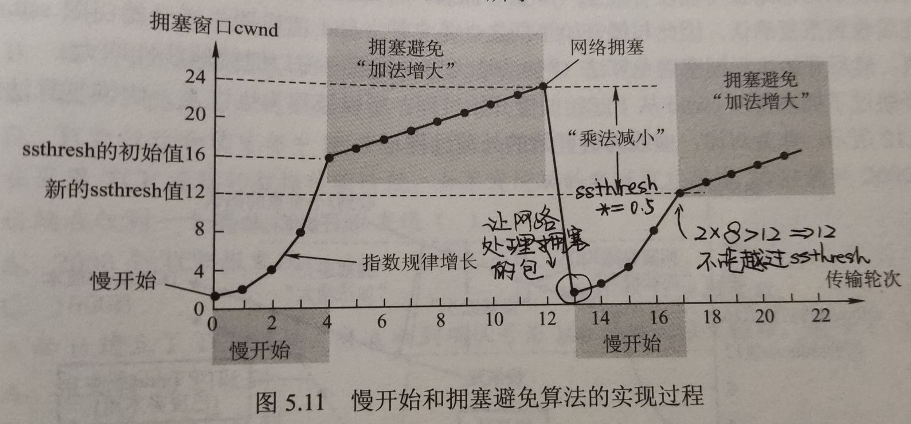
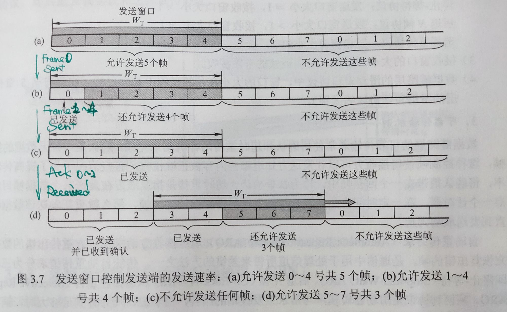

（复制过来五层是反的，将就看吧）

# 5层协议体系结构

## 应用层 Application Layer

### DNS

#### 理论上说，只要我们记住需要访问的资源部署在哪个 IP 地址上，我们就可以借此使用到对应的服务。但是如果服务更换了一个主机部署，服务提供方就需要将 IP 地址通知到每一个人；同时人们也倾向于使用更具有意义的字符串而不是 IP 地址来记忆。因此人们希望建立一个从便于记忆的主机名和 IP 地址之间的映射解决这些问题。因此我们引入了 DNS, Domain Name System。

#### The DNS Name Space

- 

- Domain names can be either absolute or relative. An absolute domain name always ends with a period (i.e. dot) (e.g., eng.cisco.com.), whereas a relative one does not. Relative names have to be interpreted in some context to uniquely determine their true meaning. In both cases, a named domain refers to a specific node in the tree and all the nodes under it.
- To create a new domain, permission is required of the domain in which it will be included. Once a new domain has been created and registered, it can create subdomains without getting permission from anybody higher up the tree.

#### Name Servers

- 
- 
- 都用 recursive query 会导致 root name server 负载过大。
- 整个 Internet 依赖于 root name server，因此实际上它们能力超强且有多份冗余；query packet 通过 anycast 找到其中之一。
- Name server 有缓存。上面的例子展示的是没有缓存的情况；事实上部分 name server 可能已经将内容缓存起来。由于缓存不一定确保正确，因此 name server 上的 records 也是有时限的。
- DNS 的 query 和 response 采用 UDP 发送；DNS name server 使用 53 号端口。如果很短的时间内没有收到 response，DNS client 就重新发一个；如果重复若干次仍然失败，就尝试另一台 name server。

#### Domain Resource Records

- 
- 
- 

### Email

#### Architecture and Services

- 
- UA, User Agent: 也叫 Email Reader，是一个 program，给用户看的。
- Message Transfer Agent: 负责发送和接收邮件，同时向发送方报告发送情况。有可能在 ISP 上。
- 收发过程
   - 发送方用 UA 编辑好了以后通过 SMTP（后面讨论）给 Message Transfer Agent
   - 邮件进入 MTA 的缓存
   - SMTP client process 定期扫描 MTA 缓存，发现了以后与接收端 SMTP server process 建立 TCP 连接（可能需要先 DNS），端口号为 25
   - TCP 连接建立好了以后 SMTP 开始发送邮件，发完了以后 SMTP 关闭 TCP 连接
   - 接收端 MTA 中的 SMTP 进程收到邮件后就放到收信人的用户邮箱
   - 收信人打算收信时，调取 UA，通过 POP3 / IMAP（后面讨论）取回邮件

#### Message Formats

- 
- 

#### SMTP, Simple Mail Transfer Protocol

- 
- SMTP 是一种 ASCII 协议，这样方便调试。

#### POP3, Post Office Protocol 3

- TCP, port = 110
- 下载并保留 or 下载并删除

#### IMAP, Internet Message Access Protocol

- POP3 的改进版；TCP, port = 143

### WWW

#### Architecture Overview

- Web = World Wide Web，由 Web pages 组成。观看它们的程序是 browser
- URL, Uniform Resource Locator，<protocol>://<host>:<port>/<path>例如 http://www.yuque.com/xianyuxuan 中 http 说明了访问这个页面的方式，www.yuque.com 经过 DNS 解析后可以得到 IP 地址，xianyuxuan 说明了具体要看的是这个主机上的什么。
- 

#### HTTP, HyperText Transfer Protocol

- TCP, port = 80，ASCII 协议。比较通用，不限于 web。
- HTTP request 可以在 TCP 第三次握手就带上
- 
- 
- 

### FTP

#### File Transfer Protocol。允许客户指明文件的类型和格式，因此可以在不同架构、操作系统之间的文件传输；允许文件具有存取权限，提供不同用户的权限，因此可以实现远程文件管理和文件共享。

#### server listen port 21, client TCP 连接之。随后建立数据连接，有 2 种方式

- 主动模式 POST：client 开个端口 N（一般是 ctrl 的端口 + 1），给 server 发 POST N，server 用 port 20 连接 N。问题在于如果 client 有 NAT 之类的可能连不上。
- 被动模式 PASV：client 给 server 发 PASV，server 开一个随机端口并且告诉 client，client 连这个端口。问题在于配置复杂而且不利于安全。

### 关于 OSI 7层模型

#### OSI 7层模型中的 会话层 Session Layer, 表示层 Presentation Layer 以及 应用层 Application Layer 对应了五层协议体系结构中的应用层。

#### Session Layer 负责管理端到端的会话，具体包括会话的建立、管理和中止。会话提供同步、checkpoint 恢复等功能。

#### Presentation Layer 负责将不同机器的不同编码和表示方式进行抽象、统一；同时也提供数据压缩、加密等功能。

#### Application Layer 就是本节介绍的用户界面以及使用的各种协议。

## 传输层 Transport Layer

### 传输层的功能

#### 传输层提供端到端的通信；也提供面向连接和无连接的两种服务。也有观点认为，网络层提供的并不是真正的端到端（即，进程到进程）的服务，而只是主机到主机的服务，因为它并没有办法找到目标的进程。但传输层通过端口来标识应用进程，从而真正实现进程之间的通信。

#### 在网络层已经有了面向连接和无连接的两种通信方式的情况下，为什么传输层还要提供这两种服务呢？因为网络层提供的服务更多是有 ISP 决定的；但传输层的代码运行在用户自己的机器上，因此用户可以在这一层选择协议来提高网络的服务质量。

#### 传输层是面向通信部分的最高层，起着承上启下的作用。每个传输服务会给用户提供一组接口，用户（或者说应用）只需要调用这些接口就能调用相应的功能了。传输服务之于网络服务就像编程语言之于汇编语言：当切换不同的网络服务时，只需要切换一种传输服务到网络服务的库就好了；就像在新的架构上运行原来的 C 语言程序时，只需要换一个编译器就好。同时，网络服务就像汇编语言一样被用的比较少；但传输服务就像高级语言一样会被很多程序员使用。因此，传输服务的接口一定要更加方便、简单。

#### 怎么实现端到端的通信呢？SAP: Service Access Point. Transport SAP 即 Port，用来指定进程，有 16bit，可以表示 65536 个不同的端口号。

#### 传输层传输的单位称为 segment。

### UDP

#### UDP, User Datagram Protocol 是一个无连接的非可靠传输层协议。它在 IP 之上只提供 2 个附加服务：多路复用和对数据的错误检查（IP 只检查头部的错误）。它不进行流量控制、拥塞控制和重传，所有维护可靠性的工作由应用层完成；它只是提供一个与 IP 协议的接口。

- UDP length 是包含 UDP Header (8 Bytes) 和数据在内的总字节数。最小是 8，即只有头部；最大是 65515，这是 IP 的限制。
- UDP checksum 是可选的；如果不想检查就写全 0。其算法与 IP checksum 类似，具体参与运算的包含一个 12 Bytes 的 IPv4 pseudoheader、UDP checksum 暂时置零的 UDP header 以及数据部分。如果数据部分的长度不是 16 bits 的整倍数，则在末尾补 0 用于计算；但补的 0 不会被发送出去。
- 
- 其中，IPv4 pseudoheader 中的长度是和 UDP header 中的长度一致的。同时也可以看到，UDP 在计算时是用到了发送方和接收方的 IPv4 地址的；这有违分层原则。当然，pseudoheader 也有对应的 IPv6 版本。

#### UDP 适合一次性传输较少数据的网络应用，也适合那些可靠性不那么重要但不能容忍延迟的应用。

### TCP

#### TCP, Transmission Control Protocol 是为了在不可靠的 IP 层上实现可靠传输设计的。它是面向连接的，且只支持一对一的通信（而 UDP 支持一对多、多对一、多对多），提供全双工通信，解决传输的可靠、有序、无丢失、不重复。

#### TCP 是面向字节流的，而 UDP 是面向报文的。这就是说，UDP Segment 的长度由应用程序传来的数据决定，而 TCP 只将应用程序传来的数据视为无结构的字节流，segment 的长度由协议动态决定。

#### TCP Segment

- 
- Sequence number - 4B。TCP 是面向字节流的，因此它的 seq# 是以字节计数的。例如一个 segment 的 seq# 是 301，数据长度是 100B，那么这个 segment 就包含了第 301~400 个字节，下一个 segment 的 seq# 就是 401。
- Ack number - 4B，期望收到下一个 segment 的 seq#。例如收到了上面说的那个 segment，那发回去的 segment 的 ack# 就应该是 401。
- TCP header length - 4bits，以 32 bits / 4 Bytes 计数。由于 header 有变长的 offset 字段，因此 header 的长度也是可变的。这一字段也被称作 data offset，因为它作为 header 的长度同时也表示了 segment 中的数据是从哪里开始的；这个 offset 与 IP datagram fragments 中的 offset 不一样。
- Reserved - 4bits，设计时用于在发现协议出现设计问题后补充使用；本来有 6 位，只用掉了 2 位，说明设计的不错。目前应当置 0。
- CWR, Congestion Window Reduced; ECE - Explicit Congestion Notification Echo：当 TCP 接收端得知网络拥塞后，就设置 ECN-Echo (ECE) 从而显式告知发送端网络拥塞，需要放慢发送速率；当 TCP 发送端收到 ECE 后就设置 CWR 从而告诉接收端已经放慢速率了，不需要再发 ECE 了。
- URG, URGent bit。可以看到后面还有一个 16 bits 的 Urgent pointer 字段，只有在 URG = 1 时该字段才有效。此时表示该 segment 中有紧急数据，范围是数据的前 urgent pointer 那么多个字节。
- ACK。ACK = 1 时 ack# 字段才有效。TCP 规定建立连接后所有 segment 的 ACK 都是 1。
- PSH, push。PSH = 1 表示接收端在接收到 segment 后应当尽快交付给应用程序，而并不是等到缓冲区满后再向上交付。
- RST, reset。RST = 1 表示 TCP 连接中发生严重差错，例如主机崩溃等，需要重置连接。
- SYN, synchronize。SYN = 1 表示这是一个连接请求或者连接接受 segment。SYN = 1, ACK = 0 说明这是一个连接请求 segment，SYN = 1, ACK = 1 说明这是一个连接接受 segment。
- FIN, finish。FIN = 1 表示发送方数据已经发送完毕，要求释放传输连接。
- Window size，2 Byte，表示允许对方发送的数据量（TCP 是全双工的）。例如 ack# 是 701，window size 是 1000，就说明允许对方发送 701~1700 这些字节。Window size 可以为 0，表示现在不想要；之后想要恢复时只需要发送一个同样 ack# 但是 window size 不为 0 的 segment 就行了。 
- Checksum，2 Byte，计算方法和 UDP 的一样，只是需要把 UDP 协议号 17 改为 TCP 协议号 6。
- Options，0~40 Bytes，但必须是 4 Bytes 的倍数，不足的用 0 补充。最初只规定了 MSS, Maximum Segment Size，即允许对方发来的 TCP segment 中 数据 部分的最大长度。

#### TCP Connection

- Establishment
   - 三次握手其实就是双方交换 ISN 的过程
   - 
   - SYN segment 不能携带数据（即前两次握手），但是要消耗掉 1 个 seq。另外由于服务端在第 2 次握手时分配了资源，因此有可能受到 SYN 泛洪攻击。
   - 
   - 
- Release
   - 
   - 2-army problem：理论上无法保证一定能成功释放连接。
- 
- TCP connection management finite state machine. The heavy solid line is the normal path for a client. The heavy dashed line is the normal path for a server. The light lines are unusual events. Each transition is labeled with the event causing it and the action resulting from it, separated by a slash.

#### 可靠传输机制

- 校验。与 UDP 相同。序号、确认。使用累积确认。
- 重传。1. 超时重传。TCP 发送方维护一个 Time-Out Timer，如果超过超时重传时间 RTO, Retransmission Time-Out 就重新发送这个 segment。值得讨论的问题是 RTO 的设置，因为网络层的路由导致 RTT, Round-Trip Time 的方差很大。RTO 是使用了略大于 RTT 的加权平均的一个值。2. 冗余 ACK。假如发送方发送了 1~5 这几个 segment，但是 2 丢掉了，那么接收方收到 1, 3, 4, 5 时各会发回一个 ACK 1，后面 3 个 ACK 1 是冗余的，提示发送方 2 号 segment 丢掉了。此时发送方可以不必等待超时而是立刻重传 2 号 segment，这种技术称为 快速重传。

#### 流量控制

- 
- 
- 窗口探测使用的计时器是 persistence timer。

#### 拥塞控制

- 发送方的窗口大小需要考虑两方面因素：1. 接收方缓冲区剩余大小，即协议中发回的 rwnd；2. 网络的拥塞情况，发送方应当根据拥塞情况维护一个拥塞窗口 cwnd。发送方的窗口大小应取这二者之间的较小值。下面讨论 cwnd 的算法。
- 慢开始和拥塞避免
   - 
   - 初始 cwnd 为 1（单位为 KB 或者 MSS, Maximum Segment Size），指数增长到小于等于 ssthresh（slow start threshold）后开始两者每次共同 +1；直到发现拥塞时 cwnd = 1, ssthresh *= 0.5。将 cwnd 置为 1 的考量是让网络迅速消化掉拥塞在网络中的数据包。
- 快重传和快恢复
   - 
   - 快重传和快恢复是对前述算法的优化。我们之前讨论了快速重传；在快恢复算法中，我们发现 3 个冗余 ACK 时会采取 cwnd *= 0.5，ssthresh *= 0.5 的方式，而不是将 cwnd 置为 0。采取这一策略的考量是，既然发送方还能收到冗余的 ACK，那么说明网络还没那么拥塞。

## 网络层 Network Layer

### 主要任务

#### 链路层完成的是在一个网络中如何将帧从一个结点传输给另一个结点；或者说是从线路的一边传递到另一边。而网络层则考虑如何将数据包从发送方一路送到接收方。在这个过程中，数据包可能会跨越不同的网络（这也是 inter-net 的名字来源）。

#### 使用一些中间设备（或称中间系统、中继系统）可以将两个计算机网络连接起来。我们之前学到的物理层的中继器 (Repeater)、集线器 (Hub)，以及链路层的网桥 (Bridge)、交换机 (Switch) 都属于中间设备。我们之前也提到，虽然网桥最初设计被用来处理异构网络之间的互联，但最终这部分任务被留给了网络层；即，我们认为上述设备只是扩大了网络，并没有连接不同的网络。因此我们引入网路层的中间设备：路由器 (Router)，它负责连接不同的网络，为到来的跨网络的数据包根据其目的地找到一条路径，并对应地将其转发。在更高层还有网关 (Gateway) 这一中间设备。由于一些历史原因，路由器有时也被称为网关。

#### 我们说，网络层是处理端到端数据传输的最底层。这是因为，链路层考虑的只是将数据从网络上的一个结点发给另一个结点，而我们实际上需要做的是将一个进程的数据传递给另一个进程。如下图所示，发送方 H1 上的进程 P1 将信息传递给 ISP（网络应用提供商）提供的设备 A，ISP 的路由器为数据包找到一条通路并转发给接收方的路由器 F，最终由接收方 H2 的进程 P2 接受。网络层首先完成了从主机到主机的数据传输。

#### 具体的过程是， A host with a packet to send transmits it to the nearest router, either on its own LAN or over a point-to-point link to the ISP. The packet is stored there until it has fully arrived and the link has finished its processing by verifying the checksum. Then it is forwarded to the next router along the path until it reaches the destination host. This mechanism is store-and-forward packet switching.

#### 除了将异构网络互联、通过路由和转发实现任意网络结点间的数据传输以外，网络层还关注拥塞控制 (congestion control) 和服务质量 (quality of service) 等话题。

### 提供给传输层的服务

#### 正如在数据链路层中讨论的那样，我们在网络层也需要考虑提供面向连接的还是无连接的服务。以 Internet community 为代表的一方认为，无论如何设计网路，本质上它就是不可靠的，因此网络服务应该是无连接的。以电话公司为代表的另一方认为，网络应该提供可靠的面向连接的服务。实际上，无连接服务获得了成功。但是 Internet 也渐渐朝着面向连接的特性进化，因为服务质量变得越来越重要了。与此相关的两个面向连接技术的例子是 MPLS 和 VLAN。我们在链路层已经讨论过了 VLAN，在网络层中我们会讨论 MPLS。

#### 但无论如何，提供给传输层的服务应当屏蔽不同的路由器技术，以及网络上的路由器数量、类型和拓扑关系。传输层可用的网络地址也应当有一套可以跨越 LAN 甚至 WAN 的统一编址方案。

#### 无连接服务的实现：数据报网络 datagram network

- 我们在物理层讨论了三种不同的交换方式，包交换 packet switching 是其中一种。在这里，我们进一步考察包交换的实现方式。我们将每个数据包独立注入网络中，并且为每个数据包独立路由（即，为每个数据包分别进行一次寻路）。在这种方式中，我们称数据包为 数据报 datagram，这种网络称为 数据报网络 datagram network。这种方式中，每个数据报的首部需要保存其目的地址；每个路由器根据该地址进行寻路。
- 

#### 面向连接服务的实现：虚电路网络 virtual-circuit network

- 虚电路网络也是包交换的一种实现方式。虚电路不希望给每个数据包选择一条路径，而希望建立一个连接，选择一条固定的路径；所有需要从这个连接上通过的流量都使用这条路径。虚电路之所以是“虚”的，是因为这条电路不是专用的，只是逻辑上的。一条链路上可能有多个虚电路通过，一对 host 之间也可能存在多条不同的虚电路。如下图所示，每个连接有一个连接标识符 connection identifier；路由器 A 的表中的第一行表示：如果有一个来自 H1 的、标识符为 1 的包，那么 A 将其转发给 C，且标识符为 1。这种方式中，每个数据报不需要保存目的地址，而是保存 connection identifier。
- 
- MPLS (MultiProtocol Label Switching)
- 

#### 数据报网络和虚电路网络的比较

- 
- One trade-off is setup time versus address parsing time. Using virtual circuits requires a setup phase, which takes time and consumes resources. However, once this price is paid, figuring out what to do with a data packet in a virtual-circuit network is easy: the router just uses the circuit number to index into a table to find out where the packet goes. In a datagram network, no setup is needed but a more complicated lookup procedure is required to locate the entry for the destination.
- A related issue is that the destination addresses used in datagram networks are longer than circuit numbers used in virtual-circuit networks because they have a global meaning. If the packets tend to be fairly short, including a full destination address in every packet may represent a significant amount of overhead, and hence a waste of bandwidth.
- Virtual circuits have some advantages in guaranteeing quality of service and avoiding congestion within the network because resources (e.g., buffers, bandwidth, and CPU cycles) can be reserved in advance, when the connection is established. Once the packets start arriving, the necessary bandwidth and router capacity will be there. With a datagram network, congestion avoidance is more difficult.
- 事务处理系统适合数据报，长期的流量连接适合虚电路（手工建立，持续使用）。
- Virtual circuits also have a vulnerability（脆弱性） problem. If a router crashes and loses its memory, even if it comes back up a second later, all the virtual circuits passing through it will have to be aborted. In contrast, if a datagram router goes down, only those users whose packets were queued in the router at the time need suffer (and  probably not even then since the sender is likely to retransmit them shortly). The loss of a communication line is fatal to virtual circuits using it, but can easily be compensated for if datagrams are used.
- Datagrams also allow the routers to balance the traffic throughout the network, since routes can be changed partway through a long sequence of packet transmissions.

### 路由算法

#### 路由器的功能是 路由 routing 和 转发 forwarding。路由是指根据特定的路由算法构造出路由表，同时不断进行更新维护；而转发是指根据到来的数据包的内容查询路由表并从合适的端口转发出去。

#### 路由算法

- 虚电路网络只在建立一条新的虚电路时才需要做路由决策，因此这种情形也称为 会话路由 session routing。
- 路由算法可以按是否根据当前网络的流量和拓扑结构调整路由决策分为两大类
   - 静态路由 static routing / 非适应性算法 nonadaptive algorithm。简便，开销较小，在拓扑变化不大、路由选择非常清楚的场合很有用；但无法响应故障。
   - 动态路由 dynamic routing / 适应性算法 adaptive algorithm。能够改善网络性能，有助于流量控制，收到故障的影响较小。但是算法较为复杂，会增加网络负担。另外如果变化太快容易引起震荡，变化过慢会影响路由的一致性。在 where they get their information (e.g., locally, from adjacent routers, or from all routers), when they change the routes (e.g., when the topology changes, or every ΔT seconds as the load changes), and what metric（度量标准）is used for optimization (e.g., distance, number of hops, or estimated transit time) 等方面有多种选择。
- Sink tree is not necessarily unique

#### Shortest Path

- 
- Dijkstra's Algorithm
- 

#### Flooding

- 

#### Distance Vector Routing / Bellman-Ford Routing

- 
- The settling of routes to best paths across the network is called convergence (收敛). Although Distance Vector Routing converges to the correct answer, it may do so slowly. In particular, it reacts rapidly to good news, but leisurely to bad news. 
- (a) After init, A started; (b) After init, A halted
- At the first packet exchange, B does not hear anything from A. Fortunately, C says "Do not worry; I have a path to A of length 2." Little does B suspect that C's path runs through B itself. ......However, none of these heuristics work well in practice despite the colorful names. The core of the problem is that when X tells Y that it has a path somewhere, Y has no way of knowing whether it itself is on the path.
- Problems: 1. 发的东西太长了，占带宽； 2. converge 太慢了

#### Link State Routing

- 基本过程：与邻居交流，了解其网络地址和交流成本；将这些信息构造成数据包，发给其他所有路由器，也接收其他路由器的数据包；根据这些数据包在本地构造出整个网络的拓扑，并用 Dijkstra's algorithm 算出到每个结点的最短路。
- 
- Use an artificial node N. One designated router on the LAN is selected to play the role of N in the routing protocol
- 
- 
- 
- 
- 
- 
- 

#### Hierarchical Routing

- 

### 拥塞控制

### 服务质量

### 网络互联

#### 不同协议的路由策略

- 具体如何在异构网络之间转发呢？有下面两种思路：
- 
- 

#### Packet Fragmentation

- Each network imposes some maximum packet size: MTU, Maximum Transmission Unit. 由于路由，源端很难得知路径上的 MTU。
- 
- 问题：(a) 拆分重组和重复工作、不能分别路由，以及 (b) 判断结尾、额外开销、错误率提升。Nontransparent fragmentation:
- 
- 

### Internet Protocol

#### IPv4

- Header (20-byte fixed + options) + Body / Payload
- Header 格式
   - 
   - 传输顺序。 The bits are transmitted from left to right and top to bottom, with the high-order bit of the Version field going first. (This is a "big-endian" network byte order. On little-endian machines, such as Intel x86 computers, a software conversion is required on both transmission and reception.) In retrospect, little endian would have been a better choice, but at the time IP was designed, no one knew it would come to dominate computing.
   - Version - 4 (0100) for IPv4
   - IHL (Internet Header Length) - 4 bits, 5~15, in 32-bit words. E.g. IHL = 5 表示头部有 5*32 bits = 20 Bytes，即 Option 字段长度为 0。因此 Option 字段最多 40 Bytes
   - Total length - 16 bits, in Byte, Head + Body, <=65536
   - Identification - 16 bits, all the fragments of a packet contain the same Identification value.
   - Unused DF (Don't Fragment) - can be used in path MTU discovery MF (More Fragments) - 0 for the last fragment
   - Fragment offset - All fragments except the last one in a datagram must be a multiple of 8 bytes
   - TTL - 设计为按秒计，现在按 hop 计。When it hits zero, the packet is discarded and a warning packet is sent back to the source host. This feature prevents packets from wandering around forever, something that otherwise might happen if the routing tables ever become corrupted
   - 
   - Checksum - 之前讨论过的 Internet Checksum，16 bits 划分。注意每一跳后 TTL 都会变所以 the Header checksum is assumed to be zero upon arrival 然后重新算一遍。
   - 
   - The Options field was designed to provide an escape to allow subsequent versions of the protocol 1) to include information not present in the original design, 2) to permit experimenters to try out new ideas, and to 3) avoid allocating header bits to information that is rarely needed. The options are of variable length. Each begins with a 1-byte code identifying the option. Some options are followed by a 1-byte option length field, and then one or more data bytes. The Options field is padded out to a multiple of 4 bytes. 
   - 
- IPv4 地址
   - Internet 上的每个 host 和 router 都有 IP 地址。需要注意的是，每个 IP 地址指向的不是一台机器，而是一个 network interface；例如 router 有多个接口，因此每个接口都有一个 IP 地址。
   - IP 地址具有层次性。Each 32-bit address is comprised of a variable-length network portion in the top bits and a host portion in the bottom bits. The network portion has the same value for all hosts on a single network, such as an Ethernet LAN. This means that a network corresponds to a contiguous block of IP address space. This block is called a prefix.Subnet mask. Since the prefix length cannot be inferred from the IP address alone, routing  protocols must carry the prefixes to routers. Sometimes prefixes are simply described by their length, as in a "/16" which is pronounced "slash 16".IP addresses are written in dotted decimal notation.
   - 
   - 
- Classful Addressing
   - 
   - 
   - 0.0.0.0：As source addr when booting, this host doesn't know its IP addr and trying to acquire one (DHCP); As dest addr / socket listening: all, including 127.*.*.*127.*.*.*: Loopback. Not acturally on the link.
- Subnet
   - 
   - 
   - Outside the network, the subnetting is not visible, so allocating a new subnet does not require contacting ICANN or changing any external databases.
- CIDR, Classless Inter-Domain Routing
   - 
   - 
- NAT
   - 
   - 
   - 

#### IPv6

- 
- 

#### Internet Control Protocols

- In addition to IP, which is used for data transfer, the Internet has several companion control protocols that are used in the network layer. 
- ARP
   - 
- DHCP
   - 
- ICMP
   - 

### 路由协议

#### 互联网路由

- 问题：不同的路由算法、不同的度量方式、对外保护网络内部细节、太大
- 
- Within each network (OR AS, Autonomous System), an intradomain or interior gateway protocol is used for routing. ("Gateway" is an older term for "router".) Across the networks that make up the internet, an interdomain or exterior gateway protocol is used. The networks may all use different intradomain protocols, but they must use the same interdomain protocol.

#### RIP, Routing Information Protocol

- 一种 Interior Gateway Protocol，基于 Distance Vector Routing，用 hop 计量距离。规定一条路径最多包含 15 个 router（即 15 个 hop），从而防止环路；可见只适用于小型网络。每 30s 在 相邻 的路由器之间交换一次信息，即自己当前的路由表，以维护路由表。
- 是一个应用层协议，需要借助 UDP，端口号是 520。

#### OSPF, Open Shortest Path First

- 也是一种 Interior Gateway Protocol，直接使用 IP Packet 发送，protocol 字段值为 89。Open 是指该协议发布在公开文献中。
- 支持根据 IP Packet 的不同 services 使用不同的路由方式，从而更好地传输实时流量。 支持多种距离度量，支持多路径之间的负载平衡，支持层次系统，提供一定安全性，支持隧道。
- 每个 AS 内部也有层次结构：有一个 Backbone Area；其他任意两个区域之间可以通过 Backbone Area 互达。
- 基于 Link State Routing。
- 

#### BGP, Border Gateway Protocol

- Internet 使用的 Exterior Gateway Protocol。每个 AS 需要选择至少一个 router 作为发言人。基于 Distance Vector Routing；但实际上不一定是最优的，因为考虑优先使用对等网络以及各种限制等实际的政策原因，同时网络太大也不一定能找到最佳。另外还维护到目的地的路径，因此叫 Path Vector Protocol。
- 应用层协议，基于 TCP，端口号 179。

### IP 组播

### 移动 IP

#### ICMP 的 ROUTER ADVERTISEMENT/SOLICITATION 消息使得主机可以找到附近的路由器。当主机发现路由器不一样的时候，就知道自己跑了。

#### 主机在新的网络 (foreign / remote agent) 通过 DHCP 获得一个新的 IP 地址，然后告诉自己的老家 (home agent) 自己现在在哪。

#### Home agent 需要拦截发给这个跑路了的主机的包，方法是当路由器通过 ARP 询问跑路主机持有的 IP 对应什么 MAC 地址时，回答自己的 MAC 地址。这就是 ARP agent。为了快速更新，home agent 也可以发 Gratuitous ARP（无故 ARP），问跑路主机的 IP 对应的 MAC 并自己回答。

#### 剩下的步骤如下图：

## 数据链路层 Link Layer

### 数据链路层的功能

#### 主要任务

- 发送方的网络层将数据包发给数据链路层，数据链路层通过物理层提供的服务将数据传输给接收方的数据链路层，接收方的数据链路层再将数据提供给网络层。
- 在这个过程中，数据链路层需要考虑的问题有：
   - 物理层传输的是比特流，因此需要区分不同的数据包的界限
   - 传输过程中可能发生的错误
   - 发送方和接收方处理数据速率的不同
- 为了方便解决这些问题，数据链路层将网路层提供的每个数据包通过一些增加和修改封装成 帧 frame（也有可能拆分并封装成多个帧），在接收方的数据链路层，这些修改被还原。
- 
- 需要说明的是，我们可以想象在两个 host 之间的数据链路层直接通信。这是因为，数据链路层无需关心物理层是怎么传输这些信息的；这种“不关心”也是有好处的，因为这说明物理层保证实现方式的任何修改不会影响到数据链路层。
- 

#### 提供给网络层的服务

- 数据链路层可以根据需要设计不同的协议，提供的具体服务根据不同的协议有所差异。（这与物理层不同，因为物理层提供给数据链路层的服务是单一的：将发送方数据链路层发来的帧想办法发送给接收方的数据链路层。）通常，数据链路层可能会提供如下 3 种服务之一：
   - 无确认的无连接服务 Unacknowledged Connectless Service这种服务不会尝试对丢帧情况进行检查，因此也不可能试图对丢失的数据进行恢复。这种服务适合错误率很低的情况（如光纤传输），或者即时通讯、直播等对即时性要求很高，且偶尔的丢失和错误关系不大的情况。
   - 有确认的无连接服务 Acknowledged Connectless Service这种服务发送的每一帧需要单独确认；如果发送方发送一个帧后在指定的时间内还没有得到确认，则重新发送该帧。适用于不可靠信道，比如无线系统（802.11 WiFi）。
   - 有确认的面向连接服务 Acknowledged Connect-Oriented Service这种服务在传输数据前在发送方和接收方之间建立一个连接，保证每个帧都按序、不重复地被接收方接收，传输结束后连接和维护连接的资源被释放。为了保证正确性，双方需要维护一些变量和计数器，记录哪些帧已经收到，哪些还没有收到。适用于长距离且不可靠的链路，如卫星信道和长途电话电路。
- 事实上，检查错误在各层都可以（选择）进行，例如如果发送方的网络层没有及时得到接收方的网络层的回复，也可以再发送一遍。而在数据链路层进行检测可以更直接、更快地检测到错误。（如果进行过拆分，在数据链路层检测也可以减少重发的开销。）当然，错误检查也会增大一部分时间和数据量开销，因此需要根据各种实际情况进行一定的权衡。

#### 成帧

- 成帧 Framing 的核心任务是设计一种方案使得接收方很容易找到每个帧的开始，从而将比特流还原成一个个帧；同时不能占用太多带宽。我们考察 4 种定界方式。
- 字节计数法 byte count
   - 
   - 如图所示，这种方式在每个 frame 的开头用一个 byte 保存这个 frame 的 byte 数目。但是当这个计数值出现错误时，即使接收方通过错误检验发现了错误，也再也无法知道下一帧的开始位置（失去同步 get out of sync）。因此，字节计数法一般不会被采用。
- 标志字节法 Flag bytes
   - 
   - 这种方式用一个固定的特殊字节标明帧的头部和尾部，如上图 (a)。这个字节称为 flag byte (FLAG)。当传输的数据内部出现 FLAG 时，用一个转义字节 escape byte (ESC) 在其前面进行标识；同时需要发送 ESC 本身时也在其前面增加一个 ESC，如上图 (b)。这种技术称为 字节填充 byte stuffing。
- 标志比特法 Flag bits
   - 
   - 考虑到帧的划分也可以是比特级的，这种标志和填充也可以精确到比特级。例如 HDLC 的标志方式是：每个帧的开始和结束用序列 01111110 (0x7E) 标识，同时发送方的数据链路层在数据中每发现连续的 5 个 1，发送时就在其后面添加一个 0；接收方的数据链路层在发现 111110 时将最后一个 0 舍弃。这种技术称为 比特填充 bit stuffing。
- 物理层编码违禁法 Physical layer coding violations
   - 对于 4B/5B 编码方式或者 Manchester 编码，有相当一部分信号组合是不可能出现的。我们可以使用这样的信号组合作为帧的开始和结束。相对于上面两种填充方法，这种方法不再需要填充数据。IEEE 802 标准就采用了这种方法。

#### 检错和纠错

- 信号在传输中有可能出现错误或者丢失。如果我们需要排除丢失的情况，我们可以在协议中要求接收方在收到帧后发回一个确认；发送方得到确认后才可以发下一帧，如果一段时间内没有收到确认则需重新发送。如果我们需要排除错误的情况，我们可以尝试直接对错误进行恢复；也可以尝试只检查错误，如果发现错误则要求发送方重传。
- 基本定义和原理
   - 如果想要检查一串数据是否出现过错误，我们显然需要一些额外的信息。如果一帧有 m 个数据位存储信息，有 r 个冗余位 (redundant / check bits) 用来校验，那么这个包含了数据位和冗余位的 n = m + r 位数据块就称为一个 n 位 码字 codeword。
   - 定义 码率 code rate 为 codeword 中数据位所占的比例，即 m/n。通常在越高质量的信道上设计的 code rate 越高，因为相比于有噪声的信道，高质量的信道通常需要更少的冗余位用来检错或纠错。
   - 两个等长的码字中不相同的位的个数称为这两个码字的 海明距离 Hamming distance d，表征一个码字需要出现 d 个 1bit 的错误才会变成另一个码字。
   - 如果我们想可靠地检测可能的 e 个错误，我们需要一个海明距离为 e + 1 的编码方案（即，任意两个合法码字之间的距离不小于 e + 1）。因为这样任意 e 个错误不可能将一个合法码字变成另一个合法码字；当我们发现一个非法码字时，我们就知道出现了错误。
   - 如果我们想可靠地纠正可能的 e 个错误，我们需要一个海明距离为 2e + 1 的编码方案。因为这样任意的 e 个错误发生后，原来的码字仍然是现在的码字距离最近的那一个。
   - 块码 block code 是指 r 个校验位是由 m 个数据位根据函数计算（即查表）得到的；系统码 systematic code 是指数据位和校验位是分开而没有交叉的；线性码 line code 是指校验位是作为数据位的线性函数 (?) 计算出来的。
   - 现实中常见的错误有两种。第一种是偶现的问题导致单个比特错误；另一种是突发的问题导致一段信息发生错误（不一定每个比特都发生错误）。
   - 
- 纠错码
   - 海明码 Hamming codes
      - 假设我们需要设计一种编码方案，每个码字有 m 个信息位和 r 个冗余位，并且能够纠正所有的 1bit 错误。那么对于 2^m 种合法的信息，每个信息都应唯一对应 n 个非法码字，它们与该信息的距离为 1。因此这里就共有 (n+1)2^m 种情况，因此有 (n+1)2^m≤2^n，亦即 (m+r+1)≤2^r。在 m 给定的情况下，我们可以通过这一不等式确定 r 的下界。海明码给出了这一下界的一个获得方式。编码方式见下图。
      - 
      - 需要检验时，对上述并非 2 的幂次方位置的数字再做一次计算，如果一致则没有错误；如果位置为 1、2、8 的位错误，则 1+2+8=11 的位出错了，其他错误情况与此类似。
   - 卷积码 convolutional codes
      - 
      - 卷积码的输出由当前输入和之前若干位输入决定，影响当前输出的此前输入位数称为 约束长度 constraint length。如图这种卷积码的约束长度为 6，每个输出 bit 会带来 2 bits 的输出，其中第一个是第 0, 2, 3, 5, 6 位的模二加法（0 指输入位，1~6 指 S1~S6 的值），第二个是第 0, 1, 2, 3, 6 位的模二加法。比如输入序列为 111，输入第一个 1 时 0~6 位是 1000000，因此输出是 11，然后 S1~S6 右移一位变成 100000；输入第二个 1 时为 1100000，因此输出是 10；输入第三个 1 时为 1110000，因此输出是 01。因此编码后为 111001。
      - 卷积码的解码是通过最大似然法。在所有可能的输出序列中找出与接收到的序列最相近的那一个，解码为这个序列对应的输入序列。
      - 
   - 里所罗门码 Reed-Solomon codes
   - 低密度奇偶校验码 LDPC, Low-Density Parity Check
   - 除了卷积码是线性码不是块码以外，其他三种编码都是线性块码。
   - 纠错码广泛运用于无线链路。无线链路容易出错，如果没有纠错码很可能获得不到任何完全正确的信息。另外对于单工信道的情况，接收方如果检测到了错误也没有办法发回一个重发请求，因此也适用纠错码。
- 检错码
   - 光纤和高品质铜线的错误率较低，因此对偶现的错误进行检错和重传更加有效。下面介绍三种检错码，它们都是线性的系统块码。
   - 奇偶校验位 parity bit
      - n-1 位信息，1 位冗余。奇校验码：在加上该位后 1 的个数为奇数；偶校验码则为偶数。
      - 交错校验 interleaving 技术可以一定程度上防止突发的若干比特范围内的错误。将数据块作为 k 行 n 列处理，每列计算一个 parity bit 后附在数据块最后发送。这样除非突发错误持续 n 个 bit 以上，否则仍然可以被检测出来。
      - 
   - 校验和 checksum
      - 对数据进行一些求和运算。奇偶校验位也可以看做校验和的一个例子。
      - 另一个实际例子是 Internet Checksum。规则是：首先将数据分割成 16 bit 的若干段（最后一段不足 16 bit 则在末尾补 0）；然后将这些段相加，最高位进位 wrap around（见下图）；最后将结果按位取反 (?) 作为校验。检查时再次计算数据之和，加上校验，如果结果不为全 1 则发生过错误。
      - 解释 wrap-around carry bit (src)
   - 循环冗余码 CRC, Cyclic Redundancy Code
      - 又称 多项式码 polynomial code，计算方式见下图。其中 G(x) 是发送方和接收方预先商定的一个多项式，称为 生成多项式 generator polynomial，其最高位和最低位一定是 1。
      - 
      - 
      - 由于模 2 除法的一些性质，这种方法有优秀的检测能力，具体可以参看中文课本 166~167 页。

#### 流量控制与一些基本协议

- 一些单工协议
   - 一个乌托邦式的单工协议 A Utopian Simplex Protocol发送方不断地从网络层获取数据包并构造一个帧，通过物理层发送该帧；接收方不断等待唯一可能的事件 FRAME_ARRIVAL 发生，将该帧从物理层取得，并将数据部分发送给网络层。这种方案的问题是，如果发送方发送帧的速度大于接收方处理的速度，接收方就会被淹没 (flood)。
   - 无错信道上的单工停-等协议 A Simplex Stop-and-Wait Protocol for an Error-Free Channel接收方每当接收一个帧并处理完成后，发回一个确认帧；发送方在收到确认帧后（不需要处理，因为此时唯一的可能就是确认帧），则可以发送下一帧。这种协议在数据传输上是单工的，但是接收方需要发回消息，因此需要使用半双工信道。这种方案的实际问题在于，没有考虑出现错误的情况。
   - 有错信道上的单工停-等协议 A Simplex Stop-and-Wait Protocol for a Noisy Channel这种协议在上一种的基础上考虑 3 种可能的错误 
      - 1. 接收到的帧检出错误为了解决第 1 种错误，我们引入一个新的事件 CKSUM_ERR 表示校验和有误；因而接收方在收到一个帧后应当校验正确性，发回一个表示正确或者错误的确认帧；如果检出错误，则直接抛弃该帧等待重传。如果发送方收到了表示错误的确认帧导致事件 CKSUM_ERR 发生，那么发送方将重新发送上一帧。
      - 2. 发送方发送的帧完全丢失对于第 2 种错误，接收方完全没有接到一个帧，因而也不可能对此作出确认。为了避免这种情况，发送方每次发送一个帧后启动或重置一个计时器，这个计时器的时间应当长于预期正常情况下收到确认帧的时间。如果计时器超时发送方仍未收到确认帧（事件 TIMEOUT），那么第 2 种错误有可能发生，此时发送方会将（缓存下来的）刚刚发出去的那一帧重新发出一次。直至发送方收到一个积极的确认帧，此时发送方再加载下一帧，上一帧的缓存即可以被覆盖掉。
      - 3. 接收方的确认帧丢失但是需要考虑的是，除了第 2 种错误，这种问题也可能导致发送方没有收到确认帧，因此可能会将一个正确收到（没有被抛弃）的帧重发，导致接收方收到两个该帧；如果不加限制，接收方的网络层则可能收到重复两次的该数据段，引起错误。我们需要防止这种重复的发生。考虑到发送方发送第 i + 1 帧的充要条件是第 i 帧已经收到了正确的确认，而这一确认的必要条件是接收方已经正确收到了第 i 帧。因此我们只需记录每一帧序号的奇偶性，并将其包含在帧头中（称为字段 seq）。如果接收方接收到了预期的（与前一帧相反的）奇偶标记，那么就将其保存；否则就说明前一帧被重复发送了，此时则直接抛弃该帧，同时发回一个确认（作为对前一个丢失确认帧的补充）。
      - 这种在接收到肯定确认之前定时重传的协议也称为 自动重复请求 ARQ, Automatic Repeat reQuest 或 带重传的肯定确认 PAR, Positive Acknowledgement with Retransmission。
- 捎带确认 piggybacking 
   - 需要注意的一个问题是，前面两种带有确认的协议都需要使用半双工传输，而这种传输和全双工传输一样都需要往返两条信道；因此实际上同一条链路最好用来往返传输数据。这种情况下，某一帧的接收方就可以把该帧的确认包含在它发回的另一帧的帧头中，这种方式就称为捎带确认。
   - 捎带确认引入的另一个问题是，需要发回确认的那一方并不知道网络层什么时候会让它发送下一个数据包，以便它将确认包含在其帧头中（称为字段 ack）。为了解决这个问题，发回确认的那一方也可以设置一个计时器，在计时器结束前如果网络层交付了一个数据包让它发送，那么就将确认包含在其中；否则就直接发送一个单独的确认帧。
   - 一个捎带确认的双工停-等协议
- 滑动窗口协议 Sliding Window Protocols
   - 基本思想
      - 在现实世界中，帧送往接收方和确认帧返回发送方的时间可能比发出一个帧的时间长出很多；这会导致带宽的利用率很低。因此我们引出滑动窗口协议。
      - 滑动窗口协议的基本思想是，任意时刻发送方维护一组允许发送的帧的序号（同样用 seq 字段保存，但这时可能不止 1 个 bit），称为 发送窗口 sending window；接收方维护一组允许接收的帧的序号，称为 接收窗口 receiving window。这两个窗口的大小不必相同，但是是固定的。 发送方每收到一个确认帧，就将发送窗口向前滑动一个位置；如果没有可以发送的帧（即发送了窗口大小那么多的帧但是还没有收到确认）就停止发送（定时重发）。接收方每收到一个帧，如果在接收窗口内则接收，否则丢弃。
      - 事实上，stop-and-wait 协议就可以视为是发送和接收窗口大小均为 1 的滑动窗口协议。
      - 需要再次注意的是，接收方的数据链路层需要尽可能将数据包按正确的顺序传递给网络层。
      - 关于窗口大小的理论分析（更正：ACK 0 应当是 ACK 1）
      - 
      - 根据上面的理论分析，我们定义 链路利用率 Line Utilization = Frame Length / (Frame Length + 2 * Bandwidth * Propagation Delay)更常见的表述是 Line Utilization = Frame Length / (Frame Length + Bandwidth * Round-Trip Delay)。
      - 进一步我们定义 链路吞吐率 Throughput = Utilization * Sending Data Rate
   - 回退 N 协议 GBN, Go-Back-N
      - 回退 N 协议是一种滑动窗口协议；其中 N 代表 sending window 的大小，而这种协议中 receiving window 的大小始终为 1。当当前 sending window 的第一帧的计时器（实际上每一帧发出后都启动一个独立的计时器）超时仍未得到 ACK 时，回退 N 位到 sending window 的开头重新发送这 N 帧；而由于 receiving window 的大小是 1，因此提前到达的帧都会被抛弃。如下图。
      - 
      - 另外引入一种确认方式：累计确认 cumulative acknowledgement，这种确认方式为：当接收方发回 ACK n 的确认，其中表示 n 和 n 之前的所有帧都已经收到；如果 n 之前有任何没有收到的帧，则 ACK n 不会被发出。 
      - 考虑 GBN 中 seq 段 bit 数和 N 的关系。如果 seq 的取值为 0~MAX_SEQ，即共有 1 + MAX_SEQ = 2^size_in_bit(seq) 种取值，那么 N 最大为 MAX_SEQ 而不能是 1 + MAX_SEQ。考虑这样的一个情况。假如 MAX_SEQ 是 7，而 N (i.e. sending window size) 是 8；发送方一次性发出了 0~7 这 8 个帧，而接收方发回的 8 个确认帧全部丢失了；发送方重发了这些帧，而此时接收方以为这是全新的 8 个帧，导致了传递给网络层的数据出现了重复。因此 N 不能是 8。
   - 选择重传协议 SR, Selective Repeat
      - 如果错误很少发生，那么 GBN 是一个良好的策略；而当错误频繁发生，GBN 的重发方式会浪费大量的带宽。GBN 协议可以有两种思路的优化。
         - 第一种是，当接收方发现了发来的帧有错误或者不是所期待的那个帧时，发送一个否定的确认信息 NAK, Negative Acknowledgement 并说明想要的下一帧，这样可以不用等到 timeout 再回退重发；
         - 第二种是，增大 receiving window size，这样当错误发生时可以先缓存一部分发来的后面的帧，这样发送方只需重发 NAK 的帧即可。
      - 综合上述两种优化和累计确认的一个例子如下；这就是 选择重传协议。
      - 
      - 选择重传协议对每一帧只发送一个 NAK，防止一次性发送大量相同 NAK 的情况。但是，这也有可能带来问题。Suppose the sender sent several frames, say No.0 ~ 6, and the receiver received these frames, sent back an accumulative ACK 6 and started to waiting for Frame 7. But the ACK lost, then the sender thought that all the frames were lost, so it sent No.0 ~ 6 again. However, the receiver wanted Frame 7, so it sent NAK 7 back. But the NAK lost again. As the receiver would not send NAK again, the sender would be permanently sending No.0 ~ 6, which is a severe error. 因此，如果 receiver 收到非预期的 frame 时发现已经发送过一个 NAK 了，那么 the auxiliary timer will be started. When it expires, an ACK will be sent to resynchronize the sender to the receiver's current status.
      - 选择重传协议需要保证接收方移动窗口前后的序号没有重叠，因此接收窗口的大小不能大于 (MAX_SEQ + 1) / 2。一般来说，选择重传协议的接收窗口和发送窗口的大小是一样的。

#### 点对点传输协议实例

- 高级数据链路控制 HDLC, High-Level Data Link Control
   - HDLC 是一种 bit-oriented protocol，使用全双工通信；有顺序编号和校验，传输可靠性高。其帧结构如下图
   - 
   - 每个帧的开始和结束用序列 01111110 (0x7E) 标识。同时发送方的数据链路层在数据中每发现连续的 5 个 1，发送时就在其后面添加一个 0；接收方的数据链路层在发现 111110 时将最后一个 0 舍弃。这样整个帧中只会有头和尾的 FLAG 有 01111110 这样的序列了。当链路上没有需要传输的内容时，HDLC 也会通过不断发送形式为 01111110 的帧以保持双方的同步。（实际上，HDLC 最开始是作为 SDLC, Synchronous Data Link Control 被提出的。）
   - 按照 Control 字段的前 2 个 bit 可以将 HDLC 帧划分为 3 类：信息帧 Information frame，第 1 位是 0，用来承载正常的信息；管理帧 Supervisory frame，前两位是 10，用来进行流量控制和差错控制，如单独的 ACK、NAK 等；这种帧没有 Information 字段；无编号帧 Un-numbered frame，前两位是 11，用来进行其他的功能，如链路管理等。
   - FCS 是根据 Address, Control 和 Information 字段计算 CRC 的结果。
- 点对点协议 PPP, Point-to-Point Protocol
   - PPP 是一种 byte-oriented protocol。HDLC 提供了可靠的数据传输；而 PPP 通常不编号、提供一种无连接无确认的服务。
   - PPP 协议有 3 个组成部分：1. 一种成帧方法。2. 链路控制协议 LCP, Link Control Protocol，用于启动、测试、配置（协商参数）、关闭链路。3. 网络控制协议 NCP, Network Control Protocol。PPP 是由 SLIP 发展而来的；SLIP 的问题在于它只能用于传送 IP Packet；PPP 则支持对于网络层运行其他协议以及两端网络层运行的协议不同的情况下仍使用 PPP 进行传输。对于每一个支持的网路层协议，都有一个相应的 NCP 进行配置。其帧结构如下：
   - 
   - 前后的 FLAG 都沿用 HDLC 的 0x7E，但填充方式有所不同。PPP 是 byte-oriented 的，因此使用 byte stuffing。在数据中发现的 0x7E 将被替换为 0x7D 0x5E 两个字节；而 0x7D 将被替换为 0x7D 0x5D。这样可以保证唯一出现 0x7E 的地方就是帧的开始和结束。
   - Address 段始终为 0xFF，表示广播，即所有计算机都接收；Control 的值为 0x03，表示这是一个无编号帧；由于这两个字段的值始终为定值，因此可以通过 LCP 协商省略这两个字段。Protocol 包含关于 LCP 和 NCP 的信息，默认 2 byte，但是可以通过 LCP 协商为 1 byte；Information 的默认长度是 1500 byte，但是也可以通过 LCP 协商，可能利用 Padding 进行填充以满足长度要求；Frame Check Sequence 默认 2 byte，但是也可以协商使用 4 byte，也是 CRC。
   - 
   - PPP 协议在用于不同链路上时可能也有不同的成帧方式。例如 PPP 用于 SONET 等同步链路时会使用 HDLC 那样的 bit stuffing 而不是 byte stuffing；用于 SONET 时还需要进行链路的建立以及扰码 (scrambling)。

### 介质访问控制子层

#### 广播信道传输协议

- MAC 子层
   - 我们讨论过的协议都是针对 点对点连接 point-to-point connections 的；但是在 LAN 等场景下，我们需要使用 广播信道 boardcast channels。广播信道也称为 多路访问信道 multiaccess channel 或 随机访问信道 random access channel。对于广播信道，关键的问题是保证在多方争用信道时确定谁可以使用信道，从而让他们都成功发送信息。用来确定多路访问信道的下一个使用者的协议属于 Link Layer 的一个子层 介质访问控制子层 MAC, Medium Access Control Sublayer。我们关注低负载情况下的延迟以及高负载情况下的链路利用率。
   - OSI 七层模型将 Data Link Layer 分为了 LLC (Logical Link Control) 和 MAC 两个子层：
   - 
   - 
   - 将信道分配问题形式化，我们提出下面 5 个关键假设：1. Independent Traffic，每个站中帧的到达率相互独立；每个帧发送出去前该站阻塞。2. Single Channel，所有的通信都发生在同一个信道上；所有的站都能在这个信道上发送和接受数据。3. Observable Collision，所有的站都能检测到冲突事件的发生。4. Continuous or Slotted Time，可以约定任何时候都可以开始传输帧，或者将时间分槽，规定只能在时间槽开始时开始传输帧。5. Carrier Sense or No Carrier Sense，可以让站在发送前侦听载波，如果信道忙就暂缓传输防止冲突。
- Static FDM / TDM
   - N 变化时很麻烦；不变化也很浪费
- ALOHA, Additive Links On-line Hawaii Area
   - Pure ALOHA
      - 基本思想很简单：每个用户有数据需要发送时就传输。问题在于，当两个用户发送的信号发生重叠（称为 冲突 collision）时，冲突的帧就会损坏。ALOHA 要求发送方可以知道所发送的信号是否发生了冲突。这种采用了可能引起冲突的共享信道方法的系统称为 竞争系统 contention system。
      - 在 ALOHA 最初的应用场景中，中央计算机会将受到的帧广播发回，发送方侦听发回的帧就可以知道有没有发生冲突。在其他系统中，发送方可以直接侦听发送的帧是否发生过冲突；或者等待接收方发回 ACK 或 NAK。
      - 当发送方侦测到冲突、收到一个 NAK 或者一段时间没有收到回复时，它在等待一段 随机 时间后再次发送该帧。如果等待时间不是随机的，那么发生冲突的帧会一次又一次发生冲突。
      - 
      - 最好情况下，Pure ALOHA 的信道利用率期望约为 1/2e ≈ 18%，这是很低的。
   - Slotted ALOHA
      - 在这种优化了的协议中，时间被分成了离散的 slot，用户只能在每个 slot 的开始时刻才能发送帧。每次传输帧的用时必须小于或等于一个 slot 的长度。
      - 阴影表示冲突 (src)
      - 这种方式可以达到的最佳利用率是 1/e ≈ 36%。
- 载波侦听多路访问 CSMA, Carrier Sense Multiple Access
   - 1-persistent CSMA
      - 每个站点需要发送数据时，首先侦听信道：如果信道空闲则立即发送数据；如果信道忙，则不断侦听直至信道空闲时发送数据。如果冲突（比如一段时间内没收到 ACK 或者收到了 NAK），则随机等待一段时间后重复上述策略。
      - 名称中 "1-persistent" 的含义稍后可以看到。我们首先考虑这种方式的问题：首先，如果信道忙时两个站点同时侦听，信道空闲的时候两个信道就会同时试图发送，从而出现冲突。另外，我们还需要考虑信道上的传播延时 propagation delay：如果 A 已经开始发送数据，但是数据暂时没有传播到 B，此时 B 侦听到的信道是空闲并开始发送数据，也会引起冲突。
      - （即便如此，这种方案的信道利用率也比 ALOHA 好）
   - nonpersistent CSMA
      - 这种方式的关键区别是：如果侦听到信道忙，则放弃侦听，等待一段随机时长后再进行侦听，直到侦听到信道空闲并成功发送。
   - p-persistent CSMA
      - 这种方式用于 slotted channels。当站点需要发送数据时侦听信道：如果信道忙，到下一个 slot 再侦听；如果信道空闲，则以 p 的概率发送数据，以 1-p 的概率到下一个 slot 再侦听。
   - 
   - CSMA/CD, CSMA with Collision Detection
      - 前述几种 CSMA 对冲突的发现都是通过确认帧进行的，对于链路过长的情况，等待的时间可能较长。我们考虑对信道不断侦听实现冲突的检测，这要求返回的信号不能比发出的信号弱太多（如无线传输就不行），而且冲突必须在发送过程中就可以被检查到。如果一个站检测到冲突，它会立即停止传输，并等待一个随机时间后再尝试发送。
      - 考察冲突检查花费的最长可能时间：在 CDMA 中，冲突的可能性是某个站开始发送前进行侦听时，另一个站虽然已经开始发送，但是信号尚未传播到这个站。因此如果最远的两个站之间传播用时是 t，那么一个站发送后 0~t 秒内冲突才有可能会发生；而这个冲突会花费同样多的时间传播回去。也就是说，如果一个站发送信息后 2t 时间仍然没有侦测到冲突，那么它发送的这一帧就不再可能出现冲突了。
- 无冲突协议 collision-free protocols
   - 基本位图协议 Basic Bit-map Protocol
      - 
      - 这种在发送数据之前先广播发送意愿的协议称为 预留协议 reservation protocol。
   - 令牌环协议 Token Ring Protocol
      - 
   - 二进制倒计数协议 Binary Countdown Protocol
      - 
- 有限竞争协议 limited-contention protocols
   - 自适应树遍历协议The Adaptive Tree Walk Protocol

#### 以太网

- 经典以太网 Classic Ethernet
   - 一个 10Mbps 的以太网标准在 1978 年被制定出来，称为 DIX standard。1983 年它被修订并成为了 IEEE 802.3 标准。
   - 物理层
      - 
      - 上图显示了经典以太网的 物理层。以太网的每个版本都有电缆长度的限制；超过这个限制的网络可以用 中继器 repeater 将多条线缆连接起来。但是收发器 transceiver 之间仍然有最大距离 2.5 km 和最大经过中继器数目 4 个的限制。在这些电缆上，信息的发送采用 Manchester 编码。
      - 集线器 Hub
         - 
         - 传统的接线模式不太方便设备的增减；出现断裂等情况也很难定位。因此人们开发出了一种设备 Hub，这种设备有很多接口，每个接口之间简单地连接起来，这样任何一个接口发送来的帧会被传播到其他所有端口。端口的设置也方便了设备增减和定位问题。
         - 之所以说 Hub 是一个物理层设备，就是因为它不会试图理解和使用任何数据链路层以及更高层添加的信息；比如它并不知道这个帧是从谁发给谁的。它做的事情就只是完成转发（实际上，只是信号的传播）而已。 也正因为 Hub 实际发挥的作用只是信号的传播，因此 Hub 并没有缓存；各个端口上的线路也必须以同样的速度运行。
   - 传输协议
      - 以太网是无连接的，也并不提供确认，使用 1-persistent CSMA/CD 算法进行传输；它通过侦听有没有冲突来判断是否发送成功。如果站侦听到了冲突，则发一个短的冲突加强信号 (short jam signal) 确保另一个发送站也听到了冲突；如果没有侦听到冲突则假设这个帧发送成功。传输过程中发生的错误只会通过校验和检出并由高层负责恢复。
      - 考虑这种冲突侦听的可靠性。假设两个最远的站 A, B 之间需要的传播时间为 τ，A 站开始发送一个帧后的 τ-ε 时间，即即将到达 B 站时，B 发送了一个帧并产生了冲突；这个冲突在 2τ-2ε 时间被 A 侦听到。那么，我们必须保证 2τ-2ε 时间时 A 还没有发送完这个帧；否则如果它就有可能已经发送完前一个帧并开始发送下一个帧，并且会不知道这个冲突信号代表哪一帧发生了冲突。即，我们需要让帧时间不低于 2τ。根据物理层中我们规范的 2.5km、4 个中继器的最大限制，往返时间 2τ 大约是 50μs；在 10Mbps 的速率下可以发送 500bit。考虑一个安全余量，我们规定最小帧时间为 51.2μs，最小帧长为 512bit，即 64 字节。（这个推导过程换个参数可以考计算题）
      - 以太网通过 二进制指数后退 binary exponential backoff 算法确定每次冲突后的等待时间。我们将时间按照 51.2μs 分块；在第 i = 1 ~ 15 次冲突发生后，站等待 0 ~ min((2^i-1), 1023) 个时间槽后再次尝试发送；在发生 16 次冲突后，它放弃发送并给上层返回一个失败报告；高层协议负责进一步的恢复工作。这种算法的考量是，如果等待时间的上限较低，那么多个站发生冲突的时候很可能再次发生冲突；而如果上限较高，则很有可能发生很多无意义的延迟。这种算法可以保证：如果只有少量站发生冲突，则可以保证较低的延迟；当许多站发生冲突时，它也可以保证在一个相对合理的时间内解决冲突。
   - 帧结构
      - 
      - 在 MAC 子层，标准规定了以太网的帧结构，如上图所示。可以看到，DIX 和 IEEE 802.3 是略有区别的。
         - 前 8 个字节是前导码 Preamble，其中前 7 个字节是 10101010 用来同步，第 8 个字节是 10101011 (SOF, Start of Frame) 提示帧的开始。
         - Dest addr 发送出去的第一个 bit 是 0 表示 单播 unicasting，1 表示 组播 multicasting；全 1 表示 广播 boardcasting。
         - Src addr 是全球唯一的；由 IEEE 统一分配。前 3 个字节称为 OUI, Organizationally Unique Identifier，分配给网络设备制造商；网络设备制造商再分配到网络设备，并写入 网络接口卡 NIC, Network Interface Card，即网卡。
         - 接下来的 2 个字节，在 DIX 中表示类型，因为接收方的操作系统需要知道用哪个网络层协议来处理数据包；而在 IEEE 802.3 中这两个字节存储 Data 的长度（在 DIX 中，这个长度只能保存在 Data 中；但这违反了分层的思想），具体的类型则存储在 Data 中的 逻辑链路控制 LLC, Logical Link Control 协议头 中。但是实际上在 IEEE 802.3 提出时，DIX 设备已经在使用了；因此最终选择了兼容：值不大于 0x600 的字段解释为 Length，而大于 0x600 则解释为 Type。
         - 接下来是 Data 段。在指定 DIX 标准时，考虑到内存很贵，所以设置了 1500 字节的上限（因此最大帧长是 1518 字节）。下面是 Padding，即填充。填充是为了保证帧长度（不算 preamble）不少于 64 个字节；这一规定的原因在前面已经讨论过了。
         - 最后一个字段是校验和，它使用的就是 32 位的 CRC。
   - 10Base2, 10Base5 用的是同轴电缆；Base 指基带传输，前面的数字表示是多少 Mbps（除了 10GBaseT 这样的表示 10Gbps）；*BaseT* 或者 *BaseC*（比如 100BaseT4, 1000BaseCX）差不多都是双绞线；其他的差不多都是光纤
- 网桥 bridge
   - 引出
      - 假如现在有若干个 LAN，例如一个大学的多个学院，分别发挥其效用。但是此时，这几个 LAN 希望相互之间有一些信息交流。最简单的解决办法就是再用一根电缆连接这些 LAN；但是这种做法有若干问题：
         - 首先，每个原来的 LAN 中可能包含大量交流于自己学院内的信息，只有很少的一部分需要与其他 LAN 交流。如果简单地将这些 LAN 连接在一起，那么每个信息都会被广播到所有 LAN，这会极大程度上增加网络的负载，同时也带来了安全性问题。
         - 其次，IEEE 802.3 的限制决定了最长的线路长度是 2.5km；而如果这些 LAN 的物理地址相距较远，我们就不能将其直接连接起来。
         - 而且，原先的各个 LAN 也有可能使用着不同运行速度的线路，甚至是不同的网络类型。这种情况下，直接将其连接是无法正常工作的。
      - 解决这些问题的一个不错的思路是，仍然保持这些 LAN 相互隔离的状态，但是给它们提供途径向其他 LAN 发送消息。这个途径应当足够简单；LAN 内部的信息交流不应感知到有没有这个途径之间的区别。为此，人们开发出了 网桥 bridge。
   - 工作原理
      - 
      - 网桥工作在 混杂模式 promiscuous mode 下；也就是说，它捕获所有发给它的数据。如果发送方和接收方连接在网桥的同一个端口上，那么网桥立刻丢弃该包（如 A 发给 C）；如果不在一个端口，那么网桥将这个帧从接收方对应的端口转发出去。
      - 这种转发的前提是，网桥应当知道每一个站点连接在哪个端口。因此，网桥中配备了一个哈希表，包含了每一个可能的目的站点以及它对应的端口。当网桥的某个端口接收到一个帧，它查看这个帧的发送站点，这样它就得知通过这个端口能够联系到这个站点（这种自学习方法称为 后向学习法 backward learning）。同时，它检查这个帧的目的站点是否在表中；如果在，则如前述那样转发或丢弃；如果不在，则网桥使用 flooding algorithm，将这一帧发送给除了发送端口以外的所有端口。
      - 
      - 当机器或网桥被打开、关闭或移动时，网络的拓扑结构会发生变化。为了处理这种动态的拓扑结构，表中还保存了这一项产生或更新的时间（亦即这一帧到达的时间）。网桥中还有一个进程定期扫描这个表，并将那些时间值在几分钟以前的表项清除。
      - 查找和更新表项的工作在每个帧到来时都需要进行一次；因此网桥使用了专用的大规模集成电路芯片完成这一工作，每次只需要几微秒就能完成。网桥一看到目的 MAC 地址就知道如何转发帧；因此一旦其看到目的地址字段就可以开始转发，此时帧的其余部分可能还在输入。这种方式降低了帧通过网桥的延迟，也降低了网桥需要缓冲的帧数。这种转发方式称为 直通式交换 cut-through switching 或 虫孔路由 wormhole routing。
      - 不同类型的线缆都可以连接到一个网桥上；各个端口上的线路可以以不同的速度运行，甚至可以是不同的网络类型。网桥内部有缓存，如果需要发送的信道忙，或者其速度慢于发送方的速度，网桥就会缓存这些帧，等到合适的时机再发送。当然，网桥也有可能因为缓冲空间耗尽而不得不丢弃帧。
      - 
      - 为了提高效率，我们也可以让网桥的每个接口独立地连接一个站点；上图展示了除了仍有一个 Hub 以外其他的站点都直接连接在了网桥上。对于每个端口，如果它连接的是全双工的点到点链路，那么它就不再需要 CSMA/CD 等冲突处理算法，因为它不会发生冲突。
   - 冗余链路 redundant links / parallel links
      - 
      - 为了提高可靠性，网桥之间可以使用冗余链路，防止在一条链路出现故障时两边不会无法联系。
      - 但是，这样的冗余引入了拓扑环路。考虑这样的情形：如上图，刚开始，B1 和 B2 的哈希表都是空的。此时 A 给 B1 发送了一帧 F0，B1 将帧从它的所有端口发送了出去，但是由于它到 B2 有两条链路，因此它在这两条链路上分别发送了帧 F1 和 F2。此时 B2 收到了这两个帧，并不知道这两个帧是同一个帧的副本，因此它分别对这两个帧进行 flooding；这样就会导致 F1 的副本从 F2 的链路被发回 B1，F2 的副本从 F1 的链路发回 B1，从此造成这个循环无线进行下去。
      - 解决这种问题的方法是生成树算法 Spanning Tree Algorithm；我们通过不使用一些链路让图简化成一个无环的连通结构，即生成树。
      - 
      - 这种算法的流程是这样的：每个网桥周期性地从它的所有端口广播一个配置信息 configuration message，同时处理来自其他网桥的信息。这些信息不会被转发。首先，全体网桥必须选择一个网桥作为生成树的根。这一选择是通过在自己的配置消息中包含一个基于 MAC 地址的标识符；网桥选择具有最低标识符的网桥作为生成树的根；通过足够的消息交换，所有网桥都将同意这个根。下面，我们选择所有与根直接连接的网桥，它们到根的最短路径都是一跳。此后，我们每次选择上一次选出的网桥通过一跳可以到达的未被选中的所有网桥，直到全部网桥都被选中。如果过程中两个或多个网桥都试图扩展到一个新的网桥，那么其中标识符最低的那个网桥获得这个新的网桥的扩展权。在过程中，网桥在它们的配置信息中还会包括与根的距离。每个网桥记住它找到的到根的最短路径，然后关闭不属于这条路径的端口。
      - 在网络正常操作期间，该算法仍需要继续运行，以便自动检查拓扑结构的变化，并更新生成树。生成树算法随后被标准化为 IEEE 802.1D。
   - 讨论
      - 
      - 考察上图这种情况发生冲突的可能。容易发现，此时 ABC 三个站以及网桥的端口 1 之间是有可能互相冲突的；DEFG 和网桥的端口 2 之间也可能冲突。但是，由于网桥的转发作用，这些站被隔离为左右两边，它们之间不会发生冲突。我们称可能会相互冲突的节点的集合称为 冲突域 collision domain。可以看到，网桥也有隔离冲突域的作用；连接在网桥同一端口上的所有站属于一个冲突域。
      - 网桥工作在数据链路层。这么说的原因是，网桥会查看 MAC 子层的源和目的地址信息，但不会查看更高层的信息。之所以我们说不同的设备工作在不同的层上，就是因为这些设备根据不同的信息决定如何交换。下图显示了网桥上的协议栈处理。
      - 
      - 网桥最初被用来连接不同种类的局域网，例如将一个以太网和一个令牌环网连接在一起。但是，由于不同局域网之间的差异，这些工作并不都能完美地完成。不同的帧格式需要重新处理，会引入额外的用时和新的错误可能。有些帧也可能过大无法转发因而不得不丢弃。有的局域网如 WLAN 提供了一些安全机制和服务质量，但以太网等局域网并没有这些概念；因此这些期待也不能得到保证。因此，线代网桥一般都工作在一种网络类型上，连接不同类型网络的责任交给路由器来完成。
      - 
      - 交换机性能上的优越性，除了在隔离冲突域甚至在点对点、全双工的情况下消除冲突的可能之外，也在于其较高的并发性。端口 1 向端口 2 发送的帧和端口 3 向端口 4 发送的帧可以被互不影响地并行发送出去；这是集线器所不能做到的。
   - 交换式以太网 Switched Ethernet
      - 交换机 switch 是现代网桥的另一个称呼；它是交换式以太网的核心。现在的以太网交换机都是全双工、点对点的，因此冲突不可能发生，也不再需要 CSMA/CD 算法了。如下图所示，以太网交换机仍然可以连接集线器，集线器的各个端口希望发送的消息通过竞争后送达以太网交换机；但以太网对此并不需要知情。不过由于交换机的价格在不断下降，传统的集线器也渐渐成为历史。
      - 
- VLAN, Virtual Local Area Network
   - 在关于网桥的讨论中，我们讨论了同一组织的多个 LAN 互相连接的必要性。另外我们也应注意到，同一组织的多个 LAN 也可能发挥不同的作用因而有不同的需求。例如，从 安全性 出发，有的 LAN 部署着 Web 服务器供其他计算机访问，但有的 LAN 存储着不应流传到组织外的信息；又如不同的 LAN 可能有不同的 负载，但诸如用于实时通讯的 LAN 可能不愿意分享它的带宽等。因此，我们在一个组织中也想要维护若干不同的 LAN。但是，我们希望将物理拓扑与逻辑拓扑分离开，这样就能避免由于人事变动或者某个员工更换办公室等情况下导致需要频繁更改线路的物理结构等情况，提高网络的灵活性。因此我们希望能够有一种技术，通过逻辑而不是物理的层面划分 LAN。因此我们提出 VLAN。
   - 
   - VLAN 基于 VLAN-aware switches，我们用不同的颜色标识不同的 VLAN，例如在上面这个图中有白色 W 和灰色 G 两个 VLAN。当一个来自灰色端口的帧发送给交换机时，它将这一帧转发给所有标记为 G 的端口。需要注意的是，一个端口可能被标记为多个颜色。这样简单的思路可能带来一些问题。例如，来自图中 Hub 的帧连接在 B2 一个标为 GW 的端口，那么交换机应当如何转发这一帧？类似地，如果 B1 收到了来自 B2 的一个帧，又应该如何转发？我们可以认识到，为了解决这些问题，我们必须传递一些附加的信息。
   - 我们希望 VLAN 使用在以太网上，但是以太网的帧结构没有什么空闲的字段可供我们附加一个帧的 VLAN 信息。因此一个新的帧结构被提出了，发表于 IEEE 802.1Q 标准中；同时为了适应这个帧结构，帧长的上限被调整到了 1522 字节：
   - 
   - 在讨论这个帧结构的细节之前，我们首先需要明确的是，在这种标准下 VLAN-aware 的和传统的交换机和计算机可以比较好地并存。这一特性的实现方式是，在任一路径上的首个 VLAN-aware 设备负责添加上 VLAN 的额外字段，路径上最后一个这样的设备负责将额外字段删除。因此，只有 VLAN-aware 的设备会看到这些额外的字段：
   - 
   - 1. VLAN protocol ID (2 Bytes), always has the value 0x81002. VLAN Identifier (12 bits), the color(Pri 5 bits, CFI 1 bit 与 VLAN 无关)
   - 颜色按端口为单位划分。With 802.1Q, frames are colored depending on the port on which they are received. For this method to work, all machines on a port must belong to the same  VLAN, which reduces flexibility.
   - 用高层协议决定颜色。Additionally, the bridge can use the higher-layer protocol to select the color.  In this way, frames arriving on a port might be placed in different VLANs depending on whether they carry IP packets or PPP frames.
   - 其他例子：用 MAC 地址决定颜色。Other methods are possible, but they are not supported by 802.1Q. As one example, the MAC address can be used to select the VLAN color. This might be  useful for frames coming in from a nearby 802.11 LAN in which laptops send frames via different ports as they move. One MAC address would then be mapped to a fixed VLAN regardless of which port it entered the LAN on.
   - Q: 计网教材第四章中讲解的VLAN是不是就是实现了一种组播的效果？那为什么不用组播MAC地址实现呢？又，MAC地址的组播是怎么实现的？A: (by @陈宇) VLAN 和组播 MAC 地址是出于完全不同的目的而设计的。VLAN：由交换机控制，将属于不同 VLAN 的主机进行 网络隔离，所有数据包只在 VLAN 内部互通，不同的 VLAN 之间的数据包是不互通的。组播 MAC 地址：虽然名义上划分了不同的组，但带有组播 MAC 地址的包实际上会被转发给同一内网下 所有主机，无论它们是否属于这个组。所有的主机需要 自己决定收不收这些包。这就无法防止有人故意窃听不属于自己的包，也无法防止有人向其它组恶意发送数据包，其安全性不如 VLAN。因此，VLAN 不是组播，VLAN 的目的是隔离和安全性，而不是为了更方便地在组内传输数据。组播也不能代替 VLAN。

#### WLAN

- 一些问题
   - 无线通信系统通常不能检测出正在发生的冲突，因为它收到的信号比发出的信号微弱得多。无线通信系统的传输范围也有限，因此一个站发出的信号可能不能到达其他所有站；这也会引起下面两种问题：
   - 隐藏终端问题 hidden terminal problem如下图 (a)，如 C 想要给 B 发送数据，实际上此时 A 正在给 B 发送数据；但由于 C 在 A 的无线传播距离之外，并没有监听到 A 发送的信号，因此它发送出数据并在 B 处与 A 的数据冲突，双方发送失败。The problem of a station not being able to detect a potential  competitor for the medium because the competitor is too far away.
   - 暴露终端问题 exposed terminal problem如下图 (b)，B 正在给 A 发送消息；此时 C 试图给 D 发送消息，但是它侦听到了来自 B 的信号，认为此时应该等待。而事实上，此时 C 给 D 发送信号并不会受到干扰；因此这种等待引发了无意义的时延。
   - 
   - 这两个问题的根本原因在于，发送端只能知道发送处是否有其他无线电信号；但是实际上影响信号接受结果的是接收端附近有无其他无线电信号干扰。在有线通信中，由于不存在传播范围这个限制，这两个概念是等同的；但是在无线通信中只要接收方互不干扰，多个传输可以同时发生。我们也应当利用这种并发性。
- 冲突避免多路访问 MACA, Multiple Access with Collision Avoidance
   - A 想要给 B 发送数据前，先发送一个 RTS, Request to Send，并在其中包含目标 B 和想要发送的数据帧的长度；B 在收到这个 RTS 后，回复一个 CTS, Clear to Send，其中也包含从 RTS 中得知的这个长度；A 在收到 CTS 后开始传输。需要注意的是，A 的传播范围内的所有站都会听到这个 RTS；听到 RTS 的站就会得知：它们离 A 足够近，因此为了避免与 A 收到的 CTS 发生冲突，它必须保持沉默，直到 A 开始发送信息。同样的，听到 CTS 的所有站都将会知道：在未来的一段时间（可以从 CTS 中的长度推测）内，它们必须保持沉默，否则就会与 B 收到的信息发生冲突。
   - 
- IEEE 802.11
   - Architecture, Protocol Stack & Phy Layer
      - 
      - 
      - U-NII：无需许可的国家信息基础建设
      - 使用的频带。All of the 802.11 techniques use short-range radios to transmit signals in either the 2.4-GHz or the 5-GHz ISM (Industrial, Scientific, Medical) frequency bands, which are unlicensed and hence freely available to any transmitter willing to meet some restrictions, such as radiated power of at most 1 W (though 50 mW is more typical for wireless LAN radios).The 2.4-GHz band tends to be more crowded than the 5-GHz band, so 5 GHz can be better for some applications even though it has shorter range due to the higher frequency.
      - 速率自适应。All of the transmission methods also define multiple rates. The idea is that different rates can be used depending on the current conditions. If the wireless signal is weak, a low rate can be used. If the signal is clear, the highest rate can be used. This adjustment is called rate adaptation. Since the rates vary by a factor of 10 or more, good rate adaptation is important for good performance. Of course, since it is not needed for interoperability, the standards do not say how rate adaptation should be done. 速率越低就可以用越好的调制方法。
   - MAC Sublayer Protocol
      - CSMA/CA
         - 无线电几乎总是半双工的，所以做不到错误检测。因此，802.11 尝试使用协议 CSMA/CA  (CSMA with Collision Avoidance) 来避免冲突。This protocol is conceptually similar to  Ethernet's CSMA/CD, with channel sensing before sending and exponential back off after collisions. However, a station that has a frame to send starts with a random backoff (except in the case that it has not used the channel recently and the channel is idle)
         - 发送前侦听。The station waits until the channel is idle, by sensing that there is no signal for a short period of time (called the DIFS), and counts down idle slots, pausing when frames are sent.
         - 确认。If the frame gets through, the destination immediately sends a short acknowledgement. Lack of an acknowledgement is inferred to indicate an error, whether a collision or otherwise.
         - 
         - 和以太网的区别。1. 以后退开始。 Starting backoffs  early helps to avoid collisions. This avoidance is worthwhile because collisions are expensive, as the entire frame is transmitted even if one occurs.2. Acknowledgements are used to infer collisions because collisions cannot be detected.
         - This mode of operation is called DCF (Distributed Coordination Function) 分布式协调 because each station acts independently, without any kind of central control. The standard also includes an optional mode of operation called PCF (Point Coordination Function) in which the access point controls all activity in its cell. However, PCF is not used in practice because there is normally no way to prevent stations in another nearby network from transmitting competing traffic.
      - Virtual channel sensing
         - 802.11 defines channel sensing to consist of both physical sensing and virtual sensing. Physical sensing simply checks the medium to see if there is a valid signal. With virtual sensing, each station keeps a logical record of when the channel is in use by tracking the NAV (Network Allocation Vector). Each frame carries a NAV field that says how long the sequence of which this frame is part will take to complete. Stations that overhear this frame know that the channel will be busy for the period indicated by the NAV, regardless of whether they can sense a physical signal.
         - 
         - However, while RTS/CTS sounds good in theory, it is one of those designs that has proved to be of little value in practice.1. It does not help for short frames or for the AP.2. It does not help with exposed terminals as MACA did, only with  hidden terminals. 因为要等到 ACK 结束。Most often there are few hidden terminals, and CSMA/CA already helps them by slowing down stations that transmit unsuccessfully
      - 一些其他机制
         - Reliability无线网络环境嘈杂，需要增加传输成功的概率
            - lower the transmission rateSlower rates use more robust modulations that are more likely to be received correctly for a given signal-to-noise ratio. If too many frames are lost, a station can lower the rate. If frames are delivered with little loss, a station can occasionally test a higher rate to see if it should be used. (Rate adaption)
            - send shorter frames如果每个 bit 出错概率一致，帧越短则无错发送的概率越大1. reducing the maximum size of the message that is accepted from the network layer2.  802.11 allows frames to be split into smaller pieces, called fragments, each with its own checksum. The fragment size is not fixed by the standard, but is a parameter that can be adjusted by the AP. The fragments are individually numbered and acknowledged using a stop-and-wait protocol. Once the channel has been acquired, multiple fragments are sent as a burst. They go one after the other with an acknowledgement (and possibly retransmissions) in between, until either the whole frame has been successfully sent or the transmission time reaches the maximum allowed. 
         - Saving Power移动无线设备需要考虑电池的寿命
            - Beacon Frames. Beacons are periodic broadcasts by the AP (e.g., every 100 msec). The frames advertise the presence of the AP to clients and carry system parameters, such as the identifier of the AP, the time, how long until the next beacon, and security settings. Clients can set a power-management bit in frames that they send to the AP to tell it that they are entering power-save mode. In this mode, the client can doze and the AP will buffer traffic intended for it. To check for incoming traffic, the client wakes up for every beacon, and checks a traffic map that is sent as part of the beacon. This map tells the client if there is buffered traffic. If so, the client sends a poll message to the AP, which then sends the buffered traffic. The client can then go back to sleep until the next beacon is sent.
            - APSD (Automatic Power Save Delivery). The AP buffers frames and sends them to a client just after the client sends frames to the AP. The client can then go to sleep until it has more traffic to send (and receive). This mechanism works well for applications such as VoIP that have frequent traffic in both directions. For example, a VoIP (Voice over Internet Protocol) wireless phone might use it to send and receive frames every 20 msec, much more frequently than the beacon interval of 100 msec, while dozing in between.
         - Quality of Service
            - When the VoIP traffic competes with peer-to-peer traffic, the VoIP traffic will suffer. It will be delayed due to contention with the high-bandwidth peer-to-peer traffic, even though the VoIP bandwidth is low. These delays are likely to degrade the voice calls. To prevent this degradation, we would like to let the VoIP traffic go ahead of the peer-to-peer traffic, as it is of higher priority.扩展了 802.11，作为 802.11e 被引入。
            - 
               - SIFS, Short InterFrame Spacing - ACK/RTS/CTS/Burst of fragmentsAIFS, Arbitration IFS - 特别设定的较高或者较低优先级（一般有四个）DIFS, DCF (Distributed Coordination Function) IFS - RegularEIFS, Extended IFS - Bad frame recovery
            - TXOP, Transmission Opportunity
               - The original CSMA/CA mechanism let stations send one frame at a time. This design was fine until the range of rates increased. With 802.11a/g, one station might be sending at 6 Mbps and another station be sending at 54 Mbps. They each get to send one frame, but the 6-Mbps station takes nine times as long (ignoring fixed overheads) as the 54-Mbps station to send its frame. This disparity has the unfortunate side effect of slowing down a fast sender who is competing with a slow sender to roughly the rate of the slow sender. For example, again ignoring fixed overheads, when sending alone the 6-Mbps and 54-Mbps senders will get their own rates, but when sending together they will both get 5.4 Mbps on average. It is a stiff penalty for the fast sender. This issue is known as the rate anomaly.
               - With transmission opportunities, each station gets an equal amount of airtime, not an equal number of frames. Stations that send at a higher rate for their airtime will get higher throughput.
   - Frame Structure
      - 
      - Frame Control- Protocol Version, temp. 00- Type, Data (Fig., 10) / Control / Management- Subtype, e.g. RTS / CTS- To / From DS (Distributed System)- More frag., More fragments- Retry, retransmission- Power management: sender is going into power-saving mode- More data, More frames- Protected, frame body has been encrypted- Order, higher layer expects the sequence of frames to arrive strictly in order
      - Duration - NAV (μs), used in all types of frames.Address - 1. Receiver Addr, 2. Transmitter Addr, 3. Destination Addr.Sequence - 4 for fragments and 12 for frames.Data - the payload, up to 2312 bytes. The first bytes of this payload are in a format known as LLC (Logical Link Control). This layer is the glue that identifies the higher-layer protocol (e.g., IP) to which the payloads should be passed.Check sequence - 32 bit CRC
      - (src)
      - Management Frame 的格式与此相同；Control Frame 只有 Frame Ctrl, Duration, Address1, CRC 字段。
   - Services
      - 暂时懒得学……

## 物理层 Physical Layer

### 主要任务

#### 网络中硬件设备和传输介质的种类繁多，通信方式也各不相同。物理层应尽可能屏蔽这些差异，让数据链路层感觉不到这些差异。

#### 发送方的数据链路层将需要发送的帧交给物理层，传输后接收方的物理层将这些帧传递给接收方的数据链路层。

#### 具体地说，物理层确定与传输媒体接口有关的一些特性：

- 机械特性 - 指明接口所用接线器的形状和尺寸、引线数目和排列、固定和锁定装置等
- 电气特性 - 指明在接口电缆的各条线上出现的电压的范围
- 功能特性 - 规定物理接口上各条信号线的功能分配和确切定义（各条线上出现各种电压表示何意义）
- 规程特性 / 过程特性 - 定义了各信号线的工作顺序和时序，使得比特流传输得以完成。

### 基本概念

#### 数据是需要传送的信息，信号是数据在传输过程中的存在形式

#### 承载信号的 physical path 称为（物理）链路 link；在后面的讨论中我们可以看到，一条物理链路可以通过分时、分频等方式容纳多个 信道 channel（也称为 逻辑链路），每条信道对应着一个发送方和一个接收方。

#### 码元/符号 symbol - 用一个数字脉冲表示的一个 k 进制数字

- k 不一定是 2 的幂次方。某些信号级别可能会用来防止出错或者简化接收器的设计

#### data rate / bit rate - 单位时间内传输的信息中 bit 的数目，即 (数据量/时间)

- 单位是 b/s kb/s Mb/s Gb/s
- 也可以写成 bps kbps Mbps Gbps
- 注意是 bit/s 不是 Byte/s

#### 带宽 Bandwidth 有 2 种可能的解释，需要注意区分：补充内容参见文档内 1 带宽 条目

- （数字）带宽  (digital) bandwidth最大可能的 data rate，用来表示通信线路传输数据的能力，单位与 data rate 一致
- （模拟）带宽  (analog) bandwidth信道的频带宽度，单位是 Hz

#### symbol rate / baud rate - 单位时间内传输的 symbol 数目，即单位时间内可能发生的信号变化次数

- 例如，一个 4 进制码元可以携带 2 bit 的信息，那么如果 data rate = 64 kb/s，那么 symbol rate = 32kBaud

#### Nyquist's theorem - 在理想（无噪声）低通（带宽有限）信道中，极限码元传输速率是 2W Baud，其中 W 是理想低通信道的（模拟）带宽。若用 V 表示每个码元离散电平的数目（即其可以取的离散值的个数；即其进制数），则极限数据率为 2W log_2 V (b/s)补充内容参见文档内 3 物理层计算中的“采样频率” 条目

- 例如，一条无噪声的 8kHz 信道，每个信号包含 8 级，则最大传输速率为 2 * 8kHz * log_2 8 bit = 48kb/s

#### Shannon's theorem - 在受高斯白噪声干扰的低通信道中，用 W 表示信道的（模拟）带宽，S 表示信号平均功率，N 表示高斯噪声功率，则极限数据率是 W log_2(1 + S/N) (b/s)

- 信噪比 Signal-to-Noise Ratio, SNR公式中的 S/N 就是信噪比，没有单位；但为了方便表示更大的范围，也用 10lg(S/N) 表示信噪比，单位为分贝 dB（事实上 dB 本来就是一个比例单位）。如果看到 dB 为单位的信噪比，应换算为 S/N 再代入公式。

#### 对于给出 V 的情况，无论是否说明无噪声都应使用 Nyquist's theorem 确定 data rate 的一个上界；对于给出 SNR 的情况，也应根据 Shannon's theorem 确定另一个上界。

- 电话系统的典型参数是信道带宽为 3000Hz，信噪比为 30dB，则该系统的最大数据传输速率为 3k * log_2(1 + 10^(30/10)) b/s ≈ 30kb/s
   - 二进制信号在信噪比为 127:1 的 4kHz 信道上传输，求最大数据传输速率。根据 Nyquist's theroem，最大数据率为 2 * 4k * log_2(2) b/s = 8kb/s；根据 Shannon's theroem，最大数据率为 4k * log_2(1+127) b/s = 28kb/s。二者均为上界，取较小的一个，因此最大数据传输速率为 8kb/s。

### 信息交互方式

#### 单工链路 simplex link - 1 条信道，固定单向通信

#### 半双工链路 half-duplex link - 2 条信道，双向可通但不能同时

#### 全双工链路 full-duplex link - 2 条信道，两边可以同时收发

#### 注意：2 条 channel 不一定需要 2 条物理链路，一条通过一些复用方式或者双向传输也可以实现

### 传输介质 / 传输媒体

#### Transmission media，数据传输系统中发送设备和接收设备之间的物理通路

#### 导向传输介质Guided trans media

- 磁介质
- 双绞线 twisted pair绞合以减少相邻导线的电磁干扰在双绞线外加一层金属丝编织的屏蔽层，可以进一步提高抗电磁干扰的能力，称为 屏蔽双绞线 STP, Shielded Twisted Pair；没有屏蔽层的称为 非屏蔽双绞线 UTP, Unshielded Twisted Pair。
- 同轴电缆 coaxial cable
- 光纤 fiber optics

#### 非导向传输介质 / 无线传输Wireless transmission

- 无线电波 Radio有较强的的穿透能力，不需对准某个方向；无线手机通信、WLAN (wireless local area network) 等
- 微波、红外线、激光有很强的方向性，直线传播

### 数字调制

#### 数据与代表它们的信号之间的转换过程称为 数字调制 digital modulation基带运输和通带运输的解释参见文档内 1 带宽 条目

#### 基带传输 Baseband Transmission

-     直接将数据转换为数字信号，数字信号是离散的。占用传输介质上的全部频率，用于有线介质（光纤不是基带传输）。    基带传输传的就是方波。方波的频域是 Sa 函数（即 (sin t) / t），因此它需要的频率范围是无穷大的；而实际上的传输媒体提供的频率范围是有限的，因此会存在一定的失真。    这里我们讨论的其实是对比特流进行编码（在课本中这部分也称为调制）；在通带传输中我们讨论真正的调制，即将数据转换为连续的模拟信号。
- 
- NRZ   Non-Return to Zero用正电压 / 有光表示 1，负电压 / 没有光表示 0。问题：如果是 0 和 1 交替，接收端可以在每一次变化时校准；但是如果一直是 0 或者 1 的话那过一段时间可能就数错了。即：无法传递时钟信号，双方难以同步；除非双方都带有时钟线。
- Manchester （以太网 Ethernet 的编码方式）用一个高和一个低表示 1，一个低一个高表示 0（实际上就是与一个时钟信号做了 XOR，如图）。解决了时钟信号的问题，即每个码元中间一定有电平跳变。问题是带宽开销增大了一倍。
- NRZI   NRZ Invert（USB 2.0 的编码方式）用信号翻转表示 1，信号不变表示 0。没有带宽开销的增加；解决了一长串都是 1 的问题；但是如果一长串都是 0 还是不行。4B/5B mapping 解决了这个问题，保证映射结果永远不会出现连续 3 个 0，虽然增加了 25% 的开销，但是比 Manchester 好一些：
   - 
- 扰频/倒频 scrambling尝试解决一长串 0 和 1 的问题。发送数据之前，用一个伪随机序列 XOR 数据，接收器用同样的序列 XOR 后得到结果。问题：不能完全保证不会出现一长串 0 或 1；尤其是序列较短之类的情况可能出错或被恶意用户攻击。
- 双极编码 bipolar encoding / AMI, Alternate Mark Inversion这种编码方式关注信号的平衡性；短时间内正电压和负电压一样多的信号称为平衡信号 balanced signal，这样的信号均值为 0，即没有直流分量；由于传输介质的物理性质，没有直流分量是一个优点。这种编码方式用 +1 或者 -1 表示 1，每次的 1 与前一次的 1 表示法相反，保证最多只差 1 个；用 0 表示 0。
- 还有一种 8B/10B 编码模式 同时考虑这些问题，通过映射保证没有超过 5 个连续的 0 或 1，同时保持 0 和 1 数目相对均等；其额外带宽消耗也只有 25%。
- 没有更深层次学习信号到底是怎么发的；但是学 OFDM 的时候看到了这个图，感觉有一点点猜想了（右侧是频谱）

#### 通带传输 Passband Transmission

- 通过调节载波信号的幅值、相位或频率来运载数据，占据以载波信号频率为中心的一段频带，用于无线和光纤信道。
- 参考：无线通信为什么不直接发送方波信号？ - 知乎
- 
- 幅移键控 ASK, Amplitude Shift Keying通过两个不同的振幅分别表示 0 和 1；可以用更多的幅值等级表示更多的信息。
- 频移键控 FSK, Frequency Shift Keying类似地，通过不同频率表示不同的码元。
- 相移键控 PSK, Phase Shift Keying将载波波形偏移一定的相位。二进制相移键控 BPSK, Binary PSK 将波形偏移 0° 和 180°；正交相移键控 QPSK, Quadrature PSK 将波形偏移 45°, 135°, 225° 和 315°。
- 为了让每个码元传输更多 bit 的信息，也可以将这些方式综合起来使用。下面的 星座图 constellation diagram 中用黑点表示一个合法的振幅和相位的组合；其中每个黑点到原点的距离表示振幅，和 x 轴正方向所成角度表示相位偏移。该图中 (a) 即为前述 QPSK，而后面两个图是 正交调幅 QAM, Quadrature Amplitude Modulation 的两个实例，它们的每个 symbol 分别携带 4 bit 和 6 bit 的信息。
- 
- 为星座图分配每个黑点代表的 bit 时，需要考虑少量的突发噪音不会导致很多 bit 出错。可以使用 Gray code 解决这一问题。
- 

### 多路复用

#### 实际上，“在两个办公室之间安装和维护一条高带宽传输带的成本和一条低带宽传输带的成本所差无几，因为主要成本来自挖壕沟的费用”。因此人们希望研究复用模式来满足多个信号共享线路的需求。

#### 频分复用 FDM, Frequency Division Multiplexing

- 经过调制后，要传输的信号所占频带宽度是有限的；而线路可使用的带宽远大于这一宽度。我们可以对多路信号采用不同频率进行调制，使得调制后各路信号频率不同，不会互相干扰；即将信道带宽分割为多种不同频带的子信道，实现多路复用。
- 每个频带之间保留足够宽的距离，保证相邻的频带不会相互重叠。这一部分保护间隔称为 保护频带 guard band。
- 
- 正交频分复用 OFDM, Orthogonal FDM
   - 基本思想是：每个子载波相互正交；即每个子载波在其他子载波的中心频率处能量为 0。这样在每个子载波中心频率处取样，就不会被其他子载波干扰了。这样的方式不需要 guard band，且频带利用率很高。
   - 
   - 关于 OFDM 的更多问题可以参看 这个博客。

#### 时分复用 TDM, Time Division Multiplexing

- 每个用户周期性地轮流工作，每次在一个非常短的时间内获得整个带宽。类似于频分复用，时分复用也可能会需要增加 保护时间 guard time。
- 
- TDM 的调度方式是机械的。一种动态按需分配时间片的方式是 统计时分复用 STDM, Statistical TDM。这种方式效率高，但需要额外信息确认数据流向，因此技术上较为复杂。

#### 码分复用 CDM, Code Division Multiplexing

- 参见文档内 2 码分多址 条目

### 公共电话交换网络

#### The Public Switched Telephone Network, PSTN

- 

#### 本地回路 Local Loop

- 不是很想学，用到了再说
- 调制解调器 modem : 调制器 modulator 和 解调器 demodulator 的缩写数字信息和模拟信号流之间的转换
- 非对称数字用户线 ADSL Asymmetric Digital Subscriber Line，使用 FDM
- 

#### 中继线 Trunk

- 也不是很想学，用到了再补
- 编码解码器 codec : coder-decoder模拟信号转为数字信号，使用 脉冲编码调制 PCM, Pulse Code Modulation
- 波分复用 WDM, Wavelength Division Multiplexing感觉和频分复用差不多，毕竟频率和波长没啥区别）可能 FDM 用来说电 WDM 用来说光这个样子

#### 交换 Switching

- 
- 
- 电路交换 Circuit Switching  图 1 (a)先建立连接，然后直接发，最后释放连接；过程中路径被独占。途径的结点收到就立刻发给下一个结点，不储存。
- 报文交换 Message Switching  图 2不需要建立连接。报文携带目的地址和源地址，途中每个结点在收到整个 message 以后再找下一条路进行传输。这样可以动态选择合适空闲的线路，增加线路的可靠性和利用率。但是会引起转发时延，并需要缓存空间。
- 分组交换 / 包交换 Packet Switching  图 1 (b)将报文合理分块，增加携带分组编号等信息。在报文交换的基础上，缩短了时延，减少了期望的出错重发数据量，同时由于 packet 的长度有所限制，存储管理也方便了很多；动态寻找线路时各个 packet 也可以选择不同路径（因此，packet 的数据不一定按序到达）。问题是额外信息量进一步增加，且发送前和接收后的工作量也会增加。

### 回顾：data rate 与 baud rate

#### 需要特别注意的是，data rate (or bit rate, etc.) 关注的是实际发送信息的速率，这与发送的方式无关；也就是说，即使我们使用很多额外的 bit 来发送这些信息，在计算 data rate 的时候，我们仍然不会认为这些 bit 是分子（即数据量）的一部分。  例如，如果我们利用一个可以提供 32 kBaud 的 baud rate (or symbol rate, etc.) 的信道发送 Manchester 编码的信号，实际上我们用 2 个 symbol 发送了 1 个 bit 的信息，因此 data rate 就是 16 kbps；  如果我们利用另一个可以提供 32 kBaud 的 baud rate 的信道发送 QAM-16 编码的信号，实际上我们用 1 个 symbol 发送了 4 个 bit 的信息，因此 data rate 就是 128 kbps。  也就是说，虽然 baud rate 和 bit rate 确实根据发送方式的不同，成不同的比例关系，但是 baud rate 比 bit rate 大或者比它小都是有可能的。
