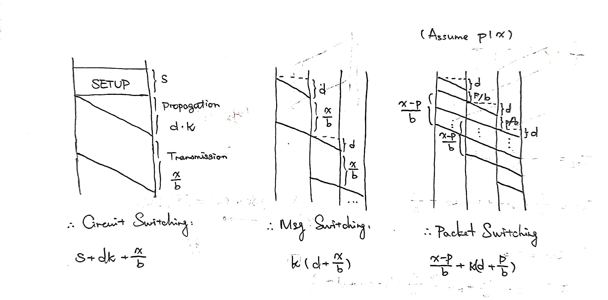
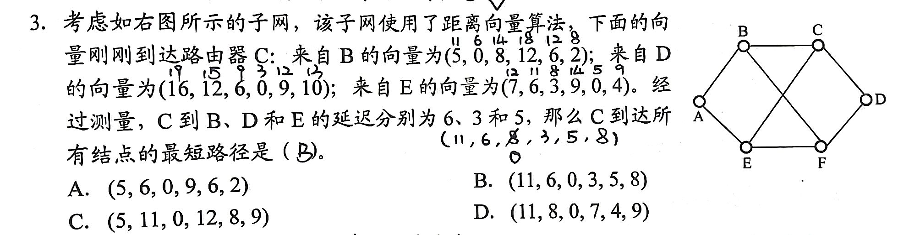
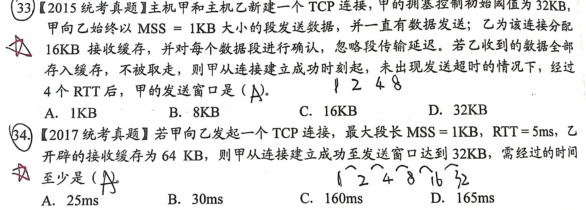

答案字体是白色的，选中或者复制走就能看到QWQ

### 0 绪论

#### 0.1 OSI 参考模型和 TCP/IP 模型
知道有哪些层、各层都在干啥

1. 在 OSI 参考模型中
   1. 提供建立、维护和拆除端到端连接的层是 传输层。
   2. 可同时提供无连接服务和面向连接服务的是 网络层（注意，TCP/IP 的网络层都是无连接，而传输层都有；OSI 的网络层两种都有，传输层只有面向连接）。
   3. 负责数据的格式转换和压缩的是 表示层。
   4. 为防止网络故障重传整个文件而插入同步点的是 会话层。
2. TCP/IP 参考模型中处理关于可靠性、流量控制和错误校正等问题的是 传输层。

### 1 物理层

#### 1.1 物理层的任务

1. 某网络在物理层规定，信号的电平用 +10V ~ +15V 表示二进制 0，用 -10V ~ -15V 表示二进制 1，电线长度限于 15m 内，这体现了物理层接口的 电气 特性。
2. 当描述一个物理层接口引脚处于高电平时的含义时，该描述属于 功能 特性。

#### 1.2 编码与调制
知道各种调制和编码方法！

1. 一个以太网的 Baud rate 是 40MBaud，则其 data rate 是 20Mbps。
2. 采用 8 种相位，每种相位各有 2 种幅度的 QAM 调制，在 1200Baud 的速率能达到的 data rate 是 4.8kbps。
3. 一条无噪声的 8kHz 信道，每个信号包含 8 级，每秒采样 24k 次，那么可以获得的最大传输速率是 48kbps。
4. 一条无噪声的 8kHz 信道，每个信号包含 8 级，每秒采样 12k 次，那么可以获得的最大传输速率是 36kbps。
5. 一个信道每 1/8s 采样一次，传输信号共有 16 种变化状态，最大数据传输速率是 32bps。
6. 

#### 1.3 交换

1. C 
2. 
   1. 

### 2 数据链路层

#### 2.1 成帧

#### 2.2 差错控制

- 对于 10 位要传输的数据，使用 Hamming code，需要的冗余信息位数是 4 位。

#### 2.3 流量控制

1. 两台主机之间的数据链路层采用 GBN 协议传输数据，数据传输速率是 16kbps，单向传播时延是 460ms，数据帧长度范围是 128~512 字节，接收方的确认帧长可以忽略。为使信道利用率达到最高，帧序号的比特数至少为 5。
2. 对于滑动窗口协议，若分组序号采用 3 bit 编号，发送窗口大小为 5，则接收窗口最大是 3。
   1. 解析： 接收方想要 0~(n-1)，现在0来了，接受窗口移到1~n，但是不必发回去 ACK0 因为比如他想 piggyback，或者你认为发出去丢了也行，反正他的窗口动了。总之 接收窗口会把 0~4 都接下来，然后 接收窗口移动到 5~(n+4)%MAX，假如所有ACK都丢了，发送方重发 0~4，我们需要保证 0~4 不在接收窗口里，也就是说，我们的接收窗口和发送窗口要完全错开，也就是发送+接收<=2^n。
3. 关于 GBN 和 SR 是否使用累积确认，考研真题和课本有不同的想法。
   - 我们理应记得这张图，在这里 SR 是使用累积确认的：
   - 
   - 但是考研真题默认 GBN 用累积确认，SR 不使用累积确认：
   - 【2009】数据链路层使用了 GBN 协议，发送方已经发送了编号为 0~7 的帧，计时器超时时，若发送方只收到了 0, 2, 3 的确认，则发送方需要重发的帧数是 4。
   - 【2011】数据链路层使用 SR 传输数据，发送方已经发送 0~3，现已收到 1 号帧的确认，0, 2 号帧依次超时。则此时需要重传的帧数是 2。
   - 总之，出题的时候看清楚怎么说的吧QWQ
4. 主机甲和乙之间用 GBN 传输数据。甲的发送窗口尺寸是 1000，数据帧长是 1000 字节，信道带宽是 100Mbps。乙每收到一个数据帧立刻用一个短帧（忽略传输延迟）进行确认；若甲、乙之间的单向传播时延是 50ms，则甲可以达到的最大平均数据传输速率约为 80Mbps。
   1. 
5. 

#### 2.4 介质访问控制

1. 长度在 10km、传输速率为 10Mbps 的 CSMA/CD 以太网，信号传播速率是 200m/μs，则该网络的最小帧长是 帧长 = BW × 帧时间 >= BW × RTT = BW × 2 × length / Vp = 1000bit。
2. 在一个采用 CSMA/CD 的网络中，传输介质是一根完整的电缆，传输速率是 1Gbps，信号传播速率是 200000km/s。若最小数据帧长度减少 800 bit，则最远的两个站点之间的距离需要 减少 80m。
3. 
4. 

#### 2.5 网桥和交换机

1. 对于 100Mbps 的以太网交换机，当输出端口无排队，以 cut-through switching 方式转发一个以太网帧时，引入的转发时延至少是 6 * 8 bits / 100 Mbps = 0.48μs。
2. 

记得看 PPP, HDLC, IEEE 802.3, IEEE 802.11 之类的）

### 3 网络层

#### 3.1 路由算法

1. 
2. 

#### 3.2 IPv4

1. 
2. 一个网段的网络号为 198.90.10.0/27，最多可以分成 8 个子网。
3. 
4. 
5. 若将 101.200.16.0/20 划分为 5 个子网，则可能的最小子网的可分配 IP 地址数是 254。
6. 

#### 3.3 IPv6

- IPv6 没有 checksum，首部长度不可变（用 next header），不允许分片

#### 3.4 路由协议

1. 
   1. RIP 用 UDP 因为它是应用层的；BGP 也是应用层但是互联网太大了 TCP 比较靠谱；OSPF 是泛洪的所以是网络层协议，这样能小一点
2. 

### 4 传输层

- 熟知端口号 well-known port：0~1023；TCP 和 UDP 分别有自己的端口号，互不干扰，可以共存于同一台主机。
- UDP

#### 4.1 TCP

1. 
2. 
3. 在一个 TCP 连接中，MSS (Max Segment Size) 是 1KB，cwnd = 34KB 时超时，如果接下来的 4 个 RTT 内报文段传输都是成功的，那么当它们都得到确认后，cwnd 的大小是 1 2 4 8 [16]。
4. 在一个 TCP 连接中，MSS (Max Segment Size) 是 1KB，cwnd = 34KB 时收到了 3 个冗余 ACK，如果接下来的 4 个 RTT 内报文段传输都是成功的，那么当它们都得到确认后，cwnd 的大小是 17 18 19 20 [21]。
5. 
6. 
7. 
8. 
9. 

### 5 应用层
知道各协议的内容、使用的传输层协议等问题。
